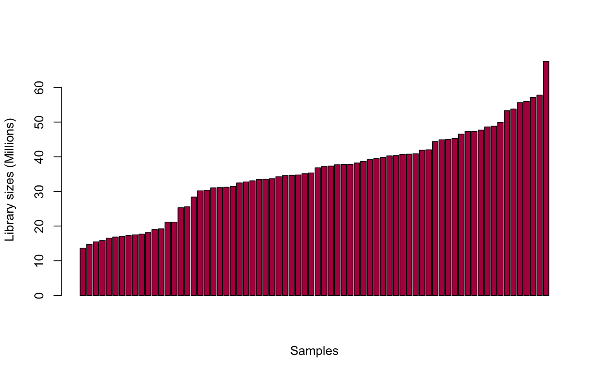
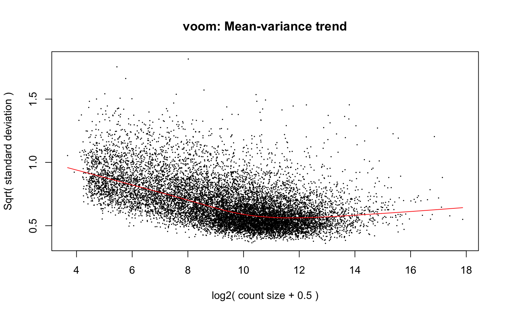
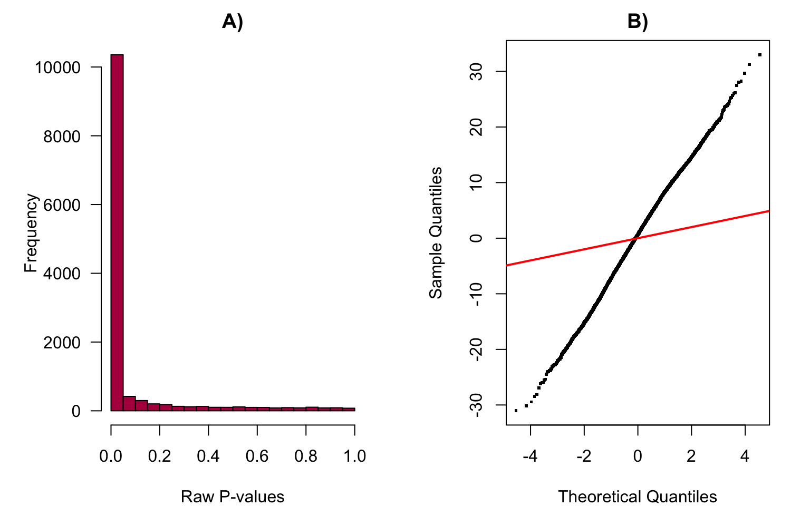
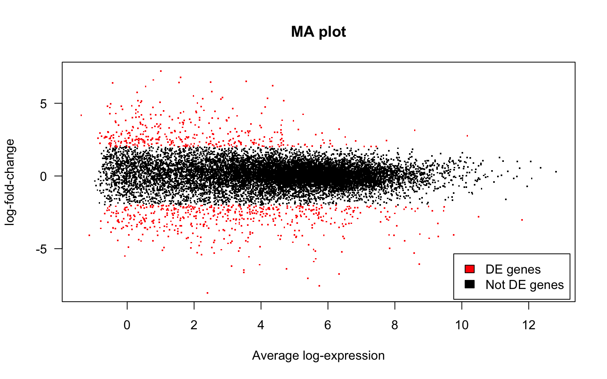

---
output:
  BiocStyle::html_document
---

<!---
Because we split the analysis pipeline in different independent files,
to speed up processing it, here in the setup block we load libraries and
objects that were loaded or produced in the previously processed file,
and which are necessary in this file.
--->


# Differential expression

After the data filtering and normalization, we are interested in identifying gene expression changes and associated p-values between tumor and control samples. For this task, we used the R/Bioconductor packages [sva](http://bioconductor.org/packages/sva) and [limma](https://bioconductor.org/packages/release/bioc/html/limma.html).
We are adopting linear regression models, which in general are used in order to represent, in the most accurate way possible, something which is very complex. In the specific case of DE analysis, the model is used as a predictor of gene expression values. 
For the purpose of fitting the said regression model, it is crucial to build a design matrix. The design matrix is a n x m matrix, where n is the number of samples and m is the number of coeffients which need to be estimated or the types of samples, like cases and controls.
It needs to be defined for which factors to adjust. In our case we are working with a paired design and we would have liked to adjust for gender.

We decide to proceed by only adjusting for the patient id, as it is already implicitly adjusting for gender; as we are working with a paired design, gender is identical between every pair of samples, which would make reduntand to adjust for it and would create technical problems during the inversion step of the matrix in the least square algorithm steps.

In the follwing step we create the design matrix, only adjusting for the patient id. We verify as well wether the matrix is full rank and so is invertible with no problem, which is the case.

```r
pid <- substr(colnames(dge.filt), 9, 12)
mod <- model.matrix(~ type + pid, colData(coadse.filt))
mod0 <- model.matrix(~pid, colData(coadse.filt))
#Verify wether is full rank --> yes!
is.fullrank(mod)
```

```
[1] TRUE
```
We use the [sva package](https://www.ncbi.nlm.nih.gov/pmc/articles/PMC3307112/) for identifying and removing batch effects and other unwanted sources of variation.

```r
sv <- sva(assays(coadse.filt)$logCPM, mod, mod0)
```

```
Number of significant surrogate variables is:  8 
Iteration (out of 5 ):1  2  3  4  5  
```

```r
sv$n
```

```
[1] 8
```

The SVA algorithm has found 8 surrogate variables which we add to our model.


```r
modsv <- cbind(mod, sv$sv)
mod0sv <- cbind(mod0, sv$sv)
```
In order to compare gene expression values between samples we need to adjust for the mean-variance realtionship.


```r
barplot(sort(dge.filt$samples$lib.size)/1e+06, xlab = "Samples", ylab = "Library sizes (Millions)", col=rgb(0.7, 0.1, 0.3))
```

<div class="figure" style="text-align: center">

<p class="caption">(\#fig:libsize)Library sizes among samples</p>
</div>

This step could be executed with both limma trend and limma voom. We decided to proceed with the voom() function, since as we can observe in the Figure \@ref(fig:libsize), there are big differences in library sizes among the samples.

So, we calculate the weights that estimate the mean-variance realtionship at gene-by-sample level with the `voom()` function. The obtained weights will be used to fit the model. 


```r
v <- voom(dge.filt, modsv, plot=TRUE)
```

<div class="figure" style="text-align: center">

<p class="caption">(\#fig:unnamed-chunk-4)Mean-variance trend</p>
</div>

Next, we fit a linear model with the `fit()` function.


```r
# Fit linear model for each gene given a series of arrays
fit<- lmFit(v,modsv)
```

We then calculate the moderated t-statistics through the `eBayes()` function.


```r
# compute moderated t-statistics, moderated F-statistic, and log-odds of differential expression by empirical Bayes moderation of the standard errors towards a common value.
fit <- eBayes(fit)
FDRcutoff <- 0.01
```

Next, we classified the obtained test statistics as up, down or not significant with the help of the `decideTest` function. The FDR threshold used for this test is corresponds to 1%, as in cancer data is usual to have a lot of changes and so we prefer to be strict.


```r
#Classify a series of related t-statistics as up, down or not significant. 
res <- decideTests(fit, p.value = FDRcutoff) 
summary(res)
```

```
       (Intercept) typetumor pid2675 pid2678 pid2680 pid2683 pid2685 pid2686
Down            22      4459       0       7       4       3       5       4
NotSig        1765      3688   12967   12959   12963   12962   12961   12963
Up           11180      4820       0       1       0       2       1       0
       pid3489 pid3496 pid3511 pid3514 pid3516 pid3517 pid3518 pid3520
Down         1       1       0       7       6       0       6       5
NotSig   12964   12964   12966   12957   12960   12967   12959   12961
Up           2       2       1       3       1       0       2       1
       pid3522 pid3525 pid3527 pid3531 pid3534 pid3655 pid3660 pid3662
Down         0       1       1       3       2       0       6       5
NotSig   12966   12964   12966   12963   12963   12964   12958   12957
Up           1       2       0       1       2       3       3       5
       pid3663 pid3697 pid3712 pid3713 pid5662 pid5667 pid6598 pid6599
Down         2       0       0       2       4       4       2       0
NotSig   12964   12967   12966   12962   12962   12963   12965   12967
Up           1       0       1       3       1       0       0       0
       pid6600 pid6601 pid6603 pid6605 pid6704                              
Down         2       1       4       0       1  2487  1488  1388   470  1000
NotSig   12965   12966   12963   12967   12965  8299 10499  9991 12031 10753
Up           0       0       0       0       1  2181   980  1588   466  1214
                        
Down      74     7     8
NotSig 12740 12959 12957
Up       153     1     2
```

We extract the genes chromosome to look at the distribution of the differential expressed genes among the chromosomes, again for the purpose of getting an overview of the data we will be working with.


```r
genesmd <- data.frame(chr = as.character(sub("\\_.*", "", seqnames(rowRanges(coadse.filt)))), symbol = rowData(coadse.filt)[, 1], stringsAsFactors = FALSE)
#Extract a table of the top-ranked genes from a linear model fit.
fit$genes <- genesmd
tt <- topTable(fit, coef = 2, n = Inf)
genes<-table(as.character(sub("\\chr*", "",tt$chr[tt$adj.P.Val < FDRcutoff])))
par(las=2) # make label text perpendicular to axis
par(mar=c(5,8,4,2)) # increase y-axis margin.
genesmd
```

```
        chr                 symbol
1     chr19                   A1BG
2     chr12                    A2M
3     chr14               SERPINA3
4      chr2                   AAMP
5     chr16                   AARS
6     chr16                   ABAT
7      chr9                  ABCA1
8      chr9                  ABCA2
9     chr16                  ABCA3
10     chrX                  ABCB7
11     chr9                   ABL1
12     chr7                   AOC1
13     chr1                   ABL2
14     chr9                    ABO
15     chr3                  ACAA1
16    chr12                  ACACB
17     chr1                  ACADM
18    chr12                  ACADS
19    chr10                 ACADSB
20    chr17                 ACADVL
21    chr11                  ACAT1
22     chr6                  ACAT2
23    chr17                  ASIC2
24    chr12                  ASIC1
25     chr7                   ACHE
26    chr17                   ACLY
27     chr9                   ACO1
28    chr22                   ACO2
29    chr17                  ACOX1
30     chr2                   ACP1
31    chr11                   ACP2
32    chr19                   ACP5
33     chr3                   ACPP
34     chr1                  ACTA1
35    chr10                  ACTA2
36     chr7                   ACTB
37    chr15                  ACTC1
38    chr17                  ACTG1
39     chr2                  ACTG2
40    chr19                  ACTN4
41     chr3                 ACTL6A
42    chr14                  ACTN1
43    chr11                  ACTN3
44     chr2                  ACVR1
45    chr12                 ACVR1B
46     chr2                 ACVR2A
47     chr3                 ACVR2B
48    chr12                 ACVRL1
49     chr3                   ACY1
50    chr14                  ACYP1
51     chr2                  ACYP2
52    chr20                    ADA
53    chr10                  ADAM8
54    chr15                 ADAM10
55     chr1                   ADAR
56    chr21                 ADARB1
57     chr7                  ADCY1
58     chr5                  ADCY2
59     chr2                  ADCY3
60     chr3                  ADCY5
61    chr12                  ADCY6
62    chr16                  ADCY7
63    chr16                  ADCY9
64    chr18                ADCYAP1
65     chr7              ADCYAP1R1
66     chr4                   ADD1
67    chr10                   ADD3
68     chr4                  ADH1A
69     chr4                  ADH1B
70     chr4                  ADH1C
71     chr4                   ADH4
72     chr4                   ADH5
73     chr4                   ADH6
74    chr10                    ADK
75    chr11                    ADM
76     chr1                 ADORA1
77    chr22                ADORA2A
78    chr17                ADORA2B
79     chr1                 ADORA3
80     chr3                  ADPRH
81    chr13                  PARP4
82    chr10                 ADRA2A
83     chr2                 ADRA2B
84     chr4                 ADRA2C
85    chr10                  ADRB1
86     chr5                  ADRB2
87    chr11                 ADRBK1
88    chr22                 ADRBK2
89    chr22                   ADSL
90     chr1                   ADSS
91    chr19                  AP2A1
92    chr17                  AP2B1
93    chr16                  AP1G1
94     chr7                  AEBP1
95    chr19                    AES
96     chr4                    AGA
97    chr15                   ACAN
98     chr1                    AGL
99    chr20                   JAG1
100    chr3                  AGTR1
101    chrX                  AGTR2
102   chr11                  APLNR
103    chr2                   AGXT
104    chrX                  NR0B1
105   chr20                   AHCY
106    chr7                    AHR
107    chr3                   AHSG
108    chr6                   AIM1
109    chr9                    AK1
110    chr1                    AK2
111    chr1                    AK4
112   chr14                   AKT1
113   chr19                   AKT2
114    chr9                   ALAD
115    chr3                  ALAS1
116    chrX                  ALAS2
117    chr4                    ALB
118    chrX                  ABCD1
119    chr9                ALDH1A1
120   chr12                  ALDH2
121   chr17                ALDH3A1
122    chr9                ALDH1B1
123   chr15                ALDH1A3
124   chr11                ALDH3B1
125   chr11                ALDH3B2
126    chr1                ALDH9A1
127   chr17                ALDH3A2
128   chr12                  ABCD2
129    chr9                  ALDOB
130   chr17                  ALDOC
131    chr2                    ALK
132   chr17                 ALOX12
133   chr17                 ALOX15
134    chr2                   ALPI
135    chr1                   ALPL
136    chr2                   ALPP
137    chr2                 ALPPL2
138    chr1                   ALX3
139    chr4                   AMBN
140    chr9                   AMBP
141    chrY                  AMELY
142   chr12                  AMHR2
143    chr1                  AMPD1
144    chr1                  AMPD2
145   chr11                  AMPD3
146    chr7                   AMPH
147    chr2                   BIN1
148    chr3                    AMT
149   chr14                    ANG
150    chr8                 ANGPT1
151    chr8                 ANGPT2
152    chr4                   ANK2
153   chr10                   ANK3
154   chr15                  ANPEP
155    chr4                SLC25A4
156    chr9                  ANXA1
157   chr15                  ANXA2
158    chr4                  ANXA3
159    chr2                  ANXA4
160    chr4                  ANXA5
161    chr5                  ANXA6
162   chr10                  ANXA7
163   chr10                 ANXA11
164   chr17                   AOC2
165    chr2                   AOX1
166   chr12                  APAF1
167   chr12                   APOF
168   chr11                  APBB1
169    chr4                  APBB2
170    chr5                    APC
171    chr1                   APCS
172    chr3                   APEH
173   chr11                  BIRC2
174   chr11                  BIRC3
175    chrX                   XIAP
176   chr17                  BIRC5
177   chr19                  APLP1
178   chr11                  APLP2
179   chr11                  APOA1
180   chr11                  APOA4
181   chr19                  APOC2
182   chr17                   APOH
183   chr21                    APP
184   chr16                   APRT
185   chr19                   KLK3
186    chrX                SHROOM2
187    chr7                   AQP1
188   chr12                   AQP5
189    chrX                   ARAF
190   chr11                  ARCN1
191    chr5                 TRIM23
192    chr1                   ARF1
193   chr12                   ARF3
194    chr3                   ARF4
195   chr17                  ARL4D
196    chr7                   ARF5
197   chr14                   ARF6
198    chr6                   ARG1
199   chr14                   ARG2
200    chr2                   RND3
201   chr14                ARHGAP5
202    chrX                ARHGAP6
203   chr12                ARHGDIB
204   chr16                ARHGDIG
205    chr4                   RHOH
206   chr12                   ARL1
207   chr11                 PHOX2A
208   chr11                   ARL2
209    chr1                   ARNT
210   chr11                  ARNTL
211    chrX                   ARR3
212   chr22                   ARSA
213    chrX                    STS
214    chrX                   ARSD
215    chrX                   ARSE
216    chrX                   ARSF
217   chr11                   ART1
218    chr4                   ART3
219   chr22                  ARVCF
220   chr12                  ASCL1
221   chr11                  ASCL2
222   chr17                  ASGR1
223   chr17                  ASGR2
224   chr20                   ASIP
225    chr7                    ASL
226   chr19                  ASNA1
227    chr7                   ASNS
228   chr17                   ASPA
229    chr9                   ASS1
230    chr1                  ASTN1
231    chr1               SERPINC1
232    chr1                   ATF3
233   chr22                   ATF4
234    chr2                   ATIC
235   chr11                    ATM
236    chr1                   RERE
237    chr4                  ATOH1
238    chr1                 ATP1A1
239    chr1                 ATP1A2
240   chr19                 ATP1A3
241   chr13                 ATP12A
242    chr1                 ATP1A4
243    chr1                 ATP1B1
244    chr3                 ATP1B3
245   chr11                  FXYD2
246   chr16                 ATP2A1
247   chr17                 ATP2A3
248   chr12                 ATP2B1
249    chr3                 ATP2B2
250    chrX                 ATP2B3
251   chr19                  ATP4A
252   chr13                  ATP4B
253    chr5                ALDH7A1
254   chr10                 ATP5C1
255   chr19                  ATP5D
256   chr20                  ATP5E
257    chr1                 ATP5F1
258   chr17                 ATP5G1
259   chr12                 ATP5G2
260    chr2                 ATP5G3
261    chr4                  ATP5I
262   chr21                  ATP5J
263    chr3                ATP6V1A
264    chr2               ATP6V1B1
265    chr8               ATP6V1B2
266   chr22               ATP6V1E1
267    chr1                ATP6V0B
268   chr17               ATP6V0A1
269    chrX                ATP6AP1
270   chr21                  ATP5O
271   chr13                  ATP7B
272    chr3                    ATR
273    chrX                   ATRX
274    chr9                    AUH
275   chr20                    AVP
276    chr1                 AVPR1B
277   chr19                    AXL
278    chr7                  AZGP1
279   chr21                  BACH1
280   chr11                    BAD
281    chr9                   BAG1
282    chr8                 ADGRB1
283    chr1                 ADGRB2
284    chr6                 ADGRB3
285    chr6                   BAK1
286    chr2                  BARD1
287   chr19                    BAX
288   chr11                   BBS1
289   chr16                   BBS2
290   chr15                   BBS4
291   chr12                  BCAT1
292   chr19                  BCAT2
293    chr3                   BCHE
294   chr19                 BCKDHA
295    chr6                 BCKDHB
296   chr11                  CCND1
297   chr18                   BCL2
298   chr15                 BCL2A1
299   chr20                 BCL2L1
300   chr14                 BCL2L2
301   chr19                   BCL3
302   chr12                  BCL7A
303    chr1                   BCL9
304   chr16               TNFRSF17
305   chr19                   HCN2
306    chr7                 OPN1SW
307   chr22                    BCR
308   chr14                 BDKRB1
309   chr14                 BDKRB2
310   chr11                   BDNF
311   chr20                  BFSP1
312    chr1                  BGLAP
313    chr5                   BHMT
314   chr12                  BICD1
315   chr22                    BID
316   chr22                    BIK
317    chr6                  PRDM1
318    chr8                    BLK
319   chr17                   BLMH
320   chr11                  CXCR5
321    chr7                  BLVRA
322   chr19                  BLVRB
323   chr10                   BMI1
324    chr8                   BMP1
325    chr4                   BMP3
326   chr14                   BMP4
327    chr6                   BMP5
328    chr6                   BMP6
329   chr20                   BMP7
330    chr1                  BMP8B
331   chr10                 BMPR1A
332    chr4                 BMPR1B
333    chr2                  BMPR2
334    chrX                    BMX
335   chr15                  BNIP2
336   chr10                  BNIP3
337    chr8                 BNIP3L
338    chr2                    BOK
339    chr6                    DST
340    chr7                   BPGM
341   chr20                    BPI
342   chr17                  BRCA1
343   chr13                  BRCA2
344    chr1                   BRDT
345   chr14                ZFP36L1
346    chr2                ZFP36L2
347    chrX                   BRS3
348   chr19                    BSG
349   chr19                   BST2
350    chr3                    BTD
351    chr9                   KLF9
352   chr13                   KLF5
353    chr5                   BTF3
354   chr12                   BTG1
355    chrX                    BTK
356    chr6                 BTN1A1
357    chr2                   BUB1
358   chr15                  BUB1B
359    chr6                   BYSL
360   chr22                   TSPO
361   chr17                  C1QBP
362   chr11               SERPING1
363    chr1                   C1QA
364    chr1                   C1QB
365    chr1                   C1QC
366   chr12                    C1S
367   chr19                     C3
368   chr11                  CAPN5
369    chr9                     C5
370    chr5                     C7
371    chr1                    C8B
372   chr11                  VPS51
373   chr11                 ZNHIT2
374   chr11                TMEM258
375   chr11                  DAGLA
376    chr8                    CA1
377    chr8                    CA2
378    chr8                    CA3
379   chr17                    CA4
380   chr16                   CA5A
381    chr1                    CA6
382   chr16                    CA7
383    chr9                    CA9
384   chr19                   CA11
385   chr19                CACNA1A
386    chr9                CACNA1B
387   chr12                CACNA1C
388    chr3                CACNA1D
389    chr1                CACNA1E
390    chrX                CACNA1F
391    chr1                CACNA1S
392   chr17                 CACNB1
393   chr10                 CACNB2
394   chr12                 CACNB3
395    chr2                 CACNB4
396   chr17                 CACNG1
397    chr3               SLC25A20
398    chrX                  S100G
399   chr11                  CALCB
400    chr7                  CALCR
401   chr14                  CALM1
402   chr19                  CALM3
403   chr10                 CALML3
404    chr7                   CALU
405    chr5                  CAMK4
406    chr5                 CAMK2A
407    chr4                 CAMK2D
408    chr5                  CAMLG
409    chr5                   CANX
410    chr2                   CAPG
411   chr11                  CAPN1
412    chr1                  CAPN2
413   chr19                 CAPNS1
414    chrX                  CAPN6
415   chr19                   CAPS
416    chr1                  CAPZB
417   chr11                  CASP4
418   chr11                  CASP5
419    chr4                  CASP6
420   chr10                  CASP7
421    chr2                  CASP8
422    chr1                  CASP9
423    chr2                 CASP10
424    chr1                  CASQ1
425    chr1                  CASQ2
426   chr11                    CAT
427    chr7                   CAV2
428    chr3                   CAV3
429    chr6                  RUNX2
430    chr8                RUNX1T1
431   chr16                   CBFB
432   chr11                    CBL
433    chr3                   CBLB
434   chr16                  CBLN1
435   chr11               SERPINH1
436   chr21                   CBR1
437   chr21                    CBS
438    chr9                   CCIN
439    chr9                  CCBL1
440    chr3                    CCK
441    chr7                  KRIT1
442    chr4                  CCNA2
443    chr5                  CCNB1
444    chr6                   CCNC
445    chr6                  CCND3
446   chr19                  CCNE1
447   chr16                   CCNF
448    chr5                  CCNG1
449    chr4                  CCNG2
450    chr5                   CCNH
451   chr12                  CCNT1
452    chr2                  CCNT2
453    chr7                  CCT6A
454    chr1                   CD1A
455    chr1                   CD1B
456    chr1                   CD1C
457    chr1                    CD2
458   chr11                   CD3D
459   chr11                   CD3E
460   chr11                   CD3G
461    chr1                  CD247
462   chr12                    CD4
463   chr11                    CD5
464    chr1                   CD5L
465   chr11                    CD6
466   chr17                    CD7
467    chr2                   CD8A
468    chr2                   CD8B
469   chr12                    CD9
470    chr5                   CD14
471   chr12                   CD27
472    chr2                   CD28
473    chr3                   CD80
474    chr3                   CD86
475    chr1                TNFRSF8
476    chr9                 TNFSF8
477   chr19                SIGLEC6
478    chr1                   CD34
479    chr7                   CD36
480   chr12                 SCARB1
481    chr4                 SCARB2
482   chr19                   CD37
483    chr4                   CD38
484   chr10                 ENTPD1
485    chr9                 ENTPD2
486   chr20                 ENTPD6
487    chr3                 ENTPD3
488   chr20                   CD40
489    chrX                 CD40LG
490   chr11                   CD44
491    chr3                   CD47
492    chr1                   CD48
493    chr1                   CD53
494    chr1                   CD58
495   chr11                   CD59
496   chr12                   CD63
497   chr12                   CD69
498   chr19                   CD70
499    chr9                   CD72
500    chr5                   CD74
501   chr19                  CD79A
502   chr17                  CD79B
503   chr11                   CD81
504   chr19                 ADGRE5
505   chr11                  CD151
506    chr1                    CDA
507    chr1                 CDK11B
508    chr6                  CDC5L
509   chr17                   CDC6
510    chr1                  CDC20
511    chr3                 CDC25A
512    chr5                 CDC25C
513   chr17                  CDC27
514   chr19                  CDC34
515    chr1                  CDC42
516   chr16                   CDH1
517   chr18                   CDH2
518   chr16                   CDH3
519    chr5                   CDH6
520   chr16                   CDH8
521    chr5                   CDH9
522    chr5                  CDH10
523    chr5                  CDH12
524   chr16                  CDH15
525    chr8                  CDH17
526   chr12                   CDK2
527   chr17                   CDK3
528   chr12                   CDK4
529    chr7                   CDK5
530    chr7                   CDK6
531   chr13                   CDK8
532    chr9                   CDK9
533    chr6                 CDKN1A
534    chr9                 CDKN2A
535    chr9                 CDKN2B
536    chr1                 CDKN2C
537   chr19                 CDKN2D
538   chr14                  CDKN3
539    chr5                   CDO1
540    chrX                   CDR1
541   chr16                   CDR2
542    chr1                   CD52
543    chr5                   CDX1
544   chr13                   CDX2
545    chrX                   CDX4
546    chr4                   CLGN
547   chr19                  CEBPA
548   chr20                  CEBPB
549    chr8                  CEBPD
550   chr14                  CEBPE
551   chr19                  CEBPG
552    chr2                  CENPA
553   chr20                  CENPB
554    chr4                  CENPC
555    chr4                  CENPE
556    chr1                  CENPF
557   chr18                  CETN1
558   chr16                   CETP
559   chr14                   CFL2
560   chr11                   CTSC
561    chr7                   CFTR
562    chr6                    CGA
563   chr19                   CGB3
564   chr19                CEACAM8
565   chr19                CEACAM4
566   chr17                   CHAD
567   chr13                 RCBTB2
568   chr10                   CHAT
569    chr5                   CHD1
570   chr15                   CHD2
571   chr17                   CHD3
572   chr12                   CHD4
573   chr10                 AKR1C4
574   chr11                  CHEK1
575   chr20                   CHGB
576    chr1                 CHI3L1
577    chr1                 CHI3L2
578    chr1                  CHIT1
579   chr11                   CHKA
580   chr22                   CHKB
581    chr2                   CHN1
582    chr7                   CHN2
583   chr11                  CHRM1
584    chr7                  CHRM2
585    chr1                  CHRM3
586   chr11                  CHRM4
587    chr2                 CHRNA1
588   chr15                 CHRNA3
589   chr20                 CHRNA4
590    chr1                 CHRNB2
591   chr15                 CHRNB4
592   chr10                   CHUK
593   chr14                    CKB
594    chr3                   CISH
595   chr19                   TBCB
596   chr19                    CKM
597    chr1                  CKS1B
598    chr9                   CKS2
599    chr3                  AP2M1
600    chr7                  AP1S1
601   chr19                  AP2S1
602    chr5                  AP3S1
603   chr19                    CLC
604    chr1                  CLCA1
605    chr7                  CLCN1
606    chr3                  CLCN2
607    chr4                  CLCN3
608    chrX                  CLCN5
609    chr1                  CLCN6
610   chr16                  CLCN7
611    chr1                 CLCNKA
612    chr1                 CLCNKB
613    chr8                    CLU
614    chr2                   CLK1
615   chr15                   CLK3
616   chr11                   TPP1
617   chr13                   CLN5
618   chr11                 CLNS1A
619    chr6                   CLPS
620    chr9                   CLTA
621    chr5                   CLTB
622   chr17                   CLTC
623    chr3                   CCR1
624    chr3                   CCR3
625    chr3                   CCR4
626    chr3                   CCR5
627   chr17                   CCR7
628    chr3                   CCR8
629    chr3                  ACKR2
630   chr12                 CMKLR1
631   chr14                  LTB4R
632   chr10                  ABCC2
633    chr4                  CNGA1
634    chrX                  CNGA2
635    chr2                  CNGA3
636   chr11                  CNGA4
637   chr19                   CNN1
638   chr19                   CNN2
639    chr1                   CNN3
640   chr17                    CNP
641    chr6                   CNR1
642    chr1                   CNR2
643   chr11                   CNTF
644    chr9                  CNTFR
645   chr17                 COL1A1
646    chr2                 COL3A1
647   chr13                 COL4A1
648   chr13                 COL4A2
649    chr2                 COL4A3
650    chr2                 COL4A4
651    chrX                 COL4A5
652    chrX                 COL4A6
653    chr9                 COL5A1
654    chr2                 COL5A2
655   chr21                 COL6A1
656   chr21                 COL6A2
657    chr2                 COL6A3
658    chr6                 COL9A1
659    chr1                 COL9A2
660   chr20                 COL9A3
661    chr6                COL10A1
662    chr1                COL11A1
663   chr10                COL13A1
664    chr9                COL15A1
665    chr1                COL16A1
666   chr10                COL17A1
667    chr6                COL19A1
668   chr19                   COMP
669   chr22                   COMT
670    chr1                   COPA
671   chr11                  COPB1
672   chr10                   KLF6
673    chr9                SLC31A2
674    chr1                   CORT
675   chr16                 COX4I1
676    chr2                  COX5B
677   chr12                 COX6A1
678   chr16                 COX6A2
679   chr19                 COX6B1
680   chr19                 COX7A1
681    chr6                 COX7A2
682    chrX                  COX7B
683    chr5                  COX7C
684   chr11                  COX8A
685   chr10                  COX15
686    chr3                     CP
687    chr7                   CPA1
688    chr3                   CPA3
689   chr13                   CPB2
690   chr17                    CPD
691    chr7                  CLDN3
692   chr17                  CLDN7
693   chr12                    CPM
694    chr3                   CPOX
695    chr2                   CPS1
696   chr22                  CPT1B
697    chr1                   CPT2
698    chr1                    CR1
699    chr1                   CR1L
700    chr1                    CR2
701   chr15                 CRABP1
702    chr9                   CRAT
703    chr2                  CREB1
704    chr2                   ATF2
705   chr16                 CREBBP
706   chr12                 CREBL2
707    chr8                    CRH
708    chr5                  CRHBP
709   chr22                   CRKL
710    chr1                    CRP
711    chr5                 HAPLN1
712   chr19                    CRX
713   chr12                   CRY1
714   chr11                   CRY2
715   chr11                  CRYAB
716   chr17                 CRYBA1
717   chr22                 CRYBA4
718   chr22                 CRYBB2
719    chr2                  CRYGB
720    chr1                   CRYZ
721    chr6                 MAPK14
722   chr20                  CSE1L
723    chr1                   CSF1
724    chr5                  CSF1R
725    chr5                   CSF2
726   chr22                 CSF2RB
727    chr1                  CSF3R
728   chr17                   CSH1
729   chr17                   CSH2
730   chr17                  CSHL1
731   chr17                 CSNK1D
732   chr22                 CSNK1E
733   chr19                CSNK1G2
734    chr5                CSNK1G3
735   chr20                CSNK2A1
736   chr16                CSNK2A2
737    chr5                   VCAN
738   chr15                  CSPG4
739    chr1                  CSRP1
740   chr12                  CSRP2
741   chr17               SLC25A10
742   chr20                   CST1
743   chr11                   CST6
744    chrX                  CSTF2
745   chr11                  CSTF3
746    chr1                   CTBS
747    chr4                  CTBP1
748   chr10                  CTBP2
749   chr16                   CTF1
750    chr6                   CTGF
751    chr1                    CTH
752    chr2                  CTLA4
753    chr5                 CTNNA1
754    chr2                 CTNNA2
755   chr17                   CTNS
756    chr3                 CTNNB1
757   chr11                 CTNND1
758    chr5                 CTNND2
759    chr1                  CTPS1
760   chr16                  CTRB1
761   chr11                   CTSD
762    chr1                   CTSE
763   chr14                   CTSG
764   chr15                   CTSH
765    chr1                   CTSK
766    chr9                   CTSL
767    chr9                   CTSV
768    chr1                   CTSS
769   chr20                   CTSZ
770    chr7                   CUX1
771    chr3                 CX3CR1
772   chr21                  CXADR
773   chr18                  CYB5A
774   chr16                   CYBA
775    chrX                   CYBB
776    chr8                   CYC1
777    chrX                  CYLC1
778    chr9                  CYLC2
779   chr16                   CYLD
780   chr19                 CYP2A6
781   chr19                 CYP2A7
782    chr7                 CYP3A7
783   chr19                CYP2A13
784   chr10                CYP2C19
785   chr10                 CYP2C8
786   chr10                 CYP2C9
787   chr10                 CYP2E1
788   chr19                 CYP2F1
789    chr7                 CYP3A4
790    chr7                 CYP3A5
791    chr3                 CYP8B1
792    chr8                CYP11B1
793   chr20                CYP24A1
794   chr12                CYP27B1
795    chr7                CYP51A1
796    chr1                   DAB1
797    chr5                   DAB2
798   chr14                   DAD1
799    chr1                   CD55
800    chr3                   DAG1
801   chr12                   DGKA
802    chr7                   DGKB
803    chr4                   DGKQ
804   chr12                    DAO
805   chr19                  DAPK3
806    chrY                   DAZ1
807    chr9                 BRINP1
808    chr2                    DBI
809    chr5                   DBN1
810   chr19                    DBP
811    chr1                    DBT
812   chr18                    DCC
813   chr12                    DCN
814   chr17                    ACE
815   chr13                    DCT
816    chr2                  DCTN1
817    chrX                    DCX
818   chr11                   DDB1
819   chr11                   DDB2
820    chr7                    DDC
821   chr10                 AKR1C1
822   chr10                 AKR1C2
823    chr1                GADD45A
824   chr12                  DDIT3
825    chr1                  DDOST
826    chr2                   DDX1
827    chrX                  DDX3X
828   chr17                   DDX5
829   chr11                   DDX6
830   chr17                   DHX8
831    chr1                   DHX9
832   chr11                  DDX10
833   chr12                  DDX11
834    chr4                  DHX15
835    chr8                  DECR1
836    chr8                  DEFA1
837    chr2                    DES
838    chr1                   DFFA
839    chr1                   DFFB
840    chr7                  DFNA5
841   chr14                   COCH
842   chr11                  DHCR7
843    chr1                 DHCR24
844    chr5                   DHFR
845   chr16                  DHODH
846   chr19                   DHPS
847   chr22                 CYB5R3
848    chr5                 DIAPH1
849    chrX                 DIAPH2
850   chr16                  SEPT1
851    chr1                   DIO1
852   chr14                   DIO2
853   chr14                   DIO3
854    chrX                   DKC1
855    chr7                    DLD
856    chr3                   DLG1
857   chr11                   DLG2
858    chrX                   DLG3
859   chr17                   DLG4
860   chr14                   DLST
861   chr17                   DLX3
862    chr7                   DLX5
863    chr7                   DLX6
864    chr9                  SARDH
865    chr4                   DMP1
866    chr9                   DNM1
867    chr9                  DMRT1
868    chr6                  DNAH8
869   chr17                  DNAH9
870   chr16                 DNASE1
871    chrX               DNASE1L1
872   chr16               DNASE1L2
873    chr3               DNASE1L3
874   chr19                 DNASE2
875   chr14                DYNC1H1
876    chr7                DYNC1I1
877    chr2                DYNC1I2
878   chr19                   DNM2
879   chr10                 TRDMT1
880    chr2                 DNMT3A
881   chr20                 DNMT3B
882   chr10                   DNTT
883    chr5                  DOCK2
884    chr3                  DOCK3
885    chr2                   DOK1
886   chr11                 DPAGT1
887   chr16                  DPEP1
888   chr17                   DPH1
889    chr1                   DPH2
890    chr2                   DPP4
891    chr7                   DPP6
892    chr5                 DPYSL3
893   chr11                   DRD2
894    chr3                   DRD3
895    chr4                   DRD5
896   chr19                 ARID3A
897   chr12                   ATN1
898   chr18                   DSC2
899   chr18                   DSC3
900   chr21                  RCAN1
901    chrX                TSC22D3
902    chr6                    DSP
903   chr12                   EPYC
904   chr18                   DTNA
905    chr2                   DTNB
906    chr5                  HBEGF
907   chr12                   DTX1
908    chr2                  DTYMK
909    chr9                   ECM2
910    chr5                  DUSP1
911    chr8                  DUSP4
912   chr10                  DUSP5
913    chr3                  DUSP7
914    chrX                  DUSP9
915   chr15                    DUT
916   chr21                 DYRK1A
917    chr1                   E2F2
918   chr16                   E2F4
919    chr8                   E2F5
920    chr2                   E2F6
921   chr16                   E4F1
922    chr5                   EBF1
923   chr13                 GPR183
924   chr22                   TYMP
925   chr19                   ECH1
926    chr1                   ECM1
927    chr3                   ECT2
928    chrX                    EDA
929    chr1                  S1PR1
930    chr9                  LPAR1
931    chr9                  S1PR3
932    chr1                   EDN2
933   chr20                   EDN3
934    chr4                  EDNRA
935   chr13                  EDNRB
936   chr12                   PHC1
937    chr1                   PHC2
938    chr6                 EEF1A1
939   chr20                 EEF1A2
940    chr2                 EEF1B2
941   chr11                  EEF1G
942   chr19                   EEF2
943    chr1                  EIF2D
944    chr1                  EFNA1
945    chr1                  EFNA3
946    chr1                  EFNA4
947    chr5                  EFNA5
948    chrX                  EFNB1
949   chr13                  EFNB2
950   chr17                  EFNB3
951    chr4                    EGF
952    chr3                 CELSR3
953    chr1                 CELSR2
954    chr1                  MEGF6
955   chr10                   EGR2
956    chr8                   EGR3
957    chr2                   EGR4
958    chr3                 EHHADH
959    chrX                 EIF1AX
960   chr14                 EIF2S1
961   chr12                 EIF2B1
962    chrX                 EIF2S3
963    chr1                  EPHA2
964   chr17                 EIF4A1
965    chr3                 EIF4A2
966   chr12                  EIF4B
967    chr4                  EIF4E
968    chr8               EIF4EBP1
969   chr10               EIF4EBP2
970    chr3                 EIF4G1
971   chr11                 EIF4G2
972   chr14                   EIF5
973   chr17                  EIF5A
974   chr12                  CELA1
975    chr6               SERPINB1
976    chr9                 ELAVL2
977   chr19                 ELAVL1
978   chr19                 ELAVL3
979    chr1                 ELAVL4
980   chr13                   ELF1
981    chr1                   ELF3
982    chrX                   ELF4
983    chrX                   ELK1
984   chr12                   ELK3
985    chr7                    ELN
986   chr14                   EML1
987    chrX                    EMD
988   chr12                   EMP1
989   chr16                   EMP2
990   chr19                   EMP3
991   chr19                 ADGRE1
992    chr2                   EMX1
993   chr11                   CTTN
994   chr10                   EMX2
995    chr2                    EN1
996   chr12                   ENO2
997   chr17                   ENO3
998    chr4                  ENPEP
999    chr1                   ENSA
1000   chr6                SLC29A1
1001  chr22                  EP300
1002   chr2                  EPAS1
1003   chr1                  EPB41
1004  chr20                EPB41L1
1005   chr6                EPB41L2
1006  chr15                  EPB42
1007   chr9                   STOM
1008   chr7                  EPHA1
1009   chr3                  EPHA3
1010   chr2                  EPHA4
1011   chr4                  EPHA5
1012   chr6                  EPHA7
1013   chr1                  EPHA8
1014   chr3                  EPHB1
1015   chr1                  EPHB2
1016   chr3                  EPHB3
1017   chr1                  EPHX1
1018  chr12                   STX2
1019  chr19                   EPOR
1020   chr1                   EPRS
1021  chr12                   EPS8
1022   chr1                  EPS15
1023  chr17                  ERBB2
1024  chr19                  ERCC1
1025   chr4                   EREG
1026   chr6                   EYA4
1027   chr2                  ERCC3
1028  chr16                  ERCC4
1029  chr13                  ERCC5
1030  chr19                    ERF
1031  chr21                    ERG
1032  chr14                    ERH
1033  chr17                   ERN1
1034   chr7                 ERV3-1
1035  chr13                    ESD
1036   chr6                   ESR1
1037  chr14                   ESR2
1038  chr11                  ESRRA
1039  chr14                  ESRRB
1040   chr1                  ESRRG
1041   chr5                   ETF1
1042  chr15                   ETFA
1043   chr4                  ETFDH
1044  chr11                   ETS1
1045  chr21                   ETS2
1046   chr7                   ETV1
1047  chr19                   ETV2
1048   chr1                   ETV3
1049  chr17                   ETV4
1050   chr3                   ETV5
1051  chr12                   ETV6
1052   chr4                    EVC
1053  chr17                  EVI2A
1054  chr17                  EVI2B
1055  chr17                   EVPL
1056   chr7                   EVX1
1057  chr22                  EWSR1
1058   chr8                   EXT1
1059  chr11                   EXT2
1060   chr1                  EXTL1
1061   chr1                  EXTL2
1062   chr8                  EXTL3
1063   chr8                   EYA1
1064  chr20                   EYA2
1065   chr1                   EYA3
1066  chr17                   EZH1
1067  chr11                     F2
1068   chr5                    F2R
1069   chr5                  F2RL1
1070   chr5                  F2RL2
1071   chr1                     F3
1072   chr1                     F5
1073  chr13                     F7
1074   chrX                     F9
1075  chr13                    F10
1076   chr5                    F12
1077   chr1                   F13B
1078   chr1                   FAAH
1079   chr4                  FABP2
1080   chr5                  FABP6
1081   chr6                  FABP7
1082  chr16                  FANCA
1083   chr9                  FANCC
1084   chr3                 FANCD2
1085   chr6                  FANCE
1086   chr4                  ACSL1
1087   chr2                  ACSL3
1088   chrX                  ACSL4
1089   chr8                  PTK2B
1090   chrX                  FANCB
1091  chr11                  FANCF
1092   chr9                  FANCG
1093   chr2                    FAP
1094  chr22                  FBLN1
1095  chr11                    FAU
1096   chr3                  FBLN2
1097  chr15                   FBN1
1098   chr2                 EFEMP1
1099   chr1                 FCER1A
1100   chr1                 FCER1G
1101   chr1                 FCGR1A
1102   chr1                 FCGR1B
1103   chr1                 FCGR2A
1104   chr1                 FCGR2B
1105   chr1                 FCGR3B
1106  chr19                  FCGRT
1107   chr9                   FCN1
1108   chr9                   FCN2
1109   chr8                  FDFT1
1110   chr1                   FDPS
1111  chr17                   FDXR
1112  chr18                   FECH
1113  chr11                   FEN1
1114   chrX                   GPC4
1115   chr4                    FGA
1116   chr4                    FGB
1117   chrX                   FGD1
1118   chr5                   FGF1
1119   chr4                   FGF2
1120  chr11                   FGF3
1121  chr11                   FGF4
1122   chr4                   FGF5
1123  chr12                   FGF6
1124  chr15                   FGF7
1125  chr10                   FGF8
1126  chr13                   FGF9
1127  chr17                  FGF11
1128   chrX                  FGF13
1129  chr13                  FGF14
1130   chr4                  FGFR3
1131  chr13                   GPC5
1132   chr5                  FGFR4
1133   chr4                    FGG
1134   chr8                   FGL1
1135   chr1                    FGR
1136   chr3                   FHIT
1137  chr11                  FKBP2
1138  chr14                  FKBP3
1139  chr12                  FKBP4
1140   chr6                  FKBP5
1141   chr6                  FOXF2
1142   chr6                  FOXC1
1143   chr5                  FOXD1
1144   chr9                  FOXE1
1145   chr1                  FOXD2
1146   chr1                    FLG
1147  chr11                   FLI1
1148  chr17                   FLII
1149   chrX                   FLNA
1150   chr7                   FLNC
1151  chr17                  FLOT2
1152  chr13                   FLT1
1153  chr13                   FLT3
1154  chr19                 FLT3LG
1155   chr1                   FMO3
1156   chr1                   FMO5
1157   chr8                   FNTA
1158  chr11                  FOLR3
1159  chr14                    FOS
1160  chr19                   FPR1
1161  chr19                   FPR2
1162  chr19                   FPR3
1163   chr9                    FXN
1164   chr6                    FRK
1165  chr11                   FSHB
1166   chrX                  CENPI
1167   chr2                   FSHR
1168   chr1                  NR5A2
1169  chr11                   FTH1
1170  chr19                    FTL
1171   chr9                  NR5A1
1172   chr1                  FUCA1
1173  chr17                   GAST
1174  chr14                   FUT8
1175  chr18                   KDSR
1176   chr1                  ACKR1
1177   chr5                    FYB
1178   chr6                    FYN
1179  chr17                   FZD2
1180   chr1                   IFI6
1181  chr17                   G6PC
1182  chr11                SLC37A4
1183  chr22                  XRCC6
1184  chr17                    GAA
1185   chr4                   GAB1
1186  chr21                  GABPA
1187   chr4                 GABRA2
1188   chrX                 GABRA3
1189   chr4                 GABRA4
1190  chr15                 GABRA5
1191   chr5                 GABRA6
1192   chr4                 GABRB1
1193   chr5                 GABRB2
1194   chrX                  GABRE
1195   chr4                 GABRG1
1196   chr6                 GABRR1
1197   chr6                 GABRR2
1198   chr2                   GAD1
1199  chr10                   GAD2
1200   chrX                 GAGE2C
1201   chr4                    GAK
1202  chr14                   GALC
1203   chr1                   GALE
1204  chr12               B4GALNT1
1205  chr17                  GALK1
1206  chr15                  GALK2
1207  chr18                  GALR1
1208  chr16                  GALNS
1209  chr18                 GALNT1
1210   chr1                 GALNT2
1211   chr2                 GALNT3
1212  chr19                   GAMT
1213   chr3                  GAP43
1214  chr12                  GAPDH
1215  chr11                 LRRC32
1216   chr7                   GARS
1217   chr9                   GAS1
1218  chr11                   GAS2
1219  chr13                   GAS6
1220  chr16                   GAS8
1221  chr10                  GATA3
1222   chr8                  GATA4
1223  chr18                  GATA6
1224  chr15                   GATM
1225   chr3                   GBE1
1226   chr1                   GBP3
1227   chr4                     GC
1228   chr2                    GCG
1229  chr17                   GCGR
1230  chr12                BLOC1S1
1231  chr17                  KAT2A
1232   chr9                  NR6A1
1233   chrX                 OPN1MW
1234  chr10                   GDF2
1235   chr5                   GDF9
1236   chrX                   GDI1
1237  chr10                   GDI2
1238   chr5                   GDNF
1239   chr8                    GEM
1240  chr16                   GFER
1241   chr1                   GFI1
1242  chr10                  GFRA1
1243   chr8                  GFRA2
1244   chr5                  GFRA3
1245   chr2                   GGCX
1246  chr22                   GGT1
1247   chr9                B4GALT1
1248  chr20                   GGT7
1249  chr17                    GH2
1250  chr20                   GHRH
1251   chr7                  GHRHR
1252   chr3                   GHSR
1253  chr11                    GIF
1254  chr17                    GIP
1255  chr13                   GJA3
1256   chr1                   GJA4
1257   chr1                   GJA5
1258   chrX                   GJB1
1259  chr13                   GJB2
1260   chr1                   GJB3
1261   chr1                   GJB5
1262   chrX                     GK
1263   chr4                    GK2
1264   chrX                    GLA
1265   chrX                   GPC3
1266   chr3                   GLB1
1267   chr9                   GLE1
1268   chr6                   GLO1
1269   chr6                  GLP1R
1270   chr5                  GLRA1
1271   chrX                  GLRA2
1272   chr4                   GLRB
1273   chr2                    GLS
1274  chr10                  GLUD1
1275   chrX                  GLUD2
1276   chr1                   GLUL
1277   chr5                   GM2A
1278   chr6                   GMDS
1279  chr19                  GNA11
1280  chr19                  GNA15
1281   chr7                  GNAI1
1282   chr1                  GNAI3
1283  chr18                   GNAL
1284   chr9                   GNAQ
1285  chr20                   GNAS
1286   chr3                  GNAT1
1287   chr1                  GNAT2
1288  chr22                   GNAZ
1289   chr1                   GNB1
1290   chr7                   GNB2
1291  chr12                   GNB3
1292  chr11                   GNG3
1293   chr9                  GNG10
1294   chr7                  GNG11
1295   chr7                  GNGT1
1296  chr17                  GNGT2
1297   chr8                  GNRH1
1298  chr20                  GNRH2
1299   chr4                  GNRHR
1300   chr9                 GOLGA1
1301   chr9                 GOLGA2
1302  chr12                 GOLGA3
1303   chr3                 GOLGA4
1304   chr3                 GOLGB1
1305  chr10                   GOT1
1306   chr1                    SFN
1307  chr17                  GP1BA
1308   chr3                    GP9
1309   chr2                   GPC1
1310  chr12                   GPD1
1311   chr2                   GPD2
1312  chr19                    GPI
1313   chr6                  GPLD1
1314   chr4                  GPM6A
1315   chrX                  GPM6B
1316   chr2                   GPR1
1317  chr17                  CCR10
1318   chr1                   GPR3
1319  chr19                   GPR4
1320   chr3                   XCR1
1321   chrX                  CXCR3
1322  chr17                  UTS2R
1323   chr3                  GPR15
1324   chr2                  GPR17
1325  chr12                  GPR19
1326   chrX                  LPAR4
1327   chr1                  GPR25
1328  chr10                  GPR26
1329   chr3                  GPR27
1330  chr19                  FFAR3
1331   chr5                   GRK6
1332  chr17                   GPS1
1333  chr17                   GPS2
1334   chr8                    GPT
1335   chr3                   GPX1
1336  chr14                   GPX2
1337   chr5                   GPX3
1338  chr19                   GPX4
1339   chr1                   GPX7
1340  chr17                   GRB2
1341  chr17                   GRB7
1342   chr9                RAPGEF1
1343   chr5                  GRIA1
1344  chr11                  GRIA4
1345  chr10                  GRID1
1346   chr4                  GRID2
1347  chr17                    GRN
1348   chr6                  GRIK2
1349   chr1                  GRIK3
1350  chr16                 GRIN2A
1351  chr12                 GRIN2B
1352  chr17                 GRIN2C
1353  chr19                 GRIN2D
1354  chr19               ARHGAP35
1355   chr6                   GRM1
1356   chr6                   GRM4
1357   chr7                   GRM8
1358   chr4                  CXCL1
1359   chr4                  CXCL2
1360   chr4                  CXCL3
1361   chrX                   GRPR
1362   chr4                  GRSF1
1363  chr22                   GSC2
1364  chr19                  GSK3A
1365   chr1                  GSTM1
1366   chr1                  GSTM2
1367   chr1                  GSTM5
1368  chr14                 GTF2A1
1369  chr15                 GTF2A2
1370  chr19                 GTF2F1
1371  chr13                 GTF2F2
1372   chr7                  GTF2I
1373  chr13                  GTF3A
1374  chr14                   BRF1
1375  chr16                 GTF3C1
1376   chr2                 GTF3C2
1377  chr11                GUCY1A2
1378   chr6                 GUCA1A
1379   chr6                 GUCA1B
1380   chr1                 GUCA2A
1381   chr1                 GUCA2B
1382   chr4                GUCY1B3
1383  chr12                 GUCY2C
1384   chrX                 GUCY2F
1385   chr1                   GUK1
1386   chr7                   GUSB
1387   chr4                   GYPB
1388   chr2                   GYPC
1389  chr12                   GYS2
1390  chr14                   GZMH
1391  chr17                 GUCY2D
1392   chr5                   GZMA
1393   chr5                   GZMK
1394  chr19                   GZMM
1395   chr6               HIST1H1C
1396   chr6               HIST1H1D
1397   chr6               HIST1H1E
1398   chr6               HIST1H1B
1399   chr6               HIST1H1T
1400   chr6              HIST1H2AE
1401   chr6              HIST1H2AD
1402   chr4                  H2AFZ
1403   chr6              HIST1H2BB
1404  chr17                  H3F3B
1405   chr6               HIST1H1A
1406   chrX               HSD17B10
1407   chr2                  HADHA
1408  chr12                    HAL
1409   chr5                   HARS
1410  chr19                   HAS1
1411   chr8                   HAS2
1412  chr16                   HAS3
1413  chr16                   HBA1
1414  chr16                   HBA2
1415  chr16                    HBM
1416  chr11                    HBD
1417  chr11                   HBE1
1418  chr11                   HBG1
1419  chr11                   HBG2
1420  chr16                   HBQ1
1421   chrX                   HCCS
1422  chr22               SERPIND1
1423  chr20                    HCK
1424   chr3                  HCLS1
1425  chr17                   HCRT
1426   chr1                  HDAC1
1427   chr6                  HDAC2
1428   chr1                   HDGF
1429  chr10                  HELLS
1430  chr15                   HEXA
1431   chr5                   HEXB
1432   chr1                  CFHR1
1433   chr1                  CFHR2
1434   chr7                    HGF
1435   chr8                   NRG1
1436  chr10                   HHEX
1437  chr17                   HIC1
1438  chr14                  HIF1A
1439   chr7                   HIP1
1440   chr4                  UBE2K
1441   chr6                 HIVEP2
1442  chr10                    HK1
1443   chr2                    HK2
1444   chr1                 ZBTB48
1445   chr6               HLA-DQA1
1446  chr17                    HLF
1447  chr21                   HLCS
1448  chr11                   HMBS
1449  chr13                  HMGB1
1450   chr4                  HMGB2
1451  chr21                  HMGN1
1452   chr1                  HMGN2
1453   chr1                  HMGCL
1454   chr5                  HMGCR
1455   chr5                 HMGCS1
1456   chr1                 HMGCS2
1457   chr6                  HMGA1
1458   chr5                   HMMR
1459  chr12                  NR4A1
1460   chr4                   HMX1
1461  chr10                   HMX2
1462  chr20                  FOXA2
1463   chr8                  HNF4G
1464  chr15                ONECUT1
1465   chr2                   HNMT
1466  chr11                SLC29A2
1467  chr14                 HNRNPC
1468   chr4                 HNRNPD
1469  chr10                 HNRNPF
1470  chr12                  HOXC8
1471  chr12                 HOXC10
1472   chr2                  HOXD3
1473   chr2                  HOXD4
1474   chr2                  HOXD8
1475   chr2                  HOXD9
1476   chr2                 HOXD10
1477   chr2                 HOXD11
1478   chr2                 HOXD12
1479   chr2                 HOXD13
1480  chr16                     HP
1481   chr2                 HPCAL1
1482  chr12                    HPD
1483   chr4                   HPGD
1484  chr19                    HPN
1485  chr16                    HPR
1486   chrX                  HPRT1
1487  chr10                   HPS1
1488  chr11                    HPX
1489   chr2                  AGFG1
1490   chr7                  AGFG2
1491   chr3                   HRH1
1492  chr19                    HRC
1493   chr3                    HRG
1494   chr5                   HRH2
1495  chr21                  PRMT2
1496  chr19                  PRMT1
1497   chr3                   HES1
1498  chr16                  HSBP1
1499   chr1                HSD11B1
1500  chr16                HSD11B2
1501  chr17                HSD17B1
1502   chr9                HSD17B3
1503   chr5                HSD17B4
1504   chr8                   HSF1
1505   chr6                   HSF2
1506  chr16                   HSF4
1507   chr2                 DNAJB2
1508   chr9                 DNAJA1
1509   chr5                  HSPA4
1510   chr1                  HSPA6
1511  chr11                  HSPA8
1512   chr5                  HSPA9
1513   chr7                  HSPB1
1514  chr11                  HSPB2
1515  chr14               HSP90AA1
1516   chr1                  IGSF3
1517   chr6               HSP90AB1
1518   chr2                  HSPD1
1519   chr2                  HSPE1
1520   chr1                  HSPG2
1521   chr4                   HTN1
1522   chr4                   HTN3
1523   chr5                  HTR1A
1524   chr6                  HTR1B
1525   chr1                  HTR1D
1526   chr6                  HTR1E
1527   chr2                  HTR2B
1528   chrX                  HTR2C
1529  chr11                  HTR3A
1530   chr5                   HTR4
1531   chr7                  HTR5A
1532   chr7                   HUS1
1533   chr9                    TNC
1534   chr4                   IBSP
1535  chr19                  ICAM1
1536  chr17                  ICAM2
1537  chr19                  ICAM3
1538  chr19                  ICAM4
1539  chr20                    ID1
1540   chr2                    ID2
1541   chr1                    ID3
1542   chr6                    ID4
1543  chr10                    IDE
1544   chr2                   IDH1
1545  chr15                  IDH3A
1546   chrX                    IDS
1547   chr4                   IDUA
1548   chr1                  IFI16
1549  chr17                  IFI35
1550   chr2                  SP110
1551  chr10                  IFIT1
1552  chr10                  IFIT3
1553   chr9                  IFNA2
1554   chr9                  IFNA5
1555   chr9                 IFNA10
1556   chr9                 IFNA13
1557   chr9                 IFNA17
1558   chr9                 IFNA21
1559  chr12                   IFNG
1560   chr6                 IFNGR1
1561   chr9                  IFNW1
1562   chr7                  IFRD1
1563   chrX                  IGBP1
1564  chr12                   IGF1
1565  chr15                  IGF1R
1566  chr11                   IGF2
1567   chr6                  IGF2R
1568  chr16                 IGFALS
1569   chr2                 IGFBP2
1570   chr7                 IGFBP3
1571   chr2                 IGFBP5
1572  chr12                 IGFBP6
1573   chr4                   RBPJ
1574  chr22                  IGLL1
1575   chrX                  IGSF1
1576   chr2                    IHH
1577   chr5                     IK
1578   chr2                   IL1A
1579   chr2                   IL1B
1580   chr2                  IL1R1
1581   chr3                 IL1RAP
1582   chr2                  IL1RN
1583  chr10                  IL2RA
1584  chr22                  IL2RB
1585   chrX                  IL2RG
1586   chr5                    IL3
1587   chr2                  CXCR1
1588   chr2                  CXCR2
1589   chr1                   IL10
1590  chr11                 IL10RA
1591   chr9                 IL11RA
1592   chr5                  IL12B
1593   chr1                IL12RB2
1594   chr5                   IL13
1595   chrX                IL13RA2
1596   chr4                   IL15
1597  chr10                 IL15RA
1598   chr1                TNFRSF9
1599   chr6                  IL17A
1600  chr11                   IL18
1601  chr17                  FOXK2
1602  chr19                   ILF3
1603  chr11                    ILK
1604   chr8                  IMPA1
1605  chr18                  IMPA2
1606   chr7                 IMPDH1
1607   chr3                 IMPDH2
1608   chr6                  IMPG1
1609  chr11                 INCENP
1610   chr8                   IDO1
1611  chr13                   ING1
1612   chr4                   ING2
1613   chr2                   INHA
1614   chr7                  INHBA
1615   chr4                 CXCL10
1616   chr2                  INPP1
1617  chr11                    INS
1618   chr2                 INPP4A
1619  chr11                 INPPL1
1620   chr7                 INSIG1
1621   chr9                  INSL4
1622  chr20                  INSM1
1623   chr1                  INSRR
1624   chr8                  EIF3E
1625   chr1                    IPP
1626  chr15                    IPW
1627   chrX                  IRAK1
1628   chr2                  ITGA6
1629   chr3                  IRAK2
1630  chr15                  IREB2
1631   chr5                   IRF1
1632   chr4                   IRF2
1633  chr19                   IRF3
1634   chr7                   IRF5
1635  chr15                  ISG20
1636   chr5                   ISL1
1637   chr5                  ITGA1
1638   chr5                  ITGA2
1639  chr17                 ITGA2B
1640  chr17                  ITGA3
1641   chr2                  ITGA4
1642  chr12                  ITGA5
1643  chr12                  ITGA7
1644   chr3                  ITGA9
1645  chr16                  ITGAD
1646  chr17                  ITGAE
1647  chr16                  ITGAL
1648  chr16                  ITGAM
1649   chr2                  ITGAV
1650  chr16                  ITGAX
1651  chr10                  ITGB1
1652  chr17                  ITGB4
1653  chr20                   EIF6
1654   chr3                  ITGB5
1655   chr2                  ITGB6
1656  chr12                  ITGB7
1657   chr3                  ITIH1
1658  chr10                  ITIH2
1659   chr3                  ITIH3
1660   chr3                  ITIH4
1661  chr11                  STT3A
1662   chr1                  ITPKB
1663   chr3                  ITPR1
1664  chr12                  ITPR2
1665   chr6                  ITPR3
1666  chr15                    IVD
1667   chr1                    IVL
1668   chr1                   JAK1
1669  chr19                   JAK3
1670   chr6                 JARID2
1671   chr1                    JUN
1672  chr19                   JUNB
1673  chr19                   JUND
1674  chr17                    JUP
1675  chr11                   CD82
1676  chr12                  KCNA1
1677   chr1                  KCNA2
1678   chr1                  KCNA3
1679  chr11                  KCNA4
1680  chr12                  KCNA5
1681   chr1                 KCNA10
1682  chr11                  KCNC1
1683   chr7                  KCND2
1684   chr1                  KCND3
1685  chr21                  KCNE1
1686   chr2                  KCNF1
1687  chr20                  KCNG1
1688   chr7                  KCNH2
1689  chr11                  KCNJ1
1690  chr17                  KCNJ2
1691   chr2                  KCNJ3
1692  chr11                  KCNJ5
1693  chr21                  KCNJ6
1694  chr12                  KCNJ8
1695   chr1                  KCNJ9
1696   chr1                 KCNJ10
1697  chr11                 KCNJ11
1698  chr17                 KCNJ12
1699  chr19                 KCNJ14
1700  chr21                 KCNJ15
1701  chr17                 KCNJ16
1702   chr1                  KCNK1
1703   chr1                  KCNK2
1704   chr2                  KCNK3
1705   chr5                 KCNMB1
1706  chr19                  KCNN1
1707   chr5                  KCNN2
1708   chr1                  KCNN3
1709  chr19                  KCNN4
1710  chr11                  KCNQ1
1711  chr20                  KCNS1
1712   chr8                  KCNS2
1713   chr2                  KCNS3
1714   chr4                    KDR
1715   chr2                    KHK
1716  chr12                  KIF5A
1717  chr10                  KIF5B
1718   chr1                  KISS1
1719   chr4                    KIT
1720  chr19                   KLK1
1721  chr19                   KLK2
1722   chr4                  KLKB1
1723  chr12                  KLRB1
1724  chr12                  KLRC2
1725  chr12                  KLRC3
1726  chr12                  KLRD1
1727   chr3                   KNG1
1728  chr14                   KLC1
1729   chr6                  KIF25
1730   chr3                  KPNA1
1731  chr17                  KPNB1
1732  chr17                  KPNA2
1733  chr13                  KPNA3
1734   chr3                  KPNA4
1735   chr6                  KPNA5
1736   chr5                  TNPO1
1737  chr13                   IPO5
1738  chr12                   KRAS
1739  chr11               KRTAP5-9
1740  chr12                   KRT1
1741  chr12                   KRT2
1742  chr12                   KRT3
1743  chr12                   KRT4
1744  chr12                   KRT5
1745  chr12                  KRT6A
1746  chr12                  KRT6B
1747  chr12                   KRT7
1748  chr12                   KRT8
1749  chr17                   KRT9
1750  chr17                  KRT10
1751  chr17                  KRT13
1752  chr17                  KRT14
1753  chr17                  KRT15
1754  chr17                  KRT16
1755  chr12                  KRT18
1756  chr17                  KRT19
1757  chr17                  KRT31
1758  chr17                  KRT32
1759  chr17                 KRT33A
1760  chr17                 KRT33B
1761  chr17                  KRT34
1762  chr17                  KRT35
1763  chr12                  KRT81
1764  chr12                  KRT82
1765  chr12                  KRT83
1766  chr12                  KRT84
1767  chr12                  KRT85
1768  chr12                  KRT86
1769   chr1                   LAD1
1770   chr2                   AFF3
1771  chr18                  LAMA3
1772   chr6                  LAMA4
1773  chr20                  LAMA5
1774   chr1                  LAMC1
1775  chr13                  LAMP1
1776  chr17                  LASP1
1777   chr1                    LBR
1778  chr16                   LCAT
1779  chr11                   LDHA
1780  chr19                   LIM2
1781  chr10                 ABLIM1
1782   chr7                  LIMK1
1783  chr22                  LIMK2
1784   chr2                  LIMS1
1785  chr10                   LIPA
1786  chr15                   LIPC
1787  chr19                   LIPE
1788  chr11                  FADS1
1789  chr17                  LLGL2
1790  chr11                  FADS3
1791  chr18                  LMAN1
1792  chr11                   LMO1
1793   chrX               PRICKLE3
1794  chr13                   LMO7
1795   chr1                  LMX1A
1796  chr11                  VWA5A
1797  chr15                  LOXL1
1798   chr6                    LPA
1799   chr3                    LPP
1800  chr12                   LRMP
1801   chr2                   LRP2
1802  chr19                   LRP3
1803   chr4                 LRPAP1
1804  chr11                   LSP1
1805  chr12                  LTA4H
1806  chr19                 CYP4F3
1807   chr2                  LTBP1
1808  chr14                  LTBP2
1809   chr5                  LTC4S
1810   chr3                    LTF
1811  chr19                   BCAM
1812  chr12                    LUM
1813   chr5                  CD180
1814   chr1                TACSTD2
1815   chr2                  EPCAM
1816  chr11                CAPRIN1
1817   chr4                 MAD2L1
1818   chr4                  SMAD1
1819  chr15                  SMAD3
1820  chr15                  SMAD6
1821  chr18                  SMAD7
1822  chr13                  SMAD9
1823   chrX                 MAGEA9
1824   chrX                MAGEA12
1825   chrX                 MAGEB3
1826   chr1                  MAGOH
1827   chr2                    MAL
1828   chr5                  MAP1B
1829  chr11                   MAP6
1830  chr14                  MARK3
1831   chr2                  MAT2A
1832  chr10                   MBL2
1833  chr18                   MC4R
1834  chr16                  CHST6
1835   chr1                   MCL1
1836   chr1                   CD46
1837   chr1                   SMCP
1838   chr7                 DNAJB9
1839   chr2                   MDH1
1840   chr7                   MDH2
1841  chr12                   MDM2
1842   chr6                   MEA1
1843  chr15                  MEF2A
1844   chr2                  MEIS1
1845   chr6                 MAP3K5
1846  chr19                  RAB8A
1847  chr11                   MEN1
1848   chr6                  MEP1A
1849  chr18                  MEP1B
1850   chr7                   MEST
1851  chr12                 METTL1
1852  chr15                  MFAP1
1853   chr5                  MFAP3
1854  chr17                  MFAP4
1855  chr15                  MFGE8
1856  chr11                SCGB2A1
1857  chr14                  MGAT2
1858  chr22                  MGAT3
1859   chr2                  MGAT5
1860  chr11                SCGB2A2
1861  chr14                 CTAGE5
1862  chr12                  KITLG
1863  chr10                   MGMT
1864  chr12                    MGP
1865  chr12                  MGST1
1866   chr4                  MGST2
1867  chr16                  CIITA
1868   chr4                  CXCL9
1869  chr14                  ATXN3
1870  chr10                  MKI67
1871  chr11                MAP3K11
1872   chr4                   AFF1
1873   chr9                  MLLT3
1874   chrX                  FOXO4
1875   chr4                  NR3C2
1876  chr14                ALDH6A1
1877   chr3                  CD200
1878   chr2                  MYO1B
1879   chrX                 CITED1
1880   chr7                  NUDT1
1881  chr17                 TRIM37
1882  chr12               PPP1R12A
1883   chr1               PPP1R12B
1884  chr19                CEACAM6
1885  chr16                  NUBP1
1886  chr22                   DRG1
1887   chr2                  SEPT2
1888   chr6                 RPL10A
1889   chr8                  TONSL
1890  chr12                  CNOT2
1891   chr7                  CNOT4
1892  chr12                SLC11A2
1893  chr10                   NRAP
1894   chr1                   NRAS
1895   chr7                  NRCAM
1896   chr7                   NRF1
1897  chr14                    NRL
1898  chr19                   NRTN
1899   chr1                   YBX1
1900   chr6                   NT5E
1901  chr12                   NTF3
1902  chr19                   NTF4
1903  chr16                  NTHL1
1904   chr1                  NTRK1
1905   chr9                  NTRK2
1906  chr15                  NTRK3
1907  chr16                   NTN3
1908   chr1                   DDR2
1909  chr12                    NTS
1910  chr20                  NTSR1
1911  chr11                  NUMA1
1912  chr17                  NUP88
1913  chr11                  NUP98
1914   chr2                  NR4A2
1915   chr1                    NVL
1916   chrX                 GPR143
1917  chr12                   OAS1
1918  chr12                   OAS2
1919  chr12                   OAS3
1920  chr10                    OAT
1921  chr19                   OAZ1
1922  chr15                   OAZ2
1923   chr7                   OCM2
1924   chrX                   OCRL
1925   chr2                   ODC1
1926   chr8                   ODF1
1927   chr9                   ODF2
1928   chr9                    OMD
1929   chr7                   OGDH
1930   chr3                   OGG1
1931   chr9                    OGN
1932  chr12                   OLR1
1933  chr17                    OMG
1934  chr11                    OMP
1935   chr3                   OPA1
1936  chr11                  OPCML
1937   chr8              TNFRSF11B
1938   chrX                  OPHN1
1939   chr8                  OPRK1
1940   chr6                  OPRM1
1941  chr14                   SIX6
1942  chr17                  OR1D2
1943  chr16                  OR1F1
1944  chr16                  OR2C1
1945  chr17                  OR3A1
1946  chr17                  OR3A2
1947   chr1                   ORC1
1948   chr2                   ORC2
1949   chr2                   ORC4
1950   chr7                   ORC5
1951   chr9                   ORM1
1952   chr9                   ORM2
1953  chr11                   OSBP
1954   chrX                    OTC
1955   chr2                   OTX1
1956  chr14                   OTX2
1957   chr1                  OVGP1
1958  chr11                  OVOL1
1959  chr14                  OXA1L
1960   chr5                  OXCT1
1961  chr20                    OXT
1962   chr3                   OXTR
1963  chr17                  P2RX1
1964  chr11                  P2RX3
1965  chr12                  P2RX4
1966  chr17                  P2RX5
1967  chr12                  P2RX7
1968   chr3                  P2RY1
1969  chr11                  P2RY2
1970   chrX                  P2RY4
1971  chr11                  P2RY6
1972  chr19                 P2RY11
1973  chr10                  P4HA1
1974  chr12                  PA2G4
1975  chr12                  PEBP1
1976  chr13                 PABPC3
1977  chr15                  FURIN
1978  chr15                  PCSK6
1979   chr9                   PAEP
1980  chr11               PAFAH1B2
1981  chr19               PAFAH1B3
1982   chr1                 PAFAH2
1983   chr1                  PRDX1
1984  chr12                    PAH
1985   chr7               SERPINE1
1986  chr18               SERPINB2
1987  chr11                   PAK1
1988  chr19                   PALM
1989   chr5                    PAM
1990   chr3                  CNTN3
1991   chr9                  PAPPA
1992   chr6                  PARK2
1993  chr12                   PAWR
1994  chr20                   PAX1
1995  chr10                   PAX2
1996   chr2                   PAX3
1997   chr7                   PAX4
1998   chr9                   PDCL
1999  chr14                   PAX9
2000   chr1                   PBX1
2001  chr10                  PCBD1
2002   chr5                PCDHGC3
2003   chr4                  PCDH7
2004  chr13                  PCDH8
2005  chr13                  PCDH9
2006  chr14               SERPINA5
2007  chr20                   PCK1
2008  chr14                   PCK2
2009   chr8                   PCM1
2010   chr6                  PCMT1
2011  chr20                   PCNA
2012  chr21                   PCNT
2013   chr7                 PCOLCE
2014  chr16                 CHMP1A
2015  chr21                   PCP4
2016   chr5                  PCSK1
2017   chr9                  PCSK5
2018   chrX                  CDK16
2019  chr12                  CDK17
2020   chr3                 PCYT1A
2021   chr1                    PDC
2022  chr12                  PDE3A
2023  chr11                  PDE3B
2024  chr19                  PDE4A
2025   chr1                  PDE4B
2026  chr19                  PDE4C
2027   chr5                  PDE4D
2028  chr17                  PDE6G
2029  chr12                  PDE6H
2030   chr8                  PDE7A
2031  chr15                  PDE8A
2032  chr12                  PDE1B
2033   chr7                  PDGFA
2034  chr22                  PDGFB
2035   chr8                 PDGFRL
2036   chr3                   PDHB
2037   chr2                   PDK1
2038  chr17                   PDK2
2039   chr7                   PDK4
2040   chr6                  ENPP1
2041   chr8                  ENPP2
2042   chr6                  ENPP3
2043  chr16                  PDPK1
2044   chr7                SLC26A4
2045  chr20                   PDYN
2046   chr1                  PDZK1
2047  chr17               SERPINF1
2048  chr19                   PEG3
2049   chr8                   PENK
2050  chr19                   PEPD
2051  chr17                   PER1
2052   chr7                   PEX1
2053   chr6                   PEX6
2054   chr6                   PEX7
2055   chr1                  PEX10
2056  chr17                  PEX12
2057   chr2                  PEX13
2058   chr1                  PEX14
2059   chr4                    PF4
2060   chr4                  PF4V1
2061  chr17                   PFAS
2062   chrX                    CFP
2063   chr5                  PFDN1
2064   chr1                  PFDN2
2065  chr20                  PFDN4
2066  chr18                 ATP8B1
2067   chrX                 PFKFB1
2068   chr1                 PFKFB2
2069   chr3                 PFKFB4
2070   chr2                    VIT
2071  chr10                   PFKP
2072  chr17                   PFN1
2073   chr3                   PFN2
2074   chr7                  CDK14
2075  chr11                   PGA5
2076  chr10                  PGAM1
2077   chr7                  PGAM2
2078   chr6                    PGC
2079   chr1                    PGD
2080  chr14                    PGF
2081   chr5                 PGGT1B
2082   chrX                   PGK1
2083   chr6                   PGK2
2084   chr1                   PGM1
2085   chr6                   PGM3
2086   chr9                   PGM5
2087  chr11                    PGR
2088   chr7                  ABCB1
2089   chr7                  ABCB4
2090  chr17                    PHB
2091   chrX                   PHEX
2092   chr9                   PHF2
2093   chrX                  PHKA1
2094   chrX                  PHKA2
2095  chr16                   PHKB
2096   chr7                  PHKG1
2097  chr10                   PHYH
2098  chr20                    PI3
2099  chr14               SERPINA4
2100  chr18               SERPINB5
2101   chr6               SERPINB6
2102   chr2               SERPINE2
2103  chr18               SERPINB8
2104   chr6               SERPINB9
2105  chr18              SERPINB10
2106   chr3               SERPINI1
2107  chr18              SERPINB13
2108   chr3               SERPINI2
2109   chr1                   PIGC
2110  chr11                PIK3C2A
2111   chr1                PIK3C2B
2112  chr12                PIK3C2G
2113  chr18                 PIK3C3
2114   chr3                 PIK3CA
2115   chr3                 PIK3CB
2116   chr6                   PIM1
2117   chr7                 PIK3CG
2118  chr19                 PIK3R2
2119  chr22                  PI4KA
2120   chr1                  PI4KB
2121  chr10                PIP4K2A
2122  chr19                  FXYD3
2123   chr4                 EXOSC9
2124   chr1                EXOSC10
2125   chr1                  PRRX1
2126  chr22                  SEPT5
2127   chr6                 POU3F2
2128  chr15                   PPIB
2129   chr5                   PPIC
2130   chr4                   PPID
2131  chr16                    PPL
2132  chr14                  PPM1A
2133   chr2                  PPM1B
2134   chr2                  PPM1G
2135   chr1                   PPOX
2136  chr11                 PPP1CA
2137   chr2                 PPP1CB
2138  chr12                 PPP1CC
2139   chr3                 PPP1R2
2140  chr10                PPP1R3C
2141   chr2                 PPP1R7
2142   chr1                 PPP1R8
2143   chr5                 PPP2CA
2144   chr8                 PPP2CB
2145  chr19                PPP2R1A
2146  chr11                PPP2R1B
2147   chr8                PPP2R2A
2148   chr4                PPP2R2C
2149   chr9                 PPP2R4
2150   chr1                PPP2R5A
2151   chr6                PPP2R5D
2152  chr14                PPP2R5E
2153   chr4                 PPP3CA
2154  chr16                  PPP4C
2155  chr10                 PPP3CB
2156   chr8                 PPP3CC
2157   chr2                 PPP3R1
2158   chr9                 PPP3R2
2159  chr19                  PPP5C
2160   chr9                  PPP6C
2161   chr1                   PPT1
2162   chr1                   PRCC
2163  chr11                   PRCP
2164   chr6                   PREP
2165  chr10                   SRGN
2166  chr11                   PRG2
2167  chr12                  PRIM1
2168   chr6                  PRIM2
2169  chr19                 PRKACA
2170   chr1                 PRKACB
2171   chr9                 PRKACG
2172  chr12                 PRKAG1
2173  chr17                PRKAR1A
2174   chr7                PRKAR1B
2175   chr3                PRKAR2A
2176   chr7                PRKAR2B
2177  chr17                  PRKCA
2178  chr16                  PRKCB
2179   chr3                  PRKCD
2180   chr2                  PRKCE
2181  chr19                  PRKCG
2182  chr14                  PRKCH
2183   chr3                  PRKCI
2184  chr14                  PRKD1
2185  chr10                  PRKCQ
2186  chr19                 PRKCSH
2187   chr1                  PRKCZ
2188   chr8                  PRKDC
2189  chr10                  PRKG1
2190   chr4                  PRKG2
2191  chr22                  MAPK1
2192  chr19                 MAP2K2
2193   chr2                EIF2AK2
2194  chr13                 DNAJC3
2195   chrX                   PRKX
2196   chr6                    PRL
2197  chr16                   PRM2
2198  chr19                   PSPN
2199   chr2                   PROC
2200   chr3                  PROS1
2201   chr1                  PROX1
2202   chrX                  PRRG1
2203   chr7                   RELN
2204  chr19                   KLK7
2205  chr16                  PRSS8
2206  chr19                   KLK6
2207  chr19                  KLK10
2208  chr10                   PSAP
2209  chr10                    PSD
2210  chr14                  PSEN1
2211   chr1                  PSEN2
2212  chr19                   PSG1
2213  chr19                   PSG2
2214  chr19                   PSG3
2215  chr19                   PSG5
2216  chr19                   PSG6
2217  chr19                   PSG9
2218  chr19                  PSG11
2219  chr16                  PSKH1
2220  chr11                  PSMA1
2221   chr7                  PSMA2
2222  chr14                  PSMA3
2223  chr15                  PSMA4
2224   chr1                  PSMA5
2225  chr14                  PSMA6
2226  chr20                  PSMA7
2227   chr6                  PSMB1
2228   chr1                  PSMB2
2229   chr1                  PSMB4
2230  chr14                  PSMB5
2231  chr17                  PSMB6
2232   chr9                  PSMB7
2233  chr17                    PYY
2234  chr16                 PSMB10
2235  chr14                  PSMC1
2236   chr7                  PSMC2
2237  chr11                  PSMC3
2238  chr19                  PSMC4
2239  chr17                  PSMC5
2240  chr14                  PSMC6
2241   chr2                  PSMD1
2242   chr3                  PSMD2
2243  chr17                  PSMD3
2244   chr1                  PSMD4
2245   chr9                  PSMD5
2246  chr16                  PSMD7
2247  chr19                  PSMD8
2248  chr12                  PSMD9
2249  chr17                 PSMD11
2250  chr14                  PSME1
2251  chr14                  PSME2
2252   chr7                   PSPH
2253   chr1                  PTAFR
2254  chr19                  PTBP1
2255   chr7                TAS2R38
2256   chr9                  PTCH1
2257  chr10                   PTEN
2258  chr14                  PTGDR
2259  chr19                 PTGER1
2260  chr14                 PTGER2
2261   chr1                 PTGER3
2262   chr5                 PTGER4
2263   chr1                  PTGFR
2264   chr1                 PTGFRN
2265  chr20                  PTGIS
2266  chr11                    PTH
2267   chr9                  PTGS1
2268   chr1                  PTGS2
2269  chr12                  PTHLH
2270   chr2                  PTH2R
2271   chr8                   PTK2
2272   chr6                   PTK7
2273   chr2                   PTMA
2274  chr12                   PTMS
2275   chr7                    PTN
2276  chr20                  PTPN1
2277  chr18                  PTPN2
2278   chr9                  PTPN3
2279   chr2                  PTPN4
2280  chr12                  PTPN6
2281   chr1                  PTPN7
2282  chr15                  PTPN9
2283   chr7                 PTPN12
2284   chr4                 PTPN13
2285   chr1                 PTPN14
2286  chr20                  PTPRA
2287  chr12                  PTPRB
2288   chr9                  PTPRD
2289  chr10                  PTPRE
2290   chr1                  PTPRF
2291  chr19                  PTPRH
2292  chr11                  PTPRJ
2293  chr18                  PTPRM
2294   chr2                  PTPRN
2295   chr7                 PTPRN2
2296  chr12                  PTPRR
2297  chr19                  PTPRS
2298   chr7                 PTPRZ1
2299   chr3                   PTX3
2300   chr5                   RAD1
2301   chr5                   PURA
2302   chr7                   PURB
2303  chr19                    PVR
2304   chr1                  PEX19
2305   chr1                  ABCD3
2306  chr14                  ABCD4
2307  chr12                  PXMP2
2308  chr12                    PXN
2309  chr12                   PEX5
2310  chr17                  PYCR1
2311  chr10               ALDH18A1
2312  chr20                   PYGB
2313  chr14                   PYGL
2314  chr11                   PYGM
2315  chr12                    PZP
2316   chr3                   QARS
2317   chr4                   QDPR
2318   chr2                  RAB1A
2319   chr8                  RAB2A
2320  chr19                  RAB3A
2321   chr1                  RAB3B
2322  chr11                RAB3IL1
2323   chr1                  RAB4A
2324   chr3                  RAB5A
2325  chr12                  RAB5B
2326  chr11                  RAB6A
2327   chr1                  RAB13
2328  chr15                 RAB27A
2329  chr18                 RAB27B
2330  chr14                RABGGTA
2331   chr1                RABGGTB
2332   chr1                  RABIF
2333  chr17                  RAB5C
2334   chr7                   RAC1
2335  chr22                   RAC2
2336  chr17                   RAC3
2337  chr11                  RAD9A
2338   chr8                  RAD21
2339   chr9                 RAD23B
2340  chr15                  RAD51
2341  chr17                 RAD51C
2342  chr14                 RAD51B
2343  chr17                 RAD51D
2344  chr12                  RAD52
2345   chr3                   RAF1
2346  chr11                   RAG1
2347  chr11                   RAG2
2348   chr7                   RALA
2349   chr2                   RALB
2350  chr12                    RAN
2351  chr22                 RANBP1
2352   chr2                 RANBP2
2353  chr22                RANGAP1
2354   chr1                  RAP1A
2355  chr12                  RAP1B
2356   chr1                RAP1GAP
2357   chr4               RAP1GDS1
2358  chr13                  RAP2A
2359   chr3                  RAP2B
2360  chr11                  RAPSN
2361  chr17                   RARA
2362   chr3                   RARB
2363   chr3                RARRES1
2364  chr11                RARRES3
2365   chr3                  RASA2
2366   chr5                RASGRF2
2367  chr13                    RB1
2368  chr14                 ARID4A
2369   chr1                  RBBP4
2370   chr1                  RBBP5
2371  chr16                  RBBP6
2372  chr18                  RBBP8
2373  chr20                   RBL1
2374  chr16                   RBL2
2375   chrX                   RBM3
2376  chr11                   RBM4
2377   chr2                  RBMS1
2378  chr12                  RBMS2
2379   chr3                   RBP1
2380   chr3                   RBP2
2381  chr11                   RCN1
2382  chr15                   RCN2
2383   chrX                 OPN1LW
2384  chr17                  RCVRN
2385   chr6                  PRPH2
2386  chr11                    RDX
2387  chr12                  RECQL
2388   chr2                  REG1A
2389   chr2                  REG1B
2390  chr19                   RELB
2391   chrX                  RENBP
2392  chr19                   UPF1
2393  chr11                   DPF2
2394   chr4                   REST
2395  chr10                    RET
2396   chr6                  REV3L
2397   chr4                   RFC1
2398   chr7                   RFC2
2399  chr13                   RFC3
2400   chr3                   RFC4
2401  chr12                   RFC5
2402  chr17                   RFNG
2403  chr22                  RFPL1
2404  chr19                   RFX1
2405  chr19                   RFX2
2406   chr9                   RFX3
2407  chr12                   RFX4
2408  chr13                  RFXAP
2409  chr10                    RGR
2410   chr1                   RGS1
2411   chr1                   RGS2
2412  chr10                  RGS10
2413   chr4                  RGS12
2414   chr1                  RGS13
2415   chr1                  RGS16
2416   chr6                   RHAG
2417   chr1                   RHCE
2418   chr1                    RHD
2419   chr7                   RHEB
2420   chr9                   RLN1
2421  chr18                   RIT2
2422   chr1                   RIT1
2423  chr15                  RLBP1
2424   chr1                    RLF
2425   chr9                   RMRP
2426  chr14                 RNASE1
2427  chr14                 RNASE2
2428  chr14                 RNASE3
2429  chr14                 RNASE6
2430   chr1                 RNASEL
2431   chr3                SNORA63
2432   chr3                SNORA62
2433   chr1                   RNF2
2434  chr13                   RNF6
2435   chr1                  RNPEP
2436   chr4                  ABCE1
2437  chr11               SNORD15A
2438   chr1                SNORD21
2439   chr1                   RORC
2440   chr7                    RP9
2441   chrX                   RPGR
2442   chr1                   RPA2
2443   chr7                   RPA3
2444   chr2                    RPE
2445   chr1                  RPE65
2446  chr22                   RPL3
2447  chr16                  RPL3L
2448  chr15                   RPL4
2449   chr1                   RPL5
2450  chr12                   RPL6
2451   chr8                   RPL7
2452   chr9                  RPL7A
2453   chrX                  RPL10
2454   chr1                  RPL11
2455   chr9                  RPL12
2456  chr16                  RPL13
2457   chr1                  RPL22
2458  chr17                 RPL23A
2459   chr3                  RPL24
2460  chr17                  RPL26
2461  chr17                  RPL27
2462   chr8                  RPL30
2463  chr19                  RPL28
2464   chr3                  RPL29
2465   chr2                  RPL31
2466   chr3                  RPL32
2467   chr4                  RPL34
2468   chr3                 RPL35A
2469  chr14                RPL36AL
2470   chr5                  RPL37
2471   chr2                 RPL37A
2472  chr17                  RPL38
2473   chrX                  RPL39
2474  chr12                  RPL41
2475   chrX                 RPL36A
2476  chr20                   RPN2
2477  chr16                   RPS2
2478  chr11                   RPS3
2479   chr4                  RPS3A
2480   chrX                  RPS4X
2481   chrY                 RPS4Y1
2482  chr19                   RPS5
2483   chr9                   RPS6
2484   chr1                RPS6KA1
2485   chr6                RPS6KA2
2486   chrX                RPS6KA3
2487  chr17                RPS6KB1
2488  chr11                RPS6KB2
2489   chr2                   RPS7
2490   chr6                  RPS10
2491  chr19                  RPS11
2492  chr19                  RPS16
2493  chr19                  RPS19
2494   chr8                  RPS20
2495   chr5                  RPS23
2496  chr11                  RPS25
2497  chr12                  RPS26
2498   chr1                  RPS27
2499   chr2                 RPS27A
2500  chr19                  RPS28
2501  chr14                  RPS29
2502  chr19                   RRAS
2503   chr6                  RREB1
2504  chr11                   RRM1
2505   chr2                   RRM2
2506   chrX                    RS1
2507   chr1                 RSC1A1
2508  chr12                  CLIP1
2509  chr19                   RTN2
2510   chr9                   RXRA
2511   chr1                   RXRG
2512   chr3                    RYK
2513  chr19                   RYR1
2514   chr1                   RYR2
2515  chr15                   RYR3
2516   chr1                 S100A1
2517   chr1                  SORT1
2518   chr1                 S100A2
2519   chr1                 S100A3
2520   chr1                 S100A4
2521   chr1                 S100A5
2522   chr1                 S100A6
2523   chr1                 S100A7
2524   chr1                 S100A8
2525   chr1                 S100A9
2526   chr1                S100A10
2527   chr1                S100A11
2528   chr1                S100A12
2529   chr1                S100A13
2530  chr21                  S100B
2531   chr4                  S100P
2532  chr11                   SAA1
2533  chr11                   SAA4
2534  chr19                   SAFB
2535   chr2                    SAG
2536  chr16                  ACSM3
2537  chr16                  SALL1
2538   chr1                   SARS
2539  chr12                TSPAN31
2540   chrX                   SAT1
2541   chr3                  SATB1
2542  chr22                   SBF1
2543   chr6                  ATXN1
2544  chr12                  ATXN2
2545   chr3                  ATXN7
2546  chr13                ATXN8OS
2547  chr18               SERPINB3
2548  chr18               SERPINB4
2549  chr19                CLEC11A
2550   chr2                  SCN1A
2551   chr2                  SCN2A
2552  chr11                  SCN2B
2553   chr2                  SCN3A
2554  chr11                  SCN4B
2555   chr3                  SCN5A
2556   chr2                  SCN7A
2557  chr12                  SCN8A
2558   chr3                 SCN10A
2559  chr12                 SCNN1A
2560  chr16                 SCNN1B
2561   chr1                 SCNN1D
2562  chr17                   SCO1
2563   chr1                   SCP2
2564   chr2                   SCTR
2565  chr16                    SRL
2566  chr16                  CCL17
2567   chr2                  CCL20
2568   chr9                  CCL21
2569  chr16                  CCL22
2570   chr7                  CCL24
2571  chr19                  CCL25
2572   chr4                  CXCL6
2573   chr4                 CXCL11
2574   chr1                   XCL1
2575  chr16                 CX3CL1
2576   chr2                   SDC1
2577   chr8                   SDC2
2578  chr20                   SDC4
2579   chr8                  SDCBP
2580  chr10                 CXCL12
2581  chr17                   SDF2
2582   chr5                   SDHA
2583   chr1                   SDHB
2584   chr1                   SDHC
2585  chr11                   SDHD
2586   chr3                  SEC13
2587  chr17                SEC14L1
2588  chr17                 SECTM1
2589   chrX                TRAPPC2
2590  chr14                  SEL1L
2591   chr1                   SELE
2592   chr1                   SELL
2593   chr1                   SELP
2594  chr12                 SELPLG
2595   chr3                 SEMA3F
2596  chr20                  SEMG1
2597   chr5                  SEPP1
2598  chr19                  SEPW1
2599   chr9                    SET
2600   chr3                 SETMAR
2601   chr1                   SFPQ
2602   chr7                  SFRP4
2603  chr10                  SFRP5
2604  chr17                  SRSF1
2605  chr17                  SRSF2
2606   chr6                  SRSF3
2607  chr14                  SRSF5
2608  chr20                  SRSF6
2609   chr2                  SRSF7
2610  chr12                 SFSWAP
2611   chr3                  TRA2B
2612   chr2                  SFTPB
2613   chr8                  SFTPC
2614  chr10                  SFTPD
2615  chr17                   SGCA
2616   chr4                   SGCB
2617   chr5                   SGCD
2618   chr6                   SGK1
2619  chr17                   SGSH
2620  chr19                   SGTA
2621  chr21                 SH3BGR
2622   chrX                SH3BGRL
2623   chr4                 SH3BP2
2624  chr21                  ITSN1
2625   chr9                    SHB
2626  chr17                   SHBG
2627   chr1                   SHC1
2628   chr7                    SHH
2629  chr17                  SHMT1
2630  chr12                  SHMT2
2631   chr3                  SHOX2
2632   chr3                     SI
2633  chr16                  SIAH1
2634   chr3                  SIAH2
2635   chr3                ST6GAL1
2636  chr12                ST8SIA1
2637   chr6                   SIM1
2638  chr21                   SIM2
2639  chr11                  SIPA1
2640  chr14                   SIX1
2641   chr2                   SIX3
2642   chr5                   SKP1
2643   chr5                   SKP2
2644   chr8                    SLA
2645   chr1                 SLAMF1
2646   chr9                 SLC1A1
2647   chr5                 SLC1A3
2648   chr2                 SLC1A4
2649  chr19                 SLC1A6
2650   chr1                 SLC1A7
2651   chr1                 SLC2A1
2652   chr3                 SLC2A2
2653  chr12                 SLC2A3
2654  chr17                 SLC2A4
2655   chr1                 SLC2A5
2656  chr17                 SLC4A1
2657  chr16                 SLC5A2
2658  chr22                   SMTN
2659  chr21                 SLC5A3
2660  chr19                 SLC5A5
2661  chr16                 SLC6A2
2662  chr17                 SLC6A4
2663   chr3                 SLC6A6
2664   chr5                 SLC6A7
2665   chrX                 SLC6A8
2666   chr3                SLC6A11
2667  chr12                SLC6A12
2668  chr12                SLC6A13
2669  chr13                 SLC7A1
2670  chr19                 SLC8A2
2671  chr22                 SLC7A4
2672   chr2                 SLC8A1
2673  chr14                 SLC8A3
2674   chr1                 SLC9A1
2675   chr2                 SLC9A2
2676   chr5                 SLC9A3
2677  chr16                 SLC9A5
2678  chr14                SLC10A1
2679  chr13                SLC10A2
2680   chr2                SLC11A1
2681  chr15                SLC12A1
2682   chr5                SLC12A2
2683  chr16                SLC12A3
2684  chr16                SLC12A4
2685   chr7                SLC13A1
2686  chr13                SLC15A1
2687   chr3                SLC15A2
2688   chr1                SLC16A1
2689   chr5                SLC34A1
2690   chr8                SLC18A1
2691  chr10                SLC18A2
2692  chr10                SLC18A3
2693  chr21                SLC19A1
2694   chr2                SLC20A1
2695   chr8                SLC20A2
2696  chr22                SLC25A1
2697   chr3                SLCO2A1
2698  chr12                SLCO1A2
2699   chr6                SLC22A1
2700   chr6                SLC22A3
2701   chr6                SLC22A2
2702   chr5                SLC22A4
2703   chr5                SLC22A5
2704  chr10                  SLIT1
2705   chr5                  SLIT3
2706  chr11                    SLN
2707  chr20                   SLPI
2708   chr8                  SNAI2
2709   chrX                SMARCA1
2710   chr9                SMARCA2
2711  chr19                SMARCA4
2712   chr3                SMARCC1
2713  chr12                SMARCC2
2714  chr12                SMARCD1
2715   chr7                SMARCD3
2716  chr17                SMARCE1
2717  chr11                  SMPD1
2718   chr6                  SMPD2
2719   chrX                    SMS
2720  chr21                  SUMO3
2721  chr17                  SUMO2
2722  chr20                SIGLEC1
2723  chr20                  SNAI1
2724  chr20                 SNAP25
2725  chr14                 SNAPC1
2726  chr19                 SNAPC2
2727   chr9                 SNAPC3
2728   chr5                   SNCB
2729   chr9                 SNAPC4
2730   chr4                   SNCA
2731   chr7                  FSCN1
2732  chr19                SNRNP70
2733  chr19                  SNRPA
2734  chr15                 SNRPA1
2735   chr6                  SNRPC
2736  chr18                 SNRPD1
2737  chr19                 SNRPD2
2738   chr1                  SNRPE
2739  chr12                  SNRPF
2740  chr15                  SNRPN
2741  chr20                  SNTA1
2742   chr8                  SNTB1
2743   chr5                   SNX2
2744  chr16                  SNTB2
2745  chr21                   SOD1
2746   chr6                   SOD2
2747   chr4                   SOD3
2748  chr21                    SON
2749  chr15                   SORD
2750  chr11                  SORL1
2751   chr2                   SOS1
2752  chr14                   SOS2
2753  chr13                   SOX1
2754   chr3                   SOX2
2755   chrX                   SOX3
2756   chr6                   SOX4
2757  chr12                   SOX5
2758  chr17                   SOX9
2759  chr22                  SOX10
2760   chr2                  SOX11
2761  chr20                  SOX12
2762  chr12                    SP1
2763  chr17                    SP2
2764   chr2                    SP3
2765   chr7                    SP4
2766   chr2                  SP100
2767  chr20                  SPAG4
2768   chr7                  SPAM1
2769   chr5                  SPARC
2770   chr2                  SPAST
2771  chr16                   SPG7
2772  chr11                   SPI1
2773  chr19                   SPIB
2774   chr5                 SPINK1
2775   chr4                 SPINK2
2776  chr15                 SPINT1
2777  chr16                    SPN
2778   chr5                 SPOCK1
2779   chr4                   SPP1
2780   chr2                    SPR
2781   chr1                 SPRR1B
2782   chr1                 SPRR2A
2783   chr1                 SPRR2D
2784   chr1                 SPRR2E
2785   chr1                 SPRR2F
2786   chr1                 SPRR2G
2787   chr1                  SPRR3
2788   chr1                  SPTA1
2789   chr9                 SPTAN1
2790  chr14                   SPTB
2791   chr8                   SQLE
2792   chr5                 SRD5A1
2793   chr2                 SRD5A2
2794  chr17                 SREBF1
2795  chr22                 SREBF2
2796   chr6                    SRF
2797  chr20                   SRMS
2798   chr1                   SRP9
2799  chr15                  SRP14
2800   chr5                  SRP19
2801  chr17                  SRP68
2802   chr7                  SRPK2
2803   chrY                    SRY
2804  chr11                 TRIM21
2805   chr1                 TROVE2
2806   chr2                  SSFA2
2807   chr6                   SSR1
2808   chr1                   SSR2
2809   chr3                   SSR3
2810  chr11                  SSRP1
2811  chr14                  SSTR1
2812  chr17                  SSTR2
2813  chr22                  SSTR3
2814   chrX                   SSX5
2815  chr18                   SS18
2816  chr11                    ST5
2817  chr11                   ST14
2818   chr3                   STAC
2819   chr8                   STAR
2820   chr2                  STAT1
2821  chr12                  STAT2
2822  chr17                  STAT3
2823   chr2                  STAT4
2824  chr17                 STAT5A
2825  chr17                 STAT5B
2826  chr12                  STAT6
2827   chr4                  STATH
2828  chr21                 HSPA13
2829   chr4                SULT1E1
2830   chr6                 ELOVL4
2831  chr20                   STK4
2832  chr20                  AURKA
2833   chrX                  CDKL5
2834   chr5                  STK10
2835  chr19                  STK11
2836  chr19                  AURKC
2837  chr16                SULT1A2
2838   chr2                   STRN
2839   chr9                 STXBP1
2840  chr19                 STXBP2
2841   chr1                 STXBP3
2842  chr14                   STYX
2843  chr16                SULT1A1
2844  chr16                SULT1A3
2845   chr2                SULT1C2
2846  chr19                SULT2B1
2847  chr12                   SUOX
2848  chr19                SULT2A1
2849  chr17                SUPT4H1
2850  chr17                 SUPT6H
2851  chr10                SUPV3L1
2852  chr11                  ABCC8
2853   chr9                  SURF1
2854   chr9                  SURF2
2855   chr9                  SURF4
2856   chr9                  SURF6
2857   chrX                SUV39H1
2858  chr10                   SVIL
2859  chr17                  VAMP2
2860   chr1                   XCL2
2861   chr9                    SYK
2862   chrX                   SYN1
2863   chrX                    SYP
2864   chr7                  SYPL1
2865  chr12                   SYT1
2866  chr18                   SYT4
2867  chr19                   SYT5
2868   chr6                      T
2869  chr10                  TACR2
2870  chr12                   TAC3
2871   chr8                  TACC1
2872   chr2                 ADAM17
2873   chr4                  TACR3
2874   chr8                   TAF2
2875  chr18                  TAF4B
2876  chr11                  TAGLN
2877  chr10                   TAF5
2878   chr7                   TAF6
2879   chr5                   TAF7
2880  chr11                  TAF10
2881   chr1                  TAF13
2882   chr1                   TAL1
2883   chr9                   TAL2
2884   chr1                 TARBP1
2885  chr12                 TARBP2
2886   chr5                   TARS
2887  chr16                    TAT
2888   chr1                  CNTN2
2889   chrX                    TAZ
2890   chr5                   TBCA
2891  chr17                   TBCD
2892   chr1                   TBCE
2893   chrX                  TBL1X
2894   chr6                    TBP
2895  chr19                 TBXA2R
2896   chr1                  TCEA3
2897  chr12                  HNF1A
2898  chr10                   ZEB1
2899   chr2                  GCFC2
2900   chr5                ZNF354A
2901   chr1                  VPS72
2902   chrX                 DYNLT3
2903   chr6                 DYNLT1
2904  chr19                  PRDX2
2905   chr6                  TEAD3
2906   chr9                    TEK
2907   chr5                  NR2F1
2908  chr15                  NR2F2
2909   chr8                  KLF10
2910  chr17                  TIMP2
2911  chr19                  ICAM5
2912   chr6                  NR2E1
2913   chrX                 TSPAN7
2914   chr1                GPR137B
2915  chr21               TRAPPC10
2916   chr3                   TMF1
2917   chr9                  TMOD1
2918  chr12                   TMPO
2919  chr21                TMPRSS2
2920   chr3                 CLEC3B
2921  chr20                  TNNC2
2922  chr14                TNFAIP2
2923   chr6                TNFAIP3
2924   chr2                TNFAIP6
2925  chr12               TNFRSF1A
2926   chr1               TNFRSF1B
2927   chr3                  TNNC1
2928   chr1                  TNNI1
2929  chr11                  TNNI2
2930  chr19                  TNNI3
2931  chr19                  TNNT1
2932   chr1                  TNNT2
2933  chr16                   TNP2
2934   chr2                   TNS1
2935  chr20                   TOP1
2936  chr17                  TOP2A
2937   chr3                  TOP2B
2938  chr17                  TOP3A
2939   chr1                   TP73
2940   chr6                   TPBG
2941   chr8                  TPD52
2942   chr6                TPD52L1
2943  chr20                TPD52L2
2944   chr9                   TPM2
2945   chr6                   TPMT
2946   chr2                    TPO
2947   chr1                    TPR
2948  chr16                 TPSAB1
2949  chr13                   TPT1
2950  chr21                   TPTE
2951   chr6                 CRISP2
2952  chr12                  NR2C1
2953   chr3                  NR2C2
2954  chr12                HSP90B1
2955   chr9                  TRAF1
2956   chr9                  TRAF2
2957   chr1                  TRAF5
2958  chr11                  TRAF6
2959   chr3                    TRH
2960   chr8                   TRHR
2961   chr1                   CCT3
2962   chr5                   TRIO
2963   chr7                  TRIP6
2964   chrX                    TRO
2965   chr3                  TRPC1
2966   chr4                  TRPC3
2967  chr13                  TRPC4
2968   chrX                  TRPC5
2969  chr11                  TRPC6
2970  chr21                  TRPM2
2971   chr8                  TRPS1
2972   chr2                    TSN
2973   chr9                   TSC1
2974  chr16                   TSC2
2975  chr11                 TSG101
2976   chr1                   TSHB
2977  chr14                   TSHR
2978   chrY                  TSPY1
2979   chr2                  TSSC1
2980  chr22                    TST
2981   chr5                   TTC1
2982  chr17                 DNAJC7
2983  chr21                   TTC3
2984   chr1                   TTC4
2985   chr9                   TTF1
2986   chr6                    TTK
2987   chr2                    TTN
2988  chr11                    TUB
2989   chr2                 TUBA4A
2990  chr13                 TUBA3C
2991  chr17                  TUBG1
2992  chr16                   TUFM
2993   chr1                  TUFT1
2994   chr6                  TULP1
2995  chr19                  TULP2
2996  chr12                  TULP3
2997  chr22                   HIRA
2998   chr7                 TWIST1
2999   chr1                 TNFSF4
3000   chr1                TNFRSF4
3001   chr9                    TXN
3002  chr19                   TYK2
3003  chr18                   TYMS
3004  chr11                    TYR
3005  chr15                  TYRO3
3006   chr9                  TYRP1
3007  chr21                  U2AF1
3008  chr17                    UBB
3009   chr3                   UBA7
3010  chr10                 UBE2D1
3011   chr5                 UBE2D2
3012   chr3                 UBE2E2
3013   chr7                  UBE2H
3014  chr22                 UBE2L3
3015  chr12                  UBE2N
3016  chr20                 UBE2V1
3017   chr8                 UBE2V2
3018  chr15                  UBE3A
3019   chr2                  SUMO1
3020  chr17                   UBTF
3021   chr3                  UPK1B
3022   chr2                    UCN
3023   chr4                   UCP1
3024  chr22                  UFD1L
3025  chr11                SCGB1A1
3026   chr4                   UGDH
3027   chr2                   UGP2
3028   chr4                 UGT2B4
3029   chr4                 UGT2B7
3030   chr4                UGT2B17
3031   chr4                   UGT8
3032   chr8                COL14A1
3033  chr12                    UNG
3034   chr3                   USP4
3035  chr19                  NR1H2
3036   chr7                   UPP1
3037  chr11                   UPK2
3038  chr22                  UPK3A
3039   chr8                  UQCRB
3040  chr16                 UQCRC2
3041  chr19                UQCRFS1
3042   chr1                  UQCRH
3043  chr10                   UROS
3044   chr1                   USF1
3045  chr19                   USF2
3046   chr1                  USH2A
3047   chr3                  CLRN1
3048   chrX                  KDM6A
3049   chrY                    UTY
3050  chr11                  UVRAG
3051  chr19                   VAV1
3052   chr9                   VAV2
3053   chrX                   VBP1
3054   chr1                  VCAM1
3055  chr10                    VCL
3056   chr5                  VDAC1
3057  chr10                  VDAC2
3058  chr12                    VDR
3059   chr6                  VEGFA
3060  chr11                  VEGFB
3061   chr4                  VEGFC
3062   chr2                   VIL1
3063   chr6                    EZR
3064  chr10                    VIM
3065   chr6                    VIP
3066   chr3                  VIPR1
3067   chr7                  VIPR2
3068  chr11                  BEST1
3069  chr22                 VPREB1
3070  chr17                  TRPV1
3071  chr14                   VRK1
3072   chr2                   VRK2
3073  chr17                    VTN
3074  chr14                   WARS
3075   chrX                    WAS
3076   chr7                    ZAN
3077   chr7                  EIF4H
3078   chr7                  CLIP2
3079   chr7                   LAT2
3080   chr9                 CORO2A
3081  chr11                   WEE1
3082   chr4                   WFS1
3083   chr4                  WHSC1
3084   chr7                   WNT2
3085  chr12                 WNT10B
3086  chr11                  WNT11
3087   chr1                  WNT2B
3088  chr21                    WRB
3089   chr8                    WRN
3090  chr22                   XBP1
3091   chrX                     XG
3092   chrX                   XIST
3093   chrX                     XK
3094   chr9                    XPA
3095   chr3                    XPC
3096  chr10                XPNPEP1
3097   chrX                XPNPEP2
3098   chr2                   XPO1
3099  chr19                  XRCC1
3100   chr7                  XRCC2
3101   chr5                  XRCC4
3102   chr2                  XRCC5
3103  chr14                    YY1
3104   chr7                  YWHAG
3105  chr22                  YWHAH
3106   chr8                  YWHAZ
3107   chr2                  ZAP70
3108  chr19                  ZFP36
3109   chr9                  ZFP37
3110  chr11                  ZFPL1
3111   chrX                    ZFX
3112   chrY                    ZFY
3113   chr3                   ZIC1
3114  chr13                   ZIC2
3115   chrX                   ZIC3
3116   chr7                   ZNF3
3117   chrX                 ZNF711
3118   chr8                   ZNF7
3119  chr19                   ZNF8
3120   chr3                   CNBP
3121  chr19                  ZNF14
3122  chr19                 ZNF708
3123   chr8                  ZNF16
3124  chr19                  ZNF17
3125  chr17                  ZNF18
3126  chr19                  ZNF20
3127  chr10                  ZNF22
3128  chr16                  ZNF23
3129  chr18                  ZNF24
3130  chr12                  ZNF26
3131  chr19                  ZNF28
3132   chr1                ZSCAN20
3133  chr10                  ZNF32
3134  chr10                 ZNF33A
3135  chr10                 ZNF33B
3136   chr3                  ZNF35
3137   chr7                ZKSCAN1
3138   chr7                ZSCAN21
3139   chrX                  ZNF41
3140  chr19                  ZNF45
3141  chr14                 ZBTB25
3142  chr19                  ZNF69
3143  chr22                  ZNF70
3144  chr22                  ZNF74
3145  chr16                 ZNF75A
3146   chr6                  ZNF76
3147   chr9                  ZNF79
3148   chr3                  ZNF80
3149  chr12                  ZNF84
3150  chr19                 ZNF221
3151  chr19                  ZNF90
3152  chr19                  ZNF91
3153  chr19                  ZNF99
3154   chr1                 ZNF124
3155   chr5                 ZNF131
3156  chr19                 ZNF132
3157  chr20                 ZNF133
3158  chr19                 ZNF134
3159  chr19                 ZNF135
3160  chr19                 ZNF136
3161   chr7                 ZNF138
3162  chr12                 ZNF140
3163   chr4                 ZNF141
3164   chr2                 ZNF142
3165  chr11                 ZNF143
3166  chr11                 ZBTB16
3167  chr19                 ZNF146
3168  chr17                 TRIM25
3169   chr3                 ZNF148
3170   chr1                 ZBTB17
3171  chr19                 ZNF154
3172  chr19                 ZNF155
3173   chrX                 ZNF157
3174  chr17                  VEZF1
3175   chr6                 ZNF165
3176  chr16                 ZNF174
3177  chr19                 ZNF175
3178  chr19                 ZNF177
3179  chr17                 RNF112
3180  chr19                 ZNF180
3181   chrX                RNF113A
3182   chr6                 ZNF184
3183   chrX                 ZNF185
3184   chr9                 ZNF189
3185  chr16                 ZNF200
3186  chr11                 ZNF202
3187  chr17                 ZNF207
3188  chr19                 ZNF208
3189  chr16                 ZNF213
3190  chr11                 ZNF214
3191   chr9                 ZFAND5
3192  chr19                 ZNF223
3193  chr19                 ZNF224
3194  chr19                 ZNF225
3195  chr19                 ZNF226
3196  chr19                 ZNF227
3197  chr19                 ZNF229
3198  chr19                 ZNF230
3199  chr17                 ZNF232
3200   chr1                SLC30A1
3201   chr1                SLC30A2
3202   chr2                SLC30A3
3203  chr15                SLC30A4
3204  chr16                    ZP2
3205   chr7                    ZP3
3206   chrX                   ZXDA
3207   chr1                  PRDM2
3208   chr1                 DNALI1
3209   chr6                 PTP4A1
3210   chr1                   LRP8
3211   chr1                 LAPTM5
3212   chr1                   BSND
3213   chr1                  CSDE1
3214   chr2                   PXDN
3215   chr2                  ALMS1
3216   chr2                 RNF103
3217  chr12                 TUBA1A
3218   chr2                  IL1R2
3219   chr2                  CXCR4
3220   chr2                   FZD5
3221   chr2                   SCG2
3222   chr3                  BRPF1
3223   chr3                  IFRD2
3224   chr3                 SEMA3B
3225   chr3                  SLMAP
3226   chr3                   MANF
3227  chr16                   USP7
3228   chr3                  RAB7A
3229   chr3                 KCNAB1
3230   chr5                  REEP5
3231   chr6                  EPM2A
3232   chr7                  AIMP2
3233   chr7                   MAFK
3234   chr8                   FZD3
3235   chr7                  SHFM1
3236   chr7                    ST7
3237   chr7                ARHGEF5
3238   chr7                 ZNF212
3239   chr8                  TUSC3
3240   chr8                   PSCA
3241   chr4                  GLRA3
3242   chr9                   BRD3
3243   chr9                 NUP214
3244  chr10                   STAM
3245  chr10                   CUBN
3246  chr10                  CCDC6
3247  chr10               SLC25A16
3248  chr10                 ADAM12
3249  chr11                  CSRP3
3250  chr11                   PDHX
3251  chr11                   CUL5
3252  chr12                  FGF23
3253  chr12                   USP5
3254  chr12                   AAAS
3255  chr12                  HMGA2
3256  chr12                CDK2AP1
3257  chr13                  IFT88
3258  chr15                  AP3B2
3259  chr15                 ANP32A
3260  chr16                    GAN
3261  chr16                 SLC7A5
3262  chr17                   RND2
3263  chr17                   COIL
3264  chr18                SLC14A2
3265  chr19                MADCAM1
3266  chr19                  SF3A2
3267  chr19                    ELL
3268  chr10                 ZNF239
3269  chr19                  SYMPK
3270  chr19                    MIA
3271  chr19                   CLPP
3272  chr19                   DPF1
3273  chr20                   GDF5
3274  chr21                  NRIP1
3275  chr21                 CHAF1B
3276  chr22                 CLTCL1
3277  chr22                   SYN3
3278   chrX                  USP11
3279   chrX                  USP9X
3280   chrX                  RBM10
3281   chrX                  KDM5C
3282   chrX                  SMC1A
3283   chrX                  UBL4A
3284   chrX                TMEM187
3285   chrX                SLC10A3
3286   chrY                  KDM5D
3287   chrY                  USP9Y
3288  chr17                    EPX
3289   chr1                 ARID1A
3290   chr2                   DYSF
3291   chr6               HIST1H4I
3292  chr12                  KLRC4
3293  chr16                    SNN
3294   chr3                  ACOX2
3295   chr4                  ACOX3
3296  chr17                  AXIN2
3297   chr3                   BAP1
3298   chr1                   CDC7
3299  chr22                  CDC45
3300   chr3                  EOMES
3301  chr11                   FZD4
3302   chr8                   FZD6
3303   chr2                   FZD7
3304  chr10                   FZD8
3305   chr7                   FZD9
3306   chr9                  GFI1B
3307   chr6              HIST1H2AK
3308   chr6              HIST1H2AJ
3309   chr1              HIST2H2AC
3310   chr6              HIST1H2BG
3311   chr6              HIST1H2BL
3312   chr6              HIST1H2BN
3313   chr6              HIST1H2BM
3314   chr6              HIST1H2BF
3315   chr6              HIST1H2BH
3316   chr6              HIST1H2BI
3317   chr6              HIST1H2BO
3318   chr1              HIST2H2BE
3319   chr6               HIST1H3A
3320   chr6               HIST1H3C
3321   chr6               HIST1H3E
3322   chr6               HIST1H3I
3323   chr6               HIST1H3J
3324   chr6               HIST1H3H
3325   chr6               HIST1H3B
3326   chr6               HIST1H4A
3327   chr6               HIST1H4D
3328   chr6               HIST1H4F
3329   chr6               HIST1H4K
3330   chr6               HIST1H4J
3331   chr6               HIST1H4C
3332   chr6               HIST1H4B
3333   chr6               HIST1H4E
3334   chr6               HIST1H4L
3335   chr6               HIST1H4G
3336   chr3                  HYAL3
3337  chr17                  OR1A1
3338  chr17                  OR1D5
3339  chr17                  OR1E1
3340  chr17                  OR1E2
3341  chr17                  OR1G1
3342  chr17                  OR3A3
3343   chr9                PIP5K1B
3344   chr3                  SOX14
3345   chr4                SPARCL1
3346   chrX                   SRPX
3347   chr1                 TAGLN2
3348   chrX                    UXT
3349  chr12                   EEA1
3350   chr1                  BCAR3
3351   chr3                  BFSP2
3352  chr11                  BBOX1
3353  chr19                  LTBP4
3354   chr7                 ZNF282
3355  chr13                  STK24
3356   chr1                  NR0B2
3357  chr10                   UTF1
3358   chr9                   RECK
3359  chr12                  SOAT2
3360   chr2                   SDPR
3361   chr8                  NSMAF
3362  chr12                  DYRK2
3363   chr2                 DUSP11
3364  chr16                  DOC2A
3365   chrX                  CUL4B
3366  chr13                  CUL4A
3367   chr2                   CUL3
3368  chr10                   CUL2
3369   chr7                   CUL1
3370  chr20                   ATRN
3371  chr17                  FOXN1
3372   chr1                   TTF2
3373  chr22                  TPST2
3374   chr7                  TPST1
3375   chr2                  KLF11
3376   chr4                SMARCA5
3377   chr7                  FKBP6
3378   chr4                 SORBS2
3379   chrX                   IRS4
3380   chrX                    OGT
3381   chr1               CDC42BPA
3382  chr16                 HIRIP3
3383   chrX                   OFD1
3384  chr15                 SEMA7A
3385  chr15                   CILP
3386  chr22                  GALR3
3387  chr17                  PPM1D
3388  chr19                 RANBP3
3389   chr1                 PIK3R3
3390  chr10                   PARG
3391  chr17                CNTNAP1
3392   chr1                 KCNAB2
3393  chr10                  ITGA8
3394   chrX                  IKBKG
3395   chr9                 IKBKAP
3396   chr2                   HAT1
3397  chr17                   GAS7
3398  chr17                   DGKE
3399   chr6                    DDO
3400  chr17                  COPS3
3401  chr17                   CBX4
3402   chr3                  CAMK1
3403  chr20                  BCAS1
3404  chr11                   API5
3405   chr2                   AGPS
3406   chr1                   LMO4
3407   chrX                    PIR
3408   chr5                  AP3B1
3409   chr1                   FCN3
3410   chr1                  BLZF1
3411  chr12               MAPKAPK5
3412   chrX                   INE2
3413   chrX                   INE1
3414   chr3                BHLHE40
3415   chr9                 CDC14B
3416   chr1                 CDC14A
3417  chr16                  CDK10
3418  chr10                 PRPF18
3419  chr12                   DENR
3420  chr21                   PDXK
3421  chr11                   MADD
3422  chr21                   RRP1
3423  chr19                  KHSRP
3424   chrX                   CASK
3425   chr2                  PRKRA
3426   chr2                  STK16
3427  chr11                  OR6A2
3428  chr13                TNFSF11
3429   chr8                  RGS20
3430   chr3                 RUVBL1
3431  chr12                  RDH16
3432   chr2                   KLF7
3433   chr4                   USO1
3434   chr3                  CADPS
3435   chr7                  CDK13
3436  chr19                 RFXANK
3437   chr3                   TP63
3438   chr8                    JRK
3439  chr12                HSD17B6
3440  chr17                 DNAH17
3441   chr4                  UNC5C
3442   chr6                RNASET2
3443   chr9                  SSNA1
3444   chr5               EIF4EBP3
3445  chr12                   OASL
3446  chr17                   AOC3
3447   chr5                PCDHGB4
3448  chr11                  DCHS1
3449   chr1                  PTCH2
3450  chr10                 AKR1C3
3451   chr6                  KCNK5
3452   chr3                   CHRD
3453   chr4                LAMTOR3
3454  chr14                   NUMB
3455   chrY                  DDX3Y
3456   chr4                  PDE5A
3457  chr12                 DYNLL1
3458   chr8                   TNKS
3459   chr1                ALDH4A1
3460  chr10                  EIF3A
3461   chr7                  EIF3B
3462  chr22                  EIF3D
3463  chr11                  EIF3F
3464  chr19                  EIF3G
3465  chr15                  EIF3J
3466   chr4                 SLC4A4
3467   chr1                 EIF4G3
3468   chr2                  VAMP8
3469   chr1                  VAMP4
3470  chr20                  STX16
3471   chr6                  STX11
3472  chr19                  STX10
3473  chr17                  BECN1
3474  chr15          JMJD7-PLA2G4B
3475  chr12                  SRSF9
3476  chr17                  KRT38
3477  chr17                  KRT37
3478  chr17                  KRT36
3479  chr11                   JRKL
3480   chr3                  HYAL2
3481  chr12                 GALNT4
3482   chr8                  DGAT1
3483   chr5                  CDC23
3484  chr19                  S1PR4
3485   chr7                 DNAH11
3486   chr3                B4GALT4
3487   chr1                B4GALT3
3488   chr1                B4GALT2
3489   chr1                B3GALT2
3490  chr18               SERPINB7
3491  chr17                   TNK1
3492   chrX                  PAGE1
3493  chr17                  ABCC3
3494  chr16                  TRADD
3495   chr9                   EDF1
3496  chr11                   CTSF
3497  chr19                   URI1
3498  chr11                    EED
3499   chr9                CTNNAL1
3500   chr5                 ADAM19
3501   chr6                  RNGTT
3502   chr8                  GPAA1
3503   chr6                  RIPK1
3504  chr12                  CRADD
3505  chr12                    HRK
3506  chr19                TNFSF14
3507  chr17                TNFSF13
3508  chr17                TNFSF12
3509   chr3                TNFSF10
3510  chr19                 TNFSF9
3511   chr2                 ADAM23
3512   chr1                 ADAM15
3513   chr8                  ADAM9
3514   chr1                 PABPC4
3515   chr6                  CD164
3516  chr15                 RAB11A
3517   chr8                  RIPK2
3518  chr20               TNFRSF6B
3519  chr15                 SNAP23
3520  chr19                SIGLEC5
3521  chr18                  RIOK3
3522   chr1               TNFRSF18
3523  chr16                  RGS11
3524  chr17                   RGS9
3525  chr14                   DLK1
3526   chr8              TNFRSF10D
3527   chr8              TNFRSF10C
3528   chr8              TNFRSF10B
3529  chr13                   SCEL
3530   chr8              TNFRSF10A
3531  chr12                  DYRK4
3532   chr1                 PEX11B
3533  chr15                 PEX11A
3534   chr3                 SUCLG2
3535   chr2                 SUCLG1
3536  chr13                 SUCLA2
3537   chr1                  CREG1
3538   chr7                 TRIM24
3539   chr2                IL18RAP
3540   chr2                 IL1RL2
3541   chr2                 IL18R1
3542  chr14                   CCNK
3543  chr20                   DPM1
3544  chr14                  CDKL1
3545  chr11                  BANF1
3546  chr14                  DCAF5
3547   chr5                  FGF18
3548   chr9                   DPM2
3549   chr4                  SAP30
3550   chr3                  HESX1
3551   chrX                  FGF16
3552  chr16                   CES2
3553  chr12                  LIN7A
3554  chr15                 IQGAP1
3555   chr2                   NRP2
3556  chr10                   NRP1
3557   chr1                   CD84
3558  chr17                 TMEM11
3559   chr8                    GGH
3560   chr2                  CFLAR
3561   chr6                  WISP3
3562  chr20                  WISP2
3563   chr8                  WISP1
3564   chr5                  HDAC3
3565   chr4                  PROM1
3566  chr12                  HCAR3
3567  chr17                   KSR1
3568  chr14                 ALKBH1
3569  chr13                TSC22D1
3570   chr3                  KAT2B
3571   chrX                  AKAP4
3572   chr2                  ASAP2
3573  chr15                ALDH1A2
3574   chr3                  NR1I2
3575  chr19                  FCGBP
3576  chr13                   PROZ
3577   chr1                   PER3
3578  chr21                  SYNJ1
3579   chr2                ST3GAL5
3580  chr10                 CDC123
3581  chr13                ARHGEF7
3582   chr6                   VNN2
3583   chr6                   VNN1
3584  chr17                  SPHK1
3585  chr10                  SGPL1
3586   chr1                  FUBP1
3587  chr13                  CDC16
3588   chr2                 SLC5A6
3589   chr7                TAX1BP1
3590   chr2                 EIF2B4
3591   chr1                 EIF2B3
3592  chr14                 EIF2B2
3593   chr3                 EIF2B5
3594  chr20                 EIF2S2
3595   chr7                  BUD31
3596  chr22                  MTMR3
3597   chr6                 PRPF4B
3598  chr20                  CPNE1
3599   chrX                  AP1S2
3600  chr19                  AP1M1
3601   chr7                   SGCE
3602  chr16                CACNA1H
3603  chr12               TIMELESS
3604   chr1                  BCL10
3605  chr15                  HERC2
3606   chr3                    BSN
3607   chr4                 PHOX2B
3608   chrX                FAM127A
3609   chr6                  WASF1
3610  chr16                 BAIAP3
3611   chr9                  FUBP3
3612  chr22                  TOP3B
3613   chr2                 CDK5R2
3614   chr2                   KYNU
3615  chr19                  AP3D1
3616   chr4               SNORD73A
3617  chr10                   BTRC
3618   chr6               HIST1H3F
3619   chr6              HIST1H2BJ
3620   chr3                   H1FX
3621   chr7                   MGAM
3622   chr8                 CHRNA6
3623   chr5                  P4HA2
3624   chr3                  USP13
3625   chr7                   WASL
3626  chr11                RPS6KA4
3627   chr4                  STBD1
3628   chr8                  TRPA1
3629   chr1               SELENBP1
3630   chr5               ATP6V0E1
3631  chr19                PGLYRP1
3632   chr3                  LIMD1
3633   chr1                TNFSF18
3634   chr4                  CDKL2
3635  chr17                   HAP1
3636  chr16                  TAF1C
3637   chr2                  TAF1B
3638   chr1                  TAF1A
3639  chr17                  SOCS3
3640   chr9                  CLIC3
3641  chr10                  CH25H
3642   chr6                   RNF8
3643  chr16                 RHBDL1
3644   chr7                  BAZ1B
3645  chr17                 TM4SF5
3646   chr5                 SEMA5A
3647   chr6                  TAAR5
3648   chr3                   UBA3
3649  chr19                  UBE2M
3650  chr10                  BTAF1
3651   chr3                  RPL14
3652   chr8                   DOK2
3653  chr11                    AIP
3654  chr18                PSTPIP2
3655  chr15                PSTPIP1
3656  chr15                   PRC1
3657  chr14                 SLC7A7
3658  chr17                SLC13A2
3659  chr10                 PAPSS2
3660   chr4                 PAPSS1
3661  chr11                   SYT7
3662   chr1                ANGPTL1
3663   chr7                 CLDN12
3664  chr21                  CLDN8
3665  chr16                  CLDN6
3666   chr3                  CLDN1
3667   chr1                 DIRAS3
3668   chrY                 EIF1AY
3669  chr17                 UNC119
3670  chr18                  USP14
3671  chr17                   USP6
3672  chr11                   USP2
3673  chr15                   USP8
3674   chrX                    RGN
3675   chr6                  LATS1
3676  chr16               ATP6V0D1
3677   chr3                 SEC22C
3678  chr10                    INA
3679  chr12                  KRT75
3680  chr17                SLC16A6
3681  chr17                SLC16A5
3682   chr1                SLC16A4
3683  chr10                 PDLIM1
3684   chr2                  RQCD1
3685  chr10                   SMC3
3686   chr1                  PRPF3
3687   chrX                 FAM50A
3688   chrX                  AIFM1
3689   chr1                  KCNQ4
3690  chr15                  CCNB2
3691   chr8                  CCNE2
3692  chr17                 RABEP1
3693  chr19                ARHGEF1
3694  chr20                CBFA2T2
3695   chr5                  ATG12
3696  chr16                 SYNGR3
3697  chr17                 SYNGR2
3698  chr22                 SYNGR1
3699  chr17                    HGS
3700  chr19                 DYRK1B
3701  chr18                  CTDP1
3702  chr11                 SLC6A5
3703  chr15                SLC28A1
3704   chr1                   EXO1
3705  chr11                   FIBP
3706  chr11                  PCSK7
3707   chr7                   DGKI
3708   chr8                  EBAG9
3709   chr2                COX7A2L
3710  chr12                 SCAF11
3711   chr2                 IL1RL1
3712  chr11                  HTR3B
3713   chr7                  AP4M1
3714   chr1                ARHGEF2
3715  chr12                 RASSF9
3716  chr11                   ZW10
3717  chr10                   BUB3
3718   chrX                  REPS2
3719  chr15                SLC24A1
3720  chr10                  DDX21
3721  chr12                SLC16A7
3722  chr17                 KCNAB3
3723  chr13                  DCLK1
3724   chr1                  ZMYM6
3725   chrX                  BMP15
3726  chr17                  AURKB
3727   chr1                   XPR1
3728  chr22                  LARGE
3729  chr20                   VAPB
3730  chr18                   VAPA
3731  chr19                 RAB11B
3732  chr16                   IL32
3733  chr15                  CCPG1
3734  chr19                  CRLF1
3735  chr11                 UBE2L6
3736   chrX                  GPR50
3737   chr1                  DHRS3
3738  chr14                RPS6KA5
3739  chr19                  NUMBL
3740   chr4                  AIMP1
3741   chr5                 PDLIM7
3742   chr2                 STK17B
3743   chr7                 STK17A
3744   chr7                  CYTH3
3745  chr17                  CYTH1
3746   chr2               ITGB1BP1
3747  chr16                  BCL7C
3748   chr7                  BCL7B
3749   chr3                  COPB2
3750   chr6                  TAAR2
3751   chr2                  GPR55
3752   chr1                  GPR52
3753  chr19                  S1PR2
3754   chr7                ATP6V1F
3755  chr11                SNORD30
3756  chr11                SNORD28
3757  chr11                SNORD27
3758  chr11                SNORD26
3759  chr11                SNORD25
3760  chr11                SNORD22
3761  chr18                  SOCS6
3762   chr6                   CD83
3763  chr19                 ZNF235
3764   chr9                   KLF4
3765   chr5                   NREP
3766  chr10                   PTER
3767  chr15                  COPS2
3768   chr2                 TRIP12
3769  chr14                 TRIP11
3770  chr19                 TRIP10
3771   chr6                  HMGN3
3772  chr15                  TRIP4
3773   chr9                 GTF3C5
3774   chr9                 GTF3C4
3775   chr2                 GTF3C3
3776  chr18                B4GALT6
3777  chr12                  CD163
3778  chr20                B4GALT5
3779   chr5                  CNOT8
3780  chr17                  GLP2R
3781   chr1                  VAMP3
3782  chr22                 SNAP29
3783  chr17                 EFTUD2
3784  chr16                  TAOK2
3785  chr17                  RPL23
3786   chr9                   CER1
3787  chr16               SLC9A3R2
3788  chr18                  TXNL1
3789   chr4                  SLIT2
3790  chr11                  UBE4A
3791  chr11                SLC22A6
3792  chr13                 ITGBL1
3793  chr14                  CPNE6
3794   chrX                 RAB33A
3795  chr13                     KL
3796   chrX                  RAB9A
3797  chr17               SLC9A3R1
3798  chr14                  NRXN3
3799  chr20                  KIF3B
3800   chr1                 ZFYVE9
3801  chr11                SLC22A8
3802  chr15                  COX5A
3803   chr2                  NRXN1
3804  chr11                  NRXN2
3805   chr9                  GRHPR
3806   chr2                   OTOF
3807  chr17                   COG1
3808   chrX                   TSIX
3809  chr18                   LIPG
3810   chr3               SLC22A14
3811   chr3               SLC22A13
3812   chr2                  CIAO1
3813  chr17                 RECQL5
3814   chr8                 RECQL4
3815  chr22                  GRAP2
3816   chr1                  SEP15
3817   chr1                 ZRANB2
3818   chr4              TMPRSS11D
3819  chr11                  PEX16
3820   chr1                SNRNP40
3821   chr1               ARHGAP29
3822   chr9               FAM189A2
3823  chr11                  FADS2
3824  chr12                  DDX23
3825   chr2                  CRIPT
3826   chr5                  HAND1
3827  chr19                 ZNF264
3828  chr17                   NTN1
3829  chr19                  KCNK6
3830   chr2                  ECEL1
3831   chr4                  ABCG2
3832   chr3                  CHST2
3833   chr6                    QKI
3834  chr10                  GSTO1
3835   chr1                   AIM2
3836   chr2                 MAP4K4
3837   chr2                EIF2AK3
3838   chr1                  GGPS1
3839  chr15                 HOMER2
3840   chr5                 HOMER1
3841   chr6                   FHL5
3842   chrX                ARHGEF6
3843  chr22                  PICK1
3844   chr4                  HAND2
3845   chr6                  AKAP7
3846  chr19                 IL27RA
3847   chrX                 PCYT1B
3848  chr10                  CHST3
3849  chr14                  AKAP6
3850   chr1                THEMIS2
3851   chr6                   ATG5
3852  chr12                  CABP1
3853  chr18                ONECUT2
3854  chr17                   PIGL
3855  chr20                  PSMF1
3856   chr3                 SLC4A7
3857  chr12                 SLC4A8
3858   chrX                  XAGE2
3859   chrX                  PAGE4
3860   chr1                ADAMTS4
3861   chr5                ADAMTS2
3862  chr21                ADAMTS1
3863  chr22                GAL3ST1
3864   chr3                STXBP5L
3865  chr16                  LITAF
3866  chr19                  GDF15
3867   chr6                  TBPL1
3868   chr6                 EEF1E1
3869  chr17                  MPDU1
3870  chr17                  GOSR1
3871   chr1                 TMEM59
3872  chr14                   BAG5
3873   chr8                   BAG4
3874  chr10                   BAG3
3875   chr6                   BAG2
3876  chr19                 ZNF254
3877   chr9                  PTGES
3878  chr11                TP53I11
3879  chr11                   EI24
3880   chr2                 TP53I3
3881   chr2                   CIR1
3882   chr5                   NRG2
3883  chr15                 IGDCC3
3884  chr19                  RAB3D
3885  chr19                  APBA3
3886   chr5                 CXCL14
3887   chr9               ATP6V1G1
3888   chr7                 ATP5J2
3889  chr17                  SPAG7
3890   chr1                 SEC22B
3891  chr14                C14orf2
3892   chr1                  CHD1L
3893  chr10                 VPS26A
3894  chr10                 MINPP1
3895  chr16                  BCAR1
3896  chr22                 GTPBP1
3897   chr9                 GABBR2
3898  chr17                  GOSR2
3899  chr17                  NR1D1
3900  chr12                   GDF3
3901   chr4                  CLOCK
3902  chr10                  SPAG6
3903   chr2                    BRE
3904  chr14               CDC42BPB
3905   chr1                  SOX13
3906   chr2                  PREPL
3907   chr8                 ENTPD4
3908  chr20                  RBM39
3909   chr7                  CREB5
3910   chr6               MAD2L1BP
3911   chr1                  PRDX6
3912   chr6                   WTAP
3913   chr6                 AKAP12
3914  chr19                   IER2
3915   chr2                  CYTIP
3916   chr7                  PDIA4
3917   chr5                  RNF14
3918  chr16                 VPS9D1
3919   chr5                 CARTPT
3920  chr22                  RAB36
3921  chr11                   RIN1
3922   chr3                   RNF7
3923  chr17                  TRAF4
3924  chr21                  ABCG1
3925  chr22                 CELSR1
3926  chr19                   KLK4
3927  chr17                   AATK
3928   chr3                 GUCA1C
3929   chr5                 SNCAIP
3930   chr9                  GNA14
3931   chr5                 NUP155
3932  chr10                 SEC24C
3933   chr1                  CLCA2
3934   chr2                   FEZ2
3935  chr11                   FEZ1
3936  chr15                 ZNF592
3937  chr10               SH3PXD2A
3938  chr11                   CTR9
3939  chr22                  PPM1F
3940   chr9                RALGPS1
3941   chr5                  TTC37
3942   chr1                 HS2ST1
3943   chr2                  TTLL4
3944   chr3                  IQCB1
3945  chr18                 ZNF516
3946   chr1                PDE4DIP
3947   chr4                 CEP135
3948  chr18                  LPIN2
3949  chr19                  SAFB2
3950  chr19                 ZNF432
3951   chr2                  EIF5B
3952   chr1                  IPO13
3953  chr12                  WSCD2
3954   chr1                   SDC3
3955   chr1               KIAA0040
3956  chr20                   TTI1
3957  chr15                PPIP5K1
3958   chr7                  PHF14
3959  chr22                 DEPDC5
3960   chr1                  KDM4A
3961   chr5                 CLINT1
3962   chr3                  VGLL4
3963   chr2                  GREB1
3964  chr16                  NUP93
3965   chr2                   BZW1
3966   chr7                  UBE3C
3967  chr14               KIAA0391
3968   chr4                RAPGEF2
3969   chr3                  EDEM1
3970   chr6                  TRAM2
3971   chr1                   PUM1
3972   chr8                  RIMS2
3973  chr12                  ESPL1
3974  chr22                 PPP6R2
3975  chr11                  CEP57
3976  chr17               KIAA0100
3977  chr19                  DHX34
3978  chr19               KIAA0355
3979   chr3                  RUBCN
3980  chr10                 USP6NL
3981  chr15                    AQR
3982  chr16                SEC14L5
3983   chr3                   ECE2
3984   chr9               ADAMTSL2
3985   chr7                 SEMA3E
3986  chr13                 UTP14C
3987  chr16                 ZNF646
3988   chr6               KIAA0408
3989   chr3                  VPRBP
3990   chr1                 CEP104
3991  chr12                  SART3
3992  chr12                  KNTC1
3993   chr2                  USP34
3994   chrX                GPRASP1
3995  chr16                 CCP110
3996  chr16                 SETD1A
3997   chr2                LAPTM4A
3998  chr16                 IFT140
3999  chr11               ARHGAP32
4000  chr17                  ACAP1
4001  chr19                 ZNF536
4002  chr12                 CLSTN3
4003  chr10                    SLK
4004   chr6                PHACTR2
4005   chr6                 FAM65B
4006  chr20                   SNPH
4007  chr17                 TBKBP1
4008   chrX                 FRMPD4
4009   chr2                  HDAC4
4010   chr8                    TOX
4011  chr16               KIAA0513
4012   chr5                ZFYVE16
4013  chr15               KIAA0101
4014  chr20                 RASSF2
4015   chr7                RAPGEF5
4016  chr17                 TMEM94
4017   chr6                 BCLAF1
4018  chr17                 EIF4A3
4019  chr11                  ATG13
4020   chr4               KIAA0232
4021  chr16                 PIEZO1
4022   chr2                RNF144A
4023   chr1                  RIMS3
4024   chr2                  SNX17
4025  chr16                  DHX38
4026  chr14               KIAA0586
4027  chr14                 DLGAP5
4028  chr11                  SPCS2
4029   chr8                 PTDSS1
4030   chr2                SERTAD2
4031  chr11                  CKAP5
4032   chr5                  MAML1
4033   chr8                 PHYHIP
4034   chr3                 TATDN2
4035  chr16                   IST1
4036   chr1                 TOMM20
4037   chr7                  SCRN1
4038  chr10                 SPOCK2
4039   chr3                  IP6K1
4040   chr7               KIAA0087
4041  chr16                  RNF40
4042  chr18                   CTIF
4043   chr5               KIAA0141
4044   chr1                EFCAB14
4045  chr22                   SFI1
4046   chr1                   URB2
4047  chr19                  KEAP1
4048   chr3                TSC22D2
4049   chr6                   CUL7
4050   chr8                 RB1CC1
4051   chrX                 ARMCX2
4052  chr20                 SPATA2
4053   chr1               ARHGEF11
4054   chr9                   RGP1
4055  chr11               ARHGEF17
4056   chr1                 DNAJC6
4057   chr5                JAKMIP2
4058  chr20                  GINS1
4059   chr2                   ZEB2
4060   chr6                 ZBTB24
4061   chrX                   HEPH
4062   chr7                  ELMO1
4063  chr11                   GAB2
4064  chr12                  C2CD5
4065  chr10                ZNF518A
4066  chr17               KIAA0753
4067   chr3               EPM2AIP1
4068   chr9                  RUSC2
4069  chr11                 C2CD2L
4070   chr2                  FARP2
4071   chr6               KIAA0319
4072   chr1                 CEP350
4073   chr9                PPP1R26
4074   chr3                  PSMD6
4075   chr7                   TRIL
4076   chr1                 SETDB1
4077  chr14                  AREL1
4078  chr11                 FCHSD2
4079  chr21                   URB1
4080   chr1                ZC3H11A
4081   chr5                  DDX46
4082   chr3                 TRANK1
4083  chr20                 OSBPL2
4084  chr10                RHOBTB1
4085   chr1                   SMG7
4086  chr22                  ZBED4
4087  chr12                  NUAK1
4088   chr6                 SNAP91
4089   chr6                   FIG4
4090   chr8               KIAA0196
4091  chr15                   SV2B
4092   chr1                   SV2A
4093   chr1                 KLHL21
4094  chr12                  RBM19
4095  chr17                  SGSM2
4096   chr1                SLC35E2
4097   chr4                  G3BP2
4098   chr1                DENND4B
4099   chr1               RABGAP1L
4100   chr1                  TMCC2
4101   chr2                 SUPT7L
4102  chr16                 ATP2C2
4103   chr1                 FAM20B
4104   chr9                 SEC16A
4105  chr12                  RNF10
4106  chr12                   PAN2
4107   chr9                  ZBTB5
4108   chr1                   MFN2
4109  chr22                  JOSD1
4110  chr17                   HELZ
4111   chr3                 P2RY14
4112  chr10                DCLRE1A
4113   chr2               ARHGAP25
4114   chr1                  RBM8A
4115   chr3                  DLEC1
4116   chr3                   EXOG
4117   chr3                   XYLB
4118   chr3                  OXSR1
4119  chr21                 CRYZL1
4120   chrX                 MAGEC1
4121   chr4                   WDR1
4122   chrX                AMMECR1
4123  chr16                 HS3ST4
4124  chr17               HS3ST3B1
4125  chr17               HS3ST3A1
4126   chr4                 HS3ST1
4127  chr15                   USP3
4128  chr20                SLC23A2
4129   chr9                TNFSF15
4130   chr1                  NR1I3
4131  chr12                  NR1H4
4132  chr11                    CCS
4133   chr3                  NR1D2
4134  chr12                 CLEC2B
4135  chr22                   RBX1
4136  chr21                 DOPEY2
4137   chr4                 FGFBP1
4138  chr14                   REC8
4139   chr7                  DMTF1
4140  chr15                SLC12A6
4141   chr9                  PTBP3
4142  chr21                  KCNE2
4143   chr6               CASP8AP2
4144  chr22                   SCO2
4145  chr14                   MED6
4146  chr15                  NR2E3
4147  chr20                  ACOT8
4148  chr10                   ABI1
4149  chr11                  KCNE3
4150   chrX                 ZBTB33
4151   chr2                   TANK
4152   chr5                   SRA1
4153   chrX                  HDAC6
4154   chr3                PDCD6IP
4155   chr5                  PDCD6
4156  chr15                BCL2L10
4157   chr2                BCL2L11
4158  chr12                  SH2B3
4159   chr9                    GNE
4160  chr15                   HCN4
4161  chr10                  FRAT1
4162   chr1                   PIGK
4163  chr19                 CHAF1A
4164  chr14                  PARP2
4165   chr3                  PARP3
4166  chr17                 TOM1L1
4167  chr22                 HMGXB4
4168  chr22                   TOM1
4169   chr9                 SH2D3C
4170  chr19                 SH2D3A
4171   chr6                 RANBP9
4172   chr3                   SMC4
4173  chr19                  AP1M2
4174  chr19                   UBA2
4175  chr19                   SAE1
4176   chr3                  ABCC5
4177   chr2                  ABCB6
4178  chr12                  ABCC9
4179   chr7                  ABCF2
4180   chr3                  COX17
4181  chr15                 SCAMP2
4182  chr11                 IL18BP
4183  chr11                   DPP3
4184   chrX                  HUWE1
4185   chr1                  PTPRU
4186  chr11                TSPAN32
4187  chr11                  TSSC4
4188  chr20                  ATP9A
4189  chr15                  PDCD7
4190  chr13                   GPC6
4191   chr8                  HHLA1
4192   chr5               COL4A3BP
4193  chr11                  KCNK7
4194   chr6                    UST
4195   chr1                  ARPC5
4196   chr3                  ARPC4
4197  chr12                  ARPC3
4198   chr7                 ARPC1B
4199   chr2                  ACTR3
4200   chr2                  ACTR2
4201   chr1                 TSPAN2
4202  chr16                  NUBP2
4203  chr12                   TSFM
4204   chr1                 TSPAN1
4205  chr12                 CTDSP2
4206   chr2                  ARPC2
4207  chr20                   SGK2
4208   chr5                  RAD50
4209   chr5                 KIF20A
4210   chr2                   PREB
4211  chr15                  FEM1B
4212   chr2                 ACTR1B
4213  chr10                 ACTR1A
4214   chr2                  ARL4C
4215   chr7                  ARL4A
4216  chr16                 ZNF263
4217  chr13                    FRY
4218   chr2                  PDIA6
4219  chr16                  TRAP1
4220  chr10                   OPTN
4221   chrX                 BCAP31
4222  chr20                  RBM12
4223  chr12                   YAF2
4224  chr20                 ARFRP1
4225   chr7                  AKAP9
4226  chr16                 CLEC3A
4227   chr5                  G3BP1
4228  chr19                  SUGP2
4229  chr19                   EBI3
4230   chr2                   ABI2
4231   chr2                  CEBPZ
4232  chr19                 TRIM28
4233   chr7                  RASA4
4234   chr7                   AASS
4235   chr1               PDZK1IP1
4236   chrX                ATP6AP2
4237  chr13                  FARP1
4238  chr12                 LPCAT3
4239   chr1                  WASF2
4240  chr16                  CHST4
4241   chr7               SLC25A13
4242  chr13               SLC25A15
4243   chr3                 ZNF197
4244  chr15                  SERF2
4245   chr2                  DHRS9
4246  chr19                 ZNF256
4247  chr11                   RBM7
4248   chr3                   TNK2
4249  chr17                 ALYREF
4250  chr12                  RNF41
4251  chr17                  PSME3
4252  chr14                  DHRS2
4253   chr2                 CALCRL
4254  chr16                  NUTF2
4255  chr13                 TRIM13
4256  chr13                  USPL1
4257  chr17                   EIF1
4258  chr19                 DDX39A
4259   chr2                 PSMD14
4260  chr21                  OLIG2
4261   chr1                   PRG4
4262   chr3                 CTDSPL
4263   chr8                  TRIB1
4264   chr1                  GPA33
4265  chr19                 ZNF443
4266   chr3                   CD96
4267   chr1                   STX6
4268  chr16                   COQ7
4269   chr6                  RCAN2
4270  chr12                 LRRC23
4271   chr7                 LRRC17
4272  chr11                RASGRP2
4273  chr17                SLC35B1
4274  chr15                  AP3S2
4275   chr3                 KCNMB2
4276   chr9                 RABEPK
4277   chr6                SLC17A2
4278  chr11                  GLYAT
4279   chr4                  SPRY1
4280  chr13                  SPRY2
4281   chr2                  STAM2
4282  chr13                  ABCC4
4283  chr15                DENND4A
4284   chr1                  SF3B4
4285  chr11                CDK2AP2
4286  chr16                   IRX5
4287   chr2                  RAMP1
4288   chr7                  RAMP3
4289  chr19                  AKAP8
4290  chr19                  FSTL3
4291  chr16                  STUB1
4292   chr3                  STAG1
4293  chr14                    EFS
4294   chr6                 PRSS16
4295   chr9                SIGMAR1
4296   chr5                  CWC27
4297  chr13                  SAP18
4298  chr10                 SMNDC1
4299  chr20                  RGS19
4300   chr3                  EIF1B
4301   chr2                   SPEG
4302   chr3                  TRAIP
4303  chr16                  BCKDK
4304  chr19                   APC2
4305   chr5                 MARCH6
4306  chr16                 KATNB1
4307   chr5                  APBB3
4308   chr5                   CCNO
4309  chr21                  DSCR3
4310   chr2                 LANCL1
4311  chr21                B3GALT5
4312   chr5                  TNIP1
4313   chr7                  IKZF1
4314   chr6                 CRISP3
4315   chr2                  SMYD5
4316   chr1                 AKR1A1
4317  chr16                   EMC8
4318  chr12                  TMEM5
4319  chr12                  CNPY2
4320  chr19                 B3GNT3
4321   chr4                  PCGF3
4322   chr7                  CCL26
4323   chr6                   TRDN
4324  chr11                 TRIM22
4325  chr19                  ABCA7
4326  chr17                 ABCA10
4327  chr17                  ABCA9
4328  chr17                  ABCA8
4329  chr19                 HMG20B
4330  chr15                 HMG20A
4331  chr19                   KLF2
4332  chr22                 CACNG2
4333   chr6                 CITED2
4334   chr7                 SEMA3A
4335  chr12                 TUBA1B
4336  chr14                   IRF9
4337   chr6                 BTN3A3
4338  chr20                  SYCP2
4339   chr1                  CEPT1
4340  chr15                 CORO2B
4341   chr4                ANAPC10
4342  chr11                   PRG3
4343   chr4                 ATP8A1
4344  chr17                   PEMT
4345   chr1                  PIAS3
4346   chr3                ST3GAL6
4347  chr20                  WFDC2
4348  chr11                 IFITM3
4349  chr12                RAPGEF3
4350   chr5                   NSA2
4351  chr11                   YAP1
4352   chr4                  SPON2
4353  chr11                  SPON1
4354  chr16                 CD2BP2
4355   chr9                  UBAC1
4356  chr16                  CDIPT
4357   chr4                 PGRMC2
4358   chr3                  ARIH2
4359  chr13                TUBGCP3
4360   chr4                 SEC24B
4361  chr19                TMEM147
4362  chr11                  RBM14
4363  chr11               CDC42EP2
4364  chr12                   EMG1
4365  chr19                  IFI30
4366   chr9                  OLFM1
4367   chr9                   ZER1
4368   chr7                  FAM3C
4369  chr18                  ACAA2
4370   chr1                   PPIE
4371   chr1                   VAV3
4372  chr19                 TOMM40
4373   chr6                   ECI2
4374   chr7                  GPNMB
4375  chr17                 BAIAP2
4376   chr4                  TACC3
4377   chr4                SLC30A9
4378   chr1                   PPIH
4379   chr7                   COG5
4380   chr5                    FST
4381   chr6                 TRIM38
4382  chr17                  ATP5H
4383   chr2                 UBE2E3
4384  chr22               SLC25A17
4385   chrX                 SLC9A6
4386  chr11                  EIF3M
4387  chr11                   NXF1
4388  chr20                 SEC23B
4389  chr14                 SEC23A
4390   chr1                C1orf61
4391   chr6                   CAP2
4392   chr1                   CAP1
4393   chr9                  CREB3
4394   chr3                  CRTAP
4395   chr2                  STK25
4396   chrX                  ENOX2
4397   chr9                 UNC13B
4398  chr19                  CARM1
4399   chr1                 SEMA6C
4400  chr19                 SEMA6B
4401   chr2                 SEMA4F
4402   chr9                 SEMA4D
4403  chr15                 SEMA4B
4404  chr17                 APPBP2
4405  chr14                  FBLN5
4406  chr17                 FBXW10
4407  chr15                   CIB2
4408  chr19                 ZNF211
4409  chr11                  DEAF1
4410  chr19                  CHERP
4411  chr11                  HYOU1
4412   chr3                   ATG7
4413  chr11                 SSSCA1
4414  chr19               RNASEH2A
4415  chr14                   BATF
4416  chr10                  GLRX3
4417  chr20                  PROCR
4418   chrX                  PRDX4
4419   chr3                ARL6IP5
4420   chr7                   AGR2
4421   chr7                 ARPC1A
4422  chr11                HTATIP2
4423   chr9                 AGPAT2
4424  chr10                  RPP30
4425  chr10                  RPP38
4426   chr9                 SPTLC1
4427   chr6                SLC35A1
4428   chr1                  IFI44
4429  chr13                  OLFM4
4430   chr4                 CXCL13
4431  chr20                ARFGEF2
4432   chr8                ARFGEF1
4433  chr19                 RABAC1
4434   chr4                SLC34A2
4435  chr10                 DPYSL4
4436  chr14                  SIVA1
4437   chr2                   CCT7
4438   chr2                   CCT4
4439  chr12                   CCT2
4440   chr2                   GNLY
4441  chr10                  TACC2
4442  chr10                 SORBS1
4443  chr11                 IFITM2
4444   chr8                COLEC10
4445   chr4                MAB21L2
4446   chr6                   SCGN
4447  chr16                   ERN2
4448  chr14                  AHSA1
4449  chr12                SLCO1B1
4450  chr21                  USP16
4451   chr2               CDC42EP3
4452   chr7                  SH2B2
4453   chr5                  PAIP1
4454   chr4                  PAICS
4455  chr16                   TBL3
4456  chr17             ST6GALNAC2
4457   chr4                 PDLIM5
4458  chr11                  TRIM3
4459  chr10                 ERLIN1
4460  chr17                 HEXIM1
4461  chr17                  SPAG5
4462  chr20                  RBCK1
4463   chr2                 STAMBP
4464  chr15                 ARID3B
4465   chr1               IVNS1ABP
4466  chr17                 TRIM16
4467   chr1                  TXNIP
4468  chr11                  TAF6L
4469   chr1                   PDPN
4470  chr11                  ATP5L
4471  chr22                RASL10A
4472  chr22                 GAS2L1
4473  chr12               RAD51AP1
4474   chr5                  RGS14
4475   chr1                  SPHAR
4476  chr14                  EXOC5
4477   chr7                IGF2BP3
4478  chr12                 CAMKK2
4479  chr11                SCGB1D2
4480  chr11                SCGB1D1
4481   chr7                   YKT6
4482  chr19                 SPINT2
4483   chr9                  DMRT2
4484   chr8                KHDRBS3
4485   chr1                KHDRBS1
4486  chr19                   KLF1
4487   chr3                  CXCR6
4488  chr16                   CTCF
4489  chr18                  CD226
4490   chr6                  FARS2
4491  chr14                 CGRRF1
4492   chr2                 CGREF1
4493   chr9                  RRAGA
4494   chr8                  DCTN6
4495  chr13               TNFSF13B
4496   chr3                  CSPG5
4497  chr12                   AVIL
4498  chr15                   GNB5
4499   chrX                    EBP
4500   chr3                 CLDN16
4501   chr6                   FUT9
4502   chr4                    RRH
4503  chr17                  CCT6B
4504  chr21                   CCT8
4505   chr6                  CNPY3
4506   chr4                  CORIN
4507   chr2                  USP39
4508  chr19                  CERS1
4509   chr2                   TBR1
4510   chr1                  AP4B1
4511  chr10                   NRG3
4512   chr4                UGT2B11
4513   chr1                   NUDC
4514  chr10                 YME1L1
4515   chr7                  STAG3
4516   chrX                  STAG2
4517   chr2                   SIX2
4518  chr22                  RFPL3
4519  chr22                  RFPL2
4520  chr20                  RBBP9
4521   chrX                   RAI2
4522  chr17                   RAI1
4523   chr4                  PTTG2
4524   chr1                  PHTF1
4525   chr2                 MAP3K2
4526  chr17                   GRAP
4527   chr3                   CHL1
4528   chr1                  CAPN9
4529  chr19                  GIPC1
4530   chr6               TRAF3IP2
4531  chr22                  NUP50
4532   chr1                  KDM5B
4533  chr22                   TOB2
4534   chr1                 AHCYL1
4535  chr10                ZMYND11
4536   chr1                 SRSF10
4537   chr9                  ZBTB6
4538  chr15                 ARPP19
4539   chr3                 ARPP21
4540  chr19                 ZNF234
4541  chr19                 ZNF266
4542  chr21                   WDR4
4543   chr5                 IQGAP2
4544   chr2                  VAMP5
4545   chr7                 ZNF273
4546  chr19                 ZNF460
4547  chr11                  OR5I1
4548   chr6                  RPP40
4549  chr17                  SEPT9
4550   chr5                 SEC24A
4551   chr3                   CCR9
4552  chr13                   GJB6
4553   chr9                SDCCAG3
4554  chr13                  HSPH1
4555  chr11                STARD10
4556   chrX                 UTP14A
4557   chr5                  CPLX2
4558   chr4                  CPLX1
4559  chr20                 SPINT3
4560   chr6                   FRS3
4561   chr5               FAM114A2
4562   chrX                 ZNF275
4563   chr3                ALDH1L1
4564  chr10                TUBGCP2
4565   chr6                 PDE10A
4566  chr16                  SRCAP
4567  chr19                 CD3EAP
4568   chr9                  CCL27
4569  chr19                 RUVBL2
4570   chrX                 PGRMC1
4571  chr14                CYP46A1
4572   chr4                SLC26A1
4573   chr8                 ADAM28
4574   chr6                SLC22A7
4575   chr2                 ARID5A
4576   chr9                  USP20
4577   chr3                  USP19
4578  chr17                 CD300C
4579   chr7                   FGL2
4580  chr14                 EDDM3A
4581   chr1                  CFHR3
4582   chr4                  SMR3B
4583  chr17                  C1QL1
4584   chr1                   WDR3
4585   chr2                 PROKR1
4586  chr11                  GPR83
4587   chr2                  RAB10
4588  chr18                  MALT1
4589   chr1                   OCLM
4590   chr7                  CPSF4
4591   chr1                    JTB
4592  chr14                  DHRS4
4593   chr5                   BRD8
4594  chr12                 TRAFD1
4595  chr18                 TXNL4A
4596   chr2                   EDAR
4597  chr14                 PAPOLA
4598   chr5                  BTNL3
4599   chr2                  COPS8
4600  chr16                  RNPS1
4601   chr5                   SUB1
4602   chr6                SMPDL3A
4603   chr7                   DBF4
4604   chr9                  SPIN1
4605  chr18                 RALBP1
4606  chr11                  SRSF8
4607  chr10                  PRDX3
4608   chr2                  GPR75
4609  chr11                   EHD1
4610  chr18                 AFG3L2
4611   chr4                 UGT2A1
4612  chr16                 PRSS21
4613  chr11               C11orf58
4614  chr19                 KDELR1
4615   chr1                  SF3A3
4616   chr8                  AP3M2
4617   chr9                 SEC61B
4618  chr20                 TOMM34
4619   chr3                  PDIA5
4620  chr20                SERINC3
4621  chr12                    OS9
4622  chr12                  TMED2
4623   chr5                  LMAN2
4624  chr12                  ERP29
4625  chr11                  STIP1
4626   chr1                 IFI44L
4627  chr14                  ACOT2
4628  chr17                 RAB40B
4629  chr12                  CKAP4
4630   chr2                  YWHAQ
4631  chr14                 TMED10
4632   chr6                  ASCC3
4633  chr19                 UQCR11
4634  chr14                 FERMT2
4635   chr7                  COPS6
4636   chr6                  RAB32
4637   chr4                   CCNI
4638  chr11               KCNQ1OT1
4639   chr8                  COPS5
4640   chr2                   IMMT
4641   chr3                SLC38A3
4642  chr11                  SF3B2
4643  chr12                    SDS
4644  chr19                SLC27A5
4645   chr9                SLC27A4
4646  chr15                SLC27A2
4647   chr1                  KIF2C
4648   chr5                 SPINK5
4649  chr11                CCDC85B
4650   chr1                   IL24
4651  chr19                  KLK11
4652   chr7                 KDELR2
4653  chr22                 KDELR3
4654  chr12                   ATF7
4655   chr2                SNRNP27
4656  chr22                  IFT27
4657  chr12                  RAB35
4658  chr10                   VAX1
4659   chr8                  RBPMS
4660  chr18                  RAB31
4661   chr7                  ADAP1
4662   chr2                  STON1
4663   chr5                   SMA4
4664   chrX                   PIM2
4665   chr5                  PAPD7
4666  chr19                  UPK1A
4667   chr9                SLC35D2
4668  chr20                  ADRM1
4669  chr12                  CPSF6
4670  chr20                   OGFR
4671  chr15                  ABHD2
4672   chr8                   WWP1
4673  chr16                   WWP2
4674   chr5                  SOX30
4675  chr20                  UBE2C
4676  chr12                SNRNP35
4677  chr10               C10orf10
4678   chr3               CYB561D2
4679   chr2                RAPGEF4
4680   chr3                TMEM115
4681   chr3                 TOPBP1
4682   chr8                  STMN2
4683   chr5                   TPPP
4684  chr21                 HSF2BP
4685   chr1                   RER1
4686   chr1                 DNAJB4
4687  chr12                   KERA
4688   chr5                   ESM1
4689  chr20                  DIDO1
4690   chr9                   WDR5
4691   chr9                 C9orf9
4692   chr9               ADAMTS13
4693   chr9                 CACFD1
4694  chr11                ADAMTS8
4695  chr21                ADAMTS5
4696   chr7                  NUPL2
4697  chr14                 PTPN21
4698  chr19               HNRNPUL1
4699  chr10                   ATE1
4700   chr3                  RPP14
4701  chr12                   KRR1
4702   chr6                 KATNA1
4703  chr16                  PRDM7
4704   chr4                  PRDM5
4705   chr7                 HIBADH
4706  chr12                    CIT
4707   chr6                FGFR1OP
4708   chr2                EMILIN1
4709   chr6                 BTN3A2
4710   chr6                 BTN3A1
4711   chr6                 BTN2A1
4712  chr20                  PTPRT
4713   chr1                  RCAN3
4714   chr1                  CD160
4715   chr5                  KIF3A
4716  chr19                 CLASRP
4717  chr10                  ZWINT
4718   chr6                 CAPN11
4719   chr2                 CAPN10
4720  chr19                   KPTN
4721  chr22               CDC42EP1
4722  chr19                 SLC7A9
4723  chr19                  CDC37
4724   chrX               IL1RAPL1
4725  chr17                   KAT7
4726   chr1                   GLMN
4727   chr1                  HHLA3
4728   chr3                  HHLA2
4729   chr6                   BVES
4730  chr16                 CORO1A
4731  chr12                   FICD
4732  chr14                  AP4S1
4733   chr4                   LSM6
4734  chr22                 RABL2B
4735   chr2                 RABL2A
4736   chr8                 ERLIN2
4737  chr14                C14orf1
4738   chr4                  NUDT6
4739  chr12                  NUDT4
4740   chr6                  NUDT3
4741  chr13                  SOX21
4742   chr9                  PSIP1
4743  chr12                  STRAP
4744  chr15                ADAMTS7
4745   chr5                ADAMTS6
4746  chr12                  BAZ2A
4747  chr14                  BAZ1A
4748   chr7                 ZNF277
4749   chr3                   WDR6
4750  chr11                   TREH
4751  chr14                 MAP4K5
4752   chr3                 RASSF1
4753  chr13                   WBP4
4754   chr7                  ABCB8
4755  chr14                SUPT16H
4756  chr22                  CHEK2
4757  chr19                   KLK8
4758  chr12                  FZD10
4759   chr8                  PROSC
4760  chr15                 AKAP13
4761  chr13                 AKAP11
4762  chr17                 AKAP10
4763   chr9                  AKAP2
4764   chr1                  DDX20
4765   chr9                  RPL35
4766  chr12                 GALNT6
4767   chr2                 GALNT5
4768  chr12                 RASSF8
4769   chrX                  PRAF2
4770   chr6                  SEC63
4771  chr11                   HPS5
4772  chr20                  RNF24
4773   chrX                   CA5B
4774  chr15                 GPR176
4775  chr12                  NXPH4
4776  chr17                  NXPH3
4777   chr2                  GPR45
4778  chr11                 PTGDR2
4779  chr22                PACSIN2
4780   chrX                SLC6A14
4781  chr20                   HRH3
4782   chr7                TP53TG1
4783   chr9                  DCTN3
4784  chr12                   XPOT
4785  chr15                   CHP1
4786   chr2                  SP140
4787   chr1                 DUSP12
4788  chr17                   SNF8
4789  chr16                 DDX19B
4790  chr16                 ATXN2L
4791  chr22                  USP18
4792   chr4                  KLHL2
4793   chr3                  TREX1
4794  chr13                  KLF12
4795   chrX                   KLF8
4796   chr3                 SCN11A
4797  chr19                 CYP4F8
4798   chr5                B4GALT7
4799  chr11                SLCO2B1
4800   chr1                  VPS45
4801   chr1                 LYPLA2
4802  chr17                 CD300A
4803   chr1                  PARK7
4804  chr19                   COPE
4805  chr20                  RBPJL
4806  chr12                 GPR182
4807  chr10                    ECD
4808   chr2                   GPN1
4809  chr17                   TMC6
4810  chr17                  DDX42
4811   chrX                  VSIG4
4812   chr7                  FKBP9
4813   chr6                  STK38
4814   chr1                   CTRC
4815  chr12                   PHB2
4816   chr1                  ACOT7
4817   chr3                  TUSC2
4818   chr7                   CBX3
4819  chr17                GABARAP
4820  chr15                   OIP5
4821  chr13                 EXOSC8
4822   chr3                  RNF13
4823   chr3                   TWF2
4824  chr16              GABARAPL2
4825   chr5                  SYNPO
4826   chr1                   COG2
4827  chr11                  RRAS2
4828   chr1                  CLCA4
4829  chr20                   XRN2
4830  chr17                  IKZF3
4831  chr19                   ATF5
4832  chr12                  COPZ1
4833   chr3                  COPG1
4834   chr4                 HSPA4L
4835   chr1                 DNAJC8
4836   chr8                  PUF60
4837   chr6                  SCAF8
4838  chr17                 ZNF652
4839  chr19                  ZFP30
4840   chr2                 COBLL1
4841   chr5                  RNF44
4842  chr20                 DLGAP4
4843  chr10              RAB11FIP2
4844  chr17                  PPM1E
4845   chr9                 FRMPD1
4846   chr9                   DOLK
4847  chr14                  VASH1
4848   chr2                   AAK1
4849  chr10                  CPEB3
4850  chr18                  ADNP2
4851  chr10                ANKRD26
4852   chr1                  NTNG1
4853   chr6                    ICK
4854  chr13                 FNDC3A
4855  chr14                  ATG14
4856  chr12                 R3HDM2
4857   chr3                SLITRK3
4858   chrX                 CNKSR2
4859  chr19                 PPP6R1
4860   chr4                 SEC31A
4861  chr13                  DZIP1
4862   chr6                  ENPP4
4863  chr10                 INPP5F
4864  chr18                TRAPPC8
4865   chr6                 ANKRD6
4866   chr5                 ABLIM3
4867   chr1                  FOXJ3
4868  chr20                  UBOX5
4869  chr14                  ZBTB1
4870  chr10                 ZNF365
4871  chr12                  RPH3A
4872  chr11                 CEP164
4873   chr8                 DENND3
4874  chr17               ARHGEF15
4875  chr17                   ARSG
4876  chr20                  BTBD3
4877  chr17                   EPN2
4878   chr3                  DHX30
4879   chr3                 SACM1L
4880   chr1                  WDR47
4881  chr20                   RALY
4882  chr12                  KLRK1
4883  chr20                   CD93
4884  chr20                 MAPRE1
4885   chr1                 KIFAP3
4886   chr1                   ATF6
4887  chr16                 SEPHS2
4888  chr10                 SEPHS1
4889   chr2               RAB3GAP1
4890  chr10                  RAB18
4891  chr19                  SIRT2
4892   chr2                   RPIA
4893  chr14                   SNW1
4894  chr11                 SHANK2
4895  chr10                    KIN
4896   chr5                   CCT5
4897   chr9                  PTGR1
4898  chr19                CYP2G1P
4899  chr12                  P2RX2
4900   chr1                  SCMH1
4901  chr20                   TPX2
4902   chr7                 PAXIP1
4903   chr1                 AKR7A3
4904  chr10                  NT5C2
4905   chr2                  EFR3B
4906  chr10                  DIP2C
4907  chr10                 PDCD11
4908  chr14                  ACIN1
4909  chr10                 SORCS3
4910  chr11                  KDM2A
4911   chr5                 HMGXB3
4912  chr17                 CEP131
4913  chr15                 CEP152
4914   chr1                 TTC39A
4915  chr11                 IGSF9B
4916   chr4                 LIMCH1
4917   chr4                  WDFY3
4918   chr7                KLHDC10
4919  chr12                  RAB21
4920  chr12                 STK38L
4921   chr1                   SPEN
4922  chr12                 FBXO21
4923  chr15                GOLGA8A
4924   chr3                 EXOSC7
4925  chr12                  FAIM2
4926  chr16                  CNOT1
4927   chr2               SNRNP200
4928   chr4                  PALLD
4929   chr3                  TMCC1
4930   chr3                 PDZRN3
4931   chr1                  KDM1A
4932   chr1                  RBM34
4933  chr19                  KDM4B
4934   chr6                 DOPEY1
4935  chr14                 SAMD4A
4936   chr6                 ZNF292
4937   chr5                  PDZD2
4938   chr1                  WDTC1
4939   chr3                   TNIK
4940   chr1                 KIF21B
4941  chr13                  PDS5B
4942  chr16                   SMG1
4943  chr16                 CLUAP1
4944  chr15                 ZNF609
4945  chr16                   GGA2
4946   chr9                   SETX
4947   chr3                  CAND2
4948  chr12                 SETD1B
4949   chr6                  CMTR1
4950   chr9                  ERP44
4951   chr7                  HECW1
4952  chr12              UHRF1BP1L
4953  chr21                  RRP1B
4954  chr13                   VWA8
4955   chr7                   AVL9
4956   chr9                  KDM4C
4957  chr10                  PPRC1
4958  chr12                   ERC1
4959  chr11                  EXPH5
4960   chr8                 TRIM35
4961  chr16                 ZNF423
4962  chr13                 ZC3H13
4963   chr5               ARHGAP26
4964  chr14                  TTLL5
4965  chr19                SIPA1L3
4966   chr6                  CDK19
4967  chr17                  SARM1
4968   chr9                 ZBTB43
4969   chr5                  FSTL4
4970  chr17               RAP1GAP2
4971  chr12                    DDN
4972  chr22                 TNRC6B
4973   chr6                   CUL9
4974   chr6                   TAB2
4975  chr22                   HIC2
4976   chr5                 ATP10B
4977   chr3                 CLASP2
4978  chr17                 CAMTA2
4979   chr1               COLGALT2
4980  chr11                  ATG2A
4981   chrX                   PHF8
4982  chr17                  KDM6B
4983  chr18                EPB41L3
4984   chr9                   SMC5
4985   chr4                DCUN1D4
4986   chr8                  ZC3H3
4987   chr7                   SSPO
4988  chr19                  FCHO1
4989   chr3                 FRMD4B
4990  chr19                    CIC
4991   chr1                  CLCC1
4992   chr4                 TBC1D9
4993   chr2                  WDR43
4994   chr7                  SNX13
4995  chr16               MAPK8IP3
4996  chr17                   GGA3
4997   chr3                  STAB1
4998   chr8                  EFR3A
4999  chr15                   RTF1
5000   chr1                SLC35D1
5001  chr22                 TTLL12
5002   chr3                  GPD1L
5003   chr2                  LPIN1
5004   chr2                  CEP68
5005   chr2                   PASK
5006   chr1                   RGL1
5007   chr3                  RFTN1
5008  chr21                  DIP2A
5009  chr10                 LARP4B
5010   chr9                  KANK1
5011   chr2                  UBXN4
5012   chr2                  ATG4B
5013   chr5                  FBXL7
5014   chr6                   MDN1
5015   chr9                FAM120A
5016   chr2                  PSME4
5017   chr3                 ATP11B
5018  chr15                 ACSBG1
5019   chr1                  SYT11
5020  chr17                  JMJD6
5021  chr19                  ZC3H4
5022   chr8                   RRS1
5023   chr8                  SULF1
5024  chr16                   XPO6
5025   chr1                 PRRC2C
5026   chr4                 TBC1D1
5027  chr19                   ZFR2
5028  chr11                   DTX4
5029   chr8                RHOBTB2
5030  chr14                  SYNE2
5031   chr3                 NUP210
5032   chrX                ARHGEF9
5033  chr10                TBC1D12
5034   chr2                 EXOC6B
5035  chr10                 DNAJC9
5036  chr11                   SIK2
5037   chr8                    ARC
5038   chr4               KIAA0922
5039   chr7                   COBL
5040   chr8                   BOP1
5041  chr13                 ATP11A
5042   chr1                  OTUD3
5043  chr18                ANKRD12
5044   chr1                   KAZN
5045  chr18                  MTCL1
5046  chr11                DENND5A
5047   chr8                  DDHD2
5048   chr1                 CAMTA1
5049   chr5                PPIP5K2
5050  chr17                  EXOC7
5051  chr15                    MGA
5052   chr3                FAM208A
5053  chr16                CLEC16A
5054   chr3                 KLHL18
5055  chr17                   CLUH
5056  chr11                 NUP160
5057  chr10                 CSTF2T
5058   chr1               KIAA1107
5059   chr5                   WWC1
5060   chr9                AGTPBP1
5061   chr5                 FBXW11
5062  chr17                   SMG6
5063   chr9                  BICD2
5064  chr16                  ATMIN
5065   chr2                  EHBP1
5066   chr8                 KIF13B
5067   chr5                  ACSL6
5068  chr19                  SIN3B
5069  chr22               KIAA0930
5070   chr2                  SATB2
5071  chr20                 SLC9A8
5072  chr12                   CUX2
5073   chr1                ZCCHC11
5074   chr4                 MAN2B2
5075  chr12               KIAA1033
5076  chr17                  USP22
5077   chr6                  SASH1
5078  chr22                  TTC28
5079   chr2                 CLASP1
5080  chr18                   WDR7
5081   chr1                DNAJC16
5082  chr12                  ESYT1
5083   chr6                  SYNE1
5084  chr18                 SMCHD1
5085  chr13                  DOCK9
5086  chr14                  KHNYN
5087   chr1                   UBR4
5088   chr7                   SUN1
5089   chr3                   VPS8
5090  chr14                 ANGEL1
5091   chr1                  USP24
5092  chr16                 ZNF629
5093   chr8                   PSD3
5094   chr2                  OBSL1
5095  chr11               ARHGEF12
5096   chr5                  LARP1
5097  chr14               PPP1R13B
5098   chr2                   PUM2
5099  chr19               ARHGEF18
5100  chr19                  CRTC1
5101  chr11                   RRP8
5102   chr1                   SMG5
5103   chr7                 AHCYL2
5104  chr22                SPECC1L
5105   chr7                 NUDCD3
5106  chr12                ZDHHC17
5107  chr20                   ADNP
5108   chr3                  LARS2
5109  chr19                PIP5K1C
5110  chr17                CTDNEP1
5111  chr10                  FRAT2
5112  chr19                 FBXO46
5113   chr9                 EXOSC2
5114  chr14                 DICER1
5115  chr16                  COTL1
5116   chr6                  SIRT5
5117  chr12                  SIRT4
5118  chr11                  SIRT3
5119  chr10                  SIRT1
5120  chr10                 COMMD3
5121   chr8                  ZFPM2
5122  chr17                  KCNH4
5123  chr12                  KCNH3
5124   chr1                   CRB1
5125   chr1                ITGB3BP
5126  chr12                  GRIP1
5127  chr14                 SLC7A8
5128   chr3                   RYBP
5129  chr16                  TPSD1
5130  chr15                  AP4E1
5131   chr2                   RHOQ
5132   chr5                  HARS2
5133   chrX                 ATP1B4
5134   chr5                    OTP
5135   chr1                SLC35A3
5136   chr9                SLC44A1
5137  chr16                  SF3B3
5138   chr2                  SF3B1
5139   chr1                 ABCB10
5140  chr12                  ABCB9
5141  chr17                  ABCA6
5142  chr17                  ABCA5
5143   chr1                   ICMT
5144  chr22                   CBX6
5145   chr6                   PHF3
5146   chr8                  TRAM1
5147   chr3                  CAPN7
5148  chr16                   QPRT
5149  chr19                   BRD4
5150  chr15                 SEC11A
5151  chr22                   PES1
5152  chr16                   CES3
5153  chr22                   CBX7
5154   chr6                   HEY2
5155  chr17              TNFRSF13B
5156   chr6                  DAAM2
5157  chr14                ZFYVE26
5158  chr12                 RIMBP2
5159   chr2                TMEM131
5160  chr14                   TTC9
5161  chr17                  KCTD2
5162   chr9                 NUP188
5163   chr8               SLC39A14
5164   chr2                 R3HDM1
5165  chr12                 ANP32D
5166  chr19                 RPL13A
5167  chr10                  KAT6B
5168  chr22                 CABIN1
5169   chr3                  ACAP2
5170  chr17                 PIK3R5
5171   chr7                  TNPO3
5172  chr16                  ADAT1
5173  chr22                SEC14L2
5174  chr12               ATP6V0A2
5175  chr19                 SYNGR4
5176   chr2                  DNPEP
5177   chr2                   PSD4
5178  chr22                  RASD2
5179   chr9                  CDK20
5180   chr7                  HYAL4
5181  chr10                TSPAN15
5182  chr18                   PIGN
5183   chr1                 SNAPIN
5184  chr17                   WBP2
5185  chr16                  CHST5
5186   chr1                  LPAR3
5187   chr5                 ZNF346
5188  chr16                 ARL2BP
5189   chr1                  PADI4
5190  chr17               CDC42EP4
5191  chr19                 CASP14
5192  chr15                CCNDBP1
5193  chr12                  SMUG1
5194  chr11                  VSIG2
5195   chr9                  DDX58
5196  chr17                   ELP5
5197  chr16                CARHSP1
5198  chr10                  PDSS1
5199   chr6                  HEBP2
5200  chr16                   ORC6
5201   chr1                   OPN3
5202   chrX                  ACOT9
5203  chr22                  PATZ1
5204  chr15                  DAPK2
5205   chr6                  CD2AP
5206  chr22                 SH3BP1
5207  chr22                  TSSK2
5208   chr2                  NTSR2
5209   chr1                  RUSC1
5210  chr19                   CBLC
5211  chr20                  SPO11
5212  chr20                   PRND
5213   chr1                   CA14
5214   chr1                  KPNA6
5215  chr19                  NUP62
5216  chr19                 HSPBP1
5217  chr11                  SNHG1
5218  chr19                   PLD3
5219  chr11                 ARFIP2
5220   chr1                  SSBP3
5221  chr11                 TRIM29
5222   chr4                SLC7A11
5223   chr7                   LSM5
5224   chr2                 TMEFF2
5225   chr1                  STX12
5226   chrX                   SMPX
5227   chr8                   SGK3
5228  chr11                  RAB38
5229   chr2                  PRKD3
5230   chr2                  KCNE4
5231  chr11                  CADM1
5232  chr12              GABARAPL1
5233   chr9                TMEM245
5234  chr15                   EID1
5235  chr15                  NPAP1
5236   chr5                  BHMT2
5237  chr17                  AIPL1
5238  chr22                 SDF2L1
5239  chr22                  PPIL2
5240  chr22                  OSBP2
5241  chr22                 IL17RA
5242  chr20                  FLRT3
5243  chr19                  FKBP8
5244  chr22                   BRD1
5245  chr22                ARHGAP8
5246  chr22                BCL2L13
5247   chrX                  KIF4A
5248  chr10                  IFIT5
5249  chr19                   EML2
5250   chrX                  FTSJ1
5251  chr20                  LAMP5
5252  chr11                  PANX1
5253   chr7                 CLDN15
5254  chr20                  PRPF6
5255  chr15                   HYPK
5256  chr12                PRPF40B
5257   chr9                SLC24A2
5258  chr22               C22orf31
5259  chr22                   CBY1
5260  chr22                   SUN2
5261   chr1                  DSTYK
5262   chr1               RAB3GAP2
5263  chr22                 DGCR11
5264  chr22                  DGCR9
5265   chr8                 RAD54B
5266   chr1                 CFAP45
5267  chr22                  FBXO7
5268  chr17                  FSCN2
5269  chr19                   PGLS
5270   chr2                   QPCT
5271   chr7                   BRI3
5272  chr19                 ZNF324
5273  chr18                SLC39A6
5274   chr6                  SPDEF
5275  chr10                  BAMBI
5276   chr2                   VAX2
5277  chr22                 RHBDD3
5278  chr22                  TTLL1
5279  chr22                 SAMM50
5280  chr22                 ATXN10
5281   chr5                TNFAIP8
5282  chr22                FAM19A5
5283  chr19                   KLK5
5284  chr15                  ARIH1
5285   chr9                 DNAJB5
5286  chr11                  PRDX5
5287  chr21                  BACE2
5288   chr2                SNORD82
5289   chr3                  FBXL2
5290  chr22               TMEM184B
5291  chr22                SULT4A1
5292  chr16                  RAB26
5293  chr16                   COG4
5294  chr11                  ABTB2
5295   chr2                   MOB4
5296   chr6                  YIPF3
5297   chr3                ANAPC13
5298   chr4                  PARM1
5299  chr19                 ZNF345
5300   chr3                  ARMC8
5301   chr4                FAM149A
5302  chr11                  BRMS1
5303   chr5                  PART1
5304   chr9                 DFNB31
5305   chr6                  USP49
5306   chr3                ABHD14A
5307  chr19                  PRKD2
5308   chr7                  SUMF2
5309   chr3                C3orf17
5310   chr1                   MPC2
5311  chr20                  SPEF1
5312   chr8                 DCAF13
5313  chr16                TMEM186
5314  chr11                 CHRDL2
5315   chr3                 ABI3BP
5316  chr11                  PAMR1
5317  chr12               METTL21B
5318   chr1                  INTS7
5319   chr8                 RNF19A
5320   chr6                CCDC28A
5321   chr1                OLFML2B
5322   chr3                 CNOT10
5323  chr11                ANAPC15
5324   chr3                TMEM158
5325   chr1                 AHCTF1
5326  chr10                   DPCD
5327   chr1                C1orf43
5328   chr9                  NELFB
5329  chr11                 ZDHHC5
5330  chr11                   ATL3
5331  chr18                 ZNF521
5332   chr2                 CNRIP1
5333   chr7                SOSTDC1
5334   chr5                 GEMIN5
5335   chr3                 PTPN23
5336   chr1                  CLIC4
5337   chr1                   NSL1
5338   chr3                  WWTR1
5339  chr14                HEATR5A
5340  chr18                  TPGS2
5341  chr15                  SIN3A
5342  chr12                ZNF385A
5343   chr7                 KBTBD2
5344   chr1                   SYF2
5345   chr1                  RWDD3
5346  chr10                 SEC31B
5347  chr19                  KANK2
5348   chr8                 ADGRA2
5349  chr10                 NUDT13
5350   chr8               KIAA1429
5351  chr15                TMEM87A
5352  chr16                  SH2B1
5353   chr2                  UNC50
5354   chrX                  EGFL6
5355   chr3                 CHMP2B
5356  chr17                 DHRS7B
5357  chr20                   AAR2
5358   chr3                  DNAH1
5359  chr11                   TSKU
5360  chr11                  HINFP
5361   chr2                  SNED1
5362   chr3                 HIGD1A
5363  chr11                  REXO2
5364  chr19                  CLIP3
5365   chr2                GORASP2
5366  chr11                  C2CD3
5367  chr11                   TKFC
5368   chr1                   ZZZ3
5369   chr2                SPATS2L
5370  chr20                L3MBTL1
5371  chr19                 FAM32A
5372   chr3                  LRIG1
5373  chr17                 TMEM98
5374   chr7                  PTCD1
5375   chr5               PCDHGA12
5376   chr1                 ACOT11
5377   chr7                 OSBPL3
5378   chr3                  SUSD5
5379  chr10                 ATRNL1
5380   chr6                 IPCEF1
5381   chr6                 ZNF451
5382  chr14                SIPA1L1
5383   chr1                   CHD5
5384  chr18                 SETBP1
5385   chr5                 LRRTM2
5386  chr13                SLITRK5
5387  chr20               PPP1R16B
5388   chr1                   DNM3
5389   chr7                  AUTS2
5390   chr2              RAB11FIP5
5391   chr4                ANKRD17
5392   chr3                   ERC2
5393   chr3                  APPL1
5394   chr3                  HACL1
5395   chr5                  RAI14
5396   chrX                FAM127B
5397  chr16           DKFZP434H168
5398   chr3               ARHGEF26
5399  chr19                  KLK13
5400   chr9                  GPSM1
5401  chr22                   GGA1
5402  chr20                 ABHD12
5403  chr19                  CCDC9
5404  chr14                  DCAF4
5405  chr10                 PTPN20
5406   chr1                  CHTOP
5407   chr7                  WIPI2
5408   chr9           DKFZP434A062
5409  chr15                  PYGO1
5410  chr17                  TANC2
5411  chr17                   WSB1
5412   chr2                   EPC2
5413   chr9                 GAPVD1
5414  chr20                TRPC4AP
5415   chr1                 SERBP1
5416   chr8              LINC00588
5417   chr3                  TTLL3
5418   chr2               TRAF3IP1
5419   chr9                  PHF19
5420  chr10               C10orf12
5421   chr9                 ZNF658
5422  chr20                 ZNF337
5423   chr7                 GIMAP2
5424   chr2                 IFT172
5425   chr5                 PCDHB5
5426  chr17                  SENP3
5427   chr1                  OR1C1
5428  chr17                  OR1A2
5429   chr9                  FBXW2
5430   chr1                 PTPN22
5431  chr20                  GMEB2
5432  chr17                PITPNC1
5433   chr7                  OR2F1
5434   chr6                  OR2B6
5435   chr9                  OR1J4
5436  chr22                  DGCR5
5437  chr22                 DGCR10
5438   chr5                 FBXL21
5439  chr13                  FBXL3
5440   chr2                  ARL5A
5441   chr1                  PHGDH
5442   chr4                  STAP1
5443  chr16                 LRRC29
5444   chr1                  FBXO2
5445   chr8                  FBXL6
5446   chr4                  FBXL5
5447   chr6                  FBXL4
5448   chr6                 FAM50B
5449   chr1                  OR2M4
5450   chr9                  OR2K2
5451   chr5                  KLHL3
5452  chr18                  KCNG2
5453  chr12                 CLEC4E
5454  chr12                  FBXW8
5455   chr7                 FBXO24
5456   chr5                TSPAN17
5457  chr15                 FBXO22
5458   chr9                 FBXO10
5459   chr6                  FBXO9
5460   chr4                  FBXO8
5461   chr1                  FBXO6
5462   chr6                  FBXO5
5463   chr5                  FBXO4
5464  chr11                  FBXO3
5465   chr2                  HIBCH
5466  chr15                 VPS33B
5467  chr13                   SACS
5468   chrX               IL1RAPL2
5469   chr8                  FGF20
5470  chr17                  ERAL1
5471  chr22                ARFGAP3
5472   chr1                    AK5
5473  chr12                 GALNT8
5474  chr19                  FGF21
5475  chr11                 SERGEF
5476  chr11                    EHF
5477  chr19                 GAPDHS
5478  chr19                 OR7A17
5479  chr11                  OR5L2
5480   chr3                  OR5K1
5481   chr3                  OR5H1
5482  chr12                  HSPB8
5483   chr2                 PTPN18
5484  chr16                 SEZ6L2
5485  chr11               PPP1R14B
5486   chr1                 OR10J1
5487  chr11                  OR8B8
5488  chr11                  OR8G1
5489   chr2                  CNNM4
5490   chr2                  CNNM3
5491  chr10                  CNNM1
5492   chr1                   HEYL
5493   chr4                  CHIC2
5494  chr13                  INTS6
5495   chr1                   AGO1
5496   chr2                 IL36RN
5497  chr19                 OR10H3
5498  chr14                 OR10G3
5499  chr14                 OR10G2
5500  chr19                 OR10H2
5501  chr19                 OR10H1
5502   chrX               ITGB1BP2
5503   chr6                  RGS17
5504   chrX                  SRPK3
5505   chr3                PCOLCE2
5506   chr9                  OSTF1
5507  chr13                  CKAP2
5508   chr7                   TBL2
5509   chrX                    VCX
5510  chr11                   ELP4
5511  chr19                 OR7E24
5512  chr19                  OR7C2
5513  chr19                  OR7A5
5514  chr19                  OR7C1
5515  chr15                  OR4F4
5516  chr14                  OR4E2
5517  chr17                  OR4D1
5518   chr9                  OR1L3
5519   chr9                  OR1L1
5520   chr9                  OR1J2
5521  chr13                 NUFIP1
5522   chr1                RPS6KC1
5523   chr2                 SH3YL1
5524   chr5                 HAVCR1
5525  chr17                SNORD4B
5526  chr17                SNORD4A
5527   chr8                SNORA72
5528  chr20               SNORA71B
5529   chrX                SNORA70
5530   chrX                SNORA69
5531   chr1                SNORA66
5532   chr9                SNORA65
5533  chr16                SNORA64
5534   chr5                SNORD63
5535   chr9               SNORD62A
5536   chrX                SNORD61
5537  chr16                SNORD60
5538  chr12               SNORD59A
5539  chr18               SNORD58B
5540  chr18               SNORD58A
5541  chr20                SNORD57
5542  chr20                SNORD56
5543   chr8                SNORD54
5544   chr2                SNORD53
5545   chr2                SNORD51
5546   chr6               SNORD50A
5547  chr17               SNORD49A
5548   chr1               SNORD45B
5549   chr1               SNORD45A
5550  chr17               SNORD42A
5551  chr19                SNORD41
5552   chr1                SNORD55
5553  chr19                SNORD37
5554   chr9               SNORD36C
5555   chr9               SNORD36B
5556   chr9               SNORD36A
5557  chr19               SNORD35A
5558  chr19                SNORD34
5559  chr19                SNORD33
5560  chr19               SNORD32A
5561   chr9                SNORD24
5562   chr5               SNORA74A
5563   chr1                RNU5D-1
5564   chr8                  OPLAH
5565   chr4                  SMR3A
5566   chr9                 RANBP6
5567   chr7                  COPG2
5568   chr7                   HBP1
5569  chr11                CHORDC1
5570   chr3                 SEC22A
5571  chr10                  AP3M1
5572   chr8                 PABPC1
5573  chr19                 AKAP8L
5574   chr1                  RNF11
5575   chr3                 GPR160
5576   chr3                  FETUB
5577   chr5                 CYFIP2
5578   chr7                 DNAJC2
5579   chr1                  USP21
5580   chr8                  KCNV1
5581   chr2                 CNPPD1
5582   chr9                  DNAI1
5583   chr1                  FOXD3
5584  chr19                 ZBTB32
5585  chr11                  ACAD8
5586  chr19                SIGLEC7
5587  chr22                 TRMT2A
5588  chr16                    LAT
5589   chr1                  DIEXF
5590  chr17                  PELP1
5591   chr7                   SND1
5592  chr10                 ANKRD1
5593   chr4                   NSG1
5594   chr4                  DAPP1
5595   chr7                  VPS41
5596   chr7                TSPAN13
5597  chr17                   B9D1
5598  chr11                 B3GAT1
5599   chr9             ST6GALNAC4
5600   chr3                 KCNMB3
5601   chr1                TRAPPC3
5602   chr1                  TAF5L
5603  chr18                  CLUL1
5604   chr7               SND1-IT1
5605   chr7                EIF2AK1
5606  chr19                 ARRDC2
5607   chr3                 ZBTB11
5608  chr14                  ATP5S
5609  chr20                 SDCBP2
5610  chr19                   BBC3
5611   chr6                  PDE7B
5612   chr5                   AFF4
5613  chr22                  SMC1B
5614  chr22                  CYTH4
5615   chr9                   INVS
5616  chr14                  KCNH5
5617  chr10                  PALD1
5618   chr4                FAM184B
5619   chr7                DENND2A
5620   chr4                   INTU
5621   chr7                 ZNF777
5622   chr6                  BRPF3
5623   chr1                   CHIA
5624   chr8                   AGO2
5625  chr12                   GLS2
5626   chr5                PRELID1
5627   chr1                SLC39A1
5628  chr17                  TUBG2
5629   chr2                  IL36B
5630   chr2                  IL36A
5631  chr19                SIGLEC9
5632  chr19                SIGLEC8
5633  chr16                  VPS4A
5634   chr1                  DISC1
5635  chr16                  IL17C
5636   chr5                  IL17B
5637   chrX                  GPR82
5638  chr12                  HCAR1
5639  chr13                  OXGR1
5640   chr4                  GPR78
5641  chr15                TUBGCP4
5642   chr6                   GNMT
5643   chr2                SULT1C4
5644   chr4                   COQ2
5645   chr4                 ARFIP1
5646   chr1               ARHGEF16
5647   chrX                  GPKOW
5648   chr9                   SIT1
5649   chr7                   BBS9
5650  chr19                 CHMP2A
5651   chr6                  SESN1
5652   chr1                  AHDC1
5653   chr1                 RNF115
5654   chr2                 ERLEC1
5655  chr10                  PDCD4
5656   chr1                 KLHL20
5657   chr3                  CNTN6
5658   chr4                SULT1B1
5659  chr10                  VENTX
5660  chr11                 RBMXL2
5661  chr12                   RND1
5662   chr9                 SPINK4
5663  chr10                R3HCC1L
5664   chr5                  DIMT1
5665   chr1                SMPDL3B
5666  chr19                   DHDH
5667  chr20                TP53TG5
5668   chr7                   CRCP
5669   chr8               ADAMDEC1
5670  chr19                 ZNF544
5671   chrX                  APEX2
5672   chr2                  BMP10
5673   chr3                  RBMS3
5674   chr4                  HPGDS
5675  chr11                  RAB30
5676  chr11                  PGAP2
5677   chrX                   RBMX
5678  chr16                 TNRC6A
5679   chr1                ANGPTL3
5680   chrX                RPS6KA6
5681   chr2                 ZNF638
5682   chr3                 GOLIM4
5683   chrX                 P2RY10
5684  chr19                  EIF3K
5685   chrX                HTATSF1
5686  chr19                  UBE2S
5687  chr11                 PRPF19
5688  chr12                  UTP20
5689  chr22                  RRP7A
5690   chr7                RABGEF1
5691   chrX                 PCSK1N
5692  chr17                 TMEM97
5693   chr2                  STK39
5694  chr22               APOBEC3C
5695  chr22                  SGSM3
5696   chr2                  HTRA2
5697   chr2                   EML4
5698  chr22                  CECR5
5699  chr22                  CECR3
5700  chr22                  CECR2
5701   chr7                   PCLO
5702  chr20                SLCO4A1
5703  chr15                SLCO3A1
5704  chr12                SLCO1B3
5705   chrX                 CCDC22
5706  chr20                   REM1
5707  chr16                   DEXI
5708  chr17                   COA3
5709   chr7               TMEM176B
5710  chr11                   DCPS
5711   chr6                  OSTM1
5712   chr5                SLC27A6
5713  chr19                SLC6A16
5714   chr7                   BZW2
5715  chr11                  AAMDC
5716   chr3                  SPCS1
5717  chr19               C19orf53
5718   chr3                  ACAD9
5719   chr6                TMEM14A
5720  chr12                  IFT81
5721  chr13                   RGCC
5722   chrX                 MAGEH1
5723   chr7                   DBNL
5724   chr3                  ASTE1
5725   chr8                 COMMD5
5726   chr7                  HIPK2
5727   chr3                  KLF15
5728  chr11                SLC43A3
5729   chr2               CPS1-IT1
5730  chr16               C16orf72
5731  chr20                TMEM230
5732   chr7                  WDR91
5733   chr4                 ZCCHC4
5734  chr11                 ZBTB44
5735  chr16                CCDC113
5736   chrX              C1GALT1C1
5737   chr3                  SETD2
5738  chr12                 CCDC59
5739  chr14                 CHMP4A
5740   chr3                 GTPBP8
5741   chr9                  PHPT1
5742  chr19                 BABAM1
5743  chr14                 STXBP6
5744   chr1              LINC00339
5745  chr12                 ORMDL2
5746   chr1                  CNIH4
5747  chr17                 RANGRF
5748  chr11                 COMMD9
5749  chr13                DNAJC15
5750  chr15                   SCG3
5751  chr16                 PYCARD
5752  chr16                  FHOD1
5753  chr12                   TBK1
5754   chr3                 TAGLN3
5755  chr17                SAP30BP
5756  chr16                   BRD7
5757  chr11                  DDX25
5758  chr10                 CTNNA3
5759   chr3                 PRSS50
5760  chr11               C11orf21
5761   chr9                  CD274
5762  chr12                RACGAP1
5763  chr19                  UHRF1
5764  chr10                   BLNK
5765  chr21                  USP25
5766  chr11                PACSIN3
5767   chr1                  TMOD4
5768  chr15                  TMOD3
5769   chr6                   ABT1
5770  chr22                  PARVB
5771   chr2                   OLA1
5772  chr16                 ZDHHC1
5773  chr22                 ZDHHC8
5774  chr22                 VPREB3
5775   chr7                 REPIN1
5776   chr2                  GRHL1
5777  chr12                  SENP1
5778  chr13                   ALG5
5779   chr9                 ANAPC2
5780   chr8                  CNOT7
5781   chr7                   SNX8
5782   chr7                  SNX10
5783  chr19                  STRN4
5784   chr3                 RBM15B
5785  chr17                PSMC3IP
5786   chr8                  CPSF1
5787   chr7                  TRA2A
5788   chr1                  GPSM2
5789  chr11                 SAC3D1
5790  chr12                FAM216A
5791  chr19                CCDC106
5792  chr16                  EEF2K
5793  chr18                ST8SIA5
5794  chr11                  SNX15
5795   chr3                 GPR171
5796  chr12                  HCFC2
5797   chr1                  PYCR2
5798  chr19                   EPN1
5799   chr2                  GMPPA
5800   chr3                SEC61A1
5801   chr1                   ALG6
5802  chr14                 GPR132
5803   chrX                  SNX12
5804   chrX                   RPA4
5805   chr8                   PURG
5806   chr1                  PADI1
5807   chr4                 ANAPC4
5808  chr19                SERTAD3
5809  chr21                 DNMT3L
5810  chr16                 OSGIN1
5811   chr1                   IL19
5812  chr19                SERTAD1
5813  chr12                 PDZRN4
5814   chr9                   DPP7
5815  chr12                  TRHDE
5816   chr1                  CERS2
5817   chr1               SLC25A24
5818   chr7                  FTSJ2
5819   chr6               PRICKLE4
5820  chr14                  STRN3
5821   chr8                  LRP12
5822   chr9                  PSAT1
5823   chr3                 SCHIP1
5824  chr10                   A1CF
5825   chr9                 UBQLN1
5826  chr21                 DONSON
5827  chr11                   RHOD
5828  chr19                SLC39A3
5829  chr14                SLC39A2
5830   chr9                 SLC2A8
5831   chr9                  OBP2B
5832   chr9                  OBP2A
5833   chr6                PACSIN1
5834   chr2                  BAZ2B
5835   chr3                  LMCD1
5836   chr7                  FSCN3
5837  chr19                  TNPO2
5838  chr11                 EFEMP2
5839   chrX                SH3KBP1
5840  chr18                    RAX
5841  chr21                   HUNK
5842  chr16                   SOX8
5843  chr20                   VSX1
5844   chr9             ST6GALNAC6
5845  chr19                 ADGRE2
5846   chr2                 KCNIP3
5847  chr10                 KCNIP2
5848   chr5                 KCNIP1
5849  chr18                  CXXC1
5850   chr5                ZNF354C
5851  chr17                   NT5C
5852  chr19                  CD209
5853   chr1                DNTTIP2
5854   chr2                   EHD3
5855  chr19                   EHD2
5856   chr3                 PIK3R4
5857  chr17                  CDR2L
5858  chr17                TAX1BP3
5859   chr9                 STOML2
5860  chr19                  KLK14
5861  chr19                  KLK12
5862  chr15                 SCAPER
5863   chr1                 WRAP73
5864   chr1                   CRNN
5865   chr8                  RRM2B
5866   chr2               SMARCAL1
5867  chr17                  MINK1
5868   chr2                  CD207
5869  chr15                  DUOX2
5870  chr19                 COL5A3
5871  chr12                  SYCP3
5872   chr9                   DEC1
5873   chr1                   IL20
5874  chr16                  IL21R
5875  chr12                   IL22
5876   chr7               ATP6V0A4
5877   chr2                  ITSN2
5878   chr6                   DEF6
5879  chr10                  CUZD1
5880   chr8                  CYHR1
5881   chr2                   ANO7
5882   chr2                ARHGEF4
5883   chr3                ARHGEF3
5884   chr1                SLC45A1
5885  chr19                   RDH8
5886   chr1                  DCAF8
5887  chr11                  KCNK4
5888   chr9                    AK3
5889   chr1                 HP1BP3
5890  chr15                HDGFRP3
5891  chr12                 COPS7A
5892   chrX                  NSDHL
5893   chr7                 TAS2R3
5894   chr7                TAS2R16
5895   chr5                 TAS2R1
5896  chr12                    DHH
5897   chr1                   F11R
5898   chr3                  TRAT1
5899   chr3                   VILL
5900  chr16                 PARD6A
5901   chr4                 SPOCK3
5902  chr20                  STMN3
5903  chr11                 RNF141
5904  chr11                    NTM
5905  chr11                   CDON
5906   chr3                  IMPG2
5907   chr2                 PDE11A
5908   chrX                  FOXP3
5909  chr19                 SHANK1
5910  chr17                   SOST
5911   chr1                  TMED5
5912   chr6                SLC35B3
5913   chr2                  TPRKB
5914  chr14                   COQ6
5915  chr16                 AMDHD2
5916  chr20                SLC35C2
5917  chr10                  ASCC1
5918  chr17                  DERL2
5919   chr9                 EXOSC3
5920   chr2                 FAHD2A
5921  chr10                 EXOSC1
5922   chr5                  ISOC1
5923   chr1                  RRP15
5924  chr12                 CCDC53
5925   chr1                  GLRX2
5926   chr7                   FIS1
5927  chr12                 GOLT1B
5928   chr1                  BOLA1
5929  chr17                  GLOD4
5930   chr1                 CELA2B
5931  chr11                  UBXN1
5932   chr1                 ZNF593
5933  chr18                ST8SIA3
5934   chr8                   PI15
5935   chr6                   GMNN
5936   chr4                   LAP3
5937   chr2                  WDPCP
5938   chr1                 ZNF691
5939   chr8                FAM135B
5940   chr1                TXNDC12
5941  chr16                TXNDC11
5942  chr14                   ATL1
5943  chr10                 CALHM2
5944  chr15                 RPS27L
5945  chr12                  YARS2
5946  chr12                   DERA
5947  chr11                   APIP
5948  chr10                   CUTC
5949  chr14                   FCF1
5950  chr11                    GAL
5951   chr1                 TNNI3K
5952   chr4                  KLHL5
5953   chr4                SEPSECS
5954  chr11                  SIDT2
5955   chr1                 RRNAD1
5956   chr1                ADIPOR1
5957   chr3                  TRNT1
5958  chr17                  UTP18
5959   chr1                 SCCPDH
5960  chr20                  IFT52
5961   chr3                  ABHD5
5962   chr8                ZC2HC1A
5963   chr1                   MECR
5964   chr9                ABHD17B
5965   chr8                PHF20L1
5966   chr1                  APH1A
5967  chr14                  RDH11
5968   chr8                 LACTB2
5969   chrX                 ZDHHC9
5970   chr8                  RMDN1
5971   chr9                   COQ4
5972   chr7                   SBDS
5973   chr5                RPL26L1
5974   chr3                 COMMD2
5975   chr8                 ZNF706
5976  chr18                IER3IP1
5977   chr1                 TRIM17
5978   chr5                  SAR1B
5979  chr19                ANGPTL4
5980  chr13                  PHF11
5981   chrX                   RLIM
5982   chr1                  KCTD3
5983  chr12                  CEP83
5984  chr17                  RNFT1
5985   chr4                  COPS4
5986  chr11               HSD17B12
5987   chr9                 CERCAM
5988   chr5                C5orf45
5989   chr1                   SDF4
5990  chr17                    HN1
5991  chr19                 ZNF580
5992   chr8                  VPS28
5993   chr3                C3orf18
5994   chr9                  EGFL7
5995   chr3                   DBR1
5996   chr5                  DCTN4
5997   chr4                  AADAT
5998   chr6                 CYB5R4
5999   chr4               HSD17B11
6000  chr19               HSD17B14
6001   chr1                   HAO2
6002  chr17                   DCXR
6003  chr10                 HSPA14
6004  chr12                   GPN3
6005   chr3                 SS18L2
6006  chr16                   CKLF
6007   chr3                 ZNF639
6008   chr5                  IPO11
6009  chr17               RAPGEFL1
6010   chr9             CDKN2A-AS1
6011   chr8                 ZDHHC2
6012  chr12                  DDX47
6013  chr15                 NUSAP1
6014   chr1                   ACP6
6015  chr10                 DUSP13
6016   chr3                 CLDN18
6017   chrX                  RAB9B
6018  chr14                  GLRX5
6019  chr14                 ZNF219
6020  chr17                   ABI3
6021  chr17                  COPZ2
6022  chr12                   GLTP
6023  chr20                  PHF20
6024  chr19                   VRK3
6025  chr22                 DRICH1
6026   chr2                ANKRD39
6027  chr14                  COX16
6028   chr3                CCDC174
6029   chr3                 SHISA5
6030   chr5                  PAIP2
6031   chrX                 PDZD11
6032   chr1                 TMEM69
6033   chr2                FAM178B
6034   chrX                  PBDC1
6035   chr5                  CDKL3
6036   chr9                  UBAP1
6037  chr11                  BET1L
6038   chr4                   KLF3
6039  chr12           MAPKAPK5-AS1
6040  chr19                 ZNF571
6041   chr2                DNAJC27
6042   chr9                  GOLM1
6043  chr20                 SCAND1
6044  chr15                 RASL12
6045  chr11                  CEND1
6046  chr11                   COA4
6047  chr12                 ERGIC2
6048  chr19                  CD320
6049   chr5                 PCDH12
6050  chr19                  ECSIT
6051  chr11                SLC15A3
6052  chr20                 BPIFA1
6053   chr6                CYP39A1
6054   chr3                 ZDHHC3
6055   chrX                 ARMCX1
6056  chr14               SLC22A17
6057   chr8               SLC25A37
6058   chr4                FAM198B
6059   chr2                  KRCC1
6060  chr11                 PHF21A
6061   chr3                  RSRC1
6062  chr17                   AMZ2
6063  chr10                    WAC
6064  chr15                  SPG21
6065  chr12                ARL6IP4
6066  chr16              TNFRSF12A
6067  chr16                 ZNF771
6068  chr14                  DACT1
6069  chr20                 CRNKL1
6070  chr19                 ZBTB7A
6071  chr12                  KLRF1
6072   chr7                 ZNF117
6073  chr11                 WT1-AS
6074   chrX                 MBTPS2
6075   chr1                  HOOK1
6076   chr6                  CDC40
6077  chr10                 CHST15
6078   chr8                   UBR5
6079   chr3                   TMA7
6080   chr2                 ATRAID
6081   chr1                  UCHL5
6082  chr20                 ANGPT4
6083  chr17                  CRLF3
6084  chr12                   CSAD
6085  chr14                ATP6V1D
6086   chr7                  WNT16
6087  chr22                  EIF3L
6088   chr6                  RWDD1
6089   chr6                   AIG1
6090   chr5                COMMD10
6091  chr19                WDR83OS
6092  chr11                TRAPPC4
6093  chr11                  PPME1
6094   chr3                  HEMK1
6095  chr12                   BIN2
6096   chr3                 AMOTL2
6097   chr7                 PRKAG2
6098   chr5                  DDX41
6099   chr6                   SNX9
6100  chr12                 ANAPC5
6101  chr12                 ANAPC7
6102   chr8                 SCARA3
6103   chr1                 HPCAL4
6104   chr1                 YTHDF2
6105   chrX                  VGLL1
6106  chr18                 RNF138
6107   chr3                  IP6K2
6108   chr2                  GULP1
6109   chr2                   REV1
6110  chr15                   RHCG
6111   chr3                 SFMBT1
6112   chr1                 GPR89B
6113   chr6                 UBE2J1
6114  chr14                    EVL
6115  chr12                  LIMA1
6116  chr11                  CABP2
6117  chr19                 ISYNA1
6118   chr1                HSD17B7
6119  chr17                 ANKFY1
6120  chr22                   RTCB
6121  chr15                CTDSPL2
6122  chr11                  CWC15
6123  chr11                TRMT112
6124   chr1                   UFC1
6125  chr20                 RTFDC1
6126   chr9                  CHMP5
6127  chr22                  GTSE1
6128   chr6                   ETV7
6129   chr1                    DTL
6130   chr6                TMEM14C
6131  chr11                TMEM138
6132  chr20                  OSER1
6133  chr14                  GSKIP
6134  chr17                ANAPC11
6135   chr7                 ZC3HC1
6136   chr9                   TRMO
6137   chr3                   PHF7
6138   chr6                   VTA1
6139   chr2                   SCLY
6140  chr19                 ZNF581
6141  chr14                   CINP
6142   chr9                  RAB14
6143   chr3                  PEX5L
6144   chr3                  RAB6B
6145  chr12                  IL23A
6146  chr12                  HDAC7
6147   chrX                 ARMCX3
6148  chr13                   UFM1
6149   chr4                  LARP7
6150   chr8                  AZIN1
6151  chr11                  PCF11
6152  chr22                  MED15
6153  chr19                  PIAS4
6154   chr1                 TRIM33
6155   chr7                   SRRT
6156   chr2                  LIPT1
6157  chr20                   PIGT
6158  chr20                  TRMT6
6159   chr7                   GET4
6160   chr1                   DPH5
6161  chr20                 ERGIC3
6162   chrX                  TAF9B
6163   chr7                   CCZ1
6164   chr2               DYNC2LI1
6165  chr17               SLC25A39
6166   chr8                 OTUD6B
6167   chrX                  RBMX2
6168  chr14                  DHRS7
6169   chr6                  PPIL1
6170   chr2                  YPEL5
6171  chr16                 FAM96B
6172   chr2                  CHMP3
6173  chr20               CDK5RAP1
6174  chr17                  RASD1
6175  chr16                  GINS2
6176   chr6                   MPC1
6177   chr2                  FKBP7
6178   chr5                    ZFR
6179   chr2                   ASB1
6180   chr7                   ASB4
6181   chr7                   NUB1
6182   chr1                 HSPB11
6183  chr16                  TPPP3
6184  chr10                   SUFU
6185   chr1                   OAZ3
6186  chr19                   LSM7
6187  chr16               TRAPPC2L
6188  chr12                  VPS29
6189  chr11                 CYB5R2
6190   chr1                  PADI3
6191  chr10                  ACSL5
6192  chr16                 GPRC5B
6193   chr4                   EMCN
6194   chr1                 CYB5R1
6195  chr19                  ZNF44
6196   chr3                   SELT
6197   chr6                  RAB23
6198   chr2                  CAB39
6199   chr5                  UIMC1
6200   chr3                 FBXO40
6201   chr3                DNAJB11
6202   chr1                  CMPK1
6203  chr12                  WBP11
6204   chr5                RAPGEF6
6205   chr3                   GHRL
6206  chr16                   WWOX
6207   chr1                  CD244
6208  chr17                 LUC7L3
6209  chr20                  RTEL1
6210  chr17                 HIGD1B
6211   chr5                  ERAP1
6212  chr17                  CDK12
6213   chr9                C9orf78
6214  chr13                 ATP8A2
6215  chr15                  RAB8B
6216  chr17                 INPP5K
6217   chr2                    ZAK
6218   chr5                  KDM3B
6219  chr14                   SIX4
6220   chr6                   COQ3
6221   chr5                   PHAX
6222   chr2                 BCL11A
6223   chrX                 CPXCR1
6224  chr13                  IL17D
6225   chr4                  NUDT9
6226   chrX                  CHIC1
6227  chr14                 ZFYVE1
6228   chr2                  LRP1B
6229  chr10                  PANK1
6230   chr9                   SHC3
6231   chr4                  NUP54
6232  chr12                  TPCN1
6233   chr6                  CLIC5
6234   chr4                  STX18
6235  chr19                   MBD3
6236   chr7                 ADAM22
6237  chr16                   BCO1
6238   chr2                 PRKAG3
6239  chr19                  PTOV1
6240  chr19                  S1PR5
6241  chr11                  FXYD6
6242  chr19                  FXYD5
6243  chr10                  FXYD4
6244   chr3                 P2RY13
6245  chr12                  GPR84
6246   chr3                 IL20RB
6247   chr4                 FGFRL1
6248   chr3                  GPR87
6249  chr11                 TRIM34
6250  chr15                  DUOX1
6251  chr19                  RAB4B
6252   chr5                  RAB24
6253   chr5                   PELO
6254  chr12                SLCO1C1
6255   chr2                  PPIL3
6256  chr11                  CNTN5
6257  chr22                 A4GALT
6258  chr14                  CPSF2
6259  chr21                  BRWD1
6260  chr21                SLC37A1
6261  chr21                  RBM11
6262  chr21                  PCBP3
6263  chr21                   YBEY
6264  chr21              LINC00160
6265  chr21              LINC00158
6266  chr21              CHODL-AS1
6267  chr21                 TSPEAR
6268  chr21              LINC00112
6269  chr21              LINC00111
6270  chr21                  SETD4
6271  chr21                  FAM3B
6272  chr21                  CLIC6
6273   chr8                 CHRAC1
6274   chr1                  GPR88
6275  chr21               C21orf91
6276   chr3                DCUN1D1
6277   chr7                   CYCS
6278  chr14                 KCNK10
6279   chr6                  TREM2
6280   chr6                  TREM1
6281   chr8                  SNTG1
6282   chrX                 GPR173
6283   chr7                  GPR85
6284  chr14                   GNG2
6285   chr1                   DPM3
6286  chr20                  SOX18
6287   chr6                 UNC93A
6288   chr4                  CYTL1
6289   chr1                   WNT4
6290  chr20                   HAO1
6291  chr12                SLC38A2
6292  chr11                   SIAE
6293   chr7                 TAS2R5
6294   chr2                DNAJC10
6295   chr4                   GAR1
6296   chr4                 SH3TC1
6297   chr3                 SEMA5B
6298   chrX                  SASH3
6299  chr16                  KCTD5
6300  chr20                   RIN2
6301   chr2                 ATAD2B
6302   chrX                  TAF7L
6303   chr9                  FBXW5
6304   chr5                FAM134B
6305   chr3                   XRN1
6306   chr2                  ETAA1
6307   chrX                 SPIN2A
6308   chr7                 ANKIB1
6309   chr7                   MIOS
6310   chrX                 ARMCX6
6311  chr11                 TOLLIP
6312   chr7                 RNF216
6313   chr7                  CHPF2
6314   chr4                UGT2B28
6315   chr5                FAM105A
6316  chr11               C11orf71
6317  chr18                   TMX3
6318   chr2                HEATR5B
6319   chr1                  TMCO1
6320   chr4                  RBM47
6321  chr11                ZDHHC13
6322   chr5                  DHX29
6323   chr1               ADAMTSL4
6324  chr12                   RHOF
6325   chr4                 PCDH18
6326   chr6                HMGCLL1
6327   chr8                 EXOSC4
6328  chr10                APBB1IP
6329   chr2                 CCDC93
6330   chrX                  WDR44
6331  chr10                ANKRD16
6332   chr2                 ASNSD1
6333  chr19                  MIER2
6334   chr4                  USP53
6335  chr10                  EXOC6
6336  chr10                 FAM35A
6337   chr9                  RC3H2
6338   chr1                  CRCT1
6339   chr1                 RNF186
6340  chr17                   SDK2
6341   chr4          DKFZP434I0714
6342   chr3                  WDR5B
6343  chr19                  DDX49
6344   chr7                   ING3
6345   chr5                   SGTB
6346   chr1                 SPATA6
6347   chr9               EPB41L4B
6348  chr15                   DLL4
6349   chr2                UGT1A10
6350   chr2                 UGT1A8
6351   chr2                 UGT1A7
6352   chr2                 UGT1A6
6353   chr2                 UGT1A5
6354   chr1                  EGLN1
6355   chr3                 LZTFL1
6356   chr9                   EQTN
6357   chr1                  L1TD1
6358   chr2                 UGT1A9
6359  chr15                  INO80
6360  chr10                   CCNJ
6361  chr16                 FBXL19
6362  chr12                 VSIG10
6363   chr5                  ARL15
6364  chr19                   PAF1
6365   chr3                 PARP14
6366   chr1                   HES2
6367  chr15                 FAM63B
6368   chr2                 UGT1A1
6369   chr2                 UGT1A3
6370   chr9                TBC1D13
6371  chr11                  WDR74
6372   chr1                  RSBN1
6373  chr20                  CRLS1
6374   chr6                 GTPBP2
6375   chr7                   CROT
6376   chr1                 ZNHIT6
6377   chr3                  P4HTM
6378   chr8                   PDP1
6379   chr1                   GPN2
6380   chr8                  CNGB3
6381   chr3                SLC6A20
6382   chr4                  OTUD4
6383   chr5                  TMED9
6384  chr11                SLC35F2
6385  chr11                 RAB39A
6386   chr2                    FEV
6387  chr17                   XAF1
6388   chr7                  EPDR1
6389   chr7                 ZNF853
6390   chr3                 IL17RD
6391  chr17                 FAM20A
6392  chr11                 TRIM44
6393  chr11                   BTG4
6394  chr16                  HYDIN
6395   chr9                 DIRAS2
6396  chr19               PPP1R12C
6397  chr15                 RNF111
6398  chr10                NSMCE4A
6399   chr7                 ALKBH4
6400  chr17                 BORCS6
6401   chr9                   BNC2
6402   chr4                  DCHS2
6403   chr3                 KLHL24
6404  chr10                  CNNM2
6405   chr6                   AHI1
6406   chr7                  SAMD9
6407   chr1                  GIPC2
6408   chr2                  AFTPH
6409  chr14                 KLHL28
6410  chr19                  QPCTL
6411  chr19                GATAD2A
6412  chr15                ZNF280D
6413   chr5                ZCCHC10
6414   chrX                 ERCC6L
6415  chr15                  TRPM7
6416   chr1                   SWT1
6417   chr5                   GIN1
6418  chr11                  NXPE4
6419  chr17                  BCAS3
6420   chr9                   ASPN
6421   chrX                NUP62CL
6422  chr19                  BEST2
6423  chr10                  WBP1L
6424   chr9                   APTX
6425   chr8                  ESRP1
6426   chr3                  SIDT1
6427   chr4               ARHGEF38
6428  chr16                   DEF8
6429  chr19                 FBXL12
6430  chr15                  PAQR5
6431   chr5                  WDR55
6432   chrX                  GDPD2
6433  chr19                 PGPEP1
6434   chr3                   SNRK
6435  chr19                 CC2D1A
6436   chr9                  TOR4A
6437  chr17                TMEM104
6438   chr3                 QRICH1
6439   chr4                   PIGG
6440   chr1                  PALMD
6441  chr15                   DPP8
6442   chr1                   ST7L
6443   chrX                   BCOR
6444   chr5                 ANKHD1
6445   chr2                 RETSAT
6446   chrX                TBC1D8B
6447   chr6               UHRF1BP1
6448   chr5                  NSUN2
6449  chr17                 ALKBH5
6450   chr2                 INO80D
6451  chr17                  RNF43
6452   chr1                  PQLC2
6453   chr1                  CASZ1
6454   chr3                    PXK
6455   chr1                   LAX1
6456   chr6                 CDKAL1
6457  chr17                  TTC19
6458   chr8                WHSC1L1
6459   chr7                 CYP2W1
6460  chr10                FAM208B
6461   chr5                  SPDL1
6462   chr2                 SEMA4C
6463  chr15                  RPP25
6464  chr20                 YTHDF1
6465   chr3                  CMTM6
6466  chr16                   DUS2
6467  chr16                  CHTF8
6468  chr19                 RASIP1
6469   chr9                 UBE2R2
6470   chr7                 CHCHD3
6471   chr8                 IMPAD1
6472  chr19               TMEM161A
6473  chr14                  HAUS4
6474   chr9                   EXD3
6475   chr1                 RHBDL2
6476   chr1                 DUSP23
6477   chr1                ADPRHL2
6478  chr13                 SOHLH2
6479  chr15                 COMMD4
6480   chr4                 OCIAD1
6481  chr18                 RNF125
6482   chr9                FAM206A
6483  chr11                 SDHAF2
6484   chr4                 COMMD8
6485   chr1               TRNAU1AP
6486   chrX                FAM120C
6487  chr15                 PARP16
6488  chr16                 TXNL4B
6489  chr19                TMEM160
6490   chr4                   ODAM
6491   chrX                 GEMIN8
6492  chr11                   SSH3
6493   chr1                C1orf56
6494   chr3                   PIGX
6495   chrX                   CT55
6496   chr8                 TMEM70
6497  chr11                  TTC12
6498  chr11               TMEM132A
6499   chr1                 CPSF3L
6500  chr20               C20orf27
6501   chr3               SLC25A38
6502   chr2                SLC35F6
6503  chr11                HRASLS2
6504   chr2                C2orf42
6505   chr9                  NMRK1
6506  chr15                   CLN6
6507  chr16                HCFC1R1
6508   chr1               C1orf123
6509  chr15                 ZNF770
6510   chr3                   OXSM
6511   chr1               AURKAIP1
6512  chr22                   TUG1
6513   chr1                  TTC22
6514  chr13                  TMCO3
6515   chr6                PAK1IP1
6516   chr2                TRMT61B
6517  chr22                FAM118A
6518  chr12                 PARPBP
6519  chr19                 PIH1D1
6520  chr14                PPP2R3C
6521   chr4               CCDC109B
6522   chr9                  STX17
6523  chr14                 PRPF39
6524  chr14              C14orf119
6525  chr17              LINC00483
6526   chr2                   PID1
6527   chr6                   PHIP
6528   chr4                  BANK1
6529  chr16                 HEATR3
6530  chr11                  USP47
6531   chr3                SLC35A5
6532   chr2                  PTCD3
6533  chr14                  CDCA4
6534   chr8                 TRMT12
6535  chr17                   EPN3
6536  chr11                 VPS37C
6537  chr19               C19orf60
6538  chr14                  NRDE2
6539   chr2                ATG16L1
6540  chr15               FLJ10038
6541   chr1                  AIM1L
6542   chr1                  SUSD4
6543   chr7                 ZCWPW1
6544   chr9                SPATA6L
6545  chr17                SLC52A1
6546  chr16                   PDPR
6547  chr15                   DET1
6548   chr9                C9orf40
6549  chr17              LRRC37A4P
6550   chr8                   OXR1
6551  chr15                   UACA
6552   chr3                TMEM45A
6553   chr3                  FEZF2
6554  chr12                 TAPBPL
6555   chr3                  IFT57
6556   chr6                   SOBP
6557  chr12                SLC38A4
6558  chr17                   MED9
6559   chr1                 TMEM51
6560   chr8                 WDYHV1
6561  chr19                GPATCH1
6562  chr19                 SAMD4B
6563   chr3                  EBLN2
6564   chr5                  WDR70
6565  chr19                 ATP5SL
6566  chr14                  ATG2B
6567   chr1                RALGPS2
6568   chr1                GPATCH2
6569  chr17                 SLFN12
6570  chr11                   ANO1
6571   chr1                  BSDC1
6572   chr5                  AGGF1
6573   chr1                   XKR8
6574  chr16               ARHGAP17
6575   chr1                TMEM39B
6576  chr12                SLC6A15
6577  chr10                 CRTAC1
6578   chr2                  FANCL
6579   chr6                AKIRIN2
6580  chr18                 CEP192
6581   chr1                 HEATR1
6582  chr11                 TRIM68
6583   chr3                  ANO10
6584  chr10                  ARMC4
6585   chr7                  RBM28
6586   chr2                  SRBD1
6587   chr2                 ANKZF1
6588  chr15                  HAUS2
6589   chr1                  CDCA8
6590   chr7                 ZDHHC4
6591  chr14                  RBM23
6592  chr19               C19orf73
6593   chr9                TMEM38B
6594   chr3                 DALRD3
6595   chr4                  SDAD1
6596   chr8                  ARMC1
6597   chr1                  DARS2
6598  chr16                  RFWD3
6599   chr1              ARHGEF10L
6600  chr10                  CEP55
6601   chr6                  CENPQ
6602   chr3                 TBCCD1
6603  chr14                 DNAAF2
6604   chr8                 INTS10
6605  chr17                 KLHL11
6606  chr10                SEC61A2
6607  chr17                 RNMTL1
6608   chr3                   FAIM
6609  chr17                   SMG8
6610   chr1                 RNF220
6611  chr20                 DZANK1
6612   chr3               SLC25A36
6613  chr12                  RIC8B
6614  chr15                DNAJC17
6615   chr3                  PBRM1
6616   chr1                  EVA1B
6617  chr14              C14orf105
6618  chr12                  APPL2
6619  chr11                FAM86C1
6620   chr1                GOLPH3L
6621  chr18                 ZNF532
6622  chr12                  SBNO1
6623   chr3                  ARL8B
6624  chr13                DCUN1D2
6625   chr3                  SETD5
6626   chr1                 ATAD3A
6627   chr3                  DPPA4
6628   chr4                   BBS7
6629  chr13                 RCBTB1
6630  chr11               C11orf57
6631   chrX                  TMLHE
6632  chr14                   EXD2
6633   chr1                  ETNK2
6634   chr1                 RAVER2
6635  chr19                 PNMAL1
6636   chr2                  USP40
6637  chr11                 CCDC87
6638   chr9                   SMU1
6639  chr14                   VRTN
6640  chr16                SLC38A7
6641  chr16                 OGFOD1
6642   chr2                 STEAP3
6643   chr1                 KIRREL
6644  chr17                SLC47A1
6645   chr8                 CCDC25
6646   chr1                 YY1AP1
6647   chr2                  ASXL2
6648   chr7                   TYW1
6649   chr3                TMEM39A
6650  chr20                  MRGBP
6651  chr12                  CASC1
6652  chr19                TMEM143
6653   chr7                C7orf43
6654   chr1                 ECHDC2
6655  chr13                  PSPC1
6656  chr13                 NUDT15
6657  chr17                TMEM100
6658   chr6                  PHF10
6659  chr17                  VPS53
6660   chr4                   PGM2
6661   chr3                 ZNF654
6662  chr10                CWF19L1
6663   chr7                TMEM140
6664  chr16                 LRRC36
6665   chr8                  UBE2W
6666   chrX                  RBM41
6667   chr4                C4orf19
6668   chr3                 TMEM40
6669  chr17                  RHOT1
6670  chr11                 PPP6R3
6671  chr11                  UEVLD
6672   chr4                  FBXW7
6673  chr19                 KLHL26
6674  chr12                 CCDC91
6675  chr11                 RNF121
6676   chr5                  BRIX1
6677   chr4                 PI4K2B
6678  chr10                   OLAH
6679   chr7                 GIMAP4
6680  chr20                 SPTLC3
6681  chr16                 DDX19A
6682  chr19                 ZNF444
6683   chr9                    RFK
6684  chr10                SLC29A3
6685  chr17                  RSAD1
6686  chr20                TMEM74B
6687   chr5                C5orf22
6688  chr15                  LARP6
6689   chr3                  ABCF3
6690   chr4                  UFSP2
6691   chr8                 AGPAT5
6692  chr11                  LIN7C
6693   chr4                BLOC1S4
6694  chr11                  ACER3
6695  chr12                  DRAM1
6696  chr14                SYNJ2BP
6697  chr16                  FBXL8
6698  chr19               C19orf66
6699   chr2                  WDR33
6700   chr7                 GIMAP5
6701   chr9                  STRBP
6702  chr11                SLC35C1
6703  chr11                TCP11L1
6704   chr3                 ABHD10
6705   chr3                   CHDH
6706   chr6                   VNN3
6707   chr4                 STK32B
6708   chr8                LAPTM4B
6709   chr1               SLC22A15
6710  chr10                 PI4K2A
6711   chr6                TMEM63B
6712   chr9                  HEMGN
6713  chr18                 IMPACT
6714   chr5                  TMCO6
6715  chr14                   MEG3
6716  chr17                  NCBP3
6717   chr1                   YOD1
6718   chr4                  AP1AR
6719   chr2                 STRADB
6720  chr14              DHRS4-AS1
6721   chr1                CAMK2N1
6722  chr10             CSGALNACT2
6723   chr2                NDUFAF7
6724   chr8             RBM12B-AS1
6725  chr12                  ETNK1
6726   chr7                 CHST12
6727   chr2                   HES6
6728  chr13               TNFRSF19
6729  chr10                 H2AFY2
6730  chr12                SLC35E3
6731   chr1                  BATF3
6732   chrX                  SAGE1
6733  chr16                  SMPD3
6734  chr18                  ELAC1
6735   chr5                 TRIM36
6736  chr19                  FEM1A
6737   chr8                TMEM55A
6738  chr11                 ELMOD1
6739   chr1               SLC30A10
6740   chr4                  MAML3
6741   chr7                 CDCA7L
6742   chr3                 IL17RB
6743  chr20                  RBM38
6744  chr11                   SOX6
6745  chr19                  KLK15
6746  chr18                 ENOSF1
6747  chr11               CDC42BPG
6748  chr16                  DNAH3
6749   chr5                GALNT10
6750   chr3                   CDV3
6751  chr12                  STAB2
6752   chr9                  KIF27
6753   chr4                 CHRNA9
6754   chrX                  OTUD5
6755  chr12                 ZCCHC8
6756   chr1                  RNPC3
6757   chr1                  ITLN1
6758   chr4                  DDX60
6759   chr4               CDKN2AIP
6760   chr6                 FAM46A
6761  chr12                 KIF21A
6762  chr13                ANKRD10
6763   chrX                ZNF280C
6764   chr7                  VPS50
6765  chr11                  OTUB1
6766  chr20                 FERMT1
6767  chr20                 KIF16B
6768  chr22                   PRR5
6769  chr20                  TASP1
6770   chr2                 DOCK10
6771  chr19                  STAP2
6772   chr2                  TTC27
6773  chr16                 ZDHHC7
6774   chr2                  SMPD4
6775  chr18                 ZNF407
6776   chr8                SLC39A4
6777   chr1                 LRRC40
6778  chr14                   G2E3
6779   chr1                 DEPDC1
6780   chr8                   CHD7
6781   chr8                   SYBU
6782  chr14                 FLVCR2
6783  chr14                  OSGEP
6784   chr1                   PIGV
6785  chr20                  BCAS4
6786   chr2                TMEM127
6787   chr8                  INTS8
6788   chr1                 ZNF692
6789  chr19                 RNF126
6790  chr19                 ZNF416
6791   chr2                PRPF40A
6792  chr20                  DDX27
6793  chr10                 HIF1AN
6794  chr19                 ZNF446
6795   chr9                CDC37L1
6796   chr7                  URGCP
6797   chr9                DENND4C
6798   chr2                SLC30A6
6799   chr2                   IWS1
6800   chr2                  LIMS2
6801  chr12                  SCYL2
6802  chr22                   TRMU
6803  chr11                  PACS1
6804  chr10                 FRMD4A
6805  chr11                  KDM4D
6806   chr7                  NSUN5
6807   chr5                  RBM22
6808   chr7                  RADIL
6809   chr1                  IARS2
6810   chr1                 MAP7D1
6811  chr14               ARHGEF40
6812  chr19                 CCDC94
6813   chr2                CCDC88A
6814   chr1                   IPO9
6815  chr11                 KBTBD4
6816  chr12                   FAR2
6817  chr20                 ZNF334
6818  chr16                   DOK4
6819  chr12                 LMBR1L
6820  chr10                  WDR11
6821   chr1                   IQCC
6822   chr5                  CEP72
6823  chr12                 ATF7IP
6824   chr1                   HHAT
6825  chr16                  VPS35
6826  chr20                ARFGAP1
6827  chr13                   NAXD
6828  chr20                  EDEM2
6829  chr11                  PARVA
6830  chr12                   CHFR
6831   chr7                   COA1
6832   chr1                 NUP133
6833  chr10                  CCAR1
6834   chr4               TMEM184C
6835   chr4                 SEPT11
6836  chr10                  OGDHL
6837   chr6                TMEM30A
6838   chr9               CDK5RAP2
6839   chr8                  INTS9
6840  chr13                  UGGT2
6841   chr1                  RCOR3
6842   chr2                  WDR12
6843  chr10                  DHX32
6844  chr11                  TTC17
6845   chr4                  EXOC1
6846   chr3                 IFT122
6847  chr19                  ZNF83
6848   chr6                 SAYSD1
6849  chr14                 ZNF839
6850  chr12                   FGD6
6851  chr19                 ZNF415
6852   chrX                  TXLNG
6853   chr5                DEPDC1B
6854   chr8             CSGALNACT1
6855  chr13                  PCID2
6856   chr7                METTL2B
6857   chr3               CACNA2D3
6858  chr11                  SCN3B
6859  chr12                   IL26
6860   chr3                  DCP1A
6861  chr17                  ADAP2
6862   chr8                     HR
6863  chr17             ST6GALNAC1
6864   chr6                 TRERF1
6865  chr14                 SPATA7
6866  chr16               TSNAXIP1
6867  chr20                   DOK5
6868   chr2                  KDM3A
6869   chr5                 RNF130
6870   chr2                   ALLC
6871  chr11                  VPS11
6872   chr8                   PAG1
6873   chr2                   PECR
6874   chr3                 GLT8D1
6875  chr12                  CAND1
6876   chr9                  UBAP2
6877  chr13                  CENPJ
6878  chr14                   EAPP
6879  chr16                  CENPN
6880   chr3                   EAF2
6881   chrX                   WWC3
6882   chr2               ARHGAP15
6883  chr10                PPP2R2D
6884   chr3                   BRK1
6885  chr12                  ITFG2
6886  chr10                  CISD1
6887   chr9                 PLGRKT
6888  chr19                   USE1
6889  chr19                 PSENEN
6890   chr2                 ZC3H15
6891   chr6                 ACOT13
6892   chrX                   BEX1
6893  chr14                 ACTR10
6894   chr6                 ECHDC1
6895  chr11               TMEM126B
6896  chr11               SLC22A11
6897   chr1                  ASH1L
6898   chr9                  CBWD1
6899   chr8                    PBK
6900  chr17                  GSDMB
6901  chr12                   LMO3
6902  chr15                GOLGA6B
6903  chr17                 GPRC5C
6904   chr8                 ZNF395
6905   chr8               DEFB103B
6906  chr15                 UNC45A
6907  chr20                  ACSS2
6908  chr20                 RNF114
6909   chrX                  ZC4H2
6910  chr12                   CMAS
6911  chr19                ANGPTL8
6912   chr8                   BIN3
6913   chr7                 LANCL2
6914   chrX                   NXT2
6915   chr1              CTTNBP2NL
6916   chr1                   RCC2
6917   chr1                FAM212B
6918  chr15                  MYO5C
6919  chr22                  ZMAT5
6920  chr19                  LIN37
6921   chr9                  KLHL9
6922  chr20                  SULF2
6923  chr22                  SEPT3
6924  chr20                 NSFL1C
6925   chr7               BAIAP2L1
6926   chr7               SLC25A40
6927   chr7                 BCAP29
6928   chr1                SLC50A1
6929   chr7                  KLHL7
6930   chrX                   NXF5
6931   chr4                  PDGFC
6932  chr16                   ALG1
6933   chr5                PCDHGC4
6934   chr5                PCDHGB7
6935   chr5                PCDHGB3
6936   chr5                PCDHGB2
6937   chr5                PCDHGB1
6938   chr5               PCDHGA11
6939   chr5               PCDHGA10
6940   chr5                PCDHGA9
6941   chr5                PCDHGA7
6942   chr5                PCDHGA6
6943   chr5                PCDHGA5
6944   chr5                PCDHGA4
6945   chr5                PCDHGA3
6946   chr5                PCDHGA1
6947   chr5                PCDHB15
6948   chr5                PCDHB14
6949   chr5                PCDHB13
6950   chr5                PCDHB11
6951   chr5                PCDHB10
6952   chr5                 PCDHB8
6953   chr5                 PCDHB7
6954   chr5                 PCDHB6
6955   chr5                 PCDHB4
6956   chr5                 PCDHB2
6957   chr5                PCDHAC2
6958   chr5                PCDHAC1
6959   chr5                 PCDHA6
6960   chr5                 PCDHA3
6961   chr5                 PCDHA2
6962  chr13                  RNF17
6963   chr2                  DNAH7
6964  chr15                FAM214A
6965  chr22                  SUSD2
6966  chr19                 ZNF253
6967  chr10               KIAA1217
6968  chr14                  YLPM1
6969   chr9                  RNF20
6970  chr20                   TMX4
6971   chr1                SERTAD4
6972   chr7                  MEPCE
6973  chr20                CTNNBL1
6974   chr8                C8orf44
6975  chr20                 GPCPD1
6976   chr9                 LRRC8A
6977  chr20                  CPXM1
6978   chr1                  CCBL2
6979  chr19                   IRGC
6980   chrX                   BEX4
6981   chr2                  IL36G
6982  chr19                SLC7A10
6983  chr12                  PRMT8
6984  chr14                 LTB4R2
6985   chrX                  CTPS2
6986   chr6                  KCNQ5
6987   chr1                  ERO1B
6988   chr4                 SLC2A9
6989  chr12                 DIABLO
6990  chr10                  BCCIP
6991   chr3                 EIF5A2
6992   chr3                 CLDND1
6993  chr18              LINC00470
6994  chr10                C10orf2
6995  chr14                 KCNK13
6996   chr2                 KCNK12
6997   chr5               VTRNA1-3
6998   chr5               VTRNA1-2
6999   chr5               VTRNA1-1
7000  chr22                  PANX2
7001  chr11                  AKIP1
7002  chr11               C11orf16
7003  chr11                 TMEM9B
7004  chr11                  NRIP3
7005  chr10                  SAR1A
7006  chr21               C21orf59
7007   chr8                   JPH1
7008  chr20               SLC2A4RG
7009   chr9                 BARHL1
7010   chr7                ZC3HAV1
7011   chr9                   IFNK
7012  chr11                 GPR137
7013  chr19                  SPHK2
7014   chr3                  RAD18
7015  chr18                  CELF4
7016   chr1               CDC42SE1
7017   chr4                  FSTL5
7018   chr2                  UGGT1
7019   chr2                  KCMF1
7020   chr8                 C8orf4
7021   chr1                 UBQLN4
7022  chr21                 AGPAT3
7023   chr6                 AGPAT4
7024   chr2                 DPYSL5
7025  chr12                 ANKS1B
7026   chr1               TMEM167B
7027   chr7                 PAPOLB
7028  chr15               C15orf39
7029  chr18                 SPIRE1
7030   chr2                 STARD7
7031  chr21               MAP3K7CL
7032  chr11                  IFT46
7033  chr20                   OTOR
7034  chr19                 EXOSC5
7035   chr4               SMARCAD1
7036  chr19                  MEIS3
7037   chr2                C2orf83
7038  chr17                  DHX33
7039   chr3                 SEMA3G
7040   chr3                  MCCC1
7041   chr3                    LXN
7042  chr19                 GPR108
7043  chr19                 SPPL2B
7044  chr19                  DUS3L
7045  chr11                  SMCO4
7046  chr14                CCDC177
7047  chr12                 ARNTL2
7048   chr6                 DUSP22
7049  chr16                   CMC2
7050   chr8                   ENY2
7051   chr1                 OLFML3
7052  chr14                SDR39U1
7053  chr19                   XAB2
7054   chr1                  SMYD2
7055   chr5                C5orf15
7056  chr17                   NT5M
7057   chr1                 OTUD7B
7058  chr19                    SHD
7059  chr15                   RGMA
7060  chr15                  WDR93
7061  chr15                  PARP6
7062  chr14              C14orf132
7063  chr17                ATXN7L3
7064  chr19               CEACAM19
7065   chr4                  PRDM8
7066   chr5                  PRDM9
7067  chr11                 PRDM11
7068  chr18                  PSMG2
7069  chr17                  ADPRM
7070  chr15                  DTWD1
7071   chr3                    BBX
7072   chr5               CDC42SE2
7073   chr3                  KIF15
7074  chr22                 TOMM22
7075  chr12                  CHPT1
7076   chr6                  TULP4
7077   chr1                  ADCK3
7078   chr3                ADAMTS9
7079   chr7                 SDHAF3
7080   chr7                 YAE1D1
7081   chr2                  ACKR3
7082  chr11                  CABP4
7083   chr7                AKR1B10
7084  chr16                   COQ9
7085   chr3                  CCNL1
7086  chr16                CIAPIN1
7087  chr16               C16orf62
7088  chr22                   PDXP
7089  chr19                SLC17A7
7090   chr1                  RSRP1
7091   chr7                 ANKMY2
7092   chr4                   UTP3
7093   chrY                   DAZ2
7094   chr3                  PCBP4
7095  chr15                  CASC5
7096  chr11                SLC17A6
7097  chr10                 ENTPD7
7098  chr20                  CASS4
7099   chr3                   PCNP
7100  chr11                 TRIM49
7101   chr8                   CPA6
7102   chr1                 PITHD1
7103  chr14                RPGRIP1
7104  chr12                 PARP11
7105  chr12                   ANO2
7106  chr12                  TIGAR
7107  chr13                CYSLTR2
7108   chr9                  REXO4
7109   chr3                 HRASLS
7110   chr1                  RAB25
7111   chr1                PGLYRP4
7112   chr4                 INTS12
7113   chr6                   GOPC
7114  chr12                  LPAR5
7115  chr12                 NUP107
7116  chr11                  CD248
7117  chr19                  CD177
7118  chr19                ATP13A1
7119  chr18                 CHMP1B
7120   chr1                 MAN1C1
7121  chr20                  APMAP
7122  chr19                   RGL3
7123   chr2                RNPEPL1
7124   chr2                   RTN4
7125  chr14                  ADCK1
7126   chr1                  SCYL3
7127  chr20                RALGAPB
7128   chr8                 SLURP1
7129  chr19                SLC44A2
7130  chr14                TMEM63C
7131  chr20                   JPH2
7132   chr2                 TRIM54
7133  chr14                  PELI2
7134   chr2                  PELI1
7135   chr1                   GJC2
7136  chr20                  SALL4
7137  chr22                 ASPHD2
7138  chr20                  ZNFX1
7139   chr9                 DOLPP1
7140   chr1                 CAMK1G
7141  chr11                 CORO1B
7142   chr7                 ACTR3B
7143   chr2               SLC39A10
7144   chr4                ANKRD50
7145  chr15                FAM219B
7146  chr15               ADAMTSL3
7147  chr19                  VN1R1
7148  chr15                 ATP10A
7149   chr4                 ATP10D
7150   chr6                 ADGRG6
7151   chr1               TP73-AS1
7152  chr13                 SPRYD7
7153   chr2                  TTC7A
7154   chr5                 ERGIC1
7155  chr12                  SMAGP
7156   chr6                  SNX14
7157   chrX                 ZNF630
7158   chr4                  DANCR
7159  chr19               KIR2DL5A
7160  chr20                CSRP2BP
7161   chr1                 PBXIP1
7162  chr17                   CBX8
7163  chr19                   RCN3
7164  chr17                ZNF286A
7165  chr17                 ZNF287
7166   chr3                  SENP7
7167  chr16                   JPH3
7168  chr14                   RHOJ
7169   chrX                 TMEM27
7170   chr5                   CLK4
7171   chr1                S100A14
7172  chr20                 RAB22A
7173   chr3                  ABHD6
7174  chr17                 MIF4GD
7175  chr11                  SCYL1
7176  chr10                  AS3MT
7177   chr7                 RHBDD2
7178   chr3                C3orf14
7179  chr19                  WDR18
7180   chr2                  BIRC6
7181  chr11                DSCAML1
7182  chr19                  REXO1
7183  chr12                  TMCC3
7184  chr12                  PPM1H
7185  chr21                  SCAF4
7186   chr3                  HHATL
7187  chr20                SLC12A5
7188  chr19                 PNMAL2
7189   chr1                 LRRC47
7190   chr2                   ERMN
7191   chr5                  CNOT6
7192  chr11                GRAMD1B
7193   chrX                SHROOM4
7194  chr16                  USP31
7195   chrX               KIAA1210
7196   chr4               KIAA1211
7197   chr4                 RNF150
7198   chr1                  ODF2L
7199   chr5                   AHRR
7200   chr6                 ARID1B
7201   chr3                   HEG1
7202  chr12                 RIMKLB
7203   chr2              KIDINS220
7204   chr6                  AARS2
7205  chr20                   MAVS
7206  chr17                  INTS2
7207   chr6                   XPO5
7208  chr13                   COG6
7209  chr10                 GPR158
7210  chr17                CASKIN2
7211   chr3               ARHGAP31
7212   chr6                SERINC1
7213  chr12                 SRGAP1
7214  chr14                 NYNRIN
7215  chr16                CASKIN1
7216   chrX                 PCDH19
7217   chr5                 KCTD16
7218   chrX                  RGAG1
7219   chr6                  HACE1
7220  chr17                 NUFIP2
7221   chr4                TBC1D14
7222   chr4                 SORCS2
7223  chr15                  ALPK3
7224   chr2                  WDR35
7225   chr7                 ZNF398
7226   chr4                 CC2D2A
7227  chr16                   PDP2
7228  chr17                 ZNF624
7229   chr1                  IGSF9
7230  chr17                  TAOK1
7231   chr1                  LRRC7
7232  chr17                  NLGN2
7233   chr5                 SEMA6A
7234  chr11                  USP35
7235  chr10               STAMBPL1
7236   chr3                  IFT80
7237   chr5                 ARRDC3
7238   chr4                  KLHL8
7239  chr18                 KLHL14
7240  chr11               ARHGAP20
7241  chr14                  TRMT5
7242  chr11                 CARNS1
7243  chr19                  DOCK6
7244   chr4                 PCDH10
7245   chr3                CCDC191
7246   chr6                FAM135A
7247  chr20                  PREX1
7248   chr9                  KCNT1
7249   chr6                TMEM181
7250  chr16                 CRAMP1
7251   chr4                 CFAP97
7252   chr1                 ZNF687
7253  chr20                   EBF4
7254  chr14                  HOMEZ
7255   chrX                  PDZD4
7256  chr17                  USP36
7257   chr8               KIAA1456
7258   chr4                 SLAIN2
7259  chr12                  DIP2B
7260  chr19                  TSHZ3
7261  chr15                  VPS18
7262   chr4                SHROOM3
7263   chr4                  STIM2
7264   chr6                  ZBTB2
7265  chr19                  LRFN1
7266   chr2                  NYAP2
7267  chr13                  KLHL1
7268   chr2                  DPP10
7269   chr4                 SH3RF1
7270   chr3                  LRRN1
7271  chr12                  EP400
7272   chr1                 ZSWIM5
7273  chr11                  USP28
7274  chr12                  DHX37
7275   chr3               KIAA1524
7276  chr19                GRAMD1A
7277  chr19                CAMSAP3
7278  chr19                  USP29
7279   chr2                  RDH14
7280  chr12                 FBRSL1
7281   chr2                EPB41L5
7282   chr7               KIAA1549
7283   chr6                  BEND3
7284  chr17                 RNF213
7285  chr10                   GPAM
7286  chr14                   CHD8
7287   chr2                  ZDBF2
7288   chr9                 ZBTB26
7289   chr5                 ZSWIM6
7290  chr11                 LRRC4C
7291  chr17                 TNRC6C
7292   chrX                 MAGEE1
7293  chr12                  DDX55
7294  chr14                  FANCM
7295   chr6                  CPNE5
7296  chr10               FAM160B1
7297   chr9                   GBA2
7298  chr10                  WDFY4
7299   chr9                DENND1A
7300   chr1                  MIER1
7301  chr19                 ZNF529
7302  chr10                 SFMBT2
7303  chr10                 SEMA4G
7304  chr19                    PRX
7305  chr19                   ANO8
7306   chr9                 GPR107
7307  chr15                 IGDCC4
7308  chr18                   EPG5
7309   chr2               ANKRD36B
7310   chr4                ZFYVE28
7311   chr4                   GBA3
7312  chr20                  TRIB3
7313   chr5                 ANKRA2
7314   chr7                   RBAK
7315  chr19                  MARK4
7316  chr19                  SUGP1
7317   chr1                 BRINP2
7318   chr7                 GATAD1
7319  chr16                 RAB40C
7320  chr19                   HAMP
7321   chr1                  GRHL3
7322   chr1                 SLAMF7
7323   chrX                  RAP2C
7324  chr19               CATSPERG
7325   chr1                    ZP4
7326  chr11               KRTAP5-8
7327   chr2                 SLC4A5
7328  chr14                 ZNF410
7329   chr1                  CADM3
7330   chr1                  PTBP2
7331  chr16                  WFDC1
7332  chr17                 CXCL16
7333  chr15                  SQRDL
7334  chr20               TP53INP2
7335   chr3                  SRPRB
7336  chr17                TRAPPC1
7337  chr11                  ZBED5
7338  chr11                 CREBZF
7339  chr15                ABHD17C
7340  chr20                 RPRD1B
7341  chr19                  ZNF71
7342  chr19                  ZNF77
7343   chr9                   INIP
7344  chr21                   JAM2
7345  chr20                  OVOL2
7346   chr1                  PRUNE
7347  chr10               ARHGAP22
7348   chr4                   OSTC
7349  chr19                  SCAF1
7350  chr19                 CACTIN
7351  chr19                 PRODH2
7352   chr1                DNASE2B
7353   chr1                 DLGAP3
7354  chr19                EPS15L1
7355   chr3                   SELK
7356  chr14                  RBM25
7357   chr6                 ABRACL
7358  chr16                   PRM3
7359   chr1                IL22RA1
7360   chr4                   IL21
7361  chr11                 CARD18
7362   chr6                  ENPP5
7363   chr1                 HIVEP3
7364  chr21                  EVA1C
7365   chrX                   ACE2
7366  chr12                   NTN4
7367  chr19                   UBL5
7368  chr11                 SIGIRR
7369   chr9                 PRDM12
7370  chr18                   HRH4
7371  chr12                  TRPV4
7372  chr17                 SCPEP1
7373   chr3                  SENP2
7374  chr17                 ALOXE3
7375   chr3                   GNB4
7376   chr1                 KLHL12
7377   chr6                  PBOV1
7378   chr4                  AFAP1
7379   chr1                GPBP1L1
7380  chr12               C12orf10
7381   chrX                  FAM3A
7382  chr10                  AVPI1
7383  chr17               SLC25A19
7384   chr7                  EXOC4
7385   chr3                 BPESC1
7386   chr6                  BACH2
7387   chr6                 ELOVL5
7388   chr2                 SLC5A7
7389  chr14                   SAV1
7390   chr6                 TRMT11
7391  chr22               APOBEC3G
7392  chr11                CCDC90B
7393  chr11                 CCDC81
7394  chr11               AASDHPPT
7395   chrX                    NYX
7396   chr2                  AGBL5
7397   chr2                   LDAH
7398  chr17                  ELAC2
7399   chr4                  SPCS3
7400   chr7                  RINT1
7401   chr4                   SCOC
7402  chr20                  DHX35
7403   chr1                   GAS5
7404   chr3                  PROK2
7405   chr1                 PAPPA2
7406  chr15                  CELF6
7407  chr19                  CELF5
7408   chr6                  SMAP1
7409   chr4               TRAPPC11
7410   chr6                 ZFAND3
7411  chr14               C14orf93
7412   chrX                 BCORL1
7413  chr17                    SRR
7414   chr1                   BCAN
7415  chr14                  ABHD4
7416   chr3                 RNF123
7417  chr17                  UBE2O
7418  chr14                VIPAS39
7419  chr17                 HEATR6
7420   chr8                 SH2D4A
7421   chr3                  NSUN3
7422   chrX                 DUSP21
7423  chr20                SLC17A9
7424   chr6              LINC01590
7425  chr20                  ELMO2
7426   chr7                GALNT11
7427   chr5                  ZBED8
7428   chr1                    TNN
7429   chr3                  CIDEC
7430  chr20                 ZNF335
7431  chr20                 ANKEF1
7432  chr22                XPNPEP3
7433   chr6                  MCUR1
7434  chr19                 ZNF667
7435  chr20                  PCIF1
7436  chr20                FAM217B
7437   chr1                 DMRTB1
7438   chr9                 DMRTA1
7439   chr1                 PRDM16
7440  chr21                 PRDM15
7441   chr8                 PRDM14
7442   chr7                 FIGNL1
7443  chr11                   ANO3
7444   chr2                 PCGEM1
7445  chr13                  RBM26
7446  chr16                 PRSS22
7447   chr1                  OXCT2
7448   chr6                   PERP
7449  chr11                  MMP27
7450  chr10                  CDH23
7451  chr19               C19orf33
7452   chr9                SLC28A3
7453   chr2                   RBKS
7454  chr10                   PBLD
7455   chr3                 CLSTN2
7456   chr8                  SNX16
7457  chr21                 SAMSN1
7458  chr14                  SMOC1
7459   chr6                  SMOC2
7460  chr20                  GFRA4
7461   chr5               EPB41L4A
7462  chr22                  PARVG
7463  chr19                ELSPBP1
7464   chrX                   TNMD
7465   chr5                  CENPK
7466  chr10               C10orf54
7467  chr17                  DUS1L
7468   chr1                  RRAGC
7469  chr17                   FN3K
7470   chr1                 ADGRL4
7471  chr19                  LIN7B
7472  chr16                  XYLT1
7473  chr17                  XYLT2
7474   chr2                  IFIH1
7475  chr16                    PDF
7476  chr17               C17orf75
7477   chr5                  ERAP2
7478   chr9                  CARD9
7479  chr16                  DPEP2
7480  chr16                  DPEP3
7481  chr14                 EDDM3B
7482  chr14                IRF2BPL
7483  chr10                 DNAJC1
7484   chr1                 SEMA4A
7485  chr15                  STRA6
7486   chr7                HERPUD2
7487   chr2                   ATL2
7488   chr8                 PDLIM2
7489  chr16                  PAPD5
7490   chr2                  RAB17
7491  chr16                 RHBDF1
7492   chr2                  RNF25
7493   chr1                  RFWD2
7494   chr7                  LMBR1
7495  chr13                   XPO4
7496  chr12                ARHGAP9
7497   chr2                 HS1BP3
7498  chr19                  HIF3A
7499   chr5                   SIL1
7500  chr12                  IKZF4
7501  chr10                  IKZF5
7502  chr19                  CHST8
7503   chr1                  GREM2
7504   chr3                  ZMAT3
7505   chr2                  GMCL1
7506  chr16                  AKTIP
7507  chr20                  CDH22
7508   chr1                  RGS18
7509  chr15                 KLHL25
7510   chr5                  ARAP3
7511  chr20                   GZF1
7512   chr5                C5orf28
7513   chr7                TMEM168
7514   chr9                  SUSD1
7515   chr3                   ATG3
7516  chr14                   INF2
7517  chr12                  SUDS3
7518   chr2                  TTC31
7519  chr10                 ZDHHC6
7520  chr14                  PCNX4
7521  chr12                  ACTR6
7522   chr7              LINC00244
7523  chr16              LINC00235
7524  chr16                  TPSB2
7525   chr6                ALDH8A1
7526  chr14                 GPR135
7527   chrY                  TSPY2
7528   chr7                 GIGYF1
7529  chr20                  VPS16
7530   chr8                   EBF2
7531   chrX                 SPANXC
7532   chr2                 ANAPC1
7533   chr3                GORASP1
7534   chr2                 COPS7B
7535   chr1                 NUCKS1
7536  chr16                  PDIA2
7537  chr16                   UNKL
7538  chr16              LINC00254
7539   chr1                  SMAP2
7540   chr1                  ACBD3
7541  chr17                 SMURF2
7542   chr7                CCDC136
7543   chr1                  SMYD3
7544  chr16               C16orf58
7545   chr1                 ATPAF1
7546   chr1                  MARC1
7547   chr7                   TNS3
7548   chr8               FAM160B2
7549   chr7                 PARP12
7550  chr19                 ZNF574
7551   chr7                CREB3L2
7552   chr1                S100PBP
7553   chr3                 CCDC14
7554   chr6               C6orf106
7555  chr17                 ENGASE
7556   chr5                 RMND5B
7557  chr22                   CERK
7558  chr15                    AEN
7559   chr1                  RBM15
7560  chr15                  CRTC3
7561  chr16                  GINS3
7562  chr12                TBC1D15
7563  chr11                 EPS8L2
7564  chr16                   LMF1
7565   chr1                   EXO5
7566   chr1                  CEP85
7567   chr9                  DDX31
7568   chr2                 RMND5A
7569  chr15                   IQCH
7570  chr22                 EFCAB6
7571   chr3                 P2RY12
7572  chr14                   IL25
7573   chr7                CYP3A43
7574   chr1                 ELOVL1
7575  chr11                   KLC2
7576   chr2                  FNDC4
7577   chr5                 FBXL17
7578  chr17                SPATA20
7579   chr5                 YTHDC2
7580  chr11                   TUT1
7581   chr9                FAM129B
7582   chr1                   VWA1
7583   chr1                DCLRE1B
7584   chrX                 ARMCX5
7585  chr15                   RFX7
7586   chr3                  CDCP1
7587  chr13                 PCDH20
7588   chr2                 PAPOLG
7589  chr20                  LPIN3
7590   chr5                  AGXT2
7591  chr14                 BCL11B
7592   chr7                  CASD1
7593   chr5                SLC30A5
7594   chr3                 CCDC71
7595  chr19                 RASAL3
7596  chr15                  TTC23
7597   chr3                 NT5DC2
7598   chr5                  CENPH
7599   chr3                SLC26A6
7600  chr12               SLC26A10
7601   chr1                  PINK1
7602   chr2                  REEP1
7603  chr16                    ACD
7604   chr2                  RAPH1
7605   chr2                  CDK15
7606   chr2                TMEM237
7607  chr22                  RTN4R
7608  chr12                 VPS33A
7609   chr9                   NOL6
7610  chr11                TMEM135
7611   chr1                  JMJD4
7612  chr19                   KRI1
7613   chr1               MARCKSL1
7614   chrX                  UPF3B
7615  chr13                  UPF3A
7616  chr12                  RSRC2
7617   chr1                PRAMEF1
7618   chr1                PRAMEF2
7619   chr2                 SOWAHC
7620  chr12                   WNK1
7621  chr10                 PCDH15
7622  chr12                 SPATS2
7623  chr19                 ZSWIM4
7624   chr5                C5orf42
7625  chr19                 ZNF649
7626  chr17                  UBE2Z
7627  chr17                   WNK4
7628   chrX                   WNK3
7629   chr9                   WNK2
7630  chr11                  STK33
7631   chr1                PHACTR4
7632  chr19                ZSCAN18
7633   chr5                 GRAMD3
7634  chr12                   AACS
7635   chr8                 ZBTB10
7636  chr16                 ZNF747
7637   chr6                   DLK2
7638  chr20                 DDRGK1
7639   chr4                RASL11B
7640  chr11               C11orf95
7641   chr3                TMEM108
7642   chr2                  TRAK2
7643   chr2                   BOLL
7644   chr8                 DUSP26
7645   chr3                 CRELD1
7646   chr2                COLEC11
7647  chr19                  YIPF2
7648   chr8              RHPN1-AS1
7649   chr1                  AUNIP
7650  chr19               C19orf43
7651  chr17                  MIS12
7652  chr16                  SLX1B
7653  chr10                  DDX50
7654   chr3                  CAMKV
7655  chr19                   DDA1
7656   chr7                   GGCT
7657  chr17                   GID4
7658  chr22                  CENPM
7659   chr7                C7orf25
7660  chr12               TMEM106C
7661  chr12                  NUP37
7662  chr11                  AHNAK
7663   chr7                 ZNF655
7664   chr1                   ERI3
7665   chr7                C7orf26
7666  chr19                   KXD1
7667   chr7                  PVRIG
7668  chr14                ZFYVE21
7669  chr12                  DDX54
7670  chr19                TMEM38A
7671  chr19                 KCTD15
7672   chr9               SECISBP2
7673  chr11                   ALG8
7674   chr2                  TRPM8
7675  chr17                ASPSCR1
7676   chr2                  ATG9A
7677  chr16                    FTO
7678  chr13                 KDELC1
7679   chr4                 ELOVL6
7680  chr11                TMEM109
7681   chr2                C2orf49
7682  chr16                 DCTPP1
7683   chr1                C1orf50
7684  chr11                 CCDC86
7685  chr11                  LBHD1
7686   chr2                   MLPH
7687   chr1                  WDR77
7688  chr19               SLC25A23
7689  chr19                  SMIM7
7690  chr22                  ALG12
7691  chr17                  TMUB2
7692  chr17                 CARD14
7693  chr15                  CHAC1
7694  chr11               C11orf49
7695  chr11                 TRIM48
7696  chr11                  RNF26
7697  chr17                  DHX58
7698  chr20                NDUFAF5
7699   chr2               TMEM185B
7700   chrX                   APOO
7701   chr2                FAM134A
7702   chr8                  DERL1
7703  chr17                  PHF23
7704   chr8                 CHCHD7
7705  chr19                   FKRP
7706  chr19                ZSCAN5A
7707  chr16                   FA2H
7708  chr16                  GDPD3
7709   chr4                  TNIP2
7710  chr12                 GNPTAB
7711   chr7                TMEM243
7712   chr1                C1orf35
7713  chr19                  RBM42
7714   chr2                  CENPO
7715  chr19               C19orf57
7716  chr22                 CRELD2
7717  chr20                 ZNF343
7718  chr10                 FBXL15
7719  chr19                 ZNF576
7720   chr1                  EFHD2
7721   chrX                  BRCC3
7722  chr19                   FSD1
7723  chr16                   IRX6
7724  chr16                   IRX3
7725  chr19                 ZNF557
7726   chr9                 DCAF10
7727   chr3                  OR5H6
7728   chr3                  OR5H2
7729  chr14                  OR4K5
7730  chr11                 OR51G1
7731   chr1                   RSG1
7732   chr3                   ZXDC
7733   chrX                  HMGN5
7734   chr1                  FCRL2
7735  chr12                 B3GNT4
7736  chr12                BCL2L14
7737  chr16                KREMEN2
7738   chr3                  ZBED2
7739  chr17               C17orf62
7740   chr4                  HAUS3
7741   chr3                  LRRC2
7742  chr20                  BIRC7
7743  chr14                  WDR25
7744  chr16                  PAGR1
7745   chr6                  ULBP3
7746   chr1                 DLEU2L
7747  chr11                 OR52N1
7748   chr1                  OR4F5
7749   chr6                  OR2A4
7750  chr14                  OR4K1
7751   chr2                C2orf47
7752   chr3                ATP13A3
7753   chr1                  TTC13
7754   chr1                 EPS8L3
7755  chr19                  ABHD8
7756   chr1                  CDC73
7757   chr2                 SPAG16
7758   chr2                   CHPF
7759  chr13                  CARS2
7760   chrX                 RNF128
7761   chr2                 SAP130
7762  chr13                 RNF219
7763   chr3                  CEP97
7764  chr12                ADIPOR2
7765   chr1                  PGBD5
7766  chr11                FAM118B
7767  chr12                  ACSS3
7768   chr5                  CCNJL
7769   chr8                 HMBOX1
7770  chr13               RNASEH2B
7771  chr16                SNRNP25
7772   chr2                GALNT14
7773   chr1              TNFAIP8L2
7774   chr6                 OGFRL1
7775  chr19                  OCEL1
7776   chr1                C1orf54
7777  chr15                   EFL1
7778   chr6                FAM184A
7779   chr2                  SCRN3
7780   chr2                CCDC121
7781  chr17                  ARMC7
7782  chr17                  CHMP6
7783   chr4                 SRD5A3
7784   chr5                  PANK3
7785   chr1                AKIRIN1
7786  chr16                   USB1
7787  chr17                 RHBDF2
7788   chr1                  BEND5
7789   chr4               ARHGAP10
7790  chr11                DYNC2H1
7791   chr3                HSPBAP1
7792  chr17                  DHX40
7793   chr5                  PARP8
7794   chr9                 ZCCHC6
7795  chr11                  NLRX1
7796  chr19                 ZNF329
7797   chr3                  VEPH1
7798  chr12                 OGFOD2
7799   chr2                   SMC6
7800   chr1                  VTCN1
7801   chr6                ZDHHC14
7802  chr11                MSANTD2
7803   chr5                 SAP30L
7804   chr7                 STEAP4
7805   chr7                GAL3ST4
7806   chr1                   YRDC
7807   chr6                  MANEA
7808   chr9                GALNT12
7809  chr14                ZC2HC1C
7810   chr8                  ZMAT4
7811   chr1                 ZYG11B
7812  chr11               C11orf80
7813   chr7                PRKRIP1
7814   chr3                 CCDC51
7815   chr3                TBL1XR1
7816  chr15                  AAGAB
7817  chr12                 VPS37B
7818  chr16                 ZNF768
7819  chr16                  WDR59
7820   chr1                 LIN28A
7821  chr11                   E2F8
7822  chr22                 KCTD17
7823   chr3                   ZBBX
7824  chr19                 ZNF419
7825   chr2                  CLIP4
7826  chr10                 ECHDC3
7827  chr15                 LMAN1L
7828   chr3                ZNF385D
7829  chr11               SLC25A22
7830  chr17                 ZNF750
7831  chr13                 DHRS12
7832  chr16                 ZNF668
7833  chr19                 GEMIN7
7834   chr1               C1orf115
7835  chr16                  ELMO3
7836   chr5                TXNDC15
7837  chr13                  GRTP1
7838  chr17                  ACBD4
7839   chr7                MICALL2
7840  chr11                 CCDC82
7841  chr12                  RERGL
7842  chr16                 KLHL36
7843  chr19                 ZNF665
7844  chr14                   CLMN
7845  chr16                 FBXO31
7846  chr12               C12orf49
7847  chr11                   ALG9
7848  chr11                 ZNF408
7849  chr16                 SHCBP1
7850   chr1                 HHIPL2
7851  chr10                   HPS6
7852   chr1                  VASH2
7853   chr4                  GSTCD
7854   chr2                 TTC21B
7855   chr5                  PTCD2
7856   chr9                  EHMT1
7857   chr1                  AGMAT
7858  chr19                 ZNF552
7859   chr1                  WDR78
7860  chr18               ARHGAP28
7861   chr2                 CAMKMT
7862   chr3                  EFCC1
7863   chr2                 METTL8
7864   chr1                  ZMYM1
7865  chr11                  QSER1
7866   chr2                 GEMIN6
7867  chr15                  PEAK1
7868   chrX                 LONRF3
7869  chr16                   TMC5
7870  chr18               CCDC102B
7871  chr11                  AGBL2
7872  chr11                  ZBTB3
7873   chr2                FAM124B
7874   chr5                ZDHHC11
7875   chr8                 RNF122
7876   chr8                  CSPP1
7877  chr11                  PDZD3
7878  chr17                 FAM57A
7879  chr19                  EPHX3
7880  chr12               FLJ13224
7881  chr18                   RBFA
7882  chr11               C11orf63
7883   chr6                 TREML2
7884  chr12                  TCTN2
7885   chrX                  ALG13
7886  chr11                  CPSF7
7887   chr8                  BAALC
7888   chr7                  CBLL1
7889  chr16                 RABEP2
7890   chr3                   UBA5
7891  chr17                  DCAKD
7892  chr22                CCDC134
7893  chr14                 ZC3H14
7894   chr4                   MAP9
7895   chr3                 HDAC11
7896   chr5                 LPCAT1
7897  chr14                   RIN3
7898  chr19                 ZNF671
7899   chr1                 ZNF672
7900  chr15                 ATP8B4
7901  chr19                 ZNF613
7902   chr2                 CYBRD1
7903  chr17                  NUP85
7904  chr16                   TMC7
7905  chr20                  ACTR5
7906  chr17                  ATAD5
7907  chr22                   ADM2
7908   chr5                  SPEF2
7909   chr5                   DOK3
7910   chr4                  TNIP3
7911   chr1              KIAA0319L
7912  chr19                  ADCK4
7913  chr19                  CNTD2
7914  chr19                SLC35E1
7915   chr6              LINC00472
7916  chr14                 L2HGDH
7917   chr1                  DHDDS
7918  chr20                SYNDIG1
7919  chr10                  PDZD7
7920   chr9                  ERMP1
7921   chr1                  PAQR6
7922  chr19                DENND1C
7923  chr18                  CEP76
7924   chr1                DENND2D
7925  chr12                DNAJC22
7926   chr4                ABCA11P
7927   chr4                   SCD5
7928  chr15                  WDR76
7929   chr1                    WLS
7930  chr19                 ZNF442
7931   chr7                  CPED1
7932   chr8                  GRHL2
7933   chrX                 TRMT2B
7934  chr20                   DSN1
7935   chr6                  FRMD1
7936   chr4                DNAJB14
7937  chr19                ZNF702P
7938   chr7                  TTC26
7939  chr10                  OBFC1
7940   chr5                 ELOVL7
7941   chr2                ANKRD53
7942  chr18                 GREB1L
7943  chr16                  ESRP2
7944   chr8                  DOCK5
7945   chr5               TRAPPC13
7946  chr10               C10orf88
7947   chr4                TMEM156
7948   chr3                   PHC3
7949  chr10                FAM188A
7950   chr4                   WWC2
7951  chr14              C14orf159
7952  chr10                  UBTD1
7953  chr15                 TMEM62
7954  chr20                  NRSN2
7955   chr7                 FBXL18
7956  chr15                 SEMA6D
7957  chr19                 ZNF556
7958   chr2                 CSRNP3
7959   chr9                  TRPM3
7960  chr17                FAM106A
7961   chr1                 GPR157
7962   chr2                  PGAP1
7963  chr16                ATF7IP2
7964   chr2                 DCAF17
7965  chr19                 ZNF606
7966   chr5                   ZFP2
7967  chr19                 ZNF614
7968   chr3                C3orf36
7969  chr22               BAIAP2L2
7970  chr15                   PIF1
7971   chr8                 VCPIP1
7972  chr15                 CCDC33
7973   chr1                 TRIM46
7974   chr6                CCDC170
7975  chr19                 LRRC8E
7976   chr1                  MROH9
7977   chr1                   RPF1
7978   chr8                 ZNF703
7979   chr9                 PTGES2
7980   chr4                  FRAS1
7981   chr2                   UXS1
7982   chr1                ZC3H12A
7983  chr11                 ASRGL1
7984  chr16                  CENPT
7985  chr15                   EDC3
7986   chr4                  CWH43
7987  chr11                  ATHL1
7988  chr17                   CTC1
7989   chr9                  IFT74
7990   chr1                  SPSB1
7991  chr16               C16orf59
7992  chr13              KIAA0226L
7993  chr12                 CEP290
7994   chr8                   TTI2
7995  chr11                TMEM134
7996  chr12                  RNF34
7997  chr16                   CHD9
7998  chr18                  FHOD3
7999  chr19                   OPA3
8000  chr15                  SPG11
8001  chr13                PROSER1
8002   chr2                  ARMC9
8003   chr2                 COQ10B
8004  chr17                  ACSF2
8005   chr1                  TARS2
8006   chr8              RAB11FIP1
8007  chr14                  NUBPL
8008  chr11                  PAAF1
8009   chr7                  ORAI2
8010   chrX                CXorf21
8011   chr3                   PIGZ
8012  chr15                   ELL3
8013   chr8                  PREX2
8014   chr3                  CEP63
8015   chr2                SLC35F5
8016   chrX                  EFHC2
8017  chr16               C16orf70
8018   chr1                 TRIM45
8019  chr19                 ZNF430
8020   chr1                  EDEM3
8021  chr16                 HSD3B7
8022  chr19                  ITPKC
8023   chr4                 GRPEL1
8024  chr17               CDK5RAP3
8025   chr2                  EFHD1
8026   chr2                C2orf44
8027  chr22                  TRABD
8028   chr1                  FLAD1
8029  chr10                 LRRC27
8030  chr10                   EPC1
8031   chr5                  CPEB4
8032   chr6                ZKSCAN3
8033   chr4                  CXXC4
8034  chr17                    SP6
8035   chr3                  CEP70
8036  chr18                 CCDC68
8037  chr12                   PUS1
8038   chr3                  ABTB1
8039   chr2                 WNT10A
8040   chr6                  ULBP2
8041   chr6                  ULBP1
8042  chr20                 DNAJC5
8043  chr20                 ADAM33
8044   chr4                 KCNIP4
8045   chr3                  WDR82
8046  chr20                PABPC1L
8047   chr1               TRAF3IP3
8048  chr17                  COASY
8049  chr15                  WDR61
8050  chr10                  TNKS2
8051  chr15                  CD276
8052   chr2                 TSGA10
8053   chr9                   AKNA
8054  chr19                   PBX4
8055  chr12                 ACAD10
8056  chr19               KIAA1683
8057   chr7                  TTYH3
8058   chr8               ARHGAP39
8059   chr3                  TSEN2
8060  chr17                 AARSD1
8061  chr14                TMEM121
8062   chr5                   PRR7
8063   chr6                  KHDC1
8064  chr10                  ITIH5
8065  chr12                    SPX
8066  chr15                 STARD5
8067  chr17                  LIMD2
8068   chr2                TMEM177
8069  chr19                   B9D2
8070  chr16                  CYB5B
8071   chr8                  ZNF34
8072  chr21                COL18A1
8073  chr11                  INTS5
8074  chr16                   CMIP
8075  chr18                  ASXL3
8076   chr4                  CEP44
8077   chr1                 ZNF436
8078   chr7                  EEPD1
8079  chr14                  DDHD1
8080   chrX                 BHLHB9
8081  chr12                 DUSP16
8082  chr11                  ZFP91
8083  chr22                  APOL6
8084  chr22                  APOL4
8085  chr22                  APOL3
8086   chr1                 TAS1R1
8087   chr3                  GRIP2
8088   chr4                  SETD7
8089   chr1                   GJA9
8090  chr20                  TUBB1
8091  chr20                   ZBP1
8092  chr20                SLC2A10
8093  chr17                  KCNH6
8094   chr8               SLC25A32
8095  chr18                COLEC12
8096  chr11                  OR8J3
8097  chr11                 OR4C15
8098  chr11                  OR4A5
8099  chr11                 OR4A16
8100  chr11                 OR4A15
8101  chr11                 OR10W1
8102   chr7                 OR2AE1
8103   chr1                  OR6N2
8104   chr1                  OR2C3
8105  chr11                 PTDSS2
8106  chr16                  ITFG1
8107  chr14                  SGPP1
8108  chr12                SLC38A1
8109  chr14                   TMX1
8110  chr21                  LRRC3
8111  chr11                  GDPD5
8112   chr5                 FBXO38
8113   chr8                  STMN4
8114   chr7                  VOPP1
8115   chr7                WBSCR16
8116  chr15                   VWA9
8117  chr17                FAM117A
8118   chr1                 TRIM11
8119   chr2                 LMAN2L
8120   chr1                C1orf21
8121  chr12                 CSRNP2
8122   chr6                 TXNDC5
8123  chr11                   CLPB
8124  chr20                  PDRG1
8125   chr1               ANKRD13C
8126   chr6                COL21A1
8127  chr13                 CDADC1
8128  chr10                  TRIM8
8129   chr9                   URM1
8130  chr20                 FAM83D
8131   chr1                 ANP32E
8132   chr2                TMEM163
8133  chr13                 CAB39L
8134   chr2                  ITM2C
8135  chr16                   CDT1
8136  chr11                UNC93B1
8137  chr13                 DIAPH3
8138   chr1                SHCBP1L
8139   chr1                 TRMT1L
8140   chr7                TSC22D4
8141   chr1                  CCNL2
8142  chr17                   VMP1
8143   chr6                C6orf62
8144   chr9                  ISCA1
8145  chr14                    AMN
8146   chr6                  OR2B2
8147   chr9                  DOCK8
8148   chr8                 RNF170
8149   chr5               ADAMTS12
8150  chr19               ADAMTS10
8151  chr18                  NETO1
8152   chr1                 VANGL1
8153   chr7                 TRIM56
8154  chr11                   SBF2
8155   chr6                 RNF146
8156   chr1             ST6GALNAC5
8157   chr6                TMEM14B
8158  chr10                  SFXN3
8159  chr19                 ZNF611
8160   chr8                SHARPIN
8161  chr17               KRTAP4-6
8162   chr1                ISG20L2
8163   chrX                  LAS1L
8164  chr19                  QTRT1
8165  chr14                  SLIRP
8166  chr20                CABLES2
8167  chr18                  SEH1L
8168  chr11                 KIF18A
8169  chr19                  ZNF93
8170   chr9                  HDHD3
8171   chrY                PCDH11Y
8172  chr10                 ELOVL3
8173   chr1                  FCRL4
8174  chr15                  ADPGK
8175   chr1               SH3BGRL3
8176   chr6                  SF3B5
8177  chr12                   GSG1
8178  chr13                 CCDC70
8179   chr4               SLC25A31
8180  chr12                  PUS7L
8181   chr7                 ABHD11
8182   chr4                 RAB33B
8183  chr12                  CDCA3
8184  chr15                  APH1B
8185  chr12                 GLT8D2
8186  chr18                KATNAL2
8187  chr19                   DOHH
8188   chr4               ARHGAP24
8189   chr1                  DDX59
8190   chr8                  EPPK1
8191   chr8                  SCRT1
8192  chr17                  TTC25
8193  chr18                  CHST9
8194   chr1                   NUF2
8195  chr20                FAM110A
8196   chr9                  AIF1L
8197  chr13                   COG3
8198   chrX                 GPR101
8199   chr6                  TAAR8
8200   chr7                  TMUB1
8201   chr1                 RASSF5
8202   chr5                 NUDT12
8203   chr8                   SOX7
8204  chr19                BCL2L12
8205   chr7                   CCM2
8206  chr22                  GUCD1
8207   chr2               AMMECR1L
8208  chr19               C19orf12
8209  chr15               FAM103A1
8210  chr10                FAM107B
8211  chr22                   SELO
8212  chr10                  CCDC3
8213   chr8              LINC00208
8214   chr8            FAM167A-AS1
8215  chr16                DYNLRB2
8216  chr20                DYNLRB1
8217   chr3                  PARP9
8218   chr1                  SESN2
8219   chrX                 CD99L2
8220  chr16                  HSDL1
8221  chr14                RPS6KL1
8222  chr12                  RHNO1
8223   chr8                TRAPPC9
8224   chr5                 SLC4A9
8225   chr6               SH3BGRL2
8226  chr11                   JAM3
8227  chr11                 FERMT3
8228  chr11                  TRPT1
8229  chr12                  NRIP2
8230  chr16                  YPEL3
8231  chr16                 FAM57B
8232  chr12                  INHBE
8233  chr22               SLC25A18
8234   chr5                  ATG10
8235  chr20                   ITCH
8236  chr19                  GRWD1
8237  chr22                L3MBTL2
8238  chr12                   RBP5
8239   chr6                 KCNK16
8240   chrX                  USP26
8241  chr13                 SETDB2
8242  chr19                ANGPTL6
8243  chr19                  KLF16
8244   chr9                  FSD1L
8245   chr1                 ATAD3B
8246  chr10                   TAF3
8247   chrY                  TTTY5
8248  chr17                  RAB34
8249  chr22               TBC1D10A
8250  chr11                   BCO2
8251  chr19                 USHBP1
8252   chr2                  CDCA7
8253  chr17                TSPAN10
8254   chr5                SLC25A2
8255  chr16                 PRSS27
8256   chr4                 FGFBP2
8257  chr19                  WDR87
8258   chr5                 SPATA9
8259   chr4                  SNX25
8260  chr12                 KCTD10
8261   chr3                SPATA16
8262   chr4                  TTC29
8263  chr17               KRTAP9-2
8264  chr17               KRTAP9-3
8265  chr17               KRTAP9-8
8266  chr17                   GSG2
8267   chr7               STARD3NL
8268   chr1                  SPRTN
8269  chr11                TMEM133
8270  chr10                 RASSF4
8271   chr3                  EIF2A
8272   chr8                 TATDN1
8273   chr5                 TSSK1B
8274   chr7                 IMMP2L
8275   chr1                  FCAMR
8276  chr19                  TSSK6
8277  chr16                  SPNS1
8278  chr19                  CCDC8
8279   chr5                FAM172A
8280  chr17                  BRIP1
8281   chr7                CTTNBP2
8282  chr22                KREMEN1
8283  chr11               TMPRSS13
8284   chr3                 B3GNT5
8285  chr18                EMILIN2
8286  chr13                KATNAL1
8287   chr2                  WDR54
8288   chr5                 ADGRV1
8289   chr6                 DTNBP1
8290   chr1                  TEX35
8291  chr11               FAM160A2
8292   chr4                SLC10A7
8293  chr12                FAM186B
8294   chr6                  ARMC2
8295  chr17                 QRICH2
8296  chr14                   FSCB
8297   chr3                C3orf20
8298  chr13                 KBTBD7
8299  chr16                  ENKD1
8300  chr17                  NSRP1
8301   chr2                 ZRANB3
8302   chr2                  RAB6C
8303   chr6                 FBXO30
8304   chr3                   ARL6
8305  chr12                  USP44
8306   chr4                C4orf17
8307  chr19                  PRAM1
8308   chr3                   ZIC4
8309  chr10                  PCGF6
8310   chr4                  QRFPR
8311   chr7                 ZNF394
8312   chr3                  ATRIP
8313   chr2                  WDR75
8314   chr3                 ACAD11
8315   chr9                  CEP78
8316   chr7                  USP42
8317   chr1                TOMM40L
8318   chr5                  UTP15
8319  chr16               SLC7A6OS
8320   chr1                  SYDE2
8321   chr1                 ZNF644
8322  chr16                   KAT8
8323  chr11               RNASEH2C
8324   chr6                   RPF2
8325  chr10                 ARID5B
8326   chr7               GTF2IRD2
8327  chr22                  ASCC2
8328  chr19               C19orf44
8329   chr2                 ANTXR1
8330  chr10                  LOXL4
8331   chr2                 ELMOD3
8332  chr20                   SLA2
8333  chr20                   CHD6
8334   chr7                FAM188B
8335   chr9                 ZCCHC7
8336   chrX                TMEM164
8337  chr11                   FAR1
8338  chr13                SLITRK6
8339  chr15                 FAM96A
8340  chr14                  SETD3
8341   chr1                  USP48
8342  chr19                 ZNF541
8343  chr12                TMEM117
8344   chr1                ZMYND12
8345  chr16                  WDR24
8346  chr22               TMEM191A
8347   chr3                   IQCG
8348  chr17                ZMYND15
8349   chr2                C2orf16
8350  chr16                   DRC7
8351   chr1                 LRRC8C
8352  chr16                  TRAF7
8353   chr3                ATP13A4
8354   chr5                 ZCCHC9
8355   chr1                ZDHHC18
8356   chr3                 FYTTD1
8357   chr5                   PSD2
8358   chr1                  SGIP1
8359   chr9                 GARNL3
8360   chr7                SLC37A3
8361  chr11                DCUN1D5
8362  chr19                  FBXW9
8363   chr7                  PSMG3
8364   chr9                  HSDL2
8365  chr16                  HAGHL
8366  chr19                 ALKBH7
8367  chr17                  RPAIN
8368   chr2                 CHCHD5
8369   chr9                 CARD19
8370   chr2                  YIPF4
8371  chr12                   COQ5
8372   chr7                DNAJC30
8373   chr9                MFSD14C
8374  chr11                 BTBD10
8375  chr17                 RNF135
8376   chr1                 TMEM79
8377   chr1                  NTPCR
8378  chr11                 EIF1AD
8379  chr10                ZDHHC16
8380   chr1                 EFCAB2
8381   chr2                   ING5
8382  chr16                 CAPNS2
8383  chr19                  WDR83
8384  chr10                FAM213A
8385   chrX                   PHF6
8386   chr8                  GINS4
8387   chr1                   DDI2
8388   chr9                TMEM246
8389   chr3                 CHCHD6
8390  chr11                 NUDT22
8391  chr16               NUDT16L1
8392   chr7                C7orf50
8393  chr14                 BRMS1L
8394  chr17                  VPS25
8395  chr17                TMEM107
8396   chr2                CCDC115
8397  chr12                 CCDC77
8398   chr1                  ACBD6
8399   chr5                  ZBED3
8400  chr12                  HVCN1
8401  chr19                 ZNF414
8402  chr10                  PCGF5
8403  chr14                 APOPT1
8404  chr19                 AKT1S1
8405  chr17                TMEM101
8406  chr19                  ELOF1
8407  chr16                   COG8
8408   chr3                   HPS3
8409  chr11                ARFGAP2
8410   chr2                C2orf40
8411   chr5                 CYSTM1
8412   chr1                  PROK1
8413   chr7                 CARD11
8414  chr19                 ZNF528
8415  chr11                MSANTD4
8416  chr14                 HHIPL1
8417  chr17              RAB11FIP4
8418  chr19                  DOT1L
8419  chr19                  BRSK1
8420  chr11                  SYVN1
8421   chr4                 ABLIM2
8422  chr19                 ZNF333
8423   chr1                 EFCAB7
8424   chr6                L3MBTL3
8425  chr10                PHYHIPL
8426  chr16                   SLX4
8427   chr5                 MEGF10
8428  chr16                 SPIRE2
8429  chr14                   JPH4
8430  chr19                 ZNF527
8431  chr17                   GHDC
8432  chr20                   MCM8
8433  chr16                  DCTN5
8434   chr3                 ACTRT3
8435  chr12                  ACRBP
8436   chr2                  ZC3H8
8437  chr19                 ZNF559
8438  chr15               C15orf41
8439  chr20                  ACSS1
8440   chr3                 KBTBD8
8441   chr2               KIAA1841
8442  chr19               SNORD35B
8443   chr6                  PGBD1
8444   chrX               TMEM185A
8445  chr18                 PARD6G
8446   chr6                   FAXC
8447   chr4                COL25A1
8448  chr17               KRTAP4-4
8449   chr1                 NT5C1A
8450  chr20                  ZGPAT
8451  chr17                 ZNF594
8452  chr11                KIRREL3
8453   chr6                  FNDC1
8454   chr7                  KRBA1
8455   chr9                  NTNG2
8456   chr7                 TNRC18
8457   chrX                SLITRK2
8458  chr10                AFAP1L2
8459   chrX                 GPR174
8460   chr4                  USP38
8461  chr22               C22orf23
8462  chr11                  DGAT2
8463  chr13                   EBPL
8464   chr5                 SPINK7
8465   chr5                   SPZ1
8466  chr16                  GLYR1
8467  chr19                 ADGRE3
8468  chr14                 RNASE7
8469   chr3                 RETNLB
8470  chr17                   HES7
8471   chr7                FAM126A
8472  chr17                  USP32
8473  chr19                 ZNF347
8474   chr8                 TRIM55
8475  chr21                  DSCR8
8476   chrX                 SLC9A7
8477  chr11                   ACCS
8478  chr14                  INSM2
8479  chr17                PPP1R9B
8480   chr9                C9orf24
8481  chr17                SPATA22
8482   chr7                FAM71F1
8483   chr3                 CCDC54
8484   chr6                  GJA10
8485  chr12                  CAPS2
8486  chr19                CREB3L3
8487  chr20                 COX4I2
8488  chr19                 GTPBP3
8489  chr16                   GPT2
8490  chr19                HDGFRP2
8491   chr9                 PRRC2B
8492  chr12                  SPSB2
8493  chr17                   CBX2
8494  chr12                UNC119B
8495  chr12                  USP30
8496  chr16                 B3GNT9
8497   chr2                  PCGF1
8498  chr19                 ZNF577
8499  chr19                 ZNF607
8500  chr10                PYROXD2
8501  chr19               C19orf48
8502   chr1                  PERM1
8503   chr1                CROCCP2
8504  chr11                  BUD13
8505  chr17                TXNDC17
8506   chr1                  FCRLA
8507   chr2                 SFT2D3
8508   chr6                  ADTRP
8509  chr10                  USMG5
8510   chr3                ABHD14B
8511  chr14            ARHGAP5-AS1
8512  chr19                   RAX2
8513   chr1                   HPDL
8514  chr22                  PHF5A
8515   chr7              LINC00525
8516   chr5                 TRIM52
8517  chr22                 KLHL22
8518  chr11                  PTPN5
8519   chr4                   CBR4
8520  chr12                 ZC3H10
8521   chr3                 ADGRG7
8522   chr2                 ZNF514
8523   chr8                 PARP10
8524  chr12                  ORAI1
8525  chr19                 ZBTB45
8526   chr1                 MFSD2A
8527  chr10                  AIFM2
8528   chr9                ZDHHC12
8529   chr1               C1orf198
8530  chr10                    ADO
8531   chr3                POMGNT2
8532  chr10                 FBXO18
8533  chr15                 LINGO1
8534   chr9                 FAM73B
8535  chr10                  ATAD1
8536  chr19                  CEP89
8537  chr20                 ZNF341
8538   chr2                FAM136A
8539   chr9                 C9orf3
8540   chr2                TMEM87B
8541  chr19                 ZNF382
8542   chr7                SLC35B4
8543   chr2                  ATOH8
8544  chr12                FAM222A
8545  chr16                   UTP4
8546   chr6                  LRP11
8547  chr12                  ALG10
8548  chr17                FAM104A
8549  chr19                 ZNF566
8550  chr12                 SPRYD3
8551   chr9                 FIBCD1
8552  chr10                  MASTL
8553  chr14                  RAB2B
8554  chr16                  ZNRF1
8555   chr1                  ATG4C
8556  chr17                  CORO6
8557  chr19                  HSH2D
8558  chr15                  WDR73
8559  chr13                 ABHD13
8560  chr17                   TNS4
8561   chr8                 NUDCD1
8562  chr11                   RELT
8563  chr11                UBASH3B
8564  chr17                 FBXL20
8565  chr19                 ALKBH6
8566   chr1                C1orf94
8567  chr19                  ATG4D
8568   chr9                  SNHG7
8569   chr1                  DISP1
8570  chr15                  FRMD5
8571  chr17                MIR22HG
8572   chr3                  CEP19
8573   chr8                 FAM83A
8574  chr10               ARHGAP19
8575  chr12                  COX14
8576  chr10                  RBM17
8577  chr21               URB1-AS1
8578  chr12                   RERG
8579   chr4                TMEM128
8580   chr9                TMEM141
8581  chr11               C11orf70
8582  chr18                TMEM241
8583   chr9             ARRDC1-AS1
8584   chr1                 SNHG12
8585  chr17               KRTAP9-4
8586  chr17               KRTAP4-1
8587  chr17               KRTAP4-5
8588  chr17               KRTAP4-3
8589  chr17               KRTAP4-2
8590  chr19                  ATCAY
8591   chr9                COL27A1
8592  chr17                   FBF1
8593   chr6                  PPIL4
8594   chr6                  PAQR8
8595  chr22                 SHANK3
8596  chr22                 DGCR6L
8597  chr11                  TRIM5
8598  chr20                 ZCCHC3
8599   chr9                   ALG2
8600  chr22               KIAA1656
8601  chr22                 RIMBP3
8602  chr22                TUBGCP6
8603  chr21                FAM207A
8604   chr1                   RGS8
8605   chr3                   EAF1
8606  chr12                DNAJC14
8607   chr6               SLC22A16
8608   chr1                SLC45A3
8609  chr19                  RHPN2
8610   chrX                  CCNB3
8611  chr12                  ZCRB1
8612  chr14                  STON2
8613   chr1                  DOCK7
8614  chr10                  KNDC1
8615   chr3                  DCLK3
8616  chr16                CNTNAP4
8617  chr14                  ZFHX2
8618  chr20               KIAA1755
8619  chr10                 ITPRIP
8620  chr17                    UNK
8621   chr1                 CFAP74
8622  chr11               TNKS1BP1
8623  chr11                 CEP295
8624   chr4                ZNF518B
8625   chr2                  TANC1
8626  chr11                ZC3H12C
8627  chr17                   SSH2
8628   chr2                   EPT1
8629   chr7                   SCIN
8630  chr12                 CCDC65
8631   chr5                   TSLP
8632   chr8                  PSKH2
8633  chr20                  SCRT2
8634  chr19                 MBD3L1
8635  chr19                   GALP
8636   chr7                GTPBP10
8637  chr13                  GGACT
8638  chr12               ANKRD13A
8639   chr6                  RRP36
8640   chr7                  TRIM4
8641  chr18              SERPINB12
8642   chr1                  WNT3A
8643  chr22                   HPS4
8644   chr3                   LMLN
8645  chr19               SIGLEC10
8646  chr11                GAL3ST3
8647   chrX                PPP1R3F
8648   chr6                 KCNK17
8649  chr15                 ULK4P1
8650   chr6                 ABCC10
8651   chr9                   FGD3
8652   chr5                 FCHSD1
8653  chr11                ATG16L2
8654   chr9                 MVB12B
8655   chr3                  KLHL6
8656   chr1                 SEC16B
8657   chr1                  AQP10
8658  chr14               SLC25A21
8659   chr9                TPD52L3
8660   chr1                 SLAMF9
8661  chr19                 ZNF628
8662  chr13                 KBTBD6
8663   chr9                  WDR34
8664  chr12                TMEM116
8665  chr12                  UBE3B
8666  chr14                  PAPLN
8667  chr11                 GLB1L2
8668   chr6                   KLC4
8669   chr9                 SAPCD2
8670  chr11                   SYT8
8671   chr4               FLJ20021
8672   chr6                  UBE3D
8673   chrX                CCDC120
8674  chr12                  LACRT
8675   chr3                 PHLDB2
8676   chr3                 VWA5B2
8677   chrX                   TSR2
8678   chr2                  KCNH7
8679  chr14                  BTBD6
8680  chr14                EFCAB11
8681   chrX                 HS6ST2
8682   chrX                  FRMD7
8683  chr20                EMILIN3
8684  chr20                   SYS1
8685  chr20                  WFDC8
8686  chr20                 ZSWIM1
8687  chr19                 ZNF551
8688   chr5                  UNC5A
8689  chr10               OLMALINC
8690   chr3                EFCAB12
8691   chrX                 KLHL13
8692  chr17                TP53I13
8693  chr19                 ZNF616
8694  chr19                 ZNF766
8695  chr19                 CCDC97
8696  chr19                EXOC3L2
8697  chr19                 ZNF160
8698   chr2                 FER1L5
8699  chr19                   CTU1
8700   chr8                FAM110B
8701  chr19                  SAMD1
8702  chr15                  TICRR
8703   chr3                TMEM41A
8704  chr17                  IFT20
8705  chr15                 KNSTRN
8706   chr2               ATP6V1E2
8707  chr15                    BMF
8708   chr5                 ZNF622
8709   chr8                   ERI1
8710  chr19             GADD45GIP1
8711  chr19                 ZNF835
8712  chr12                TMEM263
8713  chr17                 LRRC46
8714  chr17                  SCRN2
8715  chr15                    SHF
8716  chr15                 DUOXA1
8717   chr1                  STPG1
8718   chr2                CCDC74A
8719  chr19                 ZNF799
8720  chr19               C19orf52
8721  chr19                 ZNF625
8722  chr19                 ZNF700
8723  chr19                 ZNF439
8724  chr13                STARD13
8725   chr7                ZFAND2A
8726   chr7                  COX19
8727   chrY                  TBL1Y
8728  chr14                LRRC16B
8729   chr7                CCDC126
8730  chr18                 SEC11C
8731   chrX                FAM104B
8732   chr1                  PYGO2
8733  chr17                  CEP95
8734   chr1                 ANGEL2
8735  chr16                CCDC189
8736  chr16                 ZNF598
8737  chr16                   HN1L
8738  chr16                  SPSB3
8739   chr9                   IL33
8740   chr9                TMEM261
8741   chr5                 TRIM41
8742  chr11                   ESAM
8743   chr7                  ADCK2
8744   chr2                  DHX57
8745  chr12                  FMNL3
8746  chr12                  CERS5
8747  chr19                   DPP9
8748  chr11                  AP5B1
8749  chr10               ANKRD30A
8750  chr19                 ZNF682
8751  chr18                L3MBTL4
8752   chr8                 TMEM67
8753  chr22                 SCARF2
8754   chr1                NUP210L
8755  chr11               SLC39A13
8756  chr22                   LMF2
8757  chr12               C12orf29
8758  chr19                 R3HDM4
8759  chr19                TMEM259
8760  chr22                GUSBP11
8761   chr4                 DDX60L
8762   chr5             CDKN2AIPNL
8763  chr17                ANKRD40
8764   chr9                 UAP1L1
8765  chr15               SNORD107
8766   chr2                 SESTD1
8767   chr1                 BTF3L4
8768   chr2                CCDC74B
8769  chr15                  RCCD1
8770  chr19                 FAAP24
8771  chr22                 RNF185
8772  chr10                  ACBD5
8773  chr12                 PCED1B
8774   chr2                ANKRD44
8775   chr1                 UBXN11
8776  chr12               C12orf65
8777  chr22               RPS19BP1
8778  chr17                 ZNF830
8779  chr17                 SLFN11
8780  chr17                RASL10B
8781  chr14                 CHURC1
8782  chr11                 DEPDC7
8783  chr17                 ATPAF2
8784   chr3                    BOC
8785  chr19                 ZNF765
8786  chr19                 ZNF845
8787  chr11                  SYT12
8788   chr1                  CENPL
8789   chr8                 LONRF1
8790  chr11                   ACY3
8791  chr14                  LIN52
8792   chr2                ZNF804A
8793  chr18                CABLES1
8794   chr3                  NXPE3
8795   chr8                  CHMP7
8796  chr11                 ALKBH8
8797   chrX                 CHRDL1
8798  chr15                 CALML4
8799  chr16               MARVELD3
8800   chr3                   RFT1
8801  chr11                FDXACB1
8802  chr11               C11orf52
8803  chr15                 ARRDC4
8804  chr16                   COG7
8805   chr5                 ZNF300
8806  chr19                  TPGS1
8807   chrX                 FAM58A
8808  chr16                  SNX29
8809  chr20                 GGTLC1
8810   chr7               ZC3HAV1L
8811   chr2                 TTC30A
8812  chr11                  INTS4
8813   chr3                 OXNAD1
8814   chrX                RIPPLY1
8815   chr5                  UBTD2
8816   chr2                  DAPL1
8817   chr1                 DUSP27
8818   chr1                  RCSD1
8819   chr5                 LMBRD2
8820   chr5               ATP6AP1L
8821  chr19                ZNF585B
8822  chr11                GLYATL1
8823   chr5                SCGB3A1
8824   chr4                TMEM129
8825   chr1                  MEX3A
8826  chr17                 STRADA
8827  chr17                  PRR29
8828   chr1                  GORAB
8829  chr19                   CRB3
8830   chr3                  SPSB4
8831   chr3                 PXYLP1
8832   chr9                  RBM18
8833   chr8                 CHMP4C
8834  chr10                  BBIP1
8835  chr17                 SPECC1
8836   chrX                 ATXN3L
8837  chr10                  FANK1
8838  chr17                  G6PC3
8839  chr16                 ZNF764
8840  chr20                  MGME1
8841  chr20                   DTD1
8842   chr4               FAM114A1
8843   chr2                TMEM169
8844   chr1               TMEM183A
8845   chr9                 ARRDC1
8846  chr17                  OTOP2
8847   chr2                   DNER
8848   chr2                   DRC1
8849  chr12                   HELB
8850  chr19                 SHKBP1
8851   chr1               HIST3H2A
8852  chr16                 ZNF276
8853  chr16               CCDC102A
8854   chr9               ADAMTSL1
8855  chr19                 PEX11G
8856   chr3                 ZBTB47
8857   chr2                 B3GNT7
8858  chr12                 COQ10A
8859  chr19                   DMKN
8860  chr16                  KCNG4
8861  chr16                  ORAI3
8862  chr19                  OLFM2
8863   chr5                  PRDM6
8864  chr17                  PGAP3
8865  chr19                CCDC114
8866   chr2                 SP140L
8867  chr10                 OPALIN
8868   chr1                 ZNF670
8869  chr13                  TPTE2
8870  chr16                SDR42E1
8871  chr12               CACNA2D4
8872   chr1                 FBXO44
8873   chr4                   TBCK
8874   chr7                ST7-AS1
8875   chr7                ST7-AS2
8876   chr7                ST7-OT3
8877  chr12                 CAPZA3
8878   chr6               ARHGAP18
8879   chr7                 CADPS2
8880   chr8                  HPYR1
8881   chrX                   ACRC
8882   chr3                  ACTR8
8883   chr1                 ATPIF1
8884   chr7                  FOXP2
8885  chr22                  SERHL
8886  chr17                  TTYH2
8887   chr3                CAMK2N2
8888   chr5                  SFXN1
8889  chr17                  HSPB9
8890   chr2                  SFXN5
8891   chr2                 ORMDL1
8892  chr17                 ORMDL3
8893   chr6                  SYTL3
8894   chrX                  SYTL4
8895  chr10               ARHGAP12
8896   chr1                SNORD46
8897   chr1               SNORD38A
8898  chr19                   GNG8
8899  chr13                 EPSTI1
8900  chr19               PPP1R14A
8901   chr7                  CEP41
8902   chr2                  LIMS3
8903  chr19                  EGLN2
8904  chr19                  BIRC8
8905  chr11                PRKCDBP
8906  chr16                  PRRT2
8907  chr16                   ERI2
8908  chr17                   SAT2
8909  chr14                   DTD2
8910   chr6                 GTF3C6
8911   chr5                  SNX18
8912   chr2              LINC00152
8913   chr6                 RWDD2A
8914   chr3                  CMTM7
8915  chr19                FAM71E1
8916   chr2                 TUBA3E
8917   chr6                  IL17F
8918  chr14                  IFT43
8919  chr16                  STX1B
8920  chr12                  KRT71
8921  chr19                  FDX1L
8922  chr14                  WDR89
8923  chr14                L3HYPDH
8924  chr16                  SGF29
8925  chr22                 PHF21B
8926  chr11                 VPS26B
8927  chr11                 GLB1L3
8928   chr2                 CFAP36
8929   chr1                   MED8
8930   chr1                  KTI12
8931  chr16                 RPUSD1
8932  chr19                   PTH2
8933  chr11                  CDCA5
8934  chr14                 AHNAK2
8935  chr19                 IZUMO4
8936  chr19                 SCAMP4
8937  chr19                  ADAT3
8938  chr15                 CHST14
8939  chr15                  CASC4
8940   chr9                  KIF12
8941  chr19              LOC113230
8942  chr12                  LARP4
8943  chr17               TMEM106A
8944  chr20                SLC52A3
8945   chr1                 SMIM12
8946   chr1                  AZIN2
8947   chr1                 TMEM54
8948   chr2                 TUBA3D
8949   chr4                   HELQ
8950  chr16                  CMTM1
8951   chr4                 CYP2U1
8952  chr13                ADPRHL1
8953   chr8                  MFSD3
8954  chr12                   SDSL
8955  chr11                   ODF3
8956   chr7                ZBED6CL
8957  chr22                PIK3IP1
8958   chr7                   DTX2
8959   chr1                   TOE1
8960  chr21            B3GALT5-AS1
8961  chr21             TSPEAR-AS2
8962   chr7                WBSCR22
8963   chr3                 TXNRD3
8964  chr12                SLC2A13
8965   chr9                  PALM2
8966  chr19                   CGB1
8967  chr11                SLC22A9
8968  chr11               SNORD15B
8969  chr21               MIR155HG
8970   chr1                  ERMAP
8971  chr11                 CARD16
8972  chr19                PGLYRP2
8973   chr1                PGLYRP3
8974   chr6                  BTBD9
8975   chr8                   XKR4
8976   chr8                  CSMD3
8977   chr9               SLC25A25
8978   chr2                STK11IP
8979   chr6                 KLHL32
8980  chr22                  ELFN2
8981  chr12               TMEM132B
8982  chr13                SLITRK1
8983  chr18                  ESCO1
8984  chr17                 RNF157
8985   chr2                GALNT13
8986  chr10                 SORCS1
8987   chr2                 KLHL29
8988   chr5                 PWWP2A
8989  chr17                  SMYD4
8990  chr18                OSBPL1A
8991  chr11                 OSBPL5
8992   chr2                 OSBPL6
8993  chr17                 OSBPL7
8994  chr12                 OSBPL8
8995   chr1                 OSBPL9
8996   chr3                OSBPL10
8997   chr3                OSBPL11
8998  chr17                C1QTNF1
8999   chr5                C1QTNF3
9000  chr11                C1QTNF4
9001   chr8                 FBXO32
9002  chr11                TMEM123
9003   chr5           EPB41L4A-AS1
9004   chrX                GPRASP2
9005   chr7                 TSGA13
9006  chr11                 PTPMT1
9007   chr9                 ZNF618
9008   chr6                 MB21D1
9009  chr19                CCDC124
9010  chr18                  HAUS1
9011   chr8                SLC26A7
9012  chr19                 ZNF554
9013   chrX                  ATG4A
9014  chr13                 KCTD12
9015   chr1                   OMA1
9016   chr4                 DDIT4L
9017   chr1                  RAB42
9018   chr3               SLC25A26
9019  chr19                 FBXO17
9020   chr8                 PCMTD1
9021   chr7                 GPR146
9022   chr1                  FCRL1
9023   chr1                 LRRC42
9024   chr1                   GBP4
9025   chr7                 MALSU1
9026   chr9                  UHRF2
9027  chr16                 ZNF689
9028   chr5                  FCHO2
9029  chr12               ARHGEF25
9030   chr1                 FAM46B
9031  chr16                SLC5A11
9032  chr22              TNFRSF13C
9033  chr18                  ALPK2
9034  chr19               ARHGAP33
9035  chr19                  EVI5L
9036  chr14                TRMT61A
9037  chr19                RASGRP4
9038  chr12               C12orf56
9039  chr15                  DIS3L
9040  chr13                  ARL11
9041  chr12                   IQCD
9042   chr5                  RAB3C
9043   chr8                 CTHRC1
9044  chr16                   TSR3
9045  chr19                CCDC151
9046  chr19                 ZNF653
9047  chr16                 RNF166
9048   chr5                 LYSMD3
9049  chr11               SLC22A12
9050  chr20                DNTTIP1
9051   chr2                  DIRC1
9052   chr2                  WDR92
9053   chr6                   NUS1
9054  chr20                PHACTR3
9055  chr21                  CYYR1
9056   chr9                FAM122A
9057   chr1                  COX20
9058  chr17                 ABHD15
9059  chr16                  ACSM1
9060  chr11                  PANX3
9061   chr5              EXOC3-AS1
9062   chr6                SLC26A8
9063   chr6                IL22RA2
9064   chrX                 RAB39B
9065   chr9                 GRIN3A
9066  chr19                 GRIN3B
9067   chr8                 TOP1MT
9068  chr21                  OLIG1
9069   chr4                   CLNK
9070   chr1                 TSEN15
9071   chr1                FAM129A
9072   chr2                 MRPL53
9073  chr17                PPP1R27
9074   chr3                 RPL39L
9075  chr20                HSPA12B
9076   chr1                 SNAP47
9077   chr6                SLC18B1
9078   chr3              CLRN1-AS1
9079  chr22               SNORD83A
9080  chr22               SNORD83B
9081   chr4                  WDR17
9082  chr11                   ART5
9083   chr1                  ACAP3
9084   chr4                  ARAP2
9085  chr11                  ARAP1
9086  chr12                  AGAP2
9087   chr2                  AGAP1
9088   chr7                  AGAP3
9089  chr11               CATSPER1
9090   chrX                  DACH2
9091  chr15               CATSPER2
9092   chr5                SCGB3A2
9093   chr1                 SH2D1B
9094  chr12                    DCD
9095  chr16                WFIKKN1
9096  chr12                 RAB3IP
9097   chr1                 SSX2IP
9098  chr11                HRASLS5
9099  chr17                  FTSJ3
9100   chr3                GALNT15
9101   chr6                  IP6K3
9102  chr19                   CIB3
9103   chr6                  TAGAP
9104   chr2                 TWIST2
9105   chr2                 PARD3B
9106  chr17                   RFFL
9107   chr5                ZNF354B
9108  chr11                  TRIM6
9109  chr21              LINC00161
9110   chr1                 UBE2J2
9111   chr1                  OLFM3
9112   chr4                 ANTXR2
9113  chr16                 EXOSC6
9114  chr10                 CHCHD1
9115  chr10                 BTBD16
9116  chr10                 FAM24A
9117  chr10                   PSTK
9118  chr10                PIK3AP1
9119  chr10                ZFYVE27
9120  chr10                 COMTD1
9121  chr10               FRA10AC1
9122  chr10                  SFXN2
9123  chr10                  AGAP4
9124  chr10                 AGAP11
9125  chr10                   SFR1
9126  chr10                ANAPC16
9127  chr10                  SFXN4
9128  chr10                  CPXM2
9129  chr11                 OR52E2
9130  chr11                 OR51L1
9131  chr11                 OR51A7
9132  chr11                 OR51S1
9133  chr11                 OR51F2
9134  chr11                 OR52R1
9135  chr11               C11orf74
9136  chr11                 OR4C46
9137  chr11                  OR4B1
9138  chr11                 OR52M1
9139  chr11                 OR52K2
9140  chr11                GYLTL1B
9141  chr11                SLC36A4
9142  chr11                 TRIM64
9143  chr11                   DBX1
9144  chr11                 PIH1D2
9145  chr11                  NXPE1
9146  chr11                  NXPE2
9147  chr11                DNAJC24
9148  chr11                  OR8I2
9149  chr11                  OR2D3
9150  chr11                  OR2D2
9151  chr11                 OR52W1
9152  chr12                 DEPDC4
9153  chr12                FAM186A
9154  chr12               C12orf45
9155  chr12                 OR10P1
9156  chr12                 SDR9C7
9157  chr12               TMEM132D
9158  chr12                SLC15A4
9159  chr12               C12orf54
9160  chr12                 ZNF641
9161  chr12                OR10AD1
9162  chr12                    SP7
9163  chr12                  GTSF1
9164  chr12                 OR10A7
9165  chr12                  KRT74
9166  chr12                HIST4H4
9167  chr12                  ERP27
9168  chr12                   FGD4
9169  chr12                  AEBP2
9170  chr12                  ASCL4
9171  chr12                 BTBD11
9172  chr12                   SPIC
9173  chr12                   ANO4
9174  chr12                  SPPL3
9175  chr13                  RXFP2
9176  chr13                 SLAIN1
9177  chr14                 ANKRD9
9178  chr14                    AK7
9179  chr14               C14orf28
9180  chr14               TRAPPC6B
9181  chr14                 ADSSL1
9182  chr14                RNASE11
9183  chr14                  TPPP2
9184  chr14                 RNASE8
9185  chr14                 PSMB11
9186  chr14                 OR11H6
9187  chr14                 KLHDC1
9188  chr14                  FRMD6
9189  chr14                  SOCS4
9190  chr14                   JDP2
9191  chr14                  ACOT4
9192  chr14                   TTC8
9193  chr14               SLC25A29
9194  chr14                 KLHL33
9195  chr15                  SENP8
9196  chr15                 TARSL2
9197  chr15                 LRRC28
9198  chr15                TMEM266
9199  chr15                   HYKK
9200  chr15                  WHAMM
9201  chr15                   FSD2
9202  chr16               C16orf46
9203  chr16                DCUN1D3
9204  chr16                  NRN1L
9205  chr16                  CMTM3
9206  chr16                SPATA2L
9207  chr16                SPATA33
9208  chr16                 CCDC78
9209  chr16                   IQCK
9210  chr16                  ZG16B
9211  chr16                  PAQR4
9212  chr16                  ANKS3
9213  chr16                 SEPT12
9214  chr16                 ZNF720
9215  chr16                  EARS2
9216  chr16               TMEM170A
9217  chr17                   HSF5
9218  chr17               SLC38A10
9219  chr17                  CANT1
9220  chr17                  USH1G
9221  chr17                CD300LB
9222  chr17                 CYB5D1
9223  chr17                  OVCA2
9224  chr17                  USP43
9225  chr17                  KRBA2
9226  chr17               C17orf64
9227  chr17               TMEM132E
9228  chr17                WFIKKN2
9229  chr17               FLJ40194
9230  chr17               B4GALNT2
9231  chr17                 SGK494
9232  chr17                   SEZ6
9233  chr17               ANKRD13B
9234  chr17                 CYB5D2
9235  chr17                   ZFP3
9236  chr17                   GGT6
9237  chr17                  SPNS2
9238  chr17                EFCAB13
9239  chr17                TBC1D16
9240  chr17                  AFMID
9241  chr17                 KRT222
9242  chr17                SLC5A10
9243  chr18                 INO80C
9244  chr18                 TTC39C
9245  chr19                 CLDND2
9246  chr19                 ZNF816
9247  chr19                 ZNF543
9248  chr19                 RAVER1
9249  chr19                  OR7D4
9250  chr19                  OR7G1
9251  chr19                  OR1M1
9252  chr19                 COX6B2
9253  chr19               C19orf70
9254  chr19                   PCP2
9255  chr19                CCDC159
9256  chr19                  JOSD2
9257  chr19                 IZUMO2
9258  chr19                  CPT1C
9259  chr19                   NTN5
9260  chr19                 ZNF787
9261  chr19                 ZNF573
9262  chr19                  WDR88
9263  chr19                 TMIGD2
9264  chr19                  EID2B
9265  chr19              TNFAIP8L1
9266  chr19                  ZNF57
9267  chr19                 ZNF428
9268  chr19                  JSRP1
9269  chr19                 MFSD12
9270  chr19                   MISP
9271  chr19                 LRRC25
9272  chr19                  OR1I1
9273  chr19                   WTIP
9274  chr19                NR2C2AP
9275  chr19                CCDC105
9276  chr19                CYP4F22
9277  chr19                   RINL
9278  chr19                 FBXO27
9279  chr19               C19orf47
9280  chr19                 OR10H4
9281  chr19                 ANKLE1
9282  chr19                 C2CD4C
9283   chr1                    SHE
9284   chr1                 LRRC38
9285   chr1                  PUSL1
9286   chr1                B3GALT6
9287   chr1                  WDR63
9288   chr1                  IFFO2
9289   chr1                SLC44A3
9290   chr1                ATXN7L2
9291   chr1                  OR2M5
9292   chr1                  OR2M3
9293   chr1                OR14C36
9294   chr1                 OR2T10
9295   chr1                 OR2T11
9296   chr1                   TYW3
9297   chr1                 LRRIQ3
9298   chr1                 TPRG1L
9299   chr1                  TMCO2
9300   chr1                 ZNF684
9301   chr1                TCEANC2
9302   chr1                 LRRC39
9303   chr1                  HMGB4
9304   chr1                 RNF19B
9305   chr1                  DCST2
9306   chr1                 OR2B11
9307   chr1               C1orf122
9308   chr1                  OSCP1
9309   chr1               C1orf216
9310   chr1                KLHDC7A
9311   chr1                 VWA5B1
9312   chr1                 UBXN10
9313   chr1                C1orf87
9314   chr1                  ARL8A
9315   chr1                  UHMK1
9316   chr1                  WDR64
9317   chr1                SPATA17
9318   chr1                EDARADD
9319   chr1                 IQGAP3
9320   chr1                   NAXE
9321   chr1               ARHGEF19
9322   chr1              HIST3H2BB
9323   chr1                  DRAM2
9324   chr1                   PIFO
9325   chr1                 OR10T2
9326   chr1                  OR6P1
9327   chr1                 OR10X1
9328   chr1                 OR10Z1
9329   chr1                  OR6K6
9330   chr1                  OR6N1
9331   chr1                 TATDN3
9332  chr20                BHLHE23
9333  chr20                 VSTM2L
9334  chr20                 SNHG11
9335  chr20                  FITM2
9336  chr20                 WFDC12
9337  chr20                SPATA25
9338  chr20                OCSTAMP
9339  chr20                  TSHZ2
9340  chr20               C20orf85
9341  chr20                  SIRPD
9342  chr20                 PROKR2
9343  chr20                  CSTL1
9344  chr20                  CST9L
9345  chr20                 DUSP15
9346  chr20              C20orf144
9347  chr20                 CHMP4B
9348  chr20                   PIGU
9349  chr20                 FAM83C
9350  chr22                   GAB4
9351  chr22               C22orf39
9352  chr22                 TANGO2
9353  chr22                  SGSM1
9354  chr22                  EMID1
9355  chr22                ANKRD54
9356   chr2                PPP1R21
9357   chr2               TMEM150A
9358   chr2                  XIRP2
9359   chr2                   TYW5
9360   chr2                  CMPK2
9361   chr2                 MBOAT2
9362   chr6                   TAF8
9363   chr2                 TMEM18
9364   chr7                C7orf13
9365   chr2                  FBLN7
9366   chr2                  RBM45
9367   chr2                 TRIM43
9368   chr2                   BBS5
9369   chr2                CCDC173
9370   chr2                  ICA1L
9371   chr2                FAM168B
9372   chr7                  OR9A4
9373   chr2                   CIB4
9374   chr2                  RFTN2
9375   chr2                  AP1S3
9376   chr2                  SGPP2
9377   chr2                 ACVR1C
9378   chr2                  TTC32
9379   chr2                   UBR3
9380   chr2                 KCTD18
9381   chr2               ALS2CR12
9382   chr2                 SPATA3
9383   chr2                  LYPD6
9384   chr2                   GALM
9385   chr2                ZFAND2B
9386   chr2                    CPO
9387   chr2                TMEM182
9388   chr2                  AHSA2
9389   chr2                 FBXO36
9390   chr2                CCDC148
9391   chr3                  CPNE4
9392   chr3                 CCDC58
9393   chr3                DNAJC19
9394   chr3                  OTOL1
9395   chr3                  FAM3D
9396   chr3                FAM131A
9397   chr3                CD200R1
9398   chr3                 CHCHD4
9399   chr3                ZDHHC19
9400   chr3                 FAM43A
9401   chr3                  TPRA1
9402   chr3                 TMEM42
9403   chr3                  UROC1
9404   chr3                 NUDT16
9405   chr3                TMEM207
9406   chr3                 TAMM41
9407   chr3                 IL17RE
9408   chr3                   RTP1
9409   chr3                 GLYCTK
9410   chr3                  PPM1M
9411   chr3                   SNTN
9412   chr3                  SYNPR
9413   chr3                 LSMEM2
9414   chr3                  H1FOO
9415   chr4                 OCIAD2
9416   chr4                  SCLT1
9417   chr4                C4orf33
9418   chr4                TMEM155
9419   chr4                  ZFP42
9420   chr4                SPATA18
9421   chr4                C4orf32
9422   chr4                 GNPDA2
9423   chr4                 SPATA4
9424   chr4                  CPEB2
9425   chr4                   EVC2
9426   chr4                   ARL9
9427   chr4                  AASDH
9428   chr4                  PDCL2
9429   chr4                C4orf36
9430   chr4                 PACRGL
9431   chr4                TRAM1L1
9432   chr4                  ENPP6
9433   chr4                 SLC9B2
9434   chr5                  SETD9
9435   chr5                    EMB
9436   chr5                SLCO6A1
9437   chr5                C5orf47
9438   chr5                 EGFLAM
9439   chr5                  PRRC1
9440   chr5                 UGT3A1
9441   chr5                  CAPSL
9442   chr5                    JMY
9443   chr5                C5orf58
9444   chr5                CCDC127
9445   chr5                UBE2QL1
9446   chr5                FAM173B
9447   chr5                   CMBL
9448   chr5                DNAJC21
9449   chr5                AFAP1L1
9450   chr5                 GRPEL2
9451   chr5                TMEM171
9452   chr5                 STARD4
9453   chr5                 NUDCD2
9454   chr5                 SOWAHA
9455   chr5                SHROOM1
9456   chr5                C5orf24
9457   chr6                  ADAT2
9458   chr6                RIPPLY2
9459   chr6               IRAK1BP1
9460   chr6                  CLVS2
9461   chr6                 STXBP5
9462   chr6                  PACRG
9463   chr6                 B3GAT2
9464   chr6                 SDHAF4
9465   chr6                  CD109
9466   chr6                 RAET1E
9467   chr6                 SRSF12
9468   chr6               C6orf141
9469   chr6                  HUS1B
9470   chr7                 TRIM50
9471   chr7                TMEM139
9472   chr7                  NOBOX
9473   chr7                 OR2A14
9474   chr7                  OR6B1
9475   chr7                  OR2F2
9476   chr7                 ZNF786
9477   chr7                COL26A1
9478   chr7                 PRSS37
9479   chr7                  KLF14
9480   chr7                 SSMEM1
9481   chr7                C7orf57
9482   chr7                  SVOPL
9483   chr7                  LRGUK
9484   chr7                  ASB10
9485   chr7                 MPLKIP
9486   chr7                C7orf31
9487   chr7                   ASZ1
9488   chr8                 CLDN23
9489   chr8                 ZNF572
9490   chr8                 GOT1L1
9491   chr8                FAM92A1
9492   chr8                 VPS37A
9493   chr8                  LYPD2
9494   chr8                   SGCZ
9495   chr8                 ADHFE1
9496   chr8                  GPAT4
9497   chr8                  UNC5D
9498   chr8                DCAF4L2
9499   chr8                  RALYL
9500   chr9                 RNF183
9501   chr9                C9orf85
9502   chr9               C9orf135
9503   chr9                   LCN8
9504   chr9                 FAM69B
9505   chr9                  PTRH1
9506   chr9                  TAF1L
9507   chr9                 PTPDC1
9508   chr9                 ARID3C
9509   chr9                 OR13C5
9510   chr9                 OR13C3
9511   chr9                 OR13C4
9512   chr9                 OR13F1
9513   chr9                  OR1L8
9514   chr9                  OR1N2
9515   chr9                  OR1N1
9516   chrX                SLITRK4
9517   chrX                SPANXN3
9518   chrX                  BEND2
9519   chrX                  PASD1
9520   chrX               DCAF12L1
9521   chrX                   DGKK
9522   chrX                 PIH1D3
9523   chrX                  AMER1
9524   chrX                  APOOL
9525   chrX                 FUNDC1
9526   chrX                 ADGRG4
9527   chrX                 PTCHD1
9528   chrX                DCAF8L1
9529   chrX                VENTXP1
9530   chrX                 OTUD6A
9531   chrX                   UPRT
9532   chrX                   GAB3
9533   chrX                  ZFP92
9534   chrX                  PAGE3
9535   chrX                 RBMXL3
9536   chrX                 DOCK11
9537   chrX                  SPIN4
9538   chrY                 RPS4Y2
9539  chr13                RNF113B
9540   chrX                  ASB11
9541   chr4                   ASB5
9542  chr12                   ASB8
9543   chrX                   ASB9
9544  chr19                 ZNF358
9545   chr7                  RNF32
9546  chr22               APOBEC3D
9547   chr1                S100A16
9548  chr21                  CHODL
9549  chr22                   SELM
9550   chr1                   NEK7
9551  chr19                  ZFP28
9552  chr20                  GATA5
9553  chr20                SLC32A1
9554  chr20                 ZBTB46
9555  chr20                  NOL4L
9556  chr20                  CBLN4
9557  chr20                  CTCFL
9558  chr20                  MROH8
9559  chr20                 SAMD10
9560  chr20                ABHD16B
9561  chr20                  CCM2L
9562  chr12                 BRI3BP
9563  chr20                  TLDC2
9564  chr20                  RIMS4
9565  chr20                MACROD2
9566  chr17                 DYNLL2
9567   chr2                  UBE2F
9568  chr10               ADAMTS14
9569   chr6                  NRSN1
9570  chr17                  SMCR5
9571  chr17                  SMCR8
9572  chr14                 RPL10L
9573   chr9                  TRPM6
9574  chr12                  KRT72
9575  chr20                  SRXN1
9576  chr20              LINC00261
9577  chr20                 ZSWIM3
9578  chr20                WFDC10A
9579  chr20                  BANF2
9580  chr20                 SCP2D1
9581  chr20                  WFDC6
9582  chr20              LINC00028
9583  chr20                 FAM65C
9584  chr20                  CST11
9585  chr20                  SIRPA
9586   chrX                 PABPC5
9587   chr5                  SREK1
9588  chr20                  STK35
9589  chr20                 R3HDML
9590   chr5                 DCANP1
9591   chr2                 DUSP19
9592   chr9                SLC34A3
9593   chr1                  ITLN2
9594   chrX                 RAB40A
9595   chr7                  ASB15
9596  chr10                  ACSM6
9597  chr10                  SAMD8
9598  chr10                  TRUB1
9599  chr10                 FRMPD2
9600  chr10                  VTI1A
9601  chr10                EIF5AL1
9602  chr10                 HECTD2
9603  chr10                 FGFBP3
9604  chr10               C10orf82
9605  chr10                 CACUL1
9606  chr11                   SYT9
9607  chr11                 OR52B4
9608  chr11               C11orf40
9609  chr11                 OR51E1
9610  chr11                  XRRA1
9611  chr11                 UBQLNL
9612  chr11               C11orf94
9613  chr11                 FAM76B
9614  chr11                  SESN3
9615  chr11               ARHGAP42
9616  chr11                 KBTBD3
9617  chr11                CWF19L2
9618  chr11                 KDELC2
9619  chr11                   LAYN
9620  chr11                  TTC36
9621  chr11               C11orf84
9622  chr11                SPTY2D1
9623  chr11                 OR10A5
9624  chr11                 OR2AG1
9625  chr12               PRICKLE1
9626  chr12                 AMDHD1
9627  chr12                SLC2A14
9628  chr12                BCDIN3D
9629  chr12                 ALG10B
9630  chr12               GLIPR1L2
9631  chr12                FAM101A
9632  chr12                 ZNF664
9633  chr12              LINC00477
9634  chr12                  CPNE8
9635  chr12                  WDR66
9636  chr12                 GLT1D1
9637  chr12                  BEST3
9638  chr12                   E2F7
9639  chr12               C12orf60
9640  chr12                 FBXL14
9641  chr12                  RAD9B
9642  chr12                FAM109A
9643  chr13                FAM216B
9644  chr13              HNRNPA1L2
9645  chr13                 B3GLCT
9646  chr14              LINC00239
9647  chr14                  RDH12
9648  chr14                    GSC
9649  chr14              SERPINA12
9650  chr14                 MIPOL1
9651  chr14                PPP1R36
9652  chr14                SLC38A6
9653  chr14              FRMD6-AS1
9654  chr14                ABHD12B
9655  chr14                  PTGR2
9656  chr14                 CEP128
9657  chr14                   MDP1
9658  chr14                  TTC7B
9659  chr15               C15orf43
9660  chr15                 C2CD4A
9661  chr15              LOC145783
9662  chr15                PGPEP1L
9663  chr15              LOC145845
9664  chr15               C15orf61
9665  chr15                 TMCO5A
9666  chr15                 SPATA8
9667  chr15                   NRG4
9668  chr15              LINC00052
9669  chr15                ZSCAN29
9670  chr15                  TTBK2
9671  chr15                  CDAN1
9672  chr16                SLC38A8
9673  chr16                  VWA3A
9674  chr16                   OTOA
9675  chr16                  ZFP90
9676  chr16                 KCTD19
9677  chr16                  CMTM4
9678  chr16                  CMTM2
9679  chr16                  BEAN1
9680  chr16                  PRR35
9681  chr16                 FBXL16
9682  chr16               SLC22A31
9683  chr16                   IL34
9684  chr16                 ZNF597
9685  chr16                  TMED6
9686  chr16              LOC146513
9687  chr16                 ZNF785
9688  chr16                 ZNF688
9689  chr16               C16orf89
9690  chr16               C16orf71
9691  chr17                 TOM1L2
9692  chr17                 ENTHD2
9693  chr17                B3GNTL1
9694  chr17                 RBFOX3
9695  chr17                CD300LF
9696  chr17               C17orf77
9697  chr17                  DNAH2
9698  chr17                RTN4RL1
9699  chr17                 EFCAB3
9700  chr17                SLC47A2
9701  chr17                 CDRT15
9702  chr17                 CCDC42
9703  chr17                 PIK3R6
9704  chr17                   ODF4
9705  chr17               C17orf50
9706  chr17                 SLFN13
9707  chr17                SLC35G3
9708  chr17                 UNC45B
9709  chr17              LOC146880
9710  chr17                CD300LG
9711  chr17                TMEM199
9712  chr17                 PROCA1
9713  chr17                 DHRS13
9714  chr17                 KCTD11
9715  chr17                   TMC8
9716  chr17                TRIM16L
9717  chr17              LRRC37BP1
9718  chr17                  WIPF2
9719  chr17                  KRT25
9720  chr17                 TMEM99
9721  chr11                SCGB1C1
9722  chr18                 STARD6
9723  chr18               C18orf25
9724  chr18                  CBLN2
9725  chr18               AQP4-AS1
9726  chr18                ANKRD29
9727  chr18                 APCDD1
9728  chr18              LINC00526
9729  chr19                VSIG10L
9730  chr19                 ZNF534
9731  chr19                 ZNF578
9732  chr19                 ERVV-1
9733  chr19               C19orf18
9734  chr19                 ZNF418
9735  chr19                 ZNF548
9736  chr19                  PPM1N
9737  chr19                   KLC3
9738  chr19                 ZNF560
9739  chr19                 ZNF784
9740  chr19                 ZNF563
9741  chr19                  SPC24
9742  chr19                CCDC155
9743  chr19                   SIX5
9744  chr19                 ZNF420
9745  chr19                 ZNF565
9746  chr19                 ZNF582
9747  chr19                 ZNF583
9748  chr19                 FAM98C
9749  chr19                 CAPN12
9750  chr19                DPY19L3
9751  chr19                  TTC9B
9752  chr19              CIRBP-AS1
9753  chr19                  ZNRF4
9754  chr19                 ZNF599
9755  chr19                FAM187B
9756  chr19                  CILP2
9757  chr19                PROSER3
9758  chr19                 ZNF558
9759  chr19                 ZNF738
9760  chr19                 ZNF681
9761  chr19               C19orf25
9762  chr19                 ATP8B3
9763  chr19                 DIRAS1
9764  chr19                 ZNF555
9765  chr19                 ZNF569
9766  chr19                 ZNF570
9767   chr1                   SYT6
9768   chr1                CREB3L4
9769   chr1               C1orf127
9770   chr1                   BROX
9771   chr1              LOC148413
9772   chr1                C1orf52
9773   chr1                 TMEM56
9774   chr1                SLC35F3
9775   chr1               B3GALNT2
9776   chr1                 GCSAML
9777   chr1                 CCDC27
9778   chr1             ZNF436-AS1
9779   chr1                   KNCN
9780   chr1                  GLIS1
9781   chr1                  RC3H1
9782   chr1                 ZNF362
9783   chr1                  DCST1
9784   chr1                  IL23R
9785   chr1               METTL11B
9786   chr1                 SHISA4
9787   chr1                  EXOC8
9788   chr1              LOC149373
9789   chr1                 PDIK1L
9790   chr1                  BNIPL
9791   chr1               C1orf210
9792   chr1                 CCDC24
9793   chr1                 LRRC71
9794   chr1                 RNF187
9795   chr1                 PYHIN1
9796   chr1                SPATA45
9797  chr20                 GTSF1L
9798  chr20               GNAS-AS1
9799  chr20                   PRNT
9800  chr20              C20orf196
9801  chr20              LOC149950
9802  chr20                 COMMD7
9803  chr20                 LSM14B
9804  chr21                  LCA5L
9805  chr21              LINC00479
9806  chr21             ZNF295-AS1
9807  chr21             UMODL1-AS1
9808   chr4                 SLC9B1
9809  chr22                 CCT8L2
9810  chr22                   XKR3
9811  chr22                  AIFM3
9812  chr22                   HSCB
9813  chr22                CCDC117
9814  chr22                 DUSP18
9815  chr22               C22orf42
9816  chr22                 ENTHD1
9817  chr22                 DNAJB7
9818  chr22                  CHADL
9819  chr22                   MEI1
9820  chr22                FAM109B
9821  chr22                  CDPF1
9822  chr22              GTSE1-AS1
9823   chr2                    TTL
9824   chr2                 CKAP2L
9825   chr2                  CBWD2
9826   chr2                  SMYD1
9827   chr2                C2orf15
9828   chr2                   OTOS
9829   chr2                  OR6B3
9830   chr2                 COMMD1
9831   chr2                  PROM2
9832   chr2                  ANKAR
9833   chr2                 FBXO41
9834   chr2                 TTC30B
9835   chr2                  GPAT2
9836   chr2               ITPRIPL1
9837   chr2                FAM117B
9838   chr2                 GAREM2
9839   chr2                  PUS10
9840   chr2                 ZSWIM2
9841   chr2              LOC151174
9842   chr2                ARL6IP6
9843   chr2               METTL21A
9844   chr2                 CCNYL1
9845   chr2                 KLHL23
9846   chr2                PPP1R1C
9847   chr2                  SGOL2
9848   chr2               ALS2CR11
9849   chr2               SLC38A11
9850   chr2                CCDC140
9851   chr2                SLC23A3
9852   chr2                 FAHD2B
9853   chr2                 FAM84A
9854   chr2                   GDF7
9855   chr2              LOC151475
9856   chr2              LINC00471
9857   chr2              LOC151484
9858   chr2                 ASPRV1
9859   chr2                 WDSUB1
9860   chr2                   UPP2
9861   chr2                 GPR155
9862   chr3                  TTC14
9863   chr3                  DTX3L
9864   chr3                FAM19A4
9865   chr3                  SGOL1
9866   chr3                   EFHB
9867   chr3                  PPM1L
9868   chr3                 LRRC34
9869   chr3                  DPPA2
9870   chr3                 MB21D2
9871   chr3                 PPP4R2
9872   chr3                 XXYLT1
9873   chr9                  RNF38
9874   chr9                 GLIPR2
9875   chr3                C3orf22
9876   chr3                 ZCWPW2
9877   chr3                   CMC1
9878   chr3                 CCDC50
9879   chr3                  PYDC2
9880   chr3                 SPICE1
9881   chr3                 CCDC13
9882   chr3              LOC152225
9883   chr3                   FGD5
9884   chr3                  CNTN4
9885   chr3                C3orf30
9886   chr4                  PAQR3
9887   chr4                 SHISA3
9888   chr4                  SCFD2
9889   chr4               WWC2-AS2
9890   chr4                 ZNF595
9891   chr4                C4orf26
9892   chr4                    KLB
9893   chr4                  PPM1K
9894   chr4                C4orf45
9895   chr4               RASGEF1B
9896   chr9                 DAB2IP
9897   chr5                SLC38A9
9898   chr5                SLC36A2
9899   chr5                 CREBRF
9900   chr5                 CEP120
9901   chr5               TMEM167A
9902   chr5                 MBLAC2
9903   chr5               TMEM161B
9904   chr5                  ZMAT2
9905   chr5                C5orf38
9906   chr5                  BTNL9
9907   chr5                   ARSK
9908   chr5                 TTC23L
9909   chr5              LOC153684
9910   chr5                CCDC112
9911   chr5                 SH3RF2
9912   chr5                 RNF145
9913   chr6                ZC2HC1B
9914   chr6                SNRNP48
9915   chr6                 CNKSR3
9916   chr6                 RAET1L
9917   chr6                  SAMD3
9918   chr6                SLC2A12
9919   chr6                 HDGFL1
9920   chr6                 RNF217
9921   chr6                 KHDC3L
9922   chr6              LINC01600
9923   chr6               BVES-AS1
9924   chr6                CCDC167
9925   chr7                 ABCA13
9926   chr7                C7orf60
9927   chr7                C7orf55
9928   chrX                   AMOT
9929   chr7               VKORC1L1
9930  chr11                 AMOTL1
9931   chr7                  KCTD7
9932   chr7                C7orf66
9933   chr7                 GIMAP8
9934   chr7                 ZNF425
9935   chr7              LOC155060
9936   chr7                 ZNF746
9937   chr7               ATP6V0E2
9938   chr1                 SLC2A7
9939   chr7                WBSCR27
9940   chr7                 VPS37D
9941   chr7                  RBM33
9942   chr7                   AGR3
9943   chr8              LOC157273
9944   chr8                 SGK223
9945   chr8                  CDCA2
9946   chr8                 TMEM65
9947   chr8                  RDH10
9948   chr8              BAALC-AS2
9949   chr8                ANKRD46
9950   chr8                  ESCO2
9951   chr8                 FBXO16
9952   chr8                C8orf37
9953   chr8                 VPS13B
9954   chr8                   TDRP
9955   chr8                 ERICH1
9956   chr8                SLC7A13
9957   chr8                 MCMDC2
9958   chr8                  CLVS1
9959   chr8                  KCNU1
9960   chr8                 SBSPON
9961   chr9                CAMSAP1
9962   chr9                 LINGO2
9963   chr9               C9orf163
9964   chr9                 MAMDC4
9965   chr9                    AK8
9966   chr9                  OR1Q1
9967   chr9                 TTLL11
9968   chr9                  RASEF
9969   chr9                 TTC39B
9970   chr9                FAM201A
9971   chr9                  TTC16
9972   chr9              FAM120AOS
9973   chr9              LINC00475
9974   chr9                  FREM1
9975   chr9               KIAA2026
9976   chr9                C9orf84
9977   chr9               KIAA1958
9978   chr9                  TSTD2
9979   chr9                 ZNF782
9980   chr9              LOC158435
9981   chr9                 PRUNE2
9982   chrX                 ZNF645
9983   chrX                  CSAG1
9984   chrX                  FAAH2
9985   chrX                   ZXDB
9986   chrX               ARHGAP36
9987   chrX                  RIBC1
9988   chrX                 AKAP14
9989   chrX                 MAGEB6
9990   chrX                  AWAT2
9991   chrX                ZDHHC15
9992   chrX                  USP51
9993   chrX                 H2BFWT
9994   chrX                FAM122B
9995   chrX                FAM122C
9996  chr10                  USP54
9997  chr10                SLC35G1
9998  chr11                SLC5A12
9999  chr11                  PATE1
10000 chr11               C11orf65
10001 chr11                LDHAL6A
10002 chr12                  TMTC2
10003 chr12                CLEC12A
10004 chr12                  TMTC3
10005 chr12               C12orf50
10006 chr12                ALDH1L2
10007 chr12                DENND5B
10008 chr12                  GRASP
10009 chr12                 CCDC63
10010 chr12                 CCDC60
10011 chr13                   DGKH
10012 chr13                CCDC122
10013 chr13                 STOML3
10014 chr14                 FAM71D
10015 chr14               TMEM229B
10016 chr14                  SYNE3
10017 chr14                CLEC14A
10018 chr14                   REM2
10019 chr14                TMEM30B
10020 chr14                 SAMD15
10021 chr14                   EML5
10022 chr15                   STRC
10023 chr15                CFAP161
10024 chr15                 DYX1C1
10025 chr15                 OTUD7A
10026 chr15                 SPRED1
10027 chr15                 ODF3L1
10028 chr15                  PGBD4
10029 chr15                   ADAL
10030 chr15                   EXD1
10031 chr15                  FSIP1
10032 chr16                  ZFPM1
10033 chr16               ITPRIPL2
10034 chr16               C16orf82
10035 chr16                   ZFP1
10036 chr17                 ANKFN1
10037 chr17                MARCH10
10038 chr17                  SLFN5
10039 chr17                FAM134C
10040 chr17                 RHBDL3
10041 chr17                  TRPV3
10042 chr17               SLC16A11
10043 chr17                 FBXO39
10044 chr17                  KRT28
10045 chr17                USP32P1
10046 chr18                 ZNF519
10047 chr19                 ZNF320
10048 chr19                 ZNF550
10049 chr19                 ZNF296
10050 chr19                  DEDD2
10051 chr19                 ZNF846
10052 chr19                  OR7D2
10053 chr19                 ZNF791
10054 chr19                 ZNF564
10055 chr19                 ZNF709
10056 chr19                 ZNF433
10057 chr19                 ZNF114
10058 chr19                 ZNF567
10059 chr19                 ZNF383
10060 chr19                   EID2
10061 chr19                  PRR22
10062 chr19                  SYNE4
10063 chr19                 ZNF676
10064 chr19                 ZNF540
10065  chr1                DENND2C
10066  chr1                   GBP6
10067  chr1                DENND1B
10068  chr1               TOR1AIP2
10069  chr1                 CALML6
10070  chr1                 IFNLR1
10071  chr1                 CITED4
10072  chr1                  SPRR4
10073  chr1                  KANK4
10074  chr1                  SASS6
10075  chr1                   SDE2
10076  chr1                   CNST
10077  chr1                 FAM43B
10078  chr1                  PAQR7
10079  chr1                  TTC24
10080  chr1                CCDC185
10081  chr1                  UBL4B
10082 chr20                 WFDC13
10083 chr20                APCDD1L
10084 chr22                  CABP7
10085 chr22               APOBEC3H
10086 chr22                 WBP2NL
10087  chr2                CCDC138
10088  chr2                 ADGRF3
10089  chr2                C2orf57
10090  chr2                  OXER1
10091  chr2                FAM179A
10092  chr2                FAM171B
10093  chr2                  C1QL2
10094  chr2                 UBXN2A
10095  chr2                   DQX1
10096  chr3                 PARP15
10097  chr3                 SPTSSB
10098  chr3                 DNAJB8
10099  chr3                 GPR156
10100  chr3                  XIRP1
10101  chr3                 RNF168
10102  chr3                 CHST13
10103  chr3               PRICKLE2
10104  chr3                KBTBD12
10105  chr4                  BBS12
10106  chr4                  DCLK2
10107  chr4                 ADGRA3
10108  chr4                 TRIM60
10109  chr4                  FREM3
10110  chr4                 RASSF6
10111  chr4                  RBM46
10112  chr4                  SGMS2
10113  chr5                 CDC20B
10114  chr5                 UGT3A2
10115  chr5                  PAPD4
10116  chr5                   DCP2
10117  chr5                   LIX1
10118  chr5                 ZNF366
10119  chr5                FAM151B
10120  chr6                 PRSS35
10121  chr6                  OLIG3
10122  chr6                  TXLNB
10123  chr6                  DACT2
10124  chr6               C6orf118
10125  chr7                  ZNF92
10126  chr7                GALNTL5
10127  chrX                  DDX53
10128  chr7                 ZNF679
10129  chr7                 RNF133
10130  chr7                 GIMAP7
10131  chr7                  BMPER
10132  chr7                 ZNF800
10133  chr8                  CNBD1
10134  chr8                SLC30A8
10135  chr8                COL22A1
10136  chr8                 TMEM64
10137  chr8                 ZNF596
10138  chr8                   IDO2
10139  chr9                 STKLD1
10140  chr9                  KCNV2
10141  chr9                OLFML2A
10142  chr9                TMEM252
10143  chr9                  QSOX2
10144  chr9                  GLIS3
10145  chr9                 ZNF169
10146  chrX                  SPIN3
10147  chrX                 TCEANC
10148  chrX                ZCCHC12
10149  chrX                    ARX
10150 chr10                FAM170B
10151 chr10                   OIT3
10152 chr10               C10orf91
10153 chr10                 PWWP2B
10154 chr19                  SSBP4
10155 chr20                 ACTL10
10156  chr3                  DHX36
10157  chr3                  HTR3C
10158 chr11                  GPHA2
10159  chr5                  S100Z
10160  chrX                  XAGE3
10161  chrX                  XAGE5
10162  chrX                 NUDT10
10163 chr11               ADAMTS15
10164  chr5               ADAMTS16
10165 chr15               ADAMTS17
10166  chr4                 COX7B2
10167  chr2                  KCNG3
10168 chr19                 ZNF431
10169  chr4                 ZNF721
10170 chr19                ANKRD24
10171 chr12                 ZNF384
10172  chr7             ABHD11-AS1
10173 chr20                  ASXL1
10174 chr19                 ZNF675
10175  chrX                  FAM9A
10176  chrX                  FAM9C
10177 chr14                 SPTSSA
10178  chr6                  PTCRA
10179 chr18                  ABHD3
10180 chr12                  PGAM5
10181  chr5                 HIGD2A
10182 chr17                  KRT24
10183  chr2                   CYS1
10184  chr1                   AGO3
10185  chr1                   AGO4
10186 chr15                 SCAMP5
10187 chr21              LINC00189
10188  chr8                SDR16C5
10189 chr10                 ANTXRL
10190 chr10                 EMX2OS
10191 chr11                METTL15
10192 chr11                 OR56B4
10193 chr12                  KRT78
10194 chr12                 RILPL2
10195 chr12                 DNAH10
10196 chr12                   AMN1
10197 chr12                   DTX3
10198 chr12                METTL7B
10199 chr12               C12orf77
10200 chr12                 ZFC3H1
10201 chr12                 FAM71C
10202 chr12                   RMST
10203 chr12                  CCER1
10204 chr12                  PIANP
10205 chr12                  DCP1B
10206 chr12                  ARID2
10207 chr10                  VSTM4
10208 chr10                   PAOX
10209 chr10                 FAM24B
10210 chr14                  ADCY4
10211 chr15                FAM227B
10212 chr15                 GRAMD2
10213 chr15                  PATL2
10214 chr16                 ZNF778
10215 chr16                  ACSF3
10216 chr16                  WDR90
10217 chr16                   EME2
10218 chr16                 NSMCE1
10219  chr3                 TTC21A
10220 chr19                 MCEMP1
10221 chr19                 ZNF627
10222 chr19                  DAND5
10223 chr19                ZNF585A
10224 chr19                    GGN
10225 chr19                  CADM4
10226 chr19                 ZNF626
10227 chr19                FAM129C
10228 chr19                   ADM5
10229  chr1                  ALG14
10230  chr1                 FAM76A
10231  chr1               C1orf168
10232  chr1                TMEM201
10233  chr1                 TMEM61
10234  chr1                 FAAP20
10235  chr1                  CDCP2
10236  chr1                 SLC5A9
10237  chr1                 NUDT17
10238  chr1                  TXLNA
10239  chr1               C1orf100
10240  chr1                 SPAG17
10241  chr1                 SLFNL1
10242  chr1                KRTCAP2
10243  chr1                  CRTC2
10244  chr1             TMEM51-AS1
10245  chr1                  IBA57
10246 chr22               APOBEC3A
10247 chr22               APOBEC3F
10248  chr2                  VWA3B
10249  chr2                  CREG2
10250  chr2                   GKN2
10251  chr2                  TEX37
10252  chr2                ANKRD23
10253  chr2                   APLF
10254  chr2                KRTCAP3
10255  chr2                 SPRED2
10256  chr3                  ALG1L
10257  chr3                C3orf67
10258  chr3                  KCTD6
10259  chr3                 ARL13B
10260  chr3                 DHFRL1
10261  chr3                  HTR3D
10262  chr3                RPL22L1
10263  chr3                 FBXO45
10264  chr3                KLHDC8B
10265  chr3                 GABRR3
10266 chr17                 DHRS7C
10267 chr17                 TVP23C
10268 chr17                  CENPV
10269 chr17                ZNF385C
10270 chr17               SLC16A13
10271 chr17               C17orf74
10272 chr17               SLC39A11
10273 chr17                 TRIM65
10274 chr17                 UNC13D
10275 chr17                  SPNS3
10276 chr18                 FBXO15
10277 chr18                  RAB12
10278 chr18                 ZBTB7C
10279 chr19                 ZNF584
10280 chr19                 ZSCAN4
10281  chr3                  STT3B
10282  chr3                 DNAH12
10283  chr3                DENND6A
10284  chr4                SLC10A4
10285  chr4                TMEM154
10286  chr4                 SMIM14
10287  chr4                TMEM192
10288  chr4                  RWDD4
10289  chr5                SPATA24
10290  chr5                DNAJC18
10291  chr5              LINC01554
10292  chr5                   GAPT
10293  chr5                  CMYA5
10294  chr5                 STK32A
10295  chr6                KHDRBS2
10296  chr7                C7orf33
10297  chr7               TMEM184A
10298  chr8                  ADCK5
10299  chr8                 R3HCC1
10300  chr8                 PRSS55
10301  chr8                 ERICH5
10302  chr9                C9orf91
10303  chr9                C9orf72
10304  chr9                CCDC171
10305  chr9                FAM219A
10306  chr9                  ANKS6
10307  chrX                   CT83
10308  chrX                 ZCCHC5
10309  chrX                    NRK
10310  chrX                 INTS6L
10311  chrX                  VMA21
10312  chrX                  PAGE2
10313 chr15                  CERS3
10314 chr16                  PDILT
10315  chr1                  HIPK1
10316  chr1                SLC44A5
10317  chr2                  AMER3
10318  chr2              LINC00116
10319  chr3                C3orf58
10320  chr4                 TRIML2
10321  chr5                   LVRN
10322 chr10                 SFTA1P
10323  chr7                 SAMD9L
10324  chr1                 ATAD3C
10325 chr13                  USP12
10326 chr11                 OR4C16
10327 chr11                 OR4C11
10328 chr11                  OR4C6
10329 chr11                 OR5D14
10330 chr11                  OR5L1
10331 chr11                 OR5D18
10332 chr11                  OR8K5
10333 chr11                  OR5R1
10334 chr11                  OR5M3
10335 chr11                  OR5M8
10336 chr11                 OR5M11
10337 chr11                 OR5AR1
10338 chr11                 SMTNL1
10339 chr11                  YPEL4
10340  chr7                C7orf62
10341  chr7                ZNF804B
10342 chr10              C10orf107
10343 chr10                ZCCHC24
10344 chr10                  ENKUR
10345 chr10                  UNC5B
10346 chr10               C10orf35
10347 chr10                 TYSND1
10348 chr10                   GJD4
10349 chr10                   CCNY
10350 chr10                  TBATA
10351 chr11               C11orf45
10352 chr11                  HYLS1
10353 chr11                SLC37A2
10354 chr11                 OR8B12
10355 chr11                  OR8G5
10356 chr11                 OR10G9
10357 chr11                 OR10S1
10358 chr11                  OR6T1
10359 chr11                  TBCEL
10360 chr11                TMEM136
10361 chr11                  TPCN2
10362 chr11                SPATA19
10363 chr11                  OR6Q1
10364 chr11                  OR9I1
10365 chr11                  OR9Q1
10366 chr11                  OR9Q2
10367 chr11                  OR1S2
10368 chr11                  OR1S1
10369 chr11                 OR10Q1
10370 chr11                 OR5B17
10371 chr11                 OR5B21
10372 chr11                GLYATL2
10373 chr11                  OR5A1
10374 chr11                 OR4D11
10375 chr11                  PATL1
10376 chr11               CYB561A3
10377 chr11                PPP1R32
10378 chr11                  GDPD4
10379 chr11                  DDIAS
10380 chr11                 ORAOV1
10381 chr13                  SPERT
10382 chr13                  DLEU7
10383 chr13                FAM124A
10384 chr13                TPTE2P3
10385 chr18                   DOK6
10386 chr10                  ATOH7
10387 chr11                    OAF
10388 chr11                FAM181B
10389 chr11                 CCDC89
10390 chr18                 RNF152
10391 chr17                USP32P2
10392  chr9                  CBWD5
10393 chr10               ZEB1-AS1
10394 chr10                SLC16A9
10395 chr10                 FAM13C
10396 chr10             TMEM72-AS1
10397 chr10               RASGEF1A
10398 chr10                 JMJD1C
10399 chr10                   UCMA
10400 chr10              C10orf111
10401 chr10               FAM171A1
10402 chr10               SLC39A12
10403 chr10                  ARL5B
10404 chr11                LRRN4CL
10405 chr11               HNRNPUL2
10406 chr11                 ALKBH3
10407 chr13                   SKA3
10408 chr13                  MICU2
10409 chr13                SPATA13
10410 chr16                 ADGRG5
10411 chr16                 PRSS54
10412  chr6                    AK9
10413  chr6                 NT5DC1
10414  chr6                 FAM26D
10415  chr6                  ZUFSP
10416  chr6                  GSTA5
10417  chr6                   OPN5
10418  chr6                 SPATS1
10419  chr6                  RSPH9
10420  chr6                  OARD1
10421  chr6                   FGD2
10422  chr6                   PI16
10423  chr6                C6orf89
10424  chr6                 ARMC12
10425  chr6                 C6orf1
10426  chr6                  KDM1B
10427  chr6                  RBM24
10428  chr6                 RNF182
10429  chr6                PHACTR1
10430  chr6                 SMIM13
10431  chr6              LINC00518
10432  chr6                  PXDC1
10433  chr7                FAM200A
10434  chr7                   VWDE
10435  chr7                TWISTNB
10436  chr7                    SP8
10437  chr7                  JAZF1
10438  chr7                PPP1R35
10439  chr7                  BRAT1
10440  chr7                   SDK1
10441  chr7                  FOXK1
10442  chr7                  DAGLB
10443  chr7                  CCZ1B
10444  chr7                 VSTM2A
10445  chr7                  TMED4
10446  chr7                  SRRM3
10447  chr7                FAM185A
10448  chr7                 FBXL13
10449 chr10                  BEND7
10450 chr13                   LNX2
10451 chr16                 ADGRG3
10452  chr6                 HS3ST5
10453  chr6                 GPRC6A
10454  chr6                   RFX6
10455  chr6                SLC35F1
10456  chr6                 ADGRF2
10457  chr6                  TSPO2
10458  chr6                 UNC5CL
10459  chr6                 KCTD20
10460  chr6                   PXT1
10461  chr6                 SCUBE3
10462  chr6                ZSCAN23
10463  chr6                FAM217A
10464  chr7                TMEM130
10465  chr7                 FERD3L
10466  chr7                  NYAP1
10467  chr7                CCDC129
10468  chr7                 SEMA3D
10469  chr2                  SPDYA
10470  chr6                  VGLL2
10471  chr2               ATP6V1C2
10472  chr4                 CNOT6L
10473 chr17                 GAS2L2
10474  chr1                  AKR7L
10475  chr9                  CDC26
10476 chr12                SLC17A8
10477  chr2                RNASEH1
10478 chr12                  STAC3
10479 chr11                  PELI3
10480 chr15                 SPESP1
10481 chr16                   IL27
10482  chr1                  TMEM9
10483 chr18                 ZNF396
10484  chrY              FAM197Y2P
10485 chr17                 STXBP4
10486  chr1                  FNDC5
10487  chr7               HEPACAM2
10488 chr12              LINC00612
10489  chr1                  EPHX4
10490 chr22                 SERHL2
10491  chr5                EIF4E1B
10492  chr3                  CADM2
10493  chr6                TMEM244
10494  chr2               GPATCH11
10495  chr3                 ZNF620
10496  chr9               ANKRD18A
10497 chr10                 FAM21C
10498 chr10                   EBF3
10499 chr13                ZDHHC20
10500 chr20          C20orf166-AS1
10501  chr8                 YTHDF3
10502 chr14                  SFTA3
10503 chr16                 ASPHD1
10504  chr2                METAP1D
10505 chr12                 LRRC43
10506  chrX                  BRWD3
10507 chr14                 FBXO33
10508  chr1                 TTLL10
10509 chr11               TSGA10IP
10510 chr11                 RNF169
10511  chr6                 FAM26E
10512  chr1                 AKNAD1
10513  chr9                 PHYHD1
10514 chr11                ZDHHC24
10515 chr11               C11orf86
10516 chr11                  NUDT8
10517 chr12                  OR6C3
10518 chr17                TMEM256
10519  chr3                ZDHHC23
10520  chr8              LOC254896
10521  chr9                  OR1L4
10522 chr10                 CALHM1
10523 chr19                TMEM86B
10524 chr19                  CBARP
10525 chr17                   TAC4
10526  chr2                 CFAP65
10527  chr1                  TMCO4
10528  chr4                C4orf22
10529 chr19            CSNK1G2-AS1
10530 chr11                  ANKK1
10531 chr15                 LRRC57
10532  chr4                 ZNF718
10533  chr4                 ELMOD2
10534  chr1                COL24A1
10535  chr1                  PCSK9
10536  chr3               TCTEX1D2
10537  chr3                  SMCO1
10538 chr17                  BCL6B
10539 chr16                CNEP1R1
10540  chr1                  SYT14
10541 chr13                   PAN3
10542  chr5                ANKRD31
10543 chr19                 ZNF549
10544  chr3                 COL6A5
10545 chr11                  OR4S1
10546 chr17               CDRT15L2
10547  chr7                STEAP1B
10548 chr14                 NUDT14
10549 chr10                  PTF1A
10550 chr17                  NATD1
10551  chr4                CCDC110
10552  chr3                    GK5
10553  chr6                  SCML4
10554 chr14              SERPINA11
10555 chr12               GLIPR1L1
10556  chrX                 MAP7D2
10557 chr15                  WDR72
10558 chr10               C10orf67
10559  chr4              LOC256880
10560 chr11                 OR51F1
10561 chr19                  KANK3
10562  chr7                   SUN3
10563  chr5                SERINC5
10564  chr9                  FRMD3
10565  chr1               C1orf101
10566  chr1                 ZNF683
10567  chr1               ARHGAP30
10568 chr11                 RNF214
10569  chr9                C9orf43
10570  chr6                   GPX6
10571 chr21                  DSCR9
10572  chr6                  SHPRH
10573  chr4                 CCDC96
10574  chrX                 KLHL34
10575  chr2                C2orf72
10576  chr7                FAM133B
10577  chr3                 ALS2CL
10578 chr10                HSPA12A
10579 chr10                  SGMS1
10580 chr21                 DSCR10
10581  chr3                   TMIE
10582 chr20                 WFDC11
10583 chr20                  WFDC9
10584  chr1                   ASPM
10585  chr4                 BOD1L1
10586  chr7                TAS2R39
10587  chr7                TAS2R41
10588  chr9                FAM205A
10589  chr1                 CYP4X1
10590  chr1                  MAGI3
10591 chr16                  PYDC1
10592  chr4                  FDCSP
10593  chr7                 STEAP2
10594 chr22                SEC14L3
10595  chr9              LINC00094
10596  chr1                  BEST4
10597  chr6                  MDGA1
10598 chr22                   RGL4
10599 chr21              D21S2088E
10600  chr1                  PGBD2
10601 chr10                  PGBD3
10602 chr22                  RNU12
10603 chr13                   DAOA
10604 chr11               C11orf31
10605 chr20                WFDC10B
10606 chr21              LINC00515
10607 chr19                  IFNL1
10608 chr11                  AQP11
10609 chr11                OR10AG1
10610 chr11                  OR5J2
10611  chrX                RAB40AL
10612 chr10               C10orf53
10613 chr10                 STK32C
10614 chr10                BLOC1S2
10615 chr10               FLJ37201
10616 chr10              LOC283038
10617 chr11                 OR4C13
10618 chr11                 OR4C12
10619 chr11                 OR51V1
10620 chr11                    H19
10621 chr11               C11orf85
10622 chr11               SLC25A45
10623 chr11                  BCL9L
10624 chr11                  OR8D1
10625 chr11                  OR8D2
10626 chr11                  OR8B4
10627 chr11            KIRREL3-AS3
10628 chr11              LOC283194
10629 chr11                  P4HA3
10630 chr11                 PGM2L1
10631 chr11                 KLHL35
10632 chr11                 KCTD21
10633 chr11                CRACR2B
10634 chr11                 TMEM80
10635 chr11                  TTC9C
10636 chr11                  RCOR2
10637 chr11                 HARBI1
10638 chr11                 OLFML1
10639 chr12                  OTOGL
10640 chr12                CD163L1
10641 chr12              LOC283332
10642 chr12                 ZNF740
10643 chr12                 RASSF3
10644 chr12               B4GALNT3
10645 chr12                  OR6C6
10646 chr12                ANKRD52
10647 chr12                SLC39A5
10648 chr12                 SPRYD4
10649 chr12                 CLEC9A
10650 chr12              LINC01559
10651 chr12              LINC00485
10652 chr12                 HECTD4
10653 chr12                   KSR2
10654 chr12                   GATC
10655 chr12              HNF1A-AS1
10656 chr12                 GXYLT1
10657 chr12               TMPRSS12
10658 chr13                 CHAMP1
10659 chr13                  SIAH3
10660 chr13                  KCNRG
10661 chr13              LINC00282
10662 chr13                SLC46A3
10663 chr14                GPR137C
10664 chr14                  PROX2
10665 chr14                ZDHHC22
10666 chr14              C14orf178
10667 chr14                 SNHG10
10668 chr14              C14orf177
10669 chr14                  TSSK4
10670 chr14               FAM177A1
10671 chr14                CEP170B
10672 chr15               HMGN2P46
10673 chr15                 REC114
10674 chr15               ST20-AS1
10675 chr15                  OR4N4
10676 chr15              LOC283731
10677 chr15                 FAM98B
10678 chr15                 FBXL22
10679 chr16                 CCDC79
10680 chr16                    NPW
10681 chr16                 BRICD5
10682 chr16              LINC00514
10683 chr16               C16orf54
10684 chr16                 INO80E
10685 chr16             FBXL19-AS1
10686 chr16                 ZNF843
10687 chr16               C16orf91
10688 chr16                TMEM114
10689 chr16                PDXDC2P
10690 chr17              LINC00469
10691 chr17                  FADS6
10692 chr17                   HID1
10693 chr17                 TSEN54
10694 chr17                 UBALD2
10695 chr17                TMEM235
10696 chr17                  HEXDC
10697 chr17                   VMO1
10698 chr17               C17orf58
10699 chr17              LINC00324
10700 chr17               CCDC144B
10701 chr17              C17orf105
10702 chr17               FAM171A2
10703 chr17                  TTLL6
10704 chr17              LOC284080
10705 chr17               C17orf47
10706 chr17                TMEM102
10707 chr17               FLJ36000
10708 chr17                  ENDOV
10709 chr17                  GDPD1
10710 chr17                TMEM105
10711 chr18               CYP4F35P
10712 chr18                  DYNAP
10713 chr18                 BOD1L2
10714 chr18                  ZADH2
10715 chr18                 SMIM21
10716 chr18                   HMSD
10717 chr19                 ZNF776
10718 chr19               C19orf54
10719 chr19                 CXCL17
10720 chr19                 ZNF575
10721 chr19                 ZNF283
10722 chr19                  TPRX1
10723 chr19                  EMC10
10724 chr19                   KLK9
10725 chr19               SIGLECL1
10726 chr19                 ZNF615
10727 chr19                 ZNF841
10728 chr19                 ZNF763
10729 chr19                 ZNF844
10730 chr19                  WDR62
10731 chr19                  ZFP82
10732 chr19               TMEM150B
10733 chr19                FAM71E2
10734 chr19                 OR10H5
10735 chr19                   NWD1
10736 chr19                 ODF3L2
10737 chr19                   HKR1
10738  chr1                FAM19A3
10739  chr1                FAM102B
10740  chr1              RUSC1-AS1
10741  chr1              LOC284632
10742  chr1               SMG7-AS1
10743  chr1                 EPHA10
10744  chr1               C1orf111
10745  chr1                 ZNF326
10746  chr1                  BTBD8
10747  chr1                 RIMKLA
10748 chr20              LINC00176
10749 chr20                 SIRPB2
10750 chr20              LOC284798
10751 chr20                FAM182A
10752 chr21              LINC00323
10753 chr22              LOC284865
10754 chr22              TTC28-AS1
10755 chr22                SEC14L4
10756  chr2                  SH2D6
10757  chr2                CCDC150
10758  chr2                FAM150B
10759  chr2                CCDC141
10760  chr2              LINC00486
10761  chr2                C2orf61
10762  chr2                DNAJC5G
10763  chr2                   IAH1
10764  chr2                FAM126B
10765  chr2                  UNC80
10766  chr2                  RGPD4
10767  chr2                 DUSP28
10768  chr3                 SLC9A9
10769  chr3                   EOGT
10770  chr3                 FBXW12
10771  chr3                  HTR3E
10772  chr3                 ZNF619
10773  chr3                 ZNF621
10774  chr3                  RABL3
10775  chr3                 CCDC66
10776  chr3                 ZNF660
10777  chr3                  SUMF1
10778  chr3                  PRRT3
10779  chr3                  TPRG1
10780  chr4                DCAF4L1
10781  chr4                 CRIPAK
10782  chr4                   DOK7
10783  chr4                 RNF212
10784  chr4             FAM13A-AS1
10785  chr4                  COX18
10786  chr4                  YIPF7
10787  chr4                 RNF175
10788  chr4                FAM200B
10789  chr4                  STPG2
10790  chr5              LOC285593
10791  chr5                  ARL10
10792  chr5                 GPR150
10793  chr5              LOC285629
10794  chr5                C5orf51
10795  chr5                SLC36A3
10796  chr5                  OR2V2
10797  chr5                C5orf64
10798  chr5                 RNF180
10799  chr5               SREK1IP1
10800  chr5                 ZNF454
10801  chr5                C5orf60
10802  chr5                   RGMB
10803  chr6              LINC00326
10804  chr6                CEP57L1
10805  chr6                  PPIL6
10806  chr6               FLJ34503
10807  chr6                  CAGE1
10808  chr6              LOC285847
10809  chr6                 TREML4
10810  chr6                 RPL7L1
10811  chr7                  CNPY1
10812  chr7              LINC00174
10813  chr7                  TCAF2
10814  chr7                 ZNF775
10815  chr7                  ATG9B
10816  chr7                 ZNF789
10817  chr7                 LSMEM1
10818  chr7               FLJ40288
10819  chr8                   XKR6
10820  chr8              LOC286083
10821  chr8                  MICU3
10822  chr8                  ZFP41
10823  chr8                 SCARA5
10824  chr8                  TRIQK
10825  chr8                 FBXO43
10826  chr8                PPP1R42
10827  chr9                   CRB2
10828  chr9                CFAP157
10829  chr9              SPATA31E1
10830  chr9                   TPRN
10831  chr9              LOC286297
10832  chr9                  TUSC1
10833  chr9                FAM225A
10834  chr9                 OR13D1
10835  chrX                 ATP11C
10836  chrX                  YIPF6
10837  chrX                 CFAP47
10838  chrX                FAM133A
10839  chr1                   LIN9
10840  chr3                 TRIM59
10841 chr12                  KRT6C
10842  chr3                 TRIM42
10843  chr3                 EIF4E3
10844 chr10               FAM149B1
10845  chr5                  RFESD
10846 chr19                  VN1R2
10847 chr19                  VN1R4
10848 chr17                 KLHL10
10849 chr14                DHRS4L2
10850 chr14               ADAM20P1
10851 chr14               C14orf39
10852 chr14                CCDC85C
10853 chr12                  DDX51
10854 chr12                  KRT73
10855 chr14                 SNORD8
10856 chr14               SNORD56B
10857  chr4                   ZAR1
10858 chr17                  RAB37
10859 chr14               SERPINA9
10860  chr1                  PPM1J
10861 chr16                  SNAI3
10862 chr13                  UBAC2
10863 chr21               KRTAP8-1
10864 chr21              KRTAP19-1
10865 chr21               KRTAP6-1
10866 chr21               KRTAP6-2
10867 chr21               KRTAP6-3
10868 chr21              KRTAP19-5
10869 chr21              KRTAP19-6
10870 chr21              KRTAP19-7
10871 chr21              KRTAP20-1
10872 chr21              KRTAP21-1
10873 chr21              KRTAP21-2
10874 chr21              KRTAP22-1
10875 chr21              KRTAP20-3
10876 chr14              LINC00226
10877 chr14              LINC00221
10878  chr7                ST7-OT4
10879  chr1                FAM151A
10880  chr1                S100A7A
10881  chr8                GPIHBP1
10882 chr12                 CLEC4D
10883  chr9                   IFNE
10884  chr7                TAS2R60
10885 chr15              SNORD109B
10886 chr15             SNORD115-1
10887 chr11                   ANO9
10888 chr12                  HCAR2
10889 chr10                 KCNK18
10890 chr10                  DUPD1
10891 chr11                  LUZP2
10892 chr11                 CCDC84
10893 chr11                TMEM225
10894 chr11                  OR5F1
10895 chr11                 OR5AP2
10896 chr11               ANKRD13D
10897 chr11                ANKRD42
10898 chr11               B4GALNT4
10899 chr11                 OR52L1
10900 chr11                 OR2AG2
10901 chr12                TMEM119
10902 chr12                  KRT79
10903 chr13                C1QTNF9
10904 chr14                RNASE10
10905 chr14                   VSX2
10906 chr15                TMEM202
10907 chr16                 PRSS53
10908  chr3                  RAB43
10909 chr16                  JMJD8
10910 chr16                 FAM92B
10911 chr17              ASB16-AS1
10912 chr17               C17orf67
10913 chr17                  ENPP7
10914 chr17                  OXLD1
10915 chr17                  ARL16
10916 chr18                  CPLX4
10917 chr19                 ZNF260
10918 chr19                 ZNF546
10919 chr19               ADAMTSL5
10920  chr1                 LINGO4
10921  chr1                  RXFP4
10922  chr1                ANKRD45
10923  chr1               C1orf174
10924  chr1                 KLHL17
10925  chr1                ZBTB8OS
10926  chr1                 ZNF678
10927  chr1                 PRSS38
10928  chr1                CCDC190
10929  chr1              LOC339529
10930  chr1               C1orf228
10931 chr21              LOC339622
10932 chr22                SLC35E4
10933  chr2                  SPOPL
10934  chr2                C2orf70
10935  chr2              LOC339803
10936  chr2                C2orf74
10937  chr3                     KY
10938  chr3                C3orf35
10939  chr3                 PRSS42
10940  chr4              TMPRSS11A
10941  chr4              LOC339975
10942  chr4                 TRIML1
10943  chr4                 LRRC66
10944  chr5                FAM170A
10945  chr5                   ARSI
10946  chr5              LOC340107
10947  chr5               ANKRD34B
10948  chr6                SLC35D3
10949  chr6                  DPPA5
10950  chr6                 CLPSL1
10951  chr6                 TREML1
10952  chr7                 ZNF680
10953  chr7                   UNCX
10954  chr7                COL28A1
10955  chr7                FAM221A
10956  chr8                 KLHL38
10957  chr8                  NRBP2
10958  chr8                 ZNF517
10959  chr8                  WDR97
10960  chr9                ZDHHC21
10961  chr9                  ACER2
10962  chrX                  RGAG4
10963  chrX              PABPC1L2A
10964  chrX               KIAA2022
10965  chrX                   BEX5
10966  chrX                  VSIG1
10967  chrX                ZC3H12B
10968  chrX                  SATL1
10969  chrX               DCAF12L2
10970 chr10                  LRIT2
10971 chr10                   HMX3
10972 chr10                  EBLN1
10973 chr11                 OR52B6
10974 chr11                  DCDC1
10975 chr11               C11orf53
10976 chr11                 OR2AT4
10977 chr11                  OVCH2
10978 chr12                  SMCO2
10979 chr12                  OVCH1
10980 chr12                  OR6C2
10981 chr12                  OR6C4
10982 chr12                  H1FNT
10983 chr13                  FREM2
10984 chr14                SLC35F4
10985 chr15                   GLDN
10986 chr15                GOLGA6A
10987 chr15                   TMC3
10988 chr15                 ZNF774
10989 chr15                   FMN1
10990 chr16                 ATXN1L
10991 chr17                 CD300E
10992 chr17                 SMTNL2
10993 chr17                  KRT27
10994 chr17                 SLFN14
10995 chr17                  STAC2
10996 chr19                 VSTM2B
10997 chr19                 ZNF850
10998 chr19                   SYCN
10999 chr19                 ZNF284
11000 chr19               C19orf81
11001 chr19                 ZNF677
11002 chr19                 RFPL4A
11003 chr19                ZSCAN5B
11004 chr19                ZSCAN22
11005 chr19                  PALM3
11006  chr1               PRAMEF10
11007  chr1                  OR2W3
11008  chr1                 OR10R2
11009  chr1                  FCRL6
11010  chr1                  KCNT2
11011  chr1                 BARHL2
11012  chr1                 OR2T29
11013 chr20               ARHGAP40
11014 chr20                   XKR7
11015  chr2                  FIGLA
11016  chr2                   EVX2
11017  chr2                  CDKL4
11018  chr2                 SH3RF3
11019  chr2                 GPR148
11020  chr3                 GPR149
11021  chr3                 ZNF860
11022  chr3               CD200R1L
11023  chr3                  PAQR9
11024  chr3                   RTP2
11025  chr3                   OSTN
11026  chr3                ATP13A5
11027  chr4                 PRSS48
11028  chr4                 SOWAHB
11029  chr4                MSANTD1
11030  chr4               HSD17B13
11031  chr5                   PFN3
11032  chr6                  ECT2L
11033  chr6                    EYS
11034  chr6                 ZNF391
11035  chr7                 SEPT14
11036  chr7                 OR2A12
11037  chr7                  GNAT3
11038  chr7                FAM71F2
11039  chr7                  STRA8
11040  chr7                  KLRG2
11041  chr8                SLC10A5
11042  chr9                   QRFP
11043  chr9                  OR1J1
11044  chr9                  OR1B1
11045  chr9                  KIF24
11046  chr9                IGFBPL1
11047  chrX                 LANCL3
11048  chrX                DCAF8L2
11049  chrX                 SOWAHD
11050  chrX                 OR13H1
11051  chrX                DGAT2L6
11052  chrX                  RAB41
11053 chr15                SNORD64
11054  chr3                SOX2-OT
11055  chr5               CATSPER3
11056  chr6                 TUBB2B
11057  chr1                SERINC2
11058  chr3                   NME9
11059 chr17                  OTOP3
11060  chr6                C6orf52
11061 chr12                 AMIGO2
11062 chr12                EP400NL
11063 chr13               TMEM255B
11064 chr13              LINC00442
11065 chr15                 RBPMS2
11066 chr15                ANKDD1A
11067 chr15                  ARPIN
11068 chr16                CLEC18A
11069 chr16                   CTU2
11070 chr17                   SKA2
11071 chr19                   SELV
11072 chr19                 ZNF530
11073  chr1                FAM159A
11074  chr1                FAM131C
11075  chr2                   GEN1
11076  chr2                C2orf48
11077  chr3                  WDR53
11078  chr3                   LNP1
11079  chr3                CFAP100
11080  chr3                  TPRXL
11081  chr4                FAM86EP
11082  chr5                SLC6A18
11083  chr5                   HCN1
11084  chr6                  NUP43
11085  chr7                 ZNF713
11086  chr7              LINC00265
11087  chr7                  WDR86
11088  chr7                   GJC3
11089 chr11                  PLET1
11090 chr11                RTN4RL2
11091 chr17                 GPR142
11092 chr19                 DNAAF3
11093  chr7                   GATS
11094 chr19                 ZNF429
11095  chr6                 RAET1G
11096 chr12                 RILPL1
11097  chr1                  LCE1A
11098  chr1                  LCE1B
11099  chr1                  LCE1C
11100  chr1                  LCE1E
11101  chr1                  LCE2A
11102 chr17                   ZACN
11103  chr5                SLCO4C1
11104  chr6                  KAAG1
11105  chr1                  PADI6
11106  chr3                 ZNF445
11107 chr17                  KRT26
11108  chr1                  RGSL1
11109  chr4                ANKRD37
11110  chr3                SPATA12
11111 chr21             KRTAP10-10
11112  chr7                 GPR141
11113 chr19                 ZNF233
11114  chr1                  BMP8A
11115 chr12                  DPPA3
11116  chr4             KCNIP4-IT1
11117 chr17                FAM101B
11118  chr1                 ZBTB41
11119  chr9                 GLT6D1
11120  chr7                  GSTK1
11121 chr15                  USP50
11122  chr5                   DND1
11123 chr11                GALNT18
11124 chr11                NCR3LG1
11125 chr11                FAM111B
11126 chr11               TMEM179B
11127 chr11               TBC1D10C
11128 chr11                DNAJB13
11129 chr12                  KRT77
11130 chr12                  PTPRQ
11131 chr12               C12orf42
11132 chr13                TPTE2P6
11133 chr14                   ASPG
11134 chr15                 ZNF710
11135 chr15                  HDDC3
11136 chr18               ANKRD30B
11137 chr18                  ATP9B
11138 chr19               HSD11B1L
11139 chr19               C19orf45
11140 chr19                 ZNF699
11141 chr19                TMEM205
11142 chr19                 YJEFN3
11143 chr19                   SBSN
11144 chr19                 B3GNT8
11145 chr19                  IGFL1
11146 chr19                 ZNF773
11147  chr1                SPATA21
11148  chr1                  TEX38
11149  chr1                  MROH7
11150  chr1                 FAM73A
11151  chr1                  PEAR1
11152  chr1                 SFT2D2
11153  chr1                   MIA3
11154  chr1                C1orf95
11155  chr2                  RBM43
11156  chr2                  RBM44
11157  chr3                TMEM110
11158  chr5                C5orf34
11159  chr5                  SIMC1
11160  chr7                   VWC2
11161  chr7                SLC26A5
11162  chr7                    KCP
11163  chr8                 SPATC1
11164  chr9                   ENHO
11165  chr9                  PTAR1
11166  chr9                   SWI5
11167  chr1                   AGRN
11168 chr12                 LRRC10
11169 chr14                  RAB15
11170 chr19                SLC27A1
11171  chr2                  ZC3H6
11172  chr2                 KLHL30
11173  chr3                 PRSS45
11174  chr8                USP17L2
11175  chr8                   CA13
11176  chr9                 ENTPD8
11177  chr1                 APITD1
11178 chr21              LINC00162
11179 chr21            COL18A1-AS1
11180  chr7                 RNF148
11181  chrY                 RBMY1J
11182 chr22             CHKB-CPT1B
11183 chr11             ZFP91-CNTF
11184  chr4                  KCTD8
11185 chr12                   IL31
11186 chr21              KRTAP10-7
11187 chr21              KRTAP10-1
11188 chr21             KRTAP10-11
11189 chr21              KRTAP10-2
11190 chr21              KRTAP10-3
11191 chr21             KRTAP10-12
11192  chr3                 AMIGO3
11193  chr6                  SNHG5
11194  chr6                  CENPW
11195  chr6              LINC00222
11196  chr6                 CEP85L
11197  chr6               C6orf120
11198 chr14                  TBPL2
11199  chr1                  NSUN4
11200 chr21              LINC00320
11201 chr13                RASL11A
11202  chr1                 GPR153
11203 chr20                TMEM189
11204 chr22                 TPTEP1
11205 chr11               SLC22A25
11206 chr10              C10orf113
11207 chr10                 FAM21A
11208 chr10                 SH2D4B
11209 chr10               C10orf99
11210 chr10               SLC16A12
11211 chr10                 CC2D2B
11212 chr10                   ENO4
11213 chr10                  ARMS2
11214 chr10                  TEX36
11215 chr11                 IFITM5
11216 chr11                 OR56B1
11217 chr11                  FIBIN
11218 chr11               SLC22A10
11219 chr11                  SPDYC
11220 chr11                  LIPT2
11221 chr12                CLEC12B
11222 chr12                CCDC184
11223 chr12               C12orf75
11224 chr12                 CFAP73
11225 chr13                 SHISA2
11226 chr13                  SERP2
11227 chr14              LINC01551
11228 chr14                TOMM20L
11229 chr14              LINC01550
11230 chr14                   RTL1
11231 chr15              TNFAIP8L3
11232 chr15                 C2CD4B
11233 chr15               C15orf59
11234 chr16                   SBK1
11235 chr16               C16orf86
11236 chr17                 GLTPD2
11237 chr17                  INCA1
11238 chr17              C17orf100
11239 chr17                 SPDYE4
11240 chr17                 SHISA6
11241 chr17                CCDC103
11242 chr17                  YPEL2
11243 chr17               C17orf82
11244 chr17                 BTBD17
11245 chr19                 ZNF788
11246 chr19                 RGS9BP
11247 chr19                 ZNF790
11248 chr19               CEACAM16
11249 chr19                  IGFL3
11250 chr19                 ZNF761
11251 chr19                TMEM238
11252 chr19                 ZNF749
11253 chr19                ZNF324B
11254  chr1                 RNF207
11255  chr1                  TRNP1
11256  chr1                CD164L2
11257  chr1                LDLRAD1
11258  chr1                SLC6A17
11259  chr1                 LYSMD1
11260  chr1                   HRNR
11261  chr1                   FLG2
11262  chr1               C1orf189
11263  chr1                  FMO6P
11264  chr1                C1orf53
11265  chr1                 TMEM81
11266  chr1                  CAPN8
11267  chr1                   COA6
11268 chr20              LINC00493
11269 chr21              KRTAP26-1
11270 chr22              LINC00207
11271  chr2                 MFSD2B
11272  chr2                C2orf71
11273  chr2                C2orf78
11274  chr2                 SLC9A4
11275  chr2                    SP5
11276  chr2                 RESP18
11277  chr2                  OR6B2
11278  chr3                 ZNF662
11279  chr3                  CDHR4
11280  chr3                FAM212A
11281  chr3                  IQCF5
11282  chr3                  VGLL3
11283  chr3                 ANKUB1
11284  chr4                 GRXCR1
11285  chr4              TMPRSS11F
11286  chr5                 ANXA2R
11287  chr5                  PROB1
11288  chr5                C5orf46
11289  chr6                  PSMG4
11290  chr6                 CLPSL2
11291  chr6               C6orf222
11292  chr6                  GFRAL
11293  chr6                 LIN28B
11294  chr6                  SAMD5
11295  chr7              GTF2IRD2B
11296  chr7                  FEZF1
11297  chr8                   XKR5
11298  chr8                  NUGGC
11299  chr8                C8orf86
11300  chr8                FAM150A
11301  chr8                   XKR9
11302  chr8                 RBM12B
11303  chr9              SPATA31A6
11304  chr9              SPATA31D1
11305  chr9                 LRRC26
11306 chrUn              LOC389834
11307  chrX                MAP3K15
11308  chrX                 SPACA5
11309  chrX                 USP27X
11310 chr10                  C1QL3
11311 chr11                 OR52K1
11312 chr11                 OR51D1
11313 chr11                 OR52A5
11314 chr11                 OR51B6
11315 chr11                 OR51Q1
11316 chr11                 OR52D1
11317 chr11                 OR52H1
11318 chr11                 OR52N4
11319 chr11                 OR52N5
11320 chr11                 OR52N2
11321 chr11                 OR52E6
11322 chr11                 OR52E8
11323 chr11                 OR52E4
11324 chr11                 OR56A3
11325 chr11                 OR56A5
11326 chr11                  OR4X1
11327 chr11                 OR5D13
11328 chr11                 OR5D16
11329 chr11                  OR5W2
11330 chr11                  OR8H2
11331 chr11                  OR5M9
11332 chr11                 OR5M10
11333 chr11                  OR5M1
11334 chr11                  OR9G1
11335 chr11                  OR5B2
11336 chr11                 OR5B12
11337 chr11                 OR5AN1
11338 chr11                 OR4D10
11339 chr11                 OR10V1
11340 chr11                LRRC10B
11341 chr11                    BSX
11342 chr11                  OR6X1
11343 chr11                  OR6M1
11344 chr11                  OR8B3
11345 chr11                  OR8A1
11346 chr12                  OR6C1
11347 chr12                 OR6C76
11348 chr12                 OR6C70
11349 chr14                  OR4K2
11350 chr14                 OR4K13
11351 chr14                 OR11G2
11352 chr14                 OR11H4
11353 chr14                 RNASE9
11354 chr15                KBTBD13
11355 chr15                 UBAP1L
11356 chr15                  OR4F6
11357 chr15                 OR4F15
11358 chr16                C1QTNF8
11359 chr16                   PTX4
11360 chr16                PABPN1L
11361 chr17                 OR3A4P
11362 chr17                  ARL5C
11363 chr19                ONECUT3
11364 chr19                  OR7G2
11365 chr19                  OR7G3
11366 chr19                 OR7A10
11367 chr19                 NUDT19
11368 chr19                 ZNF793
11369  chr1                   HES3
11370  chr1               PRAMEF12
11371  chr1                   VHLL
11372  chr1                 OR10K2
11373  chr1                  OR6Y1
11374  chr1                  OR6K3
11375  chr1                  VSIG8
11376  chr1                  OR2L8
11377  chr1                  OR2M2
11378  chr1                  OR2G6
11379 chr20                 SPINT4
11380  chr2                SULT6B1
11381  chr2                   DYTN
11382  chr4                 TRIM61
11383  chr4                   HELT
11384  chr7                 OR2A25
11385  chr9                FAM221B
11386  chr9                 OR13J1
11387  chr9                 OR13C2
11388  chr9                  OR1L6
11389  chr9                  OR5C1
11390  chr9                  OR1K1
11391  chrX                  GLOD5
11392  chrX                 ARL13A
11393  chr7                   AGMO
11394  chr7                  OR2A5
11395 chr19                 SPRED3
11396  chr1               TMEM200B
11397  chr9                FAM102A
11398 chr15                   SHC4
11399 chr15                  CTXN2
11400 chr10              LINC00200
11401 chr10              LOC399715
11402 chr10              C10orf120
11403 chr10               FLJ37035
11404 chr10                 SPRNP1
11405 chr11                 COLCA1
11406 chr11               C11orf88
11407 chr11               MIR100HG
11408 chr11                  PATE2
11409 chr11                  PATE4
11410 chr11                  SNX19
11411 chr12              LOC400043
11412 chr12               FLJ41278
11413 chr12               FLJ37505
11414 chr13                 SERTM1
11415 chr13              LINC00547
11416 chr13              LINC00548
11417 chr13               ATP11AUN
11418 chr14               FLJ22447
11419 chr14             DICER1-AS1
11420 chr15               C15orf54
11421 chr15                   ST20
11422 chr15                FAM174B
11423 chr16                  BCAR4
11424 chr16                  KNOP1
11425 chr16               CRYM-AS1
11426 chr16               FLJ21408
11427 chr16               FLJ26245
11428 chr16              LOC400558
11429 chr17               C17orf97
11430 chr17                  GRAPL
11431 chr17              C17orf102
11432 chr17              KCNJ2-AS1
11433 chr17              LOC400620
11434 chr17               FLJ45079
11435 chr19                 PRSS57
11436 chr19                   VMAC
11437 chr19              LOC400685
11438 chr19               FLJ26850
11439 chr19                 ZNF772
11440  chr1                PRAMEF4
11441  chr1                  SH2D5
11442  chr1               C1orf141
11443  chr1               MIR137HG
11444  chr1               C1orf226
11445  chr1              LOC400794
11446  chr1               C1orf220
11447  chr1               C1orf140
11448  chr1                FAM177B
11449 chr20              C20orf202
11450 chr20               FLJ33581
11451 chr21              LINC00114
11452 chr22                IL17REL
11453  chr2              LINC00487
11454  chr2                C2orf91
11455  chr2                   EML6
11456  chr2              LOC400958
11457  chr2                 PAIP2B
11458  chr2               FLJ42351
11459  chr2                C2orf66
11460  chr2                  ASB18
11461  chr2               FLJ43879
11462  chr3              LOC401052
11463  chr3                  IQCF3
11464  chr3               FLJ22763
11465  chr3                FOXL2NB
11466  chr3                C3orf80
11467  chr3               FLJ46066
11468  chr3               FLJ42393
11469  chr4                C4orf48
11470  chr4              LOC401134
11471  chr4                   AMTN
11472  chr4                 C4orf3
11473  chr5               FLJ33360
11474  chr6              LINC00336
11475  chr6                  CRIP3
11476  chr6                 KLHL31
11477  chr7                  RAB19
11478  chr7                  OR2A7
11479  chr9                  TOMM5
11480  chr9                FAM74A1
11481  chr9               C9orf170
11482  chr9                  CENPP
11483  chr9               C9orf152
11484  chr9                  SNX30
11485  chr9                  WDR38
11486  chr9                  LCNL1
11487  chr9                FAM166A
11488  chrX              LINC00890
11489 chr11                 OR51A4
11490  chr1                 RNF223
11491  chr1                LDLRAD2
11492  chr1                 OR14I1
11493 chr22                   SRRD
11494  chr2                  VWC2L
11495  chr3                  OR5K2
11496  chrX                   XKRX
11497  chr7                  KPNA7
11498  chr7                C7orf61
11499  chr1                 OR2T27
11500  chr1                 OR2T35
11501 chr11                 OR4A47
11502  chr3                 OR5H14
11503  chr3                  OR5K3
11504  chr3                  OR5K4
11505 chr12                 OR6C65
11506  chr1                APOBEC4
11507  chr9                 ZBTB34
11508 chr19                 HAPLN4
11509  chr5                 SPINK6
11510 chr19                  CTXN1
11511  chr6               C6orf201
11512 chr17               HOXB-AS3
11513  chrX                    YY2
11514 chr16               C16orf74
11515 chr11                SCGB1D4
11516 chr10                 FAM45A
11517  chr6                 GTF2H5
11518  chr5        ANKHD1-EIF4EBP3
11519 chr15                 DUOXA2
11520  chr6               ERVFRD-1
11521  chr1               MIR101-1
11522  chr5               MIR103A1
11523  chrX               MIR105-2
11524  chrX                MIR106A
11525 chr10                 MIR107
11526  chr2                 MIR10B
11527 chr18                 MIR1-2
11528  chr8               MIR124-1
11529 chr19                MIR125A
11530 chr11               MIR125B1
11531  chr2               MIR128-1
11532  chr7               MIR129-1
11533 chr11                MIR130A
11534 chr22                MIR130B
11535 chr20               MIR133A2
11536 chr14                 MIR134
11537 chr12               MIR135A2
11538  chr3               MIR138-1
11539 chr16                 MIR140
11540 chr12                 MIR141
11541 chr17                 MIR142
11542  chr5                 MIR143
11543  chr9                MIR147A
11544 chr19                 MIR150
11545  chr7               MIR153-2
11546 chr14                 MIR154
11547 chr13                  MIR17
11548 chr13                 MIR18A
11549 chr19                MIR181C
11550  chr7                 MIR182
11551 chr22                 MIR185
11552 chr18                 MIR187
11553  chrX                 MIR188
11554  chr3                 MIR191
11555 chr11                 MIR192
11556  chr1               MIR194-1
11557 chr12               MIR196A2
11558 chr19               MIR199A1
11559  chr1               MIR199A2
11560 chr13                MIR19B1
11561  chrX                MIR19B2
11562  chr1                MIR200A
11563 chr12                MIR200C
11564  chr9                 MIR204
11565  chr1                 MIR214
11566  chr1                 MIR215
11567  chr4               MIR218-1
11568  chr5               MIR218-2
11569  chrX                 MIR221
11570  chrX                 MIR222
11571 chr19                 MIR23A
11572 chr19                MIR24-2
11573  chr3                MIR26A1
11574 chr19                 MIR27A
11575  chr9                 MIR27B
11576  chr7                 MIR29A
11577 chr20                 MIR296
11578 chr14                 MIR299
11579  chr7                MIR29B1
11580  chr1                MIR29B2
11581  chr1                 MIR29C
11582 chr17                MIR301A
11583  chr6                 MIR30A
11584  chr1                MIR30C1
11585  chr6                MIR30C2
11586  chr8                 MIR30D
11587  chr1                 MIR30E
11588  chr9                  MIR31
11589  chr9                  MIR32
11590  chr8                MIR320A
11591 chr22                 MIR33A
11592  chr3                FAM19A1
11593 chr17                 CCL3L3
11594 chr10                  ACBD7
11595 chr10              C10orf105
11596 chr10                  AGAP6
11597 chr10              ZNF32-AS3
11598 chr10             DNAJC9-AS1
11599 chr11                   DDI1
11600  chr9               C9orf106
11601  chr9                   IDNK
11602 chr22              LINC00229
11603 chr22                DENND6B
11604 chr15              LINC00593
11605 chr22                   PIM3
11606  chrX                  VCX3B
11607  chrY                 TTTY9B
11608  chr2                   ASTL
11609 chr13                ATP5EP2
11610 chr12              LINC00615
11611  chr1              LINC01555
11612  chr4              LINC00575
11613  chr8             FER1L6-AS1
11614 chr10                 IFIT1B
11615 chr11                TMEM41B
11616 chr11              LOC440028
11617 chr11          DKFZp686K1684
11618 chr11               KRTAP5-7
11619 chr11                 CARD17
11620 chr11              LINC00167
11621 chr12                ZNF705A
11622 chr12                  SMCO3
11623 chr12                  H3F3C
11624 chr12                   DBX2
11625 chr12               FLJ12825
11626 chr13                  ALG11
11627 chr14                OR11H12
11628 chr14                RNASE13
11629 chr14              LINC00238
11630 chr14                CCDC88C
11631 chr18                CXADRP3
11632 chr15                EIF2AK4
11633 chr15                 UNC13C
11634 chr15                DNM1P41
11635 chr16                  CTRB2
11636 chr18                HSBP1L1
11637 chr19                ZNF724P
11638 chr19                   PSG8
11639  chr1               PRAMEF11
11640  chr1                 UQCRHL
11641  chr1                FAM183A
11642  chr1                 ZYG11A
11643  chr1              LOC440600
11644  chr1                BCL2L15
11645  chr1              HIST2H2BF
11646  chr1                  ETV3L
11647 chr20              LINC00851
11648 chr22                  ODF3B
11649  chr2                 CAPN14
11650  chr9              LOC440896
11651  chr1                H3F3AP4
11652  chr3                  IQCF6
11653  chr3                  SMIM4
11654  chr4              LOC441025
11655  chr4               TMEM150C
11656 chr21               MGC39584
11657  chr5                MARCH11
11658  chr5                C5orf56
11659  chr5               FLJ16171
11660  chr6               C6orf226
11661  chr6               TMEM151B
11662  chr6                   OOEP
11663  chr6                 FAM26F
11664  chr6               FLJ46906
11665  chr7                 ZNF716
11666  chr7                  TYW1B
11667  chr7 DTX2P1-UPK3BP1-PMS2P11
11668  chr7                 SPDYE3
11669  chr7                AKR1B15
11670  chr7                CTAGE15
11671  chr8                 OR4F21
11672  chr8               FLJ46284
11673  chr8               FLJ42969
11674  chr8                   AARD
11675  chr9                 NUTM2G
11676  chr9               ANKRD18B
11677  chr9                  NRARP
11678  chrX                  GLRA4
11679  chrX                FAM127C
11680  chrX                SPANXN4
11681  chrX                  PGAM4
11682 chr10                   CDNF
11683 chr10                  FRG2B
11684 chr11                  OR5B3
11685 chr12                TSPAN11
11686 chr14                  OR4M1
11687  chr1                 OR10J3
11688  chr1                 OR13G1
11689  chr2                SULT1C3
11690  chr4                GALNTL6
11691  chr6                 PTCHD4
11692  chr6                 RFPL4B
11693  chr7                 ZNF727
11694  chr7                  OR2A2
11695  chrX                 FAM47C
11696  chr7              LOC442497
11697  chr7                 SPDYE5
11698  chr7                  LMOD2
11699  chr6                MIR133B
11700  chr4                MIR302B
11701  chr4                MIR302C
11702 chr14                MIR323A
11703 chr17                 MIR324
11704 chr11                 MIR326
11705 chr16                 MIR328
11706 chr19                 MIR330
11707 chr14                 MIR337
11708 chr17                 MIR338
11709  chr7                 MIR339
11710  chr5                 MIR340
11711 chr10                 MIR346
11712  chr4                 MIR367
11713 chr14                MIR376C
11714 chr19                 MIR372
11715 chr19                 MIR373
11716  chr7                MIR196B
11717 chr19                  IGFL4
11718  chr7               ARHGEF35
11719  chr7                   TARP
11720 chr11           TRIM6-TRIM34
11721  chr9                  CBWD3
11722  chr9               C9orf129
11723  chrY                 TTTY4B
11724  chrY                 TTTY4C
11725  chrX                 SPIN2B
11726  chr7                 GIMAP6
11727  chrX                   F8A3
11728  chr6                  HCG11
11729 chr16                 TRIM72
11730  chr4                  CISD2
11731 chr11                 CCDC73
11732 chr12                   EID3
11733  chr5                   GPX8
11734 chr14                RNASE12
11735  chr2               PHOSPHO2
11736  chr1                 RBMXL1
11737  chrX                SPANXN1
11738  chrX                SPANXN2
11739  chr2                  CHAC2
11740 chr17                 FBXO47
11741  chrX                SPANXN5
11742  chr2                 MIR375
11743 chr14               MIR376A1
11744 chr14                 MIR379
11745 chr14                 MIR380
11746 chr14                 MIR381
11747  chr8                 MIR383
11748 chr18                 RNF165
11749  chr2                 DFNB59
11750 chr16                CLEC18B
11751 chr11                BDNF-AS
11752 chr18               C18orf32
11753 chr10                   SPRN
11754 chr19                   DPRX
11755  chrX                 CT45A1
11756  chr8                C8orf58
11757  chrX               CXorf40B
11758 chr15                 CKMT1A
11759  chr9                DNAJC25
11760  chr8              LINC00251
11761 chr12               ATXN7L3B
11762  chr9          DNAJC25-GNG10
11763  chr5              LOC553103
11764  chr1                   PEF1
11765 chr19               KIR2DL5B
11766 chr22           PRR5-ARHGAP8
11767  chr9                MIR31HG
11768  chrX                    JPX
11769  chr1                 MIR429
11770  chrX                 MIR448
11771  chr5                MIR449A
11772  chrX               MIR450A1
11773 chr19                  ASPDH
11774  chr1              LINC00862
11775 chr12                CLLU1OS
11776 chr12                  CLLU1
11777  chrX                 MIR362
11778  chrX                 MIR363
11779 chr14                 MIR433
11780  chr1            SERTAD4-AS1
11781 chr14                 MIR431
11782 chr16                SNORA10
11783 chr14               MIR329-2
11784 chr14                MIR323B
11785 chr17                MIR451A
11786  chrX                 MIR452
11787 chr14                 MIR409
11788 chr14                 MIR485
11789  chr1                 MIR488
11790  chr7                 MIR489
11791  chr7                 MIR490
11792  chr9                 MIR491
11793 chr10                 MIR202
11794 chr12                 MIR492
11795 chr14                 MIR493
11796 chr14                 MIR432
11797 chr14                 MIR494
11798 chr14                 MIR495
11799 chr16                MIR193B
11800 chr19                MIR181D
11801 chr19               MIR512-2
11802 chr19                 MIR498
11803 chr19                MIR520E
11804 chr19               MIR515-1
11805 chr19                MIR519E
11806 chr19                MIR520F
11807 chr19               MIR515-2
11808 chr19                MIR519C
11809 chr19                MIR520A
11810 chr19                MIR526B
11811 chr19                MIR519B
11812 chr19                MIR518F
11813 chr19                MIR520B
11814 chr19                MIR518B
11815 chr19                MIR520C
11816 chr19                MIR519D
11817 chr19                MIR520D
11818 chr19                MIR517B
11819 chr19               MIR516B2
11820 chr19                MIR518E
11821 chr19               MIR518A1
11822 chr19                MIR518D
11823 chr19               MIR516B1
11824 chr19               MIR518A2
11825 chr19                MIR517C
11826 chr19                MIR520H
11827 chr19                 MIR522
11828 chr19               MIR519A1
11829 chr19               MIR516A1
11830 chr19               MIR516A2
11831 chr19               MIR519A2
11832 chr20                MIR499A
11833  chrX                MIR500A
11834  chrX                 MIR501
11835  chrX                 MIR502
11836  chrX               MIR450A2
11837  chrX                 MIR503
11838  chrX                 MIR504
11839  chrX                 MIR505
11840  chrX                 MIR506
11841  chrX                 MIR507
11842  chrX                 MIR508
11843  chrX               MIR509-1
11844  chrX                 MIR510
11845  chrX               MIR514A1
11846  chrX               MIR514A2
11847  chr4                 UGT2A2
11848  chr6               SNORD101
11849  chr6               SNORD100
11850  chr6                SNORA33
11851  chr8               HAS2-AS1
11852 chr15                  CPLX3
11853 chr15                SNORD16
11854 chr15               SNORD18B
11855 chr15               SNORD18C
11856  chr9                 PGM5P2
11857  chr1                 CYB5RL
11858 chr16                SNORD68
11859  chr5                  CTXN3
11860 chr12                 HIGD1C
11861 chr15                SERINC4
11862  chr6                FAM229B
11863  chr8                 ZNF704
11864  chr8              LINC01298
11865  chr8              LINC00589
11866  chr8                 MBOAT4
11867 chr11                SCARNA9
11868  chrX            SPANXA2-OT1
11869 chr13                SNORA27
11870 chr11                 MIR483
11871 chr14                MIR487A
11872  chr9                 MIR455
11873  chr3                SNORA7A
11874  chr5                SNORD72
11875 chr11                SNORA52
11876  chr3                 SNORD2
11877  chr5                SNORD95
11878  chr5               SNORD96A
11879 chr14                  ACOT1
11880  chr9                   NRON
11881 chr10                SNORA19
11882 chr13            TSC22D1-AS1
11883 chr18                    KC6
11884  chr8                  SNHG6
11885  chr8                SNORD87
11886 chr19                 TMEM91
11887  chr5                  ECSCR
11888  chr2                FAM110C
11889 chr13              MIR4500HG
11890 chr10              LOC642361
11891  chr5              LOC642366
11892 chr11                TRIM64B
11893 chr10                  AGAP9
11894 chr18               C18orf42
11895 chr11                 UBTFL1
11896 chr20                RAD21L1
11897 chr17                 CPSF4L
11898 chr21              LOC642852
11899 chr10                FAM196A
11900  chr9                FAM163B
11901 chr21              GRIK1-AS1
11902  chr5                TMEM232
11903 chr17                  SMIM5
11904  chr5                 SMIM15
11905  chr5              LOC643201
11906  chr5                 GRXCR2
11907 chr10                 TMEM72
11908 chr12              MAP1LC3B2
11909 chr14                   ECRP
11910 chr14                TMEM253
11911 chr18              LOC643542
11912  chr9                 RNF224
11913  chr6              LOC643623
11914  chr7                 ZNF862
11915 chr17                SLC35G6
11916  chr6           TRAF3IP2-AS1
11917 chr12              LOC643770
11918 chr21              KRTAP24-1
11919 chr21              KRTAP27-1
11920 chr11                   PGA3
11921  chr5                  ZFP62
11922  chr3                  TMPPE
11923  chr6                 CTAGE9
11924 chr14                  CBLN3
11925 chr17                 RNF222
11926  chr2                  PRR21
11927 chr16                  CRNDE
11928  chr9                  CBWD6
11929 chr18               C18orf63
11930 chr19                 SDHAF1
11931  chr7                  WIPF3
11932  chr3                TMEM30C
11933  chr1                PPIAL4G
11934  chrX              SMIM10L2B
11935 chr11              LOC644656
11936  chr8              RAD21-AS1
11937 chr15                  PHGR1
11938 chr10                  MEIG1
11939 chr11                RASSF10
11940  chr3                 ALG1L2
11941 chr17                  EVPLL
11942  chr4                  CLRN2
11943  chr5                  CCNI2
11944  chr1              LOC645166
11945  chr5              LINC00461
11946  chr1               PRAMEF19
11947  chr1               PRAMEF20
11948 chr19                 ARRDC5
11949 chr10              LINC00264
11950 chr16                CCDC154
11951 chr17                  SEBOX
11952  chr3               TXNRD3NB
11953  chr1               S100A7L2
11954  chr5                   CBY3
11955 chr16               C16orf90
11956  chr3                ARIH2OS
11957  chr8                  FABP9
11958  chr8                 FABP12
11959  chr3            IGF2BP2-AS1
11960  chr4                C4orf51
11961 chr19                   SBK2
11962 chr11                TRIM64C
11963 chr13                  ZAR1L
11964 chr15                  SH2D7
11965  chr2                 PRSS56
11966  chr9                  HRCT1
11967  chr6               C6orf132
11968 chr13               SERPINE3
11969  chr3                   GMNC
11970  chr6                PPP1R3G
11971  chr4               FLJ38576
11972  chr5               ANKRD33B
11973 chr17                SNORA48
11974 chr17                SNORD10
11975 chr22                 GATSL3
11976  chr1                 ZBTB8A
11977  chr2                FAM228A
11978 chr10                  ANXA8
11979  chr1              LOC653160
11980  chr2                  CFC1B
11981 chr10                 ASAH2B
11982 chr16              KIAA0895L
11983  chr8                SPAG11A
11984  chr2                 AQP12B
11985  chr2                  RGPD3
11986 chr10                 SFTPA1
11987  chr1                 GPR89A
11988  chr1                PPIAL4C
11989  chr1               HIST2H3D
11990  chr1               PRAMEF22
11991 chr15                GOLGA6C
11992 chr15                GOLGA6D
11993 chr22                 GSTT2B
11994  chr1                 FAM72B
11995  chr7                 ACTR3C
11996  chr7                    OCM
11997 chr11                 SNORA8
11998  chr2                SNORA75
11999  chr2                FAM138B
12000  chr8                 FER1L6
12001 chr16                 BOLA2B
12002  chr3                   IQCJ
12003  chr1                 PCP4L1
12004 chr14                 MIR539
12005  chrX                 MIR545
12006 chr14                MIR487B
12007  chrX                 MIR542
12008 chr17               SCARNA21
12009  chr5               SCARNA18
12010  chr1                SCARNA2
12011  chr3                SCARNA7
12012 chr14               SCARNA13
12013 chr18               SCARNA17
12014  chr4               SCARNA22
12015  chr1                SCARNA4
12016  chr2                SCARNA6
12017  chr1                SCARNA1
12018  chr2                SCARNA5
12019  chr9                SCARNA8
12020 chr12               SCARNA12
12021 chr15               SCARNA15
12022  chr3              LINC00488
12023 chr12               SCARNA11
12024 chr17               SCARNA16
12025 chr11                 SNORA1
12026 chr12                SNORA2A
12027 chr12                SNORA2B
12028  chr3                SNORA7B
12029  chr7                 SNORA9
12030  chrX                SNORA11
12031 chr10                SNORA12
12032  chr7               SNORA14A
12033  chr1               SNORA14B
12034  chr7                SNORA15
12035 chr11                SNORA18
12036  chr6                SNORA20
12037  chr4                SNORA24
12038  chr4                SNORA26
12039 chr14                SNORA28
12040  chr6                SNORA29
12041 chr16                SNORA30
12042 chr13                SNORA31
12043  chrX               SNORA36A
12044  chr1               SNORA36B
12045 chr18                SNORA37
12046 chr11                SNORA40
12047  chr5                SNORA47
12048 chr12                SNORA49
12049 chr12                SNORA53
12050  chr1                SNORA55
12051  chrX                SNORA56
12052  chr3                SNORA58
12053 chr20                SNORA60
12054  chr1                SNORA61
12055 chr20               SNORA71C
12056  chr5               SNORA74B
12057 chr16                SNORA78
12058 chr14                SNORA79
12059  chr3                SNORA81
12060 chr17                SNORD1A
12061 chr17                SNORD1B
12062 chr17                SNORD1C
12063 chr11                SNORA25
12064 chr14                 SNORD9
12065 chr20                SNORD12
12066  chr2                SNORD11
12067 chr11                SNORA32
12068 chr11                 SNORD5
12069  chr1               SNORA16A
12070 chr11                 SNORD6
12071 chr17                 SNORD7
12072  chr1               SNORD45C
12073  chr6               SNORD50B
12074  chr3                SNORD19
12075 chr19                SNORD23
12076  chr3                SNORD66
12077 chr11                SNORD67
12078  chr3                SNORD69
12079  chr2                SNORD70
12080 chr16                SNORD71
12081 chr12               SCARNA10
12082 chr15               SCARNA14
12083  chr1               SNORA16B
12084 chr11                SNORA57
12085 chr20                SNORD86
12086 chr19               SNORD88A
12087 chr19               SNORD88B
12088 chr19               SNORD88C
12089  chr2                SNORD89
12090  chr9                SNORD90
12091 chr17               SNORD91A
12092 chr17               SNORD91B
12093  chr2                SNORD92
12094  chr1                SNORD99
12095 chr20               SNORD110
12096 chr16               SNORD111
12097  chrX               SNORD96B
12098 chr17               SNORD104
12099 chr19               SNORD105
12100 chr17                 MIR33B
12101 chr14                 MIR411
12102  chr5                MIR449B
12103  chrX                 MIR532
12104  chr6                MIR548B
12105 chr12                MIR548C
12106  chr7               MIR550A1
12107  chr7               MIR550A2
12108  chr1                MIR551A
12109  chr3                MIR551B
12110  chr1                 MIR554
12111  chr1                 MIR555
12112  chr1                 MIR556
12113  chr1                 MIR557
12114  chr2                 MIR558
12115  chr3                 MIR563
12116  chr3                 MIR564
12117 chr11               INS-IGF2
12118 chr21              LINC00163
12119 chr15            SNORD116-19
12120  chr9                 RNF208
12121  chr9              SPATA31A3
12122 chr15               GOLGA6L6
12123 chr17                 BHLHA9
12124  chrX                FAM156B
12125  chr4              LOC728040
12126  chr4              LINC00290
12127 chr10                ANXA8L1
12128  chr1                 ZBTB8B
12129  chrY                  TSPY3
12130  chr4              LOC728175
12131 chr13              LINC00460
12132  chr3                FAM157A
12133 chr17               KRTAP2-2
12134  chr2                 D2HGDH
12135 chr21              KRTAP19-8
12136 chr17               KRTAP9-1
12137  chr1                  PPIEL
12138  chrX                OPN1MW2
12139  chr9                   DNLZ
12140  chr9               CNTNAP3B
12141 chr13                CCDC169
12142  chr1                 CCDC30
12143  chr1                 CDK11A
12144  chr1               SLC35E2B
12145  chrX                SPANXB1
12146 chr19              LOC728752
12147  chr1                 FAM72D
12148  chr8                ZNF705D
12149 chr12                SLC15A5
12150 chr15               OIP5-AS1
12151 chr10                  AGAP5
12152 chr10                 BMS1P4
12153 chr17               FLJ45513
12154  chr3                   CCR2
12155 chr10                 SFTPA2
12156 chr13                 PRR20C
12157 chr13                 PRR20D
12158 chr13                 PRR20E
12159 chr17                ZNF286B
12160  chr8                   OC90
12161  chrX                GAGE12J
12162  chr7                 GATSL2
12163 chr19                 CCDC61
12164  chrX                GAGE12H
12165  chr1                  HSD52
12166  chr6                TMEM242
12167  chr1                 FAM72A
12168  chr2                  DIRC3
12169  chr7                 SPDYE6
12170  chr1               FLJ37453
12171  chr3                 PRR23A
12172 chr14                CCDC175
12173  chr2            DNAJC27-AS1
12174 chr19               CEACAM18
12175  chr7                   ISPD
12176 chr18              LOC729950
12177 chr19                 SHISA7
12178 chr19              LOC729966
12179 chr22                SEC14L6
12180 chr16                ABCC6P2
12181 chr19                 ZNF726
12182 chr16               C16orf52
12183  chr9                FAM166B
12184  chr7               TMEM229A
12185  chr1                PPIAL4E
12186  chr7                 ZNF735
12187  chr4               FLJ36777
12188  chr2                   RFX8
12189 chr16                  SNHG9
12190 chr16                  CEMP1
12191 chr20            SYS1-DBNDD2
12192 chr14             SNORD113-1
12193 chr14             SNORD113-2
12194 chr14             SNORD113-4
12195 chr14             SNORD113-5
12196 chr14             SNORD113-7
12197 chr14             SNORD113-9
12198 chr14             SNORD114-1
12199 chr14             SNORD114-2
12200 chr14             SNORD114-3
12201 chr14             SNORD114-4
12202 chr14             SNORD114-5
12203 chr14             SNORD114-6
12204 chr14             SNORD114-7
12205 chr14             SNORD114-9
12206 chr14            SNORD114-10
12207 chr14            SNORD114-11
12208 chr14            SNORD114-13
12209 chr14            SNORD114-14
12210 chr14            SNORD114-16
12211 chr14            SNORD114-17
12212 chr14            SNORD114-19
12213 chr14            SNORD114-20
12214 chr14            SNORD114-21
12215 chr14            SNORD114-22
12216 chr14            SNORD114-23
12217 chr14            SNORD114-24
12218 chr14            SNORD114-25
12219 chr14            SNORD114-26
12220 chr14            SNORD114-27
12221 chr14            SNORD114-28
12222 chr14            SNORD114-29
12223 chr14            SNORD114-30
12224 chr14            SNORD114-31
12225 chr17                   PRCD
12226  chr4                  RELL1
12227 chr17                 MIR454
12228  chr3                   ESRG
12229 chr11                  UQCC3
12230 chr15             SNORD116-3
12231 chr15             SNORD116-4
12232 chr15             SNORD116-5
12233 chr15             SNORD116-8
12234 chr15            SNORD116-10
12235 chr15            SNORD116-11
12236 chr15            SNORD116-12
12237 chr15            SNORD116-14
12238 chr15            SNORD116-15
12239 chr15            SNORD116-16
12240 chr15            SNORD116-20
12241 chr15            SNORD116-22
12242 chr15            SNORD116-23
12243 chr15            SNORD116-24
12244 chr15            SNORD116-26
12245 chr15            SNORD116-27
12246 chr15             SNORD115-4
12247 chr15             SNORD115-9
12248 chr15            SNORD115-32
12249 chr15            SNORD115-33
12250 chr15            SNORD115-34
12251 chr15            SNORD115-35
12252 chr15            SNORD115-37
12253 chr15            SNORD115-38
12254 chr15            SNORD115-39
12255 chr15            SNORD116-28
12256 chr15            SNORD116-29
12257  chr1                PDZK1P1
12258 chr15            SNORD115-47
12259 chr10                 TLX1NB
12260  chr9             CDKN2B-AS1
12261 chr19               SIGLEC14
12262  chr4                  SNHG8
12263 chr18                ZSCAN30
12264 chr13              ANKRD26P3
12265 chr22               SNORD125
12266  chr3               SNORD19B
12267 chr19              SNORD105B
12268  chr5               SNORD123
12269  chr2               SNORD11B
12270 chr16              SNORD111B
12271  chr6               TMEM170B
12272 chr15                FAM138E
12273 chr18               SNORD58C
12274  chr9                SNORA84
12275  chr2               SNORA36C
12276 chr17               SNORA38B
12277  chrX               SNORA11C
12278 chr19                  ZGLP1
12279 chr20                 MIR298
12280 chr14                 MIR300
12281  chr5               VTRNA2-1
12282 chr14                 MIR541
12283 chr22                MIR301B
12284 chr20               MIR941-1
12285 chr14                MIR208B
12286  chrX               MIR509-3
12287  chr1                MIR190B
12288 chr16                MIR365A
12289 chr17                MIR365B
12290 chr11           LOC100126784
12291  chr3                   EGOT
12292  chr3                 GHRLOS
12293 chr10              C10orf131
12294  chr7              JAZF1-AS1
12295  chr6                 HGC6.3
12296  chr3           LOC100128164
12297 chr11           LOC100128239
12298 chr15                DNM1P35
12299  chr6               TRAPPC3L
12300 chr19           LOC100128398
12301 chr22           LOC100128531
12302 chr19           LOC100128568
12303 chr15           LOC100128714
12304  chr2                   OST4
12305 chr14                 ZBTB42
12306  chr8           LOC100128993
12307 chr21           LOC100129027
12308 chr14               KTN1-AS1
12309 chr19           LOC100129083
12310  chr6                 KHDC1L
12311  chr1           LOC100129138
12312  chr2           LOC100129175
12313 chr11           LOC100129216
12314 chr14           LOC100129345
12315  chrX              LINC01546
12316  chr6           LOC100129518
12317  chr5                CCDC152
12318 chr19                 ZNF737
12319  chr1           LOC100129924
12320  chr4           LOC100129931
12321 chr12           LOC100130238
12322 chr20           LOC100130264
12323  chr8           LOC100130298
12324 chr19               SCGB2B3P
12325  chrX                CXorf49
12326 chr13              LINC00552
12327 chr22                  CECR7
12328  chr2           LOC100130691
12329  chr7           LOC100130705
12330  chr7                EFCAB10
12331 chr17                  SMIM6
12332  chr6                C6orf99
12333 chr11           LOC100130987
12334  chr7                C7orf72
12335 chr10           LOC100130992
12336  chr6           LOC100131047
12337  chr3             ZBTB20-AS1
12338  chr1                  TSTD1
12339 chr15                ANKRD63
12340  chr2                    SP9
12341 chr17                CD300LD
12342  chrX                 ARMCX4
12343 chr19                 PET100
12344  chr6              LINC00271
12345  chr3                 ZNF717
12346  chr5                FAM196B
12347 chr21              KRTAP25-1
12348 chr16                 RRN3P3
12349  chr9           LOC100132077
12350  chr9                FAM157B
12351 chr17               KRTAP4-7
12352  chr1             ZRANB2-AS1
12353  chr3                BSN-AS2
12354  chr5                FAM159B
12355  chr9                 FAM27C
12356 chr10                 FAM25G
12357  chr8                 FAM66A
12358  chr6              LINC00240
12359  chr7               HOXA-AS3
12360  chr8           LOC100133669
12361  chr6                   CD24
12362 chr17                 KCNJ18
12363  chr7                 UPK3BL
12364 chr15                  JMJD7
12365 chr17               C17orf99
12366 chr20              LINC00029
12367 chr10                   KLLN
12368 chr21              KRTAP20-4
12369  chr2               RNU4ATAC
12370  chrX               SCARNA9L
12371 chr11                  PATE3
12372 chr19                  SRRM5
12373 chr19                 ERICH4
12374  chr6                  TOMM6
12375 chr13              LINC00426
12376  chr9              LINC00092
12377 chr13               TPT1-AS1
12378  chr1                 C2CD4D
12379 chr20               FLJ16779
12380 chr22               FLJ41941
12381 chr19                 ERVV-2
12382  chr9                  WASH1
12383 chr19                 ZNF729
12384  chr3                 PRSS46
12385 chr12              LINC00173
12386  chr1                  GM140
12387 chr21              KRTAP22-2
12388  chr4             ERVMER34-1
12389  chr4                   DUX4
12390  chr3                  FRG2C
12391 chr13              UBAC2-AS1
12392 chr12                 ZNF605
12393 chr19                ZNF587B
12394 chr17           LOC100294362
12395  chr3                MIR1284
12396  chr7                MIR1200
12397  chrX                MIR1468
12398 chr10                MIR1265
12399  chr6                MIR1275
12400 chr17                MIR1288
12401 chr18               MIR320C1
12402 chr12                MIR1252
12403  chr3                MIR1248
12404 chr14                MIR1247
12405  chr7                MIR548N
12406  chr5               MIR548F3
12407  chr6                MIR2113
12408 chr10                MIR1307
12409  chr8                MIR1207
12410  chr8               MIR548I3
12411  chr1                MIR1976
12412  chrX               MIR548I4
12413 chr10               MIR548F1
12414 chr19              MIR1283-2
12415 chr17                MIR1253
12416 chr19                MIR1909
12417  chrX                MIR1277
12418 chr10                MIR2110
12419  chr3                MIR1226
12420 chr11                MIR1304
12421  chr2                MIR1301
12422 chr14                MIR1197
12423  chrX                MIR1264
12424 chr15                MIR1282
12425 chr19                MIR1323
12426 chr15                MIR1469
12427 chr11                MIR1908
12428  chr4                MIR1305
12429  chr4               MIR548I2
12430 chr17               MIR548H3
12431  chr4                MIR1973
12432  chr2             GPR75-ASB3
12433  chr1              LINC00184
12434  chr2               SNORA80B
12435  chr1            TSNAX-DISC1
12436  chr2               ZEB2-AS1
12437 chr20                 PET117
12438 chr11                MIR548K
12439  chr2               MIR548F2
12440  chrX                MIR548M
12441 chr16               MIR548H2
12442  chr9                MIR2278
12443 chr10                MIR548Q
12444 chr13                MIR2276
12445  chr8               MIR548H4
12446  chr5                MIR2277
12447 chr22                MIR548J
12448  chr4                MIR548G
12449  chr7                 HOTTIP
12450  chr7                  SAP25
12451  chr2               SNORA70F
12452  chr4               CSN1S2BP
12453 chr12               SNORA70G
12454 chr16               SNORA70D
12455 chr20            MACROD2-AS1
12456 chr19           LOC100379224
12457  chr2                BOK-AS1
12458 chr11               SNORA70E
12459  chr9             MIR181A2HG
12460 chr21              GRIK1-AS2
12461  chr1                  ZBED6
12462 chr11                MIR4300
12463  chr2                MIR3128
12464  chr4                MIR4274
12465 chr11              MIR3160-1
12466  chr8                MIR4287
12467 chr18                MIR4319
12468 chr19                MIR3188
12469  chrX                MIR514B
12470  chr4                MIR548T
12471 chr17                MIR4316
12472 chr16                MIR3182
12473 chr19                MIR3187
12474 chr11                MIR4301
12475  chr1                MIR3123
12476  chr7                MIR4285
12477  chr9                MIR4292
12478 chr13                MIR4306
12479  chr1                MIR3115
12480 chr10                MIR378C
12481 chr10                MIR4297
12482  chr5                MIR4279
12483 chr20                MIR3192
12484  chr8                MIR3148
12485  chr1                MIR3124
12486 chr13                MIR3170
12487  chr5                MIR4280
12488 chr20                MIR3194
12489 chr21                MIR4327
12490  chr9                MIR3154
12491 chr10                MIR4294
12492  chr4                MIR3140
12493 chr19                MIR3190
12494 chr10              MIR3158-1
12495  chr8                MIR4288
12496 chr18              MIR3156-2
12497 chr10                MIR4295
12498  chrX                MIR500B
12499 chr22                MIR3200
12500 chr19                MIR320E
12501 chr22                MIR3201
12502 chr11                MIR3167
12503 chr21                MIR548X
12504 chr16                MIR548W
12505 chr12                MIR4303
12506 chr19                MIR4322
12507  chr9                MIR4291
12508  chrX                MIR4330
12509 chr12                MIR4304
12510  chr6                MIR3143
12511  chr9                MIR3153
12512  chr5                MIR3142
12513  chr7                MIR3147
12514 chr13                MIR4305
12515 chr19                MIR3189
12516 chr20                MIR4326
12517  chr7                MIR4284
12518  chr5                MIR3141
12519 chr11                MIR3165
12520 chr14                MIR4309
12521  chr3                MIR4273
12522  chr2                MIR3131
12523  chr9                MIR4290
12524  chr5                MIR4277
12525  chr7                MIR3146
12526 chr15                MIR4312
12527 chr13                MIR3169
12528 chr16                MIR3178
12529 chr19                MIR4324
12530 chr19                MIR4323
12531 chr14                MIR3173
12532 chr17                MIR4314
12533 chr14                MIR4308
12534  chr2                MIR3125
12535  chrX              MIR3202-1
12536 chr10              MIR3156-1
12537  chr3                MIR3134
12538 chr11               MIR1260B
12539  chr8                MIR3151
12540 chr15                MIR3175
12541  chr6                MIR3145
12542  chr2              MIR3130-2
12543  chr6                MIR4282
12544  chrX                MIR4329
12545  chr1              MIR3119-2
12546 chr16                MIR3177
12547 chr15                MIR4310
12548 chr20                MIR3196
12549  chr9                MIR4289
12550 chr21              MIR3156-3
12551 chr14                MIR4307
12552 chr11                MIR4298
12553 chr21                MIR3197
12554 chr22              MIR3198-1
12555 chr11                MIR4299
12556  chr2                MIR3126
12557 chr19                MIR4321
12558  chr1                MIR3121
12559 chr15                MIR4313
12560  chr2                MIR2355
12561  chr2                MIR3132
12562 chr10                MIR4296
12563 chr12                  KLRF2
12564  chr9                CCDC180
12565  chr3                MIR3919
12566  chr1                MIR3917
12567  chrX                 MIR23C
12568  chr1                MIR3620
12569  chr9                MIR3621
12570 chr16                MIR3677
12571 chr20                MIR3646
12572 chr20                MIR3616
12573 chr12                MIR3649
12574  chr4                MIR3945
12575  chr7                MIR3609
12576  chr5                MIR3655
12577  chr9              MIR3910-1
12578 chr11                MIR3920
12579  chr5                MIR3650
12580  chr5                MIR3660
12581 chr22                MIR3909
12582 chr17                MIR3614
12583 chr22                MIR3619
12584  chr7                MIR3943
12585  chr5                MIR3912
12586 chr22                MIR3653
12587  chr7                MIR3907
12588 chr11                MIR3656
12589 chr12                MIR3652
12590 chr12                MIR3922
12591 chr11                MIR3664
12592 chr17                MIR3615
12593  chr1                MIR3916
12594  chr2                MIR3682
12595  chr6                MIR3918
12596  chr1                MIR3671
12597  chr6                MIR3939
12598  chr8               MIR3622A
12599 chr22                MIR3618
12600 chr13                MIR3665
12601  chr8              MIR548AA1
12602  chr5                MIR3936
12603 chr10                MIR3941
12604  chr4                MIR3684
12605  chr8              MIR3926-1
12606  chr8               MIR3622B
12607  chr9                MIR3911
12608  chr2                MIR3679
12609  chr6                MIR3668
12610  chr4              MIR3688-1
12611  chr6                MIR3925
12612 chr19                MIR3940
12613 chr16                MIR3935
12614 chr10                MIR3663
12615  chr7                MIR3666
12616  chr6                MIR3691
12617 chr22                MIR3928
12618 chr15                MIR3942
12619  chr5                MIR3661
12620  chr9               MIR3689B
12621  chr8               MIR3150B
12622 chr13                MIR3613
12623 chr12                MIR3908
12624 chr10                MIR3944
12625  chr3                MIR3714
12626  chr8                MIR3610
12627 chr16              MIR3180-5
12628 chr16              MIR3680-1
12629  chr9                MIR3651
12630 chr14                MIR548Y
12631 chr13              RBM26-AS1
12632  chr3               FGD5-AS1
12633  chr5           LOC100505658
12634 chr17              KRTAP16-1
12635  chr1              PROX1-AS1
12636  chr4              SLIT2-IT1
12637 chr21              LINC01549
12638  chr1               ENO1-AS1
12639 chr14           LOC100506071
12640 chr16           LOC100506083
12641  chr2           LOC100506124
12642  chr1                ZMYM6NB
12643  chr7           LOC100506178
12644 chr21             PAXBP1-AS1
12645  chr3                 KRBOX1
12646 chr12           LOC100506393
12647 chr21               CBR3-AS1
12648 chr17              SPAG5-AS1
12649 chr21              DSCAM-AS1
12650  chr3              PVRL3-AS1
12651  chr5                   OCLN
12652 chr17                SLFN12L
12653 chr11                 CASP12
12654 chr17               MIR497HG
12655  chr1           LOC100506801
12656  chr4           LOC100507053
12657 chr12           LOC100507091
12658  chr2           LOC100507140
12659  chr6           LOC100507194
12660 chr11           LOC100507205
12661 chr16               ERVK13-1
12662 chr12           LOC100507377
12663  chr5           LOC100507387
12664  chr3           LOC100507389
12665 chr21           LOC100507412
12666 chr12           LOC100507424
12667  chr3           ARHGEF26-AS1
12668  chr3           LOC100507537
12669  chr6           LOC100507557
12670  chr1           LOC100507564
12671 chr16           LOC100507577
12672  chr2           LOC100507600
12673  chr3            ARPC4-TTLL3
12674  chr9         MSANTD3-TMEFF1
12675 chr11             RBM14-RBM4
12676  chr1            APITD1-CORT
12677  chr7           ATP5J2-PTCD1
12678  chr2           RNF103-CHMP3
12679  chr3         TMEM110-MUSTN1
12680 chr15         C15orf38-AP3S2
12681  chr6                   CAHM
12682  chr7           INMT-FAM188B
12683 chr16          SLX1A-SULT1A3
12684 chr22            SEPT5-GP1BB
12685  chr1            FPGT-TNNI3K
12686  chr6         EEF1E1-BLOC1S5
12687  chr7          GIMAP1-GIMAP5
12688  chr1             GJA9-MYCBP
12689  chr1             MROH7-TTC4
12690  chr1           TMEM56-RWDD3
12691 chr10            BORCS7-ASMT
12692 chr11            TMX2-CTNND1
12693 chr11         HSPB2-C11orf52
12694 chr15             ST20-MTHFS
12695 chr12           BLOC1S1-RDH5
12696 chr12            KLRC4-KLRK1
12697  chrX         ARMCX5-GPRASP2
12698 chr14          BCL2L2-PABPN1
12699 chr15         SERF2-C15ORF63
12700  chrX         RPL36A-HNRNPH2
12701 chr17           RAD51L3-RFFL
12702 chr17         TMEM256-PLSCR3
12703 chr19          ZNF559-ZNF177
12704  chr6            RPS10-NUDT3
12705 chr16             CKLF-CMTM1
12706 chr14          SYNJ2BP-COX16
12707 chr14            CHURC1-FNTB
12708 chr19            RAB4B-EGLN2
12709 chr19           ZNF625-ZNF20
12710 chr10            COMMD3-BMI1
12711  chr2            INO80B-WBP1
12712  chr8           C8orf44-SGK3
12713 chr20         RTEL1-TNFRSF6B
12714  chr1          ZNF670-ZNF695
12715 chr11            FXYD6-FXYD2
12716 chr12         ZNF664-FAM101A
12717 chr10         ARHGAP19-SLIT1
12718 chr10           FAM24B-CUZD1
12719 chr15           DYX1C1-CCPG1
12720 chr17           TVP23C-CDRT4
12721 chr17           SENP3-EIF4A1
12722 chr17          P2RX5-TAX1BP3
12723 chr20            SLMO2-ATP5E
12724  chrX         MAGEA10-MAGEA5
12725  chr1        TNFAIP8L2-SCNM1
12726  chr7           HOXA10-HOXA9
12727  chr7           URGCP-MRPS24
12728 chr20           STX16-NPEPL1
12729  chr3             ISY1-RAB43
12730  chr5          C1QTNF3-AMACR
12731 chr21              LINC00159
12732  chr6                MIR4464
12733  chr3                MIR4793
12734 chr10                MIR4680
12735  chr9                MIR4668
12736  chr8                MIR4469
12737  chr7                MIR4648
12738  chr7                MIR4653
12739 chr11                MIR4486
12740 chr11                MIR4697
12741  chr1                MIR4695
12742 chr17                MIR4523
12743  chr6                MIR4647
12744 chr17                MIR4731
12745 chr11                MIR4686
12746 chr17                MIR4728
12747 chr12                MIR4699
12748  chr3                MIR4787
12749 chr18                MIR4741
12750  chr5                MIR4458
12751  chrX               MIR548AN
12752 chr22                MIR4534
12753  chrX                MIR4769
12754 chr21                MIR4760
12755 chr16                MIR4720
12756 chr10                MIR4480
12757  chr5                MIR4804
12758  chr6                MIR4466
12759  chr2                MIR4772
12760 chr14                MIR4505
12761  chr2                MIR4779
12762  chr7                MIR4655
12763  chr3                MIR4795
12764 chr19                MIR4530
12765  chr1                MIR4420
12766 chr16                MIR4722
12767 chr19                MIR4754
12768  chr8               MIR378D2
12769 chr17                MIR4739
12770 chr16                MIR4719
12771  chr5                MIR4633
12772 chr14                MIR4708
12773  chr6                MIR4465
12774 chr15                MIR4514
12775 chr13                MIR4500
12776 chr15                MIR4513
12777  chr2                MIR4783
12778 chr20               MIR548O2
12779 chr10              MIR4679-2
12780  chr4                MIR4453
12781 chr16                MIR4718
12782  chr4               MIR378D1
12783  chr5                MIR4634
12784 chr17                MIR4729
12785  chr7                MIR4652
12786  chr2                MIR4439
12787  chr2                MIR4782
12788  chr5                MIR4461
12789 chr17                MIR4737
12790 chr14                MIR4709
12791  chr2                MIR4437
12792 chr11               MIR548AL
12793  chr3                MIR4797
12794  chr1                MIR4753
12795 chr20                MIR4756
12796  chr7                MIR4468
12797 chr15              MIR4509-2
12798  chr9                MIR4473
12799  chr5                MIR4457
12800  chr9                MIR4669
12801 chr13                MIR4705
12802 chr16                MIR4717
12803  chr9                MIR4673
12804 chr21                MIR4759
12805 chr18                MIR3976
12806  chr8                MIR4661
12807  chr4                MIR4799
12808 chr17                MIR4724
12809  chrX                MIR4768
12810 chr22                MIR4762
12811 chr16                MIR4721
12812 chr16                MIR4516
12813  chr8                MIR4663
12814 chr12                MIR4701
12815 chr17                MIR4733
12816  chr2              MIR4776-1
12817  chr8              MIR4472-1
12818  chr6                MIR4639
12819  chr7                MIR4651
12820  chr5                MIR4637
12821  chr1                MIR4422
12822  chr4                MIR4802
12823 chr15                MIR4508
12824 chr17                MIR4522
12825  chr9                MIR4540
12826 chr14                MIR4503
12827  chr3                MIR4788
12828 chr17                MIR4738
12829 chr22                MIR4766
12830 chr11                MIR4489
12831  chr6                MIR4645
12832 chr10                MIR4676
12833  chr9                MIR4475
12834 chr18                MIR4529
12835  chr3                MIR4791
12836 chr11                MIR4690
12837 chr15                MIR4510
12838 chr17                MIR4740
12839 chr22                MIR4764
12840  chr4                MIR4450
12841 chr14                MIR4710
12842  chr9                MIR4674
12843  chr2                MIR4757
12844 chr12              MIR4472-2
12845 chr11                MIR3973
12846  chr9                MIR4478
12847 chr19                MIR4749
12848 chr19                MIR4750
12849  chr1                MIR4781
12850  chr2                MIR4777
12851 chr11                MIR4493
12852 chr10                MIR4682
12853  chr5                MIR4460
12854  chr5                MIR4636
12855 chr10                MIR4484
12856  chr1                MIR4424
12857 chr12                MIR4700
12858 chr15                MIR4716
12859  chr9               MIR3689C
12860  chr3                MIR4790
12861 chr19                MIR4747
12862  chr1                MIR4794
12863 chr20                MIR4758
12864  chr5                MIR4638
12865  chr9              MIR3689D2
12866  chr6               MIR548AI
12867  chr8               MIR4659A
12868  chr4                MIR4451
12869  chr8                MIR4660
12870 chr20                MIR4532
12871  chr7               MIR550A3
12872  chr2                MIR4774
12873  chr4                MIR4800
12874 chr17                MIR4730
12875  chr2                MIR2467
12876  chr2                MIR4775
12877  chr1                MIR4735
12878  chr2                MIR4785
12879 chr18                MIR4743
12880  chr7                MIR4467
12881 chr11                MIR4688
12882 chr19                MIR4746
12883 chr11                MIR4492
12884  chr5                MIR4803
12885  chr2                MIR4784
12886 chr15                MIR4511
12887  chr5                MIR4456
12888 chr10                MIR4675
12889 chr17                MIR4732
12890  chr1                MIR4654
12891  chr1                MIR4427
12892 chr15                MIR4712
12893  chr2                MIR4440
12894 chr10                MIR4681
12895  chr2               MIR4436A
12896 chr11                MIR4696
12897 chr11                MIR4691
12898 chr15                MIR4515
12899  chr3                MIR4443
12900 chr17                MIR5047
12901  chr1                MIR4711
12902 chr11                MIR4692
12903  chr6                MIR4462
12904 chr22                MIR4761
12905 chr22                MIR4535
12906  chr2                MIR4786
12907 chr18                MIR4744
12908  chr1                MIR4689
12909 chr13                MIR4703
12910 chr14                MIR4707
12911 chr19                MIR4748
12912 chr11                MIR4694
12913  chr9                MIR4672
12914 chr15                MIR4714
12915 chr20                MIR4755
12916  chr4                MIR4801
12917  chr4                MIR4449
12918  chr1                MIR4632
12919  chr7                MIR4658
12920  chr9                MIR4474
12921  chr2                MIR4780
12922  chr3                MIR4792
12923 chr17                MIR4725
12924  chr8                MIR4471
12925  chr1                MIR2682
12926 chr11                MIR4687
12927 chr12                MIR4497
12928  chr9                MIR4476
12929 chr11                MIR4693
12930  chr1                MIR5095
12931 chr19                MIR4745
12932  chr2                MIR4778
12933  chr7                MIR4656
12934  chrX                MIR4767
12935  chr1                MIR4742
12936  chr2                MIR4429
12937 chr11                MIR4488
12938  chr4                MIR4798
12939  chr2                MIR4432
12940  chr3                MIR4446
12941  chr3                MIR4442
12942  chr9                MIR4479
12943  chr1                MIR4423
12944 chr10                MIR4685
12945 chr19                MIR4751
12946  chr8                MIR4470
12947 chr12                MIR4698
12948 chr16                MIR4517
12949  chr1                MIR4417
12950 chr14                MIR4706
12951  chrX                MIR3978
12952  chr1                MIR378F
12953  chr2                MIR4441
12954  chr5                MIR378E
12955  chr1                 DNM3OS
12956  chr7           LOC100630923
12957 chr19           LOC100631378
12958 chr12           LOC100652999
12959  chr7              KLHL7-AS1
12960  chr5             EGFLAM-AS4
12961  chr1             ZRANB2-AS2
12962  chr8              LINC00536
12963  chr8                   FSBP
12964 chr17               SNORD124
12965  chr9              SNORD121B
12966  chrX                 GAGE10
12967 chr21              BRWD1-IT2
```

```r
names.arg=c("1","2","3","4","5","6","7","8","9","10","11","12","13","14","15","16","17","18","19","20","21","22","X","Y")
barplot(genes,  cex.names=0.7, names.arg = names.arg, col=rgb(0.7, 0.1, 0.3))
```

<div class="figure" style="text-align: center">

<p class="caption">(\#fig:chrs)Distribution of DE genes among chromosomes</p>
</div>

```r
sort(table(tt$chr[tt$adj.P.Val < FDRcutoff]), decreasing = TRUE)
```

```

 chr1 chr19 chr11  chr2  chr3 chr17 chr12  chr6  chr7  chr5  chr9  chrX 
  961   684   628   611   534   523   479   423   422   408   405   359 
chr16 chr10 chr14  chr4 chr15  chr8 chr20 chr22 chr13 chr18 chr21  chrY 
  358   349   346   337   283   281   261   208   169   120   115    15 
```

Now, we produce two diagnostic plots for limma DE analysis.


```r
par(mfrow = c(1, 2), mar = c(4, 5, 2, 2))
hist(tt$P.Value, xlab = "Raw P-values", main = "A)", las = 1, col=rgb(0.7, 0.1, 0.3))
qqt(fit$t[, 2], df = fit$df.prior + fit$df.residual, main = "B)", pch = ".", cex = 3) 
abline(0, 1, lwd = 2, col= "red")
```

<div class="figure" style="text-align: center">

<p class="caption">(\#fig:dp)Diagnostic plots for limma DE analysis</p>
</div>

In the A plot of figure \@ref(fig:dp) we visualize the raw p-values distribution: it is mainly uniform a part from the very high peak on the left which corresponds to the significantly DE genes. In the B Q-Q plot of figure \@ref(fig:dp) we observe that our gene expression values are not following a normal distribution. In fact, if that was the case, we would expect the two lines overlapping and no DE genes. 

One interesting aspect we would like to systematically assess is the accuracy of the model with different combinations of adjusting factors and when using different algorithms when adjusting for the mean variance relationship. 
For doing this, we would need to use a dataset of genes which are known to be differentially expressed between patients with colon cancer and  control individuals with no colon cancer.
At the moment, we could not find a suitable dataset for this task but in the future, to expand the analysis, it would be interesting to investigate this aspect further.
Lastly, we just collect our set of differential expressed genes to proceed with further analyses.

We proceed to filter only those genes with FDR < 1% and a logFC > 2 (a minimum 100% change in expression)


```r
tt.filt <- tt[tt$adj.P.Val < FDRcutoff,]  #filtering by FDR < 0.01
tt.filt <- tt.filt[abs(tt.filt$logFC)>2,] # filtering by logFC > 2
all_DEgenes <- tt.filt
up_regulated <- all_DEgenes[which(all_DEgenes$logFC > 0),] # DE genes up regulated
down_regulated <- all_DEgenes[which(all_DEgenes$logFC < 0),] # DE genes down regulated
length(rownames(all_DEgenes)) # how many DE genes we have
```

```
[1] 928
```

```r
length(rownames(up_regulated)) #  Up-reg DE
```

```
[1] 256
```

```r
length(rownames(down_regulated)) # Down-reg DE
```

```
[1] 672
```
After the filtering, the total number of DE genes is 928, from which 256 are up regulated and 672 are down regulated.


```r
tt.filt <- tt[tt$adj.P.Val < FDRcutoff,]  #filtering by FDR < 0.01
all_DEgenes <- tt.filt[abs(tt.filt$logFC)>2,] # filtering by logFC > 2
DEgenes <- rownames(all_DEgenes) 
limma::plotMA(fit, coef = 2, status = rownames(fit$lods) %in% DEgenes, legend = FALSE,
main = "MA plot", hl.pch = 46, hl.cex = 2, bg.pch = 46, bg.cex = 2, las = 1)
legend("bottomright", c("DE genes", "Not DE genes"), fill = c("red", "black"), inset = 0.01)
```

<div class="figure" style="text-align: center">

<p class="caption">(\#fig:plotMA)MA plot of DE genes with logFC > 2 and FDR cutoff < 0.01.</p>
</div>

```r
saveRDS(all_DEgenes , file.path("results", "alldegenes.rds"))
```
In figure \@ref(fig:plotMA) we can see the distribution of the filtered DE genes. One reassuring thing here is that the dots are centered around the value zero which indicates that there are not expression-level dependent biases.

## Volcano plot 

Lastly, we want to visualize the DE genes in a Volcano plot. We set two different thresholds: the log fold change threshold and the adjusted p-value threshold.


```r
EnhancedVolcano(tt,
    lab = tt$symbol,
    x = 'logFC',
    y = 'adj.P.Val',
    xlim = c(-8, 8),
    title = 'Volcano Plot',
    pCutoff = 10e-16,
    FCcutoff = 2,
    transcriptPointSize = 1.0,
    transcriptLabSize = 3.0)
```

```
Warning: Removed 1 rows containing missing values (geom_point).
```

```
Warning: Removed 1 rows containing missing values (geom_text).
```

<div class="figure" style="text-align: center">

<p class="caption">(\#fig:unnamed-chunk-9)Volcano plot</p>
</div>

## Session information


```r
sessionInfo()
```

```
R version 3.5.3 (2019-03-11)
Platform: x86_64-apple-darwin15.6.0 (64-bit)
Running under: macOS Mojave 10.14.3

Matrix products: default
BLAS: /Library/Frameworks/R.framework/Versions/3.5/Resources/lib/libRblas.0.dylib
LAPACK: /Library/Frameworks/R.framework/Versions/3.5/Resources/lib/libRlapack.dylib

locale:
[1] it_IT.UTF-8/it_IT.UTF-8/it_IT.UTF-8/C/it_IT.UTF-8/it_IT.UTF-8

attached base packages:
[1] parallel  stats4    stats     graphics  grDevices utils     datasets 
[8] methods   base     

other attached packages:
 [1] EnhancedVolcano_1.0.1       ggrepel_0.8.1              
 [3] ggplot2_3.1.1               calibrate_1.7.2            
 [5] MASS_7.3-51.4               sva_3.30.1                 
 [7] genefilter_1.64.0           mgcv_1.8-28                
 [9] nlme_3.1-139                geneplotter_1.60.0         
[11] annotate_1.60.1             XML_3.98-1.19              
[13] AnnotationDbi_1.44.0        lattice_0.20-38            
[15] edgeR_3.24.3                limma_3.38.3               
[17] SummarizedExperiment_1.12.0 DelayedArray_0.8.0         
[19] BiocParallel_1.16.6         matrixStats_0.54.0         
[21] Biobase_2.42.0              GenomicRanges_1.34.0       
[23] GenomeInfoDb_1.18.2         IRanges_2.16.0             
[25] S4Vectors_0.20.1            BiocGenerics_0.28.0        
[27] knitr_1.22                  BiocStyle_2.10.0           

loaded via a namespace (and not attached):
 [1] bit64_0.9-7            splines_3.5.3          assertthat_0.2.1      
 [4] highr_0.8              BiocManager_1.30.4     blob_1.1.1            
 [7] GenomeInfoDbData_1.2.0 yaml_2.2.0             pillar_1.3.1          
[10] RSQLite_2.1.1          glue_1.3.1             digest_0.6.18         
[13] RColorBrewer_1.1-2     XVector_0.22.0         colorspace_1.4-1      
[16] htmltools_0.3.6        Matrix_1.2-17          plyr_1.8.4            
[19] pkgconfig_2.0.2        bookdown_0.9           zlibbioc_1.28.0       
[22] purrr_0.3.2            xtable_1.8-4           scales_1.0.0          
[25] tibble_2.1.1           withr_2.1.2            lazyeval_0.2.2        
[28] survival_2.44-1.1      magrittr_1.5           crayon_1.3.4          
[31] memoise_1.1.0          evaluate_0.13          tools_3.5.3           
[34] stringr_1.4.0          munsell_0.5.0          locfit_1.5-9.1        
[37] compiler_3.5.3         rlang_0.3.4            grid_3.5.3            
[40] RCurl_1.95-4.12        labeling_0.3           bitops_1.0-6          
[43] rmarkdown_1.12         codetools_0.2-16       gtable_0.3.0          
[46] DBI_1.0.0              R6_2.4.0               dplyr_0.8.1           
[49] bit_1.1-14             stringi_1.4.3          Rcpp_1.0.1            
[52] tidyselect_0.2.5       xfun_0.6              
```
