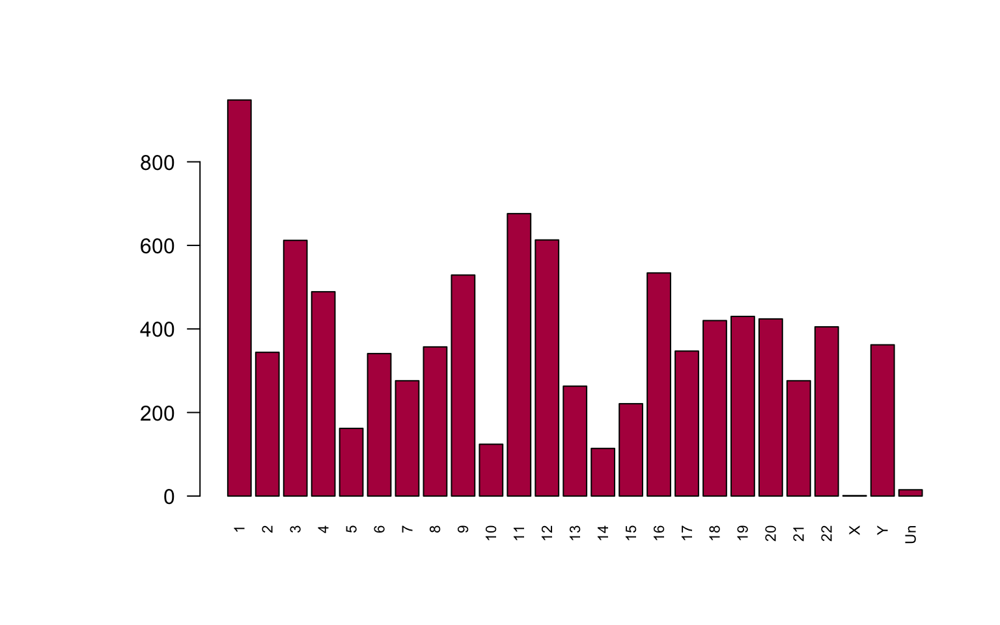

---
output:
  BiocStyle::html_document
---

<!---
Because we split the analysis pipeline in different independent files,
to speed up processing it, here in the setup block we load libraries and
objects that were loaded or produced in the previously processed file,
and which are necessary in this file.
--->


# Differential expression

After the data filtering and normalization, we are interested in identifying gene expression changes and associated p-values between tumor and control samples. For this task, we used the R/Bioconductor packages [sva](http://bioconductor.org/packages/sva) and [limma](https://bioconductor.org/packages/release/bioc/html/limma.html).
We are adopting linear regression models, which in general are used in order to represent, in the most accurate way possible, something which is very complex. In the specific case of DE analysis, the model is used as a predictor of gene expression values. 
For the purpose of fitting the said regression model, it is crucial to build a design matrix. The design matrix is a n x m matrix, where n is the number of samples and m is the number of coeffients which need to be estimated or the types of samples, like cases and controls.
It needs to be defined for which factors to adjust. In our case we are working with a paired design and we would have liked to adjust for gender.

We decide to proceed by only adjusting for the patient id, as it is already implicitly adjusting for gender; as we are working with a paired design, gender is identical between every pair of samples, which would make reduntand to adjust for it and would create technical problems during the inversion step of the matrix in the least square algorithm steps.

In the follwing step we create the design matrix, only adjusting for the patient id. We verify as well wether the matrix is full rank and so is invertible with no problem, which is the case.

```r
pid <- substr(colnames(dge.filt), 9, 12)
mod <- model.matrix(~ factor(type) + factor(pid), colData(coadse.filt))
mod0 <- model.matrix(~ factor(pid), colData(coadse.filt))
#Verify wether is full rank --> yes!
is.fullrank(mod)
```

```
[1] TRUE
```
We use the [sva package](https://www.ncbi.nlm.nih.gov/pmc/articles/PMC3307112/) for identifying and removing batch effects and other unwanted sources of variation.

```r
sv <- sva(assays(coadse.filt)$logCPM, mod, mod0)
```

```
Number of significant surrogate variables is:  8 
Iteration (out of 5 ):1  2  3  4  5  
```

```r
sv$n
```

```
[1] 8
```

The SVA algorithm has found 8 surrogate variables which we add to our model.


```r
modsv <- cbind(mod, sv$sv)
mod0sv <- cbind(mod0, sv$sv)
```
In order to compare gene expression values between samples we need to adjust for the mean-variance realtionship.


```r
barplot(sort(dge.filt$samples$lib.size)/1e+06, xlab = "Samples", ylab = "Library sizes (Millions)", col=rgb(0.7, 0.1, 0.3))
```

<div class="figure" style="text-align: center">

<p class="caption">(\#fig:libsize)Library sizes among samples</p>
</div>

This step could be executed with both limma trend and limma voom. We decided to proceed with the voom() function, since as we can observe in the Figure \@ref(fig:libsize), there are big differences in library sizes among the samples.

So, we calculate the weights that estimate the mean-variance realtionship at gene-by-sample level with the `voom()` function. The obtained weights will be used to fit the model. Morevoer, at the same time, it performs a between-sample normalization.


```r
v <- voom(dge.filt, modsv, plot=TRUE, normalize.method="quantile")
```

<div class="figure" style="text-align: center">

<p class="caption">(\#fig:unnamed-chunk-4)Mean-variance trend</p>
</div>

Next, we fit a linear model with the `fit()` function.


```r
# Fit linear model for each gene given a series of arrays
fit<- lmFit(v,modsv)
```

We then calculate the moderated t-statistics through the `eBayes()` function.


```r
# compute moderated t-statistics, moderated F-statistic, and log-odds of differential expression by empirical Bayes moderation of the standard errors towards a common value.
fit <- eBayes(fit)
FDRcutoff <- 0.01
```

Next, we classified the obtained test statistics as up, down or not significant with the help of the `decideTest` function. The FDR threshold used for this test is corresponds to 1%, as in cancer data is usual to have a lot of changes and so we prefer to be strict.


```r
#Classify a series of related t-statistics as up, down or not significant. 
res <- decideTests(fit, p.value = FDRcutoff) 
summary(res)
```

```
       (Intercept) factor(type)tumor factor(pid)2675 factor(pid)2678
Down            97              4224               1               3
NotSig        1760              3684           12965           12963
Up           11110              5059               1               1
       factor(pid)2680 factor(pid)2683 factor(pid)2685 factor(pid)2686
Down                 1               1               3               1
NotSig           12966           12965           12963           12966
Up                   0               1               1               0
       factor(pid)3489 factor(pid)3496 factor(pid)3511 factor(pid)3514
Down                 5               1               0               2
NotSig           12959           12964           12967           12962
Up                   3               2               0               3
       factor(pid)3516 factor(pid)3517 factor(pid)3518 factor(pid)3520
Down                 0               0               0               1
NotSig           12966           12967           12967           12965
Up                   1               0               0               1
       factor(pid)3522 factor(pid)3525 factor(pid)3527 factor(pid)3531
Down                 0               0               1               1
NotSig           12965           12965           12966           12965
Up                   2               2               0               1
       factor(pid)3534 factor(pid)3655 factor(pid)3660 factor(pid)3662
Down                 0               0               3               2
NotSig           12966           12965           12960           12962
Up                   1               2               4               3
       factor(pid)3663 factor(pid)3697 factor(pid)3712 factor(pid)3713
Down                 3               1               0               1
NotSig           12964           12966           12966           12964
Up                   0               0               1               2
       factor(pid)5662 factor(pid)5667 factor(pid)6598 factor(pid)6599
Down                 4               1               0               1
NotSig           12962           12966           12967           12966
Up                   1               0               0               0
       factor(pid)6600 factor(pid)6601 factor(pid)6603 factor(pid)6605
Down                 2               1               5               0
NotSig           12965           12965           12962           12967
Up                   0               1               0               0
       factor(pid)6704                                                
Down                 1  1928  1251  1430   420  1085    95     7     3
NotSig           12966  9327 10863 10207 12144 10780 12742 12959 12964
Up                   0  1712   853  1330   403  1102   130     1     0
```

We extract the genes chromosome to look at the distribution of the differential expressed genes among the chromosomes, again for the purpose of getting an overview of the data we will be working with.


```r
genesmd <- data.frame(chr = as.character(sub("\\_.*", "", seqnames(rowRanges(coadse.filt)))), symbol = rowData(coadse.filt)[, 1], stringsAsFactors = FALSE)
#Extract a table of the top-ranked genes from a linear model fit.
fit$genes <- genesmd
tt <- topTable(fit, coef = 2, n = Inf)
genes<-table(as.character(sub("\\chr*", "",tt$chr[tt$adj.P.Val < FDRcutoff])))
par(las=2) # make label text perpendicular to axis
par(mar=c(5,8,4,2)) # increase y-axis margin.
names.arg=c("1","2","3","4","5","6","7","8","9","10","11","12","13","14","15","16","17","18","19","20","21","22","X","Y","Un")
barplot(genes,  cex.names=0.7, names.arg = names.arg, col=rgb(0.7, 0.1, 0.3))
```

<div class="figure" style="text-align: center">

<p class="caption">(\#fig:chrs)Distribution of DE genes among chromosomes</p>
</div>

```r
sort(table(tt$chr[tt$adj.P.Val < FDRcutoff]), decreasing = TRUE)
```

```

 chr1 chr19  chr2 chr11  chr3 chr17 chr12  chr6  chr7  chr5  chr9  chrX 
  948   676   613   612   534   529   489   430   424   420   405   362 
chr16  chr4 chr10 chr14 chr15  chr8 chr20 chr22 chr13 chr18 chr21  chrY 
  357   347   344   341   276   276   263   221   162   124   114    15 
chrUn 
    1 
```

Now, we produce two diagnostic plots for limma DE analysis.


```r
par(mfrow = c(1, 2), mar = c(4, 5, 2, 2))
hist(tt$P.Value, xlab = "Raw P-values", main = "A)", las = 1, col=rgb(0.7, 0.1, 0.3))
qqt(fit$t[, 2], df = fit$df.prior + fit$df.residual, main = "B)", pch = ".", cex = 3) 
abline(0, 1, lwd = 2, col= "red")
```

<div class="figure" style="text-align: center">

<p class="caption">(\#fig:dp)Diagnostic plots for limma DE analysis</p>
</div>

In the A plot of figure \@ref(fig:dp) we visualize the raw p-values distribution: it is mainly uniform a part from the very high peak on the left which corresponds to the significantly DE genes. In the B Q-Q plot of figure \@ref(fig:dp) we observe that our gene expression values are not following a normal distribution. In fact, if that was the case, we would expect the two lines overlapping and no DE genes. 

One interesting aspect we would like to systematically assess is the accuracy of the model with different combinations of adjusting factors and when using different algorithms when adjusting for the mean variance relationship. 
For doing this, we would need to use a dataset of genes which are known to be differentially expressed between patients with colon cancer and  control individuals with no colon cancer.
At the moment, we could not find a suitable dataset for this task but in the future, to expand the analysis, it would be interesting to investigate this aspect further.
Lastly, we just collect our set of differential expressed genes to proceed with further analyses.

We proceed to filter only those genes with FDR < 1% and a logFC > 2 (a minimum 100% change in expression).
We then separately observe the upregulated genes in tumor (logFC>0) and the downregulated ones (logFC<0). We decide to investigate them by sorting them by logFC.


```r
tt.filt <- tt[tt$adj.P.Val < FDRcutoff,]  #filtering by FDR < 0.01
tt.filt <- tt.filt[abs(tt.filt$logFC)>2,] # filtering by logFC > 2
all_DEgenes <- tt.filt
up_regulated <- all_DEgenes[which(all_DEgenes$logFC > 0),] # DE genes up regulated
down_regulated <- all_DEgenes[which(all_DEgenes$logFC < 0),] # DE genes down regulated
length(rownames(all_DEgenes)) # how many DE genes we have
```

```
[1] 895
```

```r
length(rownames(up_regulated)) #  Up-reg DE
```

```
[1] 371
```

```r
length(rownames(down_regulated)) # Down-reg DE
```

```
[1] 524
```

```r
down_regulated <- down_regulated[order(down_regulated$logFC),]
up_regulated <- up_regulated[order(up_regulated$logFC, decreasing = TRUE),]
print(head(down_regulated$symbol, n = 8))
```

```
[1] "PPP1R16B" "CA11"     "LVRN"     "CLCN1"    "WNT10A"   "HDAC2"   
[7] "OPRK1"    "SCPEP1"  
```

```r
print(head(up_regulated$symbol, n = 8))
```

```
[1] "NT5DC2"  "COL13A1" "COPA"    "CDH6"    "FZD9"    "LCE2A"   "ESRP2"  
[8] "DPH1"   
```
After the filtering, the total number of DE genes is 895, from which 371 are up regulated and 524 are down regulated.


```r
tt.filt <- tt[tt$adj.P.Val < FDRcutoff,]  #filtering by FDR < 0.01
all_DEgenes <- tt.filt[abs(tt.filt$logFC)>2,] # filtering by logFC > 2
DEgenes <- rownames(all_DEgenes) 
limma::plotMA(fit, coef = 2, status = rownames(fit$lods) %in% DEgenes, legend = FALSE,
main = "MA plot", hl.pch = 46, hl.cex = 2, bg.pch = 46, bg.cex = 2, las = 1)
legend("bottomright", c("DE genes", "Not DE genes"), fill = c("red", "black"), inset = 0.01)
```

<div class="figure" style="text-align: center">

<p class="caption">(\#fig:plotMA)MA plot of DE genes with logFC > 2 and FDR cutoff < 0.01.</p>
</div>

```r
saveRDS(all_DEgenes , file.path("results", "alldegenes.rds"))
```
In figure \@ref(fig:plotMA) we can see the distribution of the filtered DE genes. One reassuring thing here is that the dots are centered around the value zero which indicates that there are not expression-level dependent biases.

## Volcano plot 

Lastly, we want to visualize the DE genes in a Volcano plot. We set two different thresholds: the log fold change threshold and the adjusted p-value threshold.


```r
EnhancedVolcano(tt,
    lab = tt$symbol,
    x = 'logFC',
    y = 'adj.P.Val',
    xlim = c(-8, 8),
    title = 'Volcano Plot',
    pCutoff = 10e-16,
    FCcutoff = 2,
    transcriptPointSize = 1.0,
    transcriptLabSize = 3.0)
```

```
Warning: Removed 1 rows containing missing values (geom_point).
```

```
Warning: Removed 1 rows containing missing values (geom_text).
```

<div class="figure" style="text-align: center">

<p class="caption">(\#fig:unnamed-chunk-9)Volcano plot</p>
</div>

## Session information


```r
sessionInfo()
```

```
R version 3.5.3 (2019-03-11)
Platform: x86_64-apple-darwin15.6.0 (64-bit)
Running under: macOS Mojave 10.14.3

Matrix products: default
BLAS: /Library/Frameworks/R.framework/Versions/3.5/Resources/lib/libRblas.0.dylib
LAPACK: /Library/Frameworks/R.framework/Versions/3.5/Resources/lib/libRlapack.dylib

locale:
[1] it_IT.UTF-8/it_IT.UTF-8/it_IT.UTF-8/C/it_IT.UTF-8/it_IT.UTF-8

attached base packages:
[1] parallel  stats4    stats     graphics  grDevices utils     datasets 
[8] methods   base     

other attached packages:
 [1] GSVA_1.30.0                 GSVAdata_1.18.0            
 [3] hgu95a.db_3.2.3             GSEABase_1.44.0            
 [5] org.Hs.eg.db_3.7.0          xtable_1.8-4               
 [7] GOstats_2.48.0              graph_1.60.0               
 [9] Category_2.48.1             Matrix_1.2-17              
[11] EnhancedVolcano_1.0.1       ggrepel_0.8.1              
[13] ggplot2_3.1.1               calibrate_1.7.2            
[15] MASS_7.3-51.4               sva_3.30.1                 
[17] genefilter_1.64.0           mgcv_1.8-28                
[19] nlme_3.1-139                geneplotter_1.60.0         
[21] annotate_1.60.1             XML_3.98-1.19              
[23] AnnotationDbi_1.44.0        lattice_0.20-38            
[25] edgeR_3.24.3                limma_3.38.3               
[27] SummarizedExperiment_1.12.0 DelayedArray_0.8.0         
[29] BiocParallel_1.16.6         matrixStats_0.54.0         
[31] Biobase_2.42.0              GenomicRanges_1.34.0       
[33] GenomeInfoDb_1.18.2         IRanges_2.16.0             
[35] S4Vectors_0.20.1            BiocGenerics_0.28.0        
[37] knitr_1.22                  BiocStyle_2.10.0           

loaded via a namespace (and not attached):
 [1] bitops_1.0-6           bit64_0.9-7            RColorBrewer_1.1-2    
 [4] Rgraphviz_2.26.0       tools_3.5.3            R6_2.4.0              
 [7] DBI_1.0.0              lazyeval_0.2.2         colorspace_1.4-1      
[10] withr_2.1.2            tidyselect_0.2.5       bit_1.1-14            
[13] compiler_3.5.3         labeling_0.3           bookdown_0.9          
[16] scales_1.0.0           RBGL_1.58.2            stringr_1.4.0         
[19] digest_0.6.18          rmarkdown_1.12         AnnotationForge_1.24.0
[22] XVector_0.22.0         pkgconfig_2.0.2        htmltools_0.3.6       
[25] highr_0.8              rlang_0.3.4            RSQLite_2.1.1         
[28] shiny_1.3.2            dplyr_0.8.1            RCurl_1.95-4.12       
[31] magrittr_1.5           GO.db_3.7.0            GenomeInfoDbData_1.2.0
[34] Rcpp_1.0.1             munsell_0.5.0          stringi_1.4.3         
[37] yaml_2.2.0             zlibbioc_1.28.0        plyr_1.8.4            
[40] grid_3.5.3             blob_1.1.1             promises_1.0.1        
[43] crayon_1.3.4           splines_3.5.3          locfit_1.5-9.1        
[46] pillar_1.3.1           codetools_0.2-16       glue_1.3.1            
[49] evaluate_0.13          BiocManager_1.30.4     httpuv_1.5.1          
[52] gtable_0.3.0           purrr_0.3.2            assertthat_0.2.1      
[55] xfun_0.6               mime_0.6               later_0.8.0           
[58] survival_2.44-1.1      tibble_2.1.1           shinythemes_1.1.2     
[61] memoise_1.1.0         
```
