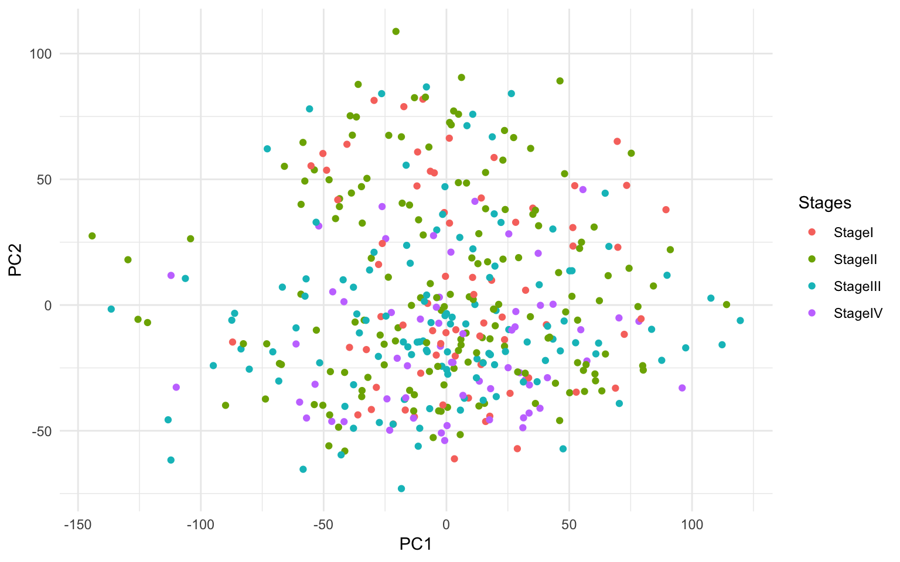

---
output:
  BiocStyle::html_document
---

<!---
Because we split the analysis pipeline in different independent files,
to speed up processing it, here in the setup block we load libraries and
objects that were loaded or produced in the previously processed file,
and which are necessary in this file.
--->


## Differential expression

After having filtered and normalized our tumor dataset, we looked for differential expression of genes among the cancer stages.
We applied a limma voom pipeline, the steps of which are explained in depth already in the paired DEanalysis section and for this reason here we only focus on the steps that differ in the new one.
Since the tumor stage has 4 different values ("StageI","StageII","StageIII", "StageIV""), we decide to use a model with no intercept and a contrast matrix instead, following the instruction of the "Several groups" section of the [limma user guide](http://www.bioconductor.org/packages/devel/bioc/vignettes/limma/inst/doc/usersguide.pdf).
After having obtained the model with the help of the contrast matrix, we applied eBayes. After multiple test adjusting, we are left with no DE genes. 

```r
coadse.tumor$ajcc_pathologic_tumor_stage <- gsub(x = coadse.tumor$ajcc_pathologic_tumor_stage, pattern = " ", replacement = "")
coadse.tumor$ajcc_pathologic_tumor_stage <- droplevels(as.factor(coadse.tumor$ajcc_pathologic_tumor_stage))
coadse.tumor$age_at_initial_pathologic_diagnosis <- droplevels(coadse.tumor$age_at_initial_pathologic_diagnosis)
lev <- c("StageI","StageII","StageIII", "StageIV")
f <- factor(coadse.tumor$ajcc_pathologic_tumor_stage, levels=lev)
design <- model.matrix(~0+f , colData(coadse.tumor))
colnames(design) <- lev
fit1 <- lmFit(assays(coadse.tumor)$logCPM,design)
contrast.matrix <- makeContrasts(StageI-StageII, StageI-StageIII, StageI-StageIV, StageII-StageIII, StageII-StageIV, StageIII-StageIV, levels=design)
fit2 <- contrasts.fit(fit1, contrast.matrix)
fit2 <- eBayes(fit2)
tt<-topTable(fit2, coef=1, n=Inf,adjust="fdr")
DEgenes <- rownames(tt)[tt$adj.P.Val < 0.1]
length(DEgenes)
```

```
[1] 0
```

```r
saveRDS(tt, file.path("results", "tt.rds"))
```
This can be due to the fact that in many different biological contexts gene expression changes may be very little and after Multiple test adjusting no significant DE genes can be identified.
We then decide to run a Principal Component Analysis to further explore the gene expression among the four cancer stages.
Since we use the prcomp() function, we first need to transpose our matrix in order to have the samples as rows, if not we would get a pca analysis explaining how genes are related to each other, which in this case is not the desired output. After having prepared our data, we run the pca analyis and we can observe that the first four principal components explain respectively 11.7%, 7%, 6% and 4% of the variability. 

```r
a<-assays(coadse.tumor)
ta<-t(assays(coadse.tumor)$logCPM)
pca<- prcomp(ta)
summary(pca)
```

```
Importance of components:
                           PC1      PC2      PC3      PC4      PC5     PC6
Standard deviation     44.6935 36.51157 32.42333 28.17916 25.07691 20.6460
Proportion of Variance  0.1171  0.07818  0.06165  0.04657  0.03688  0.0250
Cumulative Proportion   0.1171  0.19531  0.25696  0.30353  0.34040  0.3654
                            PC7      PC8      PC9     PC10     PC11     PC12
Standard deviation     18.59050 17.71089 17.08951 16.53713 16.14581 14.85982
Proportion of Variance  0.02027  0.01839  0.01713  0.01604  0.01529  0.01295
Cumulative Proportion   0.38567  0.40406  0.42119  0.43723  0.45251  0.46546
                           PC13     PC14     PC15     PC16     PC17     PC18
Standard deviation     14.48627 13.96364 13.04648 12.84439 12.54125 12.17461
Proportion of Variance  0.01231  0.01143  0.00998  0.00967  0.00922  0.00869
Cumulative Proportion   0.47777  0.48920  0.49918  0.50886  0.51808  0.52677
                           PC19     PC20     PC21     PC22    PC23    PC24
Standard deviation     11.98712 11.63894 11.46548 10.98483 10.8444 10.6052
Proportion of Variance  0.00843  0.00794  0.00771  0.00708  0.0069  0.0066
Cumulative Proportion   0.53520  0.54314  0.55085  0.55793  0.5648  0.5714
                           PC25     PC26     PC27    PC28    PC29    PC30
Standard deviation     10.16535 10.06506 10.04708 9.83001 9.43738 9.30215
Proportion of Variance  0.00606  0.00594  0.00592 0.00567 0.00522 0.00507
Cumulative Proportion   0.57748  0.58342  0.58934 0.59501 0.60023 0.60530
                          PC31    PC32   PC33    PC34    PC35    PC36
Standard deviation     9.03161 8.98159 8.8583 8.70738 8.38520 8.26667
Proportion of Variance 0.00478 0.00473 0.0046 0.00445 0.00412 0.00401
Cumulative Proportion  0.61009 0.61482 0.6194 0.62387 0.62799 0.63200
                          PC37   PC38    PC39    PC40    PC41    PC42
Standard deviation     8.22396 8.1527 8.01166 7.95894 7.90294 7.71894
Proportion of Variance 0.00397 0.0039 0.00376 0.00371 0.00366 0.00349
Cumulative Proportion  0.63596 0.6399 0.64363 0.64734 0.65100 0.65450
                          PC43    PC44    PC45    PC46    PC47    PC48
Standard deviation     7.62120 7.48398 7.43333 7.37608 7.31295 7.25205
Proportion of Variance 0.00341 0.00328 0.00324 0.00319 0.00314 0.00308
Cumulative Proportion  0.65790 0.66119 0.66443 0.66762 0.67075 0.67384
                          PC49    PC50    PC51    PC52    PC53    PC54
Standard deviation     7.19878 7.13457 7.05670 6.99305 6.92780 6.85429
Proportion of Variance 0.00304 0.00298 0.00292 0.00287 0.00281 0.00276
Cumulative Proportion  0.67688 0.67986 0.68278 0.68565 0.68846 0.69122
                          PC55   PC56    PC57    PC58    PC59    PC60   PC61
Standard deviation     6.82387 6.7797 6.74418 6.66551 6.61843 6.58317 6.5330
Proportion of Variance 0.00273 0.0027 0.00267 0.00261 0.00257 0.00254 0.0025
Cumulative Proportion  0.69395 0.6966 0.69931 0.70192 0.70449 0.70703 0.7095
                          PC62    PC63    PC64    PC65    PC66   PC67
Standard deviation     6.46915 6.42760 6.42152 6.35342 6.29894 6.2584
Proportion of Variance 0.00245 0.00242 0.00242 0.00237 0.00233 0.0023
Cumulative Proportion  0.71199 0.71441 0.71683 0.71919 0.72152 0.7238
                          PC68    PC69   PC70    PC71    PC72    PC73
Standard deviation     6.21788 6.14443 6.1309 6.05797 6.02530 6.00753
Proportion of Variance 0.00227 0.00221 0.0022 0.00215 0.00213 0.00212
Cumulative Proportion  0.72608 0.72830 0.7305 0.73265 0.73478 0.73690
                          PC74    PC75    PC76    PC77    PC78    PC79
Standard deviation     5.95645 5.93414 5.91833 5.88620 5.81640 5.79733
Proportion of Variance 0.00208 0.00207 0.00205 0.00203 0.00198 0.00197
Cumulative Proportion  0.73898 0.74105 0.74310 0.74513 0.74712 0.74909
                          PC80    PC81    PC82   PC83    PC84    PC85
Standard deviation     5.77299 5.74475 5.72211 5.6907 5.64574 5.62126
Proportion of Variance 0.00195 0.00194 0.00192 0.0019 0.00187 0.00185
Cumulative Proportion  0.75104 0.75298 0.75490 0.7568 0.75866 0.76052
                          PC86    PC87    PC88    PC89    PC90    PC91
Standard deviation     5.60174 5.57095 5.54936 5.47291 5.46457 5.44289
Proportion of Variance 0.00184 0.00182 0.00181 0.00176 0.00175 0.00174
Cumulative Proportion  0.76236 0.76418 0.76598 0.76774 0.76949 0.77123
                          PC92   PC93    PC94    PC95    PC96    PC97
Standard deviation     5.43243 5.3871 5.36085 5.29807 5.29398 5.28114
Proportion of Variance 0.00173 0.0017 0.00169 0.00165 0.00164 0.00164
Cumulative Proportion  0.77296 0.7747 0.77635 0.77799 0.77964 0.78127
                          PC98    PC99   PC100   PC101   PC102   PC103
Standard deviation     5.23626 5.23255 5.20496 5.19151 5.18347 5.16841
Proportion of Variance 0.00161 0.00161 0.00159 0.00158 0.00158 0.00157
Cumulative Proportion  0.78288 0.78448 0.78607 0.78765 0.78923 0.79080
                         PC104   PC105   PC106   PC107   PC108   PC109
Standard deviation     5.15305 5.12863 5.12108 5.07225 5.06783 5.04423
Proportion of Variance 0.00156 0.00154 0.00154 0.00151 0.00151 0.00149
Cumulative Proportion  0.79235 0.79390 0.79543 0.79694 0.79845 0.79994
                         PC110   PC111   PC112   PC113   PC114   PC115
Standard deviation     5.01331 4.99007 4.98494 4.94455 4.92491 4.90752
Proportion of Variance 0.00147 0.00146 0.00146 0.00143 0.00142 0.00141
Cumulative Proportion  0.80141 0.80287 0.80433 0.80577 0.80719 0.80860
                        PC116  PC117   PC118   PC119   PC120   PC121   PC122
Standard deviation     4.8891 4.8850 4.86350 4.82485 4.82178 4.81539 4.78333
Proportion of Variance 0.0014 0.0014 0.00139 0.00137 0.00136 0.00136 0.00134
Cumulative Proportion  0.8100 0.8114 0.81279 0.81415 0.81552 0.81688 0.81822
                         PC123   PC124   PC125   PC126   PC127   PC128
Standard deviation     4.78080 4.76804 4.74201 4.74120 4.68750 4.68386
Proportion of Variance 0.00134 0.00133 0.00132 0.00132 0.00129 0.00129
Cumulative Proportion  0.81956 0.82089 0.82221 0.82353 0.82482 0.82610
                         PC129   PC130   PC131   PC132   PC133   PC134
Standard deviation     4.67484 4.66644 4.65354 4.60859 4.60377 4.59877
Proportion of Variance 0.00128 0.00128 0.00127 0.00125 0.00124 0.00124
Cumulative Proportion  0.82739 0.82866 0.82993 0.83118 0.83242 0.83366
                         PC135   PC136   PC137  PC138  PC139   PC140   PC141
Standard deviation     4.57334 4.56747 4.55318 4.5223 4.5179 4.49251 4.47413
Proportion of Variance 0.00123 0.00122 0.00122 0.0012 0.0012 0.00118 0.00117
Cumulative Proportion  0.83489 0.83611 0.83733 0.8385 0.8397 0.84091 0.84208
                         PC142   PC143   PC144   PC145   PC146   PC147
Standard deviation     4.45544 4.44353 4.43244 4.42651 4.41182 4.39015
Proportion of Variance 0.00116 0.00116 0.00115 0.00115 0.00114 0.00113
Cumulative Proportion  0.84324 0.84440 0.84555 0.84670 0.84784 0.84897
                         PC148   PC149   PC150   PC151  PC152  PC153   PC154
Standard deviation     4.37981 4.37028 4.35685 4.34626 4.3358 4.3228 4.30286
Proportion of Variance 0.00112 0.00112 0.00111 0.00111 0.0011 0.0011 0.00109
Cumulative Proportion  0.85010 0.85122 0.85233 0.85344 0.8545 0.8556 0.85672
                         PC155   PC156   PC157   PC158   PC159   PC160
Standard deviation     4.27687 4.27060 4.25577 4.25117 4.23543 4.22520
Proportion of Variance 0.00107 0.00107 0.00106 0.00106 0.00105 0.00105
Cumulative Proportion  0.85780 0.85887 0.85993 0.86099 0.86204 0.86309
                         PC161   PC162   PC163   PC164   PC165   PC166
Standard deviation     4.21232 4.18941 4.17341 4.16563 4.15160 4.14360
Proportion of Variance 0.00104 0.00103 0.00102 0.00102 0.00101 0.00101
Cumulative Proportion  0.86413 0.86516 0.86618 0.86720 0.86821 0.86921
                        PC167   PC168   PC169   PC170   PC171   PC172
Standard deviation     4.1327 4.10695 4.09876 4.07790 4.07162 4.06287
Proportion of Variance 0.0010 0.00099 0.00099 0.00098 0.00097 0.00097
Cumulative Proportion  0.8702 0.87120 0.87219 0.87316 0.87414 0.87510
                         PC173   PC174   PC175   PC176   PC177   PC178
Standard deviation     4.05339 4.04455 4.01090 4.00330 3.99674 3.98506
Proportion of Variance 0.00096 0.00096 0.00094 0.00094 0.00094 0.00093
Cumulative Proportion  0.87607 0.87703 0.87797 0.87891 0.87985 0.88078
                         PC179   PC180   PC181   PC182   PC183  PC184  PC185
Standard deviation     3.95933 3.95520 3.94865 3.93825 3.93104 3.9245 3.9157
Proportion of Variance 0.00092 0.00092 0.00091 0.00091 0.00091 0.0009 0.0009
Cumulative Proportion  0.88170 0.88262 0.88353 0.88444 0.88535 0.8862 0.8871
                         PC186   PC187   PC188   PC189   PC190   PC191
Standard deviation     3.89855 3.88968 3.88385 3.87187 3.86025 3.84428
Proportion of Variance 0.00089 0.00089 0.00088 0.00088 0.00087 0.00087
Cumulative Proportion  0.88804 0.88893 0.88981 0.89069 0.89156 0.89243
                         PC192   PC193   PC194   PC195   PC196   PC197
Standard deviation     3.83863 3.82117 3.81845 3.79988 3.79161 3.77460
Proportion of Variance 0.00086 0.00086 0.00086 0.00085 0.00084 0.00084
Cumulative Proportion  0.89329 0.89415 0.89501 0.89585 0.89670 0.89753
                         PC198   PC199   PC200   PC201   PC202   PC203
Standard deviation     3.76647 3.75734 3.74509 3.73608 3.73207 3.71334
Proportion of Variance 0.00083 0.00083 0.00082 0.00082 0.00082 0.00081
Cumulative Proportion  0.89836 0.89919 0.90001 0.90083 0.90165 0.90246
                         PC204  PC205  PC206   PC207   PC208   PC209   PC210
Standard deviation     3.70693 3.6999 3.6907 3.67838 3.67069 3.64806 3.63786
Proportion of Variance 0.00081 0.0008 0.0008 0.00079 0.00079 0.00078 0.00078
Cumulative Proportion  0.90326 0.9041 0.9049 0.90566 0.90645 0.90723 0.90800
                         PC211   PC212   PC213   PC214   PC215   PC216
Standard deviation     3.63668 3.62390 3.61442 3.60922 3.60190 3.58148
Proportion of Variance 0.00078 0.00077 0.00077 0.00076 0.00076 0.00075
Cumulative Proportion  0.90878 0.90955 0.91032 0.91108 0.91184 0.91259
                         PC217   PC218   PC219   PC220   PC221   PC222
Standard deviation     3.56900 3.56600 3.55709 3.55361 3.52974 3.51467
Proportion of Variance 0.00075 0.00075 0.00074 0.00074 0.00073 0.00072
Cumulative Proportion  0.91334 0.91409 0.91483 0.91557 0.91630 0.91702
                         PC223   PC224   PC225   PC226   PC227  PC228  PC229
Standard deviation     3.50518 3.49158 3.48292 3.47675 3.47090 3.4623 3.4546
Proportion of Variance 0.00072 0.00071 0.00071 0.00071 0.00071 0.0007 0.0007
Cumulative Proportion  0.91774 0.91846 0.91917 0.91988 0.92059 0.9213 0.9220
                         PC230   PC231   PC232   PC233   PC234   PC235
Standard deviation     3.42926 3.41371 3.40741 3.40331 3.39621 3.38637
Proportion of Variance 0.00069 0.00068 0.00068 0.00068 0.00068 0.00067
Cumulative Proportion  0.92268 0.92336 0.92404 0.92472 0.92540 0.92607
                         PC236   PC237   PC238   PC239   PC240   PC241
Standard deviation     3.38031 3.37654 3.37250 3.36566 3.34443 3.33955
Proportion of Variance 0.00067 0.00067 0.00067 0.00066 0.00066 0.00065
Cumulative Proportion  0.92674 0.92741 0.92808 0.92874 0.92940 0.93005
                         PC242   PC243   PC244   PC245   PC246   PC247
Standard deviation     3.33588 3.32950 3.31844 3.31419 3.30190 3.29236
Proportion of Variance 0.00065 0.00065 0.00065 0.00064 0.00064 0.00064
Cumulative Proportion  0.93070 0.93135 0.93200 0.93264 0.93328 0.93392
                         PC248   PC249   PC250   PC251   PC252   PC253
Standard deviation     3.28535 3.28141 3.26743 3.26422 3.25422 3.24564
Proportion of Variance 0.00063 0.00063 0.00063 0.00062 0.00062 0.00062
Cumulative Proportion  0.93455 0.93518 0.93581 0.93643 0.93705 0.93767
                         PC254   PC255  PC256  PC257  PC258   PC259   PC260
Standard deviation     3.23760 3.22960 3.2105 3.1997 3.1901 3.18130 3.17704
Proportion of Variance 0.00061 0.00061 0.0006 0.0006 0.0006 0.00059 0.00059
Cumulative Proportion  0.93829 0.93890 0.9395 0.9401 0.9407 0.94129 0.94189
                         PC261   PC262   PC263   PC264   PC265   PC266
Standard deviation     3.17478 3.16568 3.16051 3.15364 3.14908 3.12888
Proportion of Variance 0.00059 0.00059 0.00059 0.00058 0.00058 0.00057
Cumulative Proportion  0.94248 0.94306 0.94365 0.94423 0.94481 0.94539
                         PC267   PC268   PC269   PC270   PC271   PC272
Standard deviation     3.11436 3.11310 3.10912 3.10374 3.09464 3.08761
Proportion of Variance 0.00057 0.00057 0.00057 0.00056 0.00056 0.00056
Cumulative Proportion  0.94596 0.94653 0.94709 0.94766 0.94822 0.94878
                         PC273   PC274   PC275   PC276   PC277   PC278
Standard deviation     3.07420 3.07246 3.06774 3.04938 3.04524 3.03002
Proportion of Variance 0.00055 0.00055 0.00055 0.00055 0.00054 0.00054
Cumulative Proportion  0.94933 0.94989 0.95044 0.95098 0.95153 0.95207
                         PC279   PC280   PC281   PC282   PC283   PC284
Standard deviation     3.02888 3.02651 3.01281 3.00031 2.99465 2.98222
Proportion of Variance 0.00054 0.00054 0.00053 0.00053 0.00053 0.00052
Cumulative Proportion  0.95260 0.95314 0.95367 0.95420 0.95473 0.95525
                         PC285   PC286   PC287   PC288   PC289  PC290  PC291
Standard deviation     2.97629 2.97135 2.96061 2.95295 2.93863 2.9325 2.9254
Proportion of Variance 0.00052 0.00052 0.00051 0.00051 0.00051 0.0005 0.0005
Cumulative Proportion  0.95577 0.95629 0.95680 0.95731 0.95782 0.9583 0.9588
                        PC292   PC293   PC294   PC295   PC296   PC297
Standard deviation     2.9065 2.90285 2.89613 2.88550 2.88129 2.87175
Proportion of Variance 0.0005 0.00049 0.00049 0.00049 0.00049 0.00048
Cumulative Proportion  0.9593 0.95981 0.96030 0.96079 0.96128 0.96176
                         PC298   PC299   PC300   PC301   PC302   PC303
Standard deviation     2.86229 2.85615 2.84741 2.83469 2.82846 2.82636
Proportion of Variance 0.00048 0.00048 0.00048 0.00047 0.00047 0.00047
Cumulative Proportion  0.96224 0.96272 0.96320 0.96367 0.96414 0.96461
                         PC304   PC305   PC306   PC307   PC308   PC309
Standard deviation     2.81953 2.81194 2.80863 2.79527 2.79464 2.77689
Proportion of Variance 0.00047 0.00046 0.00046 0.00046 0.00046 0.00045
Cumulative Proportion  0.96507 0.96554 0.96600 0.96646 0.96692 0.96737
                         PC310   PC311   PC312   PC313   PC314   PC315
Standard deviation     2.77457 2.76934 2.75810 2.75248 2.74274 2.73410
Proportion of Variance 0.00045 0.00045 0.00045 0.00044 0.00044 0.00044
Cumulative Proportion  0.96782 0.96827 0.96871 0.96916 0.96960 0.97004
                         PC316   PC317   PC318   PC319   PC320   PC321
Standard deviation     2.72543 2.72232 2.71713 2.70336 2.69912 2.68869
Proportion of Variance 0.00044 0.00043 0.00043 0.00043 0.00043 0.00042
Cumulative Proportion  0.97047 0.97091 0.97134 0.97177 0.97220 0.97262
                         PC322   PC323   PC324   PC325   PC326   PC327
Standard deviation     2.68677 2.67612 2.67131 2.66771 2.65190 2.63964
Proportion of Variance 0.00042 0.00042 0.00042 0.00042 0.00041 0.00041
Cumulative Proportion  0.97304 0.97346 0.97388 0.97430 0.97471 0.97512
                         PC328   PC329  PC330  PC331  PC332  PC333   PC334
Standard deviation     2.62973 2.62841 2.6241 2.6181 2.6052 2.5954 2.59464
Proportion of Variance 0.00041 0.00041 0.0004 0.0004 0.0004 0.0004 0.00039
Cumulative Proportion  0.97553 0.97593 0.9763 0.9767 0.9771 0.9775 0.97793
                         PC335   PC336   PC337   PC338   PC339   PC340
Standard deviation     2.58933 2.57766 2.57635 2.56835 2.56263 2.54871
Proportion of Variance 0.00039 0.00039 0.00039 0.00039 0.00039 0.00038
Cumulative Proportion  0.97832 0.97871 0.97910 0.97948 0.97987 0.98025
                         PC341   PC342   PC343   PC344   PC345   PC346
Standard deviation     2.54729 2.53286 2.52395 2.52075 2.51463 2.50988
Proportion of Variance 0.00038 0.00038 0.00037 0.00037 0.00037 0.00037
Cumulative Proportion  0.98063 0.98101 0.98138 0.98175 0.98212 0.98249
                         PC347   PC348   PC349   PC350   PC351   PC352
Standard deviation     2.48787 2.47835 2.47456 2.46291 2.45721 2.45083
Proportion of Variance 0.00036 0.00036 0.00036 0.00036 0.00035 0.00035
Cumulative Proportion  0.98286 0.98322 0.98358 0.98393 0.98429 0.98464
                         PC353   PC354   PC355   PC356   PC357   PC358
Standard deviation     2.44010 2.43357 2.42909 2.42339 2.41580 2.41093
Proportion of Variance 0.00035 0.00035 0.00035 0.00034 0.00034 0.00034
Cumulative Proportion  0.98499 0.98533 0.98568 0.98602 0.98637 0.98671
                         PC359   PC360   PC361   PC362   PC363   PC364
Standard deviation     2.39708 2.39219 2.38403 2.37501 2.36474 2.36072
Proportion of Variance 0.00034 0.00034 0.00033 0.00033 0.00033 0.00033
Cumulative Proportion  0.98704 0.98738 0.98771 0.98804 0.98837 0.98870
                         PC365   PC366   PC367   PC368   PC369   PC370
Standard deviation     2.34682 2.34017 2.33101 2.32409 2.32219 2.31027
Proportion of Variance 0.00032 0.00032 0.00032 0.00032 0.00032 0.00031
Cumulative Proportion  0.98902 0.98934 0.98966 0.98998 0.99030 0.99061
                         PC371   PC372   PC373  PC374  PC375  PC376  PC377
Standard deviation     2.30664 2.29914 2.28848 2.2800 2.2738 2.2611 2.2561
Proportion of Variance 0.00031 0.00031 0.00031 0.0003 0.0003 0.0003 0.0003
Cumulative Proportion  0.99092 0.99123 0.99154 0.9918 0.9921 0.9925 0.9927
                        PC378   PC379   PC380   PC381   PC382   PC383
Standard deviation     2.2495 2.23862 2.23139 2.22381 2.20932 2.19898
Proportion of Variance 0.0003 0.00029 0.00029 0.00029 0.00029 0.00028
Cumulative Proportion  0.9930 0.99333 0.99363 0.99392 0.99420 0.99449
                         PC384   PC385   PC386   PC387   PC388   PC389
Standard deviation     2.19738 2.19201 2.17961 2.16815 2.16281 2.15704
Proportion of Variance 0.00028 0.00028 0.00028 0.00028 0.00027 0.00027
Cumulative Proportion  0.99477 0.99505 0.99533 0.99561 0.99588 0.99615
                         PC390   PC391   PC392   PC393   PC394   PC395
Standard deviation     2.13686 2.13183 2.11173 2.09438 2.08236 2.07396
Proportion of Variance 0.00027 0.00027 0.00026 0.00026 0.00025 0.00025
Cumulative Proportion  0.99642 0.99669 0.99695 0.99721 0.99746 0.99771
                         PC396   PC397   PC398   PC399   PC400   PC401
Standard deviation     2.03804 2.03039 2.01921 2.01246 2.01009 1.98283
Proportion of Variance 0.00024 0.00024 0.00024 0.00024 0.00024 0.00023
Cumulative Proportion  0.99796 0.99820 0.99844 0.99867 0.99891 0.99914
                         PC402   PC403   PC404   PC405     PC406
Standard deviation     1.95088 1.91258 1.90654 1.88289 3.267e-14
Proportion of Variance 0.00022 0.00021 0.00021 0.00021 0.000e+00
Cumulative Proportion  0.99936 0.99958 0.99979 1.00000 1.000e+00
```

```r
dtp <- data.frame('Stages' = coadse.tumor$ajcc_pathologic_tumor_stage, pca$x[,1:2]) # the first two componets are selected (NB: you can also select 3 for 3D plottings or 3+)
ggplot(data = dtp) + geom_point(aes(x = PC1, y = PC2, col = Stages)) + theme_minimal() 
```

<div class="figure" style="text-align: center">

<p class="caption">(\#fig:pca)PC 1 and PC 2 by cancer Stage</p>
</div>
In Figure \@ref(fig:pca) it seems that there is no differential expression among the stages. However, we decide to proceed with the GSE Analysis. In fact, there may be small but consistent changes in gene expression values which could still imply relevant changes between the different stages.

### Session information


```r
sessionInfo()
```

```
R version 3.5.3 (2019-03-11)
Platform: x86_64-apple-darwin15.6.0 (64-bit)
Running under: macOS Mojave 10.14.3

Matrix products: default
BLAS: /Library/Frameworks/R.framework/Versions/3.5/Resources/lib/libRblas.0.dylib
LAPACK: /Library/Frameworks/R.framework/Versions/3.5/Resources/lib/libRlapack.dylib

locale:
[1] it_IT.UTF-8/it_IT.UTF-8/it_IT.UTF-8/C/it_IT.UTF-8/it_IT.UTF-8

attached base packages:
[1] parallel  stats4    stats     graphics  grDevices utils     datasets 
[8] methods   base     

other attached packages:
 [1] GSVA_1.30.0                 GSVAdata_1.18.0            
 [3] hgu95a.db_3.2.3             GSEABase_1.44.0            
 [5] org.Hs.eg.db_3.7.0          xtable_1.8-4               
 [7] GOstats_2.48.0              graph_1.60.0               
 [9] Category_2.48.1             Matrix_1.2-17              
[11] ggplot2_3.1.1               calibrate_1.7.2            
[13] MASS_7.3-51.4               geneplotter_1.60.0         
[15] annotate_1.60.1             XML_3.98-1.19              
[17] AnnotationDbi_1.44.0        lattice_0.20-38            
[19] edgeR_3.24.3                limma_3.38.3               
[21] SummarizedExperiment_1.12.0 DelayedArray_0.8.0         
[23] BiocParallel_1.16.6         matrixStats_0.54.0         
[25] Biobase_2.42.0              GenomicRanges_1.34.0       
[27] GenomeInfoDb_1.18.2         IRanges_2.16.0             
[29] S4Vectors_0.20.1            BiocGenerics_0.28.0        
[31] knitr_1.22                  BiocStyle_2.10.0           

loaded via a namespace (and not attached):
 [1] bitops_1.0-6           bit64_0.9-7            RColorBrewer_1.1-2    
 [4] Rgraphviz_2.26.0       tools_3.5.3            R6_2.4.0              
 [7] DBI_1.0.0              lazyeval_0.2.2         colorspace_1.4-1      
[10] withr_2.1.2            tidyselect_0.2.5       bit_1.1-14            
[13] compiler_3.5.3         labeling_0.3           bookdown_0.9          
[16] scales_1.0.0           genefilter_1.64.0      RBGL_1.58.2           
[19] stringr_1.4.0          digest_0.6.18          rmarkdown_1.12        
[22] AnnotationForge_1.24.0 XVector_0.22.0         pkgconfig_2.0.2       
[25] htmltools_0.3.6        highr_0.8              rlang_0.3.4           
[28] RSQLite_2.1.1          shiny_1.3.2            dplyr_0.8.1           
[31] RCurl_1.95-4.12        magrittr_1.5           GO.db_3.7.0           
[34] GenomeInfoDbData_1.2.0 Rcpp_1.0.1             munsell_0.5.0         
[37] stringi_1.4.3          yaml_2.2.0             zlibbioc_1.28.0       
[40] plyr_1.8.4             grid_3.5.3             blob_1.1.1            
[43] promises_1.0.1         crayon_1.3.4           splines_3.5.3         
[46] locfit_1.5-9.1         pillar_1.3.1           codetools_0.2-16      
[49] glue_1.3.1             evaluate_0.13          BiocManager_1.30.4    
[52] httpuv_1.5.1           gtable_0.3.0           purrr_0.3.2           
[55] assertthat_0.2.1       xfun_0.6               mime_0.6              
[58] later_0.8.0            survival_2.44-1.1      tibble_2.1.1          
[61] shinythemes_1.1.2      memoise_1.1.0         
```
