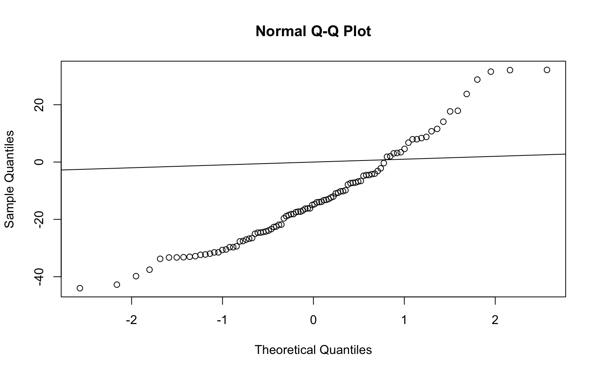

---
output:
  BiocStyle::html_document
---

<!---
Because we split the analysis pipeline in different independent files,
to speed up processing it, here in the setup block we load libraries and
objects that were loaded or produced in the previously processed file,
and which are necessary in this file.
--->


# GSEA

In many differential gene expression analyses, the magnitude of gene expression changes may be small and very few significant DE genes will be idenified after having adjusted for multiple testing. For this reason, we want to see if there are small but consistent changes occuring for a number of genes operating in a common pathway. We go through this workflow by assessing DE genes direclty at the geneset level, starting from the expression data themselves. We approach this analysis by using the `GSEA algorithm`.

## Preparation

To start with the GSEA, we start putting our expression data and the collection of gene sets from the GSVA[http://www.bioconductor.org/packages/release/data/experiment/html/GSVAdata.html] dataset `c2BroadSets` in a `GeneSetCollection` object, as it contains curated gene sets, suggesting a good set representation for biological data analysis.


```r
# collect gene sets
data(c2BroadSets)
gsc <- GeneSetCollection(c2BroadSets)
gsc
```

```
GeneSetCollection
  names: NAKAMURA_CANCER_MICROENVIRONMENT_UP, NAKAMURA_CANCER_MICROENVIRONMENT_DN, ..., ST_PHOSPHOINOSITIDE_3_KINASE_PATHWAY (3272 total)
  unique identifiers: 5167, 100288400, ..., 57191 (29340 total)
  types in collection:
    geneIdType: EntrezIdentifier (1 total)
    collectionType: BroadCollection (1 total)
```

```r
length(gsc) # number of gene sets in the collection
```

```
[1] 3272
```

```r
head(names(gsc)) # some of the gene sets in the collection
```

```
[1] "NAKAMURA_CANCER_MICROENVIRONMENT_UP" 
[2] "NAKAMURA_CANCER_MICROENVIRONMENT_DN" 
[3] "WEST_ADRENOCORTICAL_TUMOR_MARKERS_UP"
[4] "WEST_ADRENOCORTICAL_TUMOR_MARKERS_DN"
[5] "WINTER_HYPOXIA_UP"                   
[6] "WINTER_HYPOXIA_DN"                   
```

In order to reduce the amount of data to analyse, we are going to restrict the analysis to the pathways `KEGG`, `REACTOME` and `BIOCARTA`.


```r
gsc <- gsc[c(grep("^KEGG", names(gsc)),
grep("^REACTOME", names(gsc)), grep("^BIOCARTA", names(gsc)))]
gsc
```

```
GeneSetCollection
  names: KEGG_GLYCOLYSIS_GLUCONEOGENESIS, KEGG_CITRATE_CYCLE_TCA_CYCLE, ..., BIOCARTA_ACTINY_PATHWAY (833 total)
  unique identifiers: 55902, 2645, ..., 8544 (6744 total)
  types in collection:
    geneIdType: EntrezIdentifier (1 total)
    collectionType: BroadCollection (1 total)
```

```r
length(gsc)
```

```
[1] 833
```

Now we can start our GSEA analysis, using the algorithm refered as *simple GSEA* (Irizarry et al. (2009)[https://journals.sagepub.com/doi/abs/10.1177/0962280209351908]).

First, we need to map the identifiers from the gene sets to the identifiers of the data we are going to analyze. Furthermore, we create an incidence matrix (Im) which indicates which genes belong to what gene set.


```r
gsc <- mapIdentifiers(gsc, AnnoOrEntrezIdentifier(metadata(coadse.filt)$annotation))
gsc
```

```
GeneSetCollection
  names: KEGG_GLYCOLYSIS_GLUCONEOGENESIS, KEGG_CITRATE_CYCLE_TCA_CYCLE, ..., BIOCARTA_ACTINY_PATHWAY (833 total)
  unique identifiers: 55902, 2645, ..., 8544 (6744 total)
  types in collection:
    geneIdType: EntrezIdentifier (1 total)
    collectionType: BroadCollection (1 total)
```

```r
Im <- incidence(gsc)
dim(Im)
```

```
[1]  833 6744
```

```r
Im[1:2, 1:10]
```

```
                                55902 2645 5232 5230 5162 5160 5161 55276
KEGG_GLYCOLYSIS_GLUCONEOGENESIS     1    1    1    1    1    1    1     1
KEGG_CITRATE_CYCLE_TCA_CYCLE        0    0    0    0    1    1    1     0
                                7167 84532
KEGG_GLYCOLYSIS_GLUCONEOGENESIS    1     1
KEGG_CITRATE_CYCLE_TCA_CYCLE       0     0
```
We can see that several genes are present in more than one gene set.

Once done it, the following step will be to discard those genes that are not present in our data, and also discard all genes in our data that are not annotated in any gene sets.


```r
Im <- Im[, colnames(Im) %in% rownames(all_DEgenes)]
dim(Im)
```

```
[1] 833 312
```

```r
coadse.filt <- coadse.filt[colnames(Im), ]
dim(coadse.filt)
```

```
[1] 312  72
```

```r
dge.filt <- dge.filt[colnames(Im),]
dim(dge.filt)
```

```
[1] 312  72
```

As a result we have discarted almost **6400** genes that didn't belong to our data.

## Simple GSEA

In order to determine whether an *a priori* defined set of genes shows statistically significant differences between tumor vs normal phenotypes, we are going to perform a *Gene Set Enrichment Analysis* to introduce a method for pathway analysis assessing DE directly at gene set level.

The main scope of the GSEA approach is, as mentioned, to detect consistent and robust changes in expression within a gene set. To do so, we calculate the Enrichment Score (ES) as a z-score.

We decided to filter out the genesets that contain less than 10 genes. In fact, very small gene sets may induce little reliability and increase type I errors (false positives). Then we also calculate the z-score.


```r
Im <- Im[rowSums(Im) >= 5, ]
tGSgenes <- all_DEgenes[match(colnames(Im), rownames(all_DEgenes)), "t"] # calculate all t-statistics for genes in each gene set
zS <- sqrt(rowSums(Im)) * (as.vector(Im %*% tGSgenes)/rowSums(Im)) # calculating Zscore statistic
length(zS)
```

```
[1] 98
```

```r
head(zS, n=10)
```

```
                  KEGG_GLYCOLYSIS_GLUCONEOGENESIS 
                                       -14.054563 
                       KEGG_FATTY_ACID_METABOLISM 
                                       -22.468084 
                KEGG_STEROID_HORMONE_BIOSYNTHESIS 
                                        -3.128532 
                           KEGG_PURINE_METABOLISM 
                                       -18.179222 
                       KEGG_PYRIMIDINE_METABOLISM 
                                       -39.806624 
             KEGG_ARGININE_AND_PROLINE_METABOLISM 
                                         8.772841 
                          KEGG_RETINOL_METABOLISM 
                                         3.420898 
        KEGG_PORPHYRIN_AND_CHLOROPHYLL_METABOLISM 
                                        17.655980 
KEGG_METABOLISM_OF_XENOBIOTICS_BY_CYTOCHROME_P450 
                                       -16.873131 
             KEGG_DRUG_METABOLISM_CYTOCHROME_P450 
                                         3.158353 
```

The incidence matrix after the filtering has lost 200 gene sets approximately.
As we can see, know we have 618 pathways that contain a total of 4174 genes.


```r
qqnorm(zS)
abline(0,1)
```

<div class="figure" style="text-align: center">

<p class="caption">(\#fig:qqplot)Q-Q Plot of gene set Z-scores</p>
</div>

As we can observe in the Q-Q plot of figure \@ref(fig:qqplot) we can detect that the gene sets Z-scores do not follow a normal distribution (expected but the null hypothesis of no DE gene sets), which indicates a promising number of DE gene sets.

Just to have an overview we rank the gene sets according to  Z-scores, and show in decreasing order.


```r
rnkGS_Z <- sort(abs(zS), decreasing = TRUE)
head(rnkGS_Z, n=20)
```

```
                   REACTOME_SIGNALLING_BY_NGF 
                                     43.99818 
 KEGG_NEUROACTIVE_LIGAND_RECEPTOR_INTERACTION 
                                     42.76569 
                   KEGG_PYRIMIDINE_METABOLISM 
                                     39.80662 
                  KEGG_OLFACTORY_TRANSDUCTION 
                                     37.54749 
REACTOME_P75_NTR_RECEPTOR_MEDIATED_SIGNALLING 
                                     33.75918 
    REACTOME_HOST_INTERACTIONS_OF_HIV_FACTORS 
                                     33.30035 
                     REACTOME_G1_S_TRANSITION 
                                     33.27730 
               KEGG_CALCIUM_SIGNALING_PATHWAY 
                                     33.20118 
                   REACTOME_DIABETES_PATHWAYS 
                                     33.04180 
                   KEGG_WNT_SIGNALING_PATHWAY 
                                     32.83759 
 REACTOME_DOWNSTREAM_EVENTS_IN_GPCR_SIGNALING 
                                     32.35510 
                 KEGG_NOTCH_SIGNALING_PATHWAY 
                                     32.23747 
                          KEGG_TIGHT_JUNCTION 
                                     32.13952 
          REACTOME_CELL_CELL_ADHESION_SYSTEMS 
                                     32.06619 
          REACTOME_FORMATION_OF_PLATELET_PLUG 
                                     31.95290 
           KEGG_DRUG_METABOLISM_OTHER_ENZYMES 
                                     31.52333 
                  KEGG_LONG_TERM_POTENTIATION 
                                     31.51740 
                          REACTOME_HEMOSTASIS 
                                     31.50406 
          REACTOME_SIGNALING_IN_IMMUNE_SYSTEM 
                                     30.68054 
         REACTOME_OLFACTORY_SIGNALING_PATHWAY 
                                     30.49469 
```


Let's define a function called `plotGS` to produce a scatter plot, for a given gene set, of the mean expression values comparing Tumor vs Normal phenotypes.


```r
plotGS <- function(se, gs, pheno,dge, ...) {
l <- levels(colData(se)[, pheno])
idxSamples1 <- colData(se)[, pheno] == l[1]
idxSamples2 <- colData(se)[, pheno] == l[2]
exps1 <- rowMeans(assays(se)$logCPM[gs, idxSamples1])
exps2 <- rowMeans(assays(se)$logCPM[gs, idxSamples2])
rng <- range(c(exps1, exps2))
plot(exps1, exps2, pch = 21, col = "black", bg = "black", xlim = rng, ylim = rng,
xlab = l[1], ylab = l[2], ...)
abline(a = 0, b = 1, lwd = 2, col = "red")
nn<-dge[rownames(dge$genes) %in% gs,]$genes$symbol
text(exps1, exps2, labels = nn, cex = 0.8, pos=2)
}
```


We perform one sample z-test and compute the number of DE gene sets according to the adjusted p-value with and FDR of 1%.


```r
pv <- pmin(pnorm(zS), 1 - pnorm(zS))
sum(pv < 0.05)
```

```
[1] 97
```

```r
pvadj <- p.adjust(pv, method = "fdr")
DEgs <- names(pvadj)[which(pvadj < 0.01)]
length(DEgs)
```

```
[1] 94
```

```r
head(DEgs, n = 30)
```

```
 [1] "KEGG_GLYCOLYSIS_GLUCONEOGENESIS"                  
 [2] "KEGG_FATTY_ACID_METABOLISM"                       
 [3] "KEGG_STEROID_HORMONE_BIOSYNTHESIS"                
 [4] "KEGG_PURINE_METABOLISM"                           
 [5] "KEGG_PYRIMIDINE_METABOLISM"                       
 [6] "KEGG_ARGININE_AND_PROLINE_METABOLISM"             
 [7] "KEGG_RETINOL_METABOLISM"                          
 [8] "KEGG_PORPHYRIN_AND_CHLOROPHYLL_METABOLISM"        
 [9] "KEGG_METABOLISM_OF_XENOBIOTICS_BY_CYTOCHROME_P450"
[10] "KEGG_DRUG_METABOLISM_CYTOCHROME_P450"             
[11] "KEGG_DRUG_METABOLISM_OTHER_ENZYMES"               
[12] "KEGG_ABC_TRANSPORTERS"                            
[13] "KEGG_MAPK_SIGNALING_PATHWAY"                      
[14] "KEGG_CALCIUM_SIGNALING_PATHWAY"                   
[15] "KEGG_CYTOKINE_CYTOKINE_RECEPTOR_INTERACTION"      
[16] "KEGG_CHEMOKINE_SIGNALING_PATHWAY"                 
[17] "KEGG_NEUROACTIVE_LIGAND_RECEPTOR_INTERACTION"     
[18] "KEGG_CELL_CYCLE"                                  
[19] "KEGG_OOCYTE_MEIOSIS"                              
[20] "KEGG_UBIQUITIN_MEDIATED_PROTEOLYSIS"              
[21] "KEGG_LYSOSOME"                                    
[22] "KEGG_ENDOCYTOSIS"                                 
[23] "KEGG_APOPTOSIS"                                   
[24] "KEGG_WNT_SIGNALING_PATHWAY"                       
[25] "KEGG_NOTCH_SIGNALING_PATHWAY"                     
[26] "KEGG_HEDGEHOG_SIGNALING_PATHWAY"                  
[27] "KEGG_TGF_BETA_SIGNALING_PATHWAY"                  
[28] "KEGG_AXON_GUIDANCE"                               
[29] "KEGG_FOCAL_ADHESION"                              
[30] "KEGG_CELL_ADHESION_MOLECULES_CAMS"                
```
After filtering by *adjusted p value* we obtained a total of 94 gene sets.

Now, we plot the mean expression values per gene for 6 gene sets of interest selected by the Z-score.


```r
top1G <- colnames(Im)[which(Im[names(rnkGS_Z)[1], ] == 1)]
genesGS1 <- rowData(coadse.filt)[top1G,1] # to know the gene symbol
genesGS1
```

```
 [1] "ADCY5"     "PDPK1"     "RASGRF2"   "GSK3A"     "ADCYAP1R1" "HDAC2"    
 [7] "PSEN1"     "RAPGEF1"   "ITGB3BP"   "MEF2A"     "RTN4"      "PCSK6"    
```

```r
top2G <- colnames(Im)[which(Im[names(rnkGS_Z)[2], ] == 1)]
genesGS2 <- rowData(coadse.filt)[top2G,1]
genesGS2
```

```
 [1] "CHRM1"     "GRIN2D"    "HTR4"      "PTAFR"     "PTGER4"    "AGTR2"    
 [7] "GALR1"     "ADCYAP1R1" "OPRK1"     "GABRA4"    "GPR50"     "TAAR8"    
[13] "GRM4"     
```

```r
top10G <- colnames(Im)[which(Im[names(rnkGS_Z)[10], ] == 1)]
genesGS10 <- rowData(coadse.filt)[top10G,1]
genesGS10
```

```
 [1] "PPP3R2"  "PPP3CC"  "CHP1"    "CREBBP"  "EP300"   "BTRC"    "PPP2R5E"
 [8] "FZD6"    "FZD7"    "FZD9"    "AXIN2"   "WNT16"   "WNT10A"  "PSEN1"  
```

```r
top15G <- colnames(Im)[which(Im[names(rnkGS_Z)[15], ] == 1)]
genesGS15 <- rowData(coadse.filt)[top15G,1]
genesGS15
```

```
[1] "PDPK1"   "RASGRP2" "PDGFA"   "PDGFB"   "PSAP"    "DAGLA"   "HRG"    
```

```r
top37G <- colnames(Im)[which(Im[names(rnkGS_Z)[37], ] == 1)]
genesGS37 <- rowData(coadse.filt)[top37G,1]
genesGS37
```

```
 [1] "PSMC6"   "PSMB7"   "PSMD5"   "CLASP1"  "NUP85"   "CENPA"   "ITGB3BP"
 [8] "KIF20A"  "NSL1"    "CLIP1"  
```

```r
par(mfrow = c(3, 2), mar= c(2,5,2,2), mai=c(0.5,0.6,0.6,1))
plotGS(coadse.filt, top1G, "type", main = paste("1)",names(rnkGS_Z)[1]),dge.filt,  cex.main = 2, cex.lab = 2, las = 1)
plotGS(coadse.filt, top2G, "type", main = paste("2)",names(rnkGS_Z)[2]),dge.filt, cex.main = 2, cex.lab = 2, las = 1)
plotGS(coadse.filt, top10G, "type", main = paste("3)", names(rnkGS_Z)[10]), dge.filt, cex.main = 2, cex.lab = 2, las = 1)
plotGS(coadse.filt, top15G, "type", main = paste("4)",names(rnkGS_Z)[15]),dge.filt, cex.main = 2, cex.lab = 2, las = 1)
plotGS(coadse.filt, top37G, "type", main = paste("5)",names(rnkGS_Z)[37]),dge.filt, cex.main = 2, cex.lab = 2, las = 1)
```

<div class="figure" style="text-align: center">

<p class="caption">(\#fig:sp)Scatter Plots of mean expression values for genesets of interests</p>
</div>

We can observe that in the selected genesets the distribution of the genes is mainly downregulated in tumor cases respect to normal. In general, gene downregulation in cancer could possibly be the cause of dysregulation of important pathways, repression of apoptosis or tumor suppressors' repression.

Now we want to investigate the specific genes that are up- and down-regulated.

In the plot 1 of figure \@ref(fig:sp), we can observe an overexpression of the MEF2A transcription factor myocyte-enhancer factor 2 known to play a role in adaptive responses during development and adult life. Even if the specific role in tumorgenesis of the MEF2 family has not been clarified yet, it has been identified that it can favor matrix degradative processes when its activation is promoted by TGF-Beta by decreasing the stability of HDACs @di2018mef2. Consistently with this scenario we observe an underexpression of the HDAC2 gene, which competes for binding to the same region of MEF2.
 
In the plot 2 of figure \@ref(fig:sp)  we observe an overexpression of the HT receptor (HTR4) which is involved in the neuronal response with the serotonergic synapse pathway @arese2018tumor. HT receptors have been shown to be over expressed in cancer tissues and that their antagonists inhibit the HT effect to different extents and induce apoptosis @radin2017current.

In plot 3 of figure \@ref(fig:sp) we can identify an overexpression of two Frizzled Receptors(FZD7 and FZD9). FZD9 expression was reported to be upregulated in different carcinomas @qiu2016overexpression. Moreover, a dysregulation of the WNT pathway by FZD7 was related to tumorigenesis and metastasis. As mentioned, a possible disregulation of the WNT pathway is induced by the Frizzled Receptors; consistently to this we observe that expression levels of WNT10a and WNT6 are affected as well in tumor patients. A desregulation in Wnt pathway has been associated with the accumulation of the oncogenic protein beta-catein, and therefore, with the development of cancer @fearon2011molecular.   

In plot 4 of figure \@ref(fig:sp) we identify an overexpression of the PDGF-B gene.In a mice study was identified that PDGF-B released from colon tumor cells regulated tumor growth by inducing blood vessel formation. Also they found that an elevated expression of PDGF-B was also correlated with tumor size @hsu1995platelet.

In plot 5 of figure \@ref(fig:sp) we identify an overexpression of the CENPA gene. Recent work has demonstrated that the kinetochore protein CENP-A was overexpressed in all of 11 primary human colorectal cancer tissues. It is also known that chromosome missegregation during mitosis is the main cause of aneuploidy and contributes to oncogenesis. Centromere protein (CENP)-A is the centromere-specific histone-H3-like variant essential for centromere structure, function and the assembly of the kinetochore @tomonaga2003overexpression.


```r
boxplotgenes <- function(se, gene) {
  iterations = dim(se)[2]
  variables = 2
  output <- matrix(ncol=variables, nrow=iterations)
  output <- data.frame(output)
  colnames(output) <- c("type", "logCPM")
  aa <- se[rowData(se)$symbol == gene]$type
  bb<-assays(se[rowData(se)$symbol == gene])$logCPM
  for(i in 1:iterations){
  output$type[i] <- aa[i]
  output$logCPM[i] <- bb[i]
  }
  output$type<-gsub(x = output$type, pattern = "1", replacement = "normal")
  output$type<-gsub(x = output$type, pattern = "2", replacement = "tumor")
  boxplot(logCPM ~ type, data=output, col=c("grey",rgb(0.7, 0.1, 0.3)), main=gene, ylab="logCPM")
}
```


```r
par(mfrow = c(3, 3), mar= c(2,5,2,2), mai=c(0.5,0.6,0.6,1))
boxplotgenes(coadse.filt, "MEF2A")
boxplotgenes(coadse.filt, "HDAC2")
boxplotgenes(coadse.filt, "HTR4")
boxplotgenes(coadse.filt, "FZD7")
boxplotgenes(coadse.filt, "FZD9")
boxplotgenes(coadse.filt, "PDGFB")
boxplotgenes(coadse.filt, "CENPA")
```

<div class="figure" style="text-align: center">

<p class="caption">(\#fig:boxplot)Boxplot of logCPM expression of genes of interest between tumor and normal samples</p>
</div>

In Figure \@ref(fig:boxplot) you can observe the boxplots for the logCPM expression values of the genes we just discussed between tumor and normal samples.

## Session information


```r
sessionInfo()
```

```
R version 3.5.3 (2019-03-11)
Platform: x86_64-apple-darwin15.6.0 (64-bit)
Running under: macOS Mojave 10.14.3

Matrix products: default
BLAS: /Library/Frameworks/R.framework/Versions/3.5/Resources/lib/libRblas.0.dylib
LAPACK: /Library/Frameworks/R.framework/Versions/3.5/Resources/lib/libRlapack.dylib

locale:
[1] it_IT.UTF-8/it_IT.UTF-8/it_IT.UTF-8/C/it_IT.UTF-8/it_IT.UTF-8

attached base packages:
[1] parallel  stats4    stats     graphics  grDevices utils     datasets 
[8] methods   base     

other attached packages:
 [1] ggplot2_3.1.1               calibrate_1.7.2            
 [3] MASS_7.3-51.4               GSVA_1.30.0                
 [5] GSVAdata_1.18.0             hgu95a.db_3.2.3            
 [7] GSEABase_1.44.0             org.Hs.eg.db_3.7.0         
 [9] xtable_1.8-4                GOstats_2.48.0             
[11] graph_1.60.0                Category_2.48.1            
[13] Matrix_1.2-17               geneplotter_1.60.0         
[15] annotate_1.60.1             XML_3.98-1.19              
[17] AnnotationDbi_1.44.0        lattice_0.20-38            
[19] edgeR_3.24.3                limma_3.38.3               
[21] SummarizedExperiment_1.12.0 DelayedArray_0.8.0         
[23] BiocParallel_1.16.6         matrixStats_0.54.0         
[25] Biobase_2.42.0              GenomicRanges_1.34.0       
[27] GenomeInfoDb_1.18.2         IRanges_2.16.0             
[29] S4Vectors_0.20.1            BiocGenerics_0.28.0        
[31] knitr_1.22                  BiocStyle_2.10.0           

loaded via a namespace (and not attached):
 [1] bitops_1.0-6           bit64_0.9-7            RColorBrewer_1.1-2    
 [4] Rgraphviz_2.26.0       tools_3.5.3            R6_2.4.0              
 [7] DBI_1.0.0              lazyeval_0.2.2         colorspace_1.4-1      
[10] withr_2.1.2            tidyselect_0.2.5       bit_1.1-14            
[13] compiler_3.5.3         bookdown_0.9           scales_1.0.0          
[16] genefilter_1.64.0      RBGL_1.58.2            stringr_1.4.0         
[19] digest_0.6.18          rmarkdown_1.12         AnnotationForge_1.24.0
[22] XVector_0.22.0         pkgconfig_2.0.2        htmltools_0.3.6       
[25] highr_0.8              rlang_0.3.4            RSQLite_2.1.1         
[28] shiny_1.3.2            dplyr_0.8.1            RCurl_1.95-4.12       
[31] magrittr_1.5           GO.db_3.7.0            GenomeInfoDbData_1.2.0
[34] Rcpp_1.0.1             munsell_0.5.0          stringi_1.4.3         
[37] yaml_2.2.0             zlibbioc_1.28.0        plyr_1.8.4            
[40] grid_3.5.3             blob_1.1.1             promises_1.0.1        
[43] crayon_1.3.4           splines_3.5.3          locfit_1.5-9.1        
[46] pillar_1.3.1           codetools_0.2-16       glue_1.3.1            
[49] evaluate_0.13          BiocManager_1.30.4     httpuv_1.5.1          
[52] gtable_0.3.0           purrr_0.3.2            assertthat_0.2.1      
[55] xfun_0.6               mime_0.6               later_0.8.0           
[58] survival_2.44-1.1      tibble_2.1.1           shinythemes_1.1.2     
[61] memoise_1.1.0         
```
