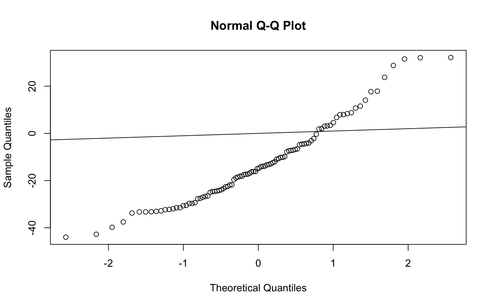
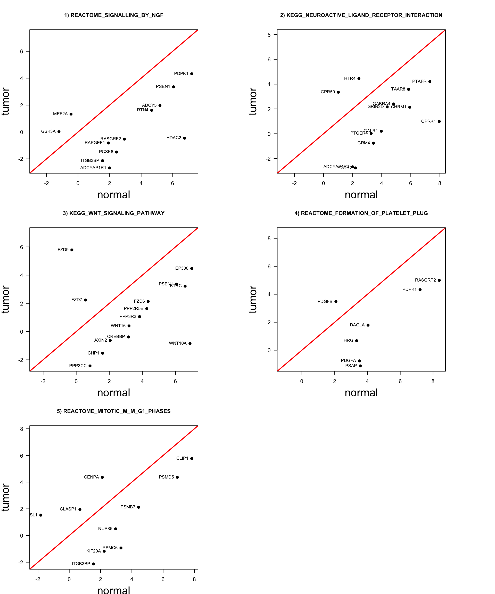

---
output:
  BiocStyle::html_document
---

<!---
Because we split the analysis pipeline in different independent files,
to speed up processing it, here in the setup block we load libraries and
objects that were loaded or produced in the previously processed file,
and which are necessary in this file.
--->


# GSEA

The magnitude of gene expression changes may be small and very few significant DE genes will be idenified after having adjusted for multiple testing. For this reason, we want to see if there are small but consistent changes occuring for a number of genes operating in a common pathway. We go throug this workflow by assessing DE genes direclty at the geneset level, starting from the expression data themselves. We approach this analysis by using the `GSEA algorithm`.

## Preparation

To start with the GSEA, we start putting our expression data and the collection of gene sets from the GSVA[http://www.bioconductor.org/packages/release/data/experiment/html/GSVAdata.html] dataset `c2BroadSets` in a `GeneSetCollection` object, as it contains curated gene sets, suggesting a good set representation for biological data analysis.


```r
# collect gene sets
data(c2BroadSets)
gsc <- GeneSetCollection(c2BroadSets)
gsc
```

```
GeneSetCollection
  names: NAKAMURA_CANCER_MICROENVIRONMENT_UP, NAKAMURA_CANCER_MICROENVIRONMENT_DN, ..., ST_PHOSPHOINOSITIDE_3_KINASE_PATHWAY (3272 total)
  unique identifiers: 5167, 100288400, ..., 57191 (29340 total)
  types in collection:
    geneIdType: EntrezIdentifier (1 total)
    collectionType: BroadCollection (1 total)
```

```r
length(gsc) # number of gene sets in the collection
```

```
[1] 3272
```

```r
head(names(gsc)) # some of the gene sets in the collection
```

```
[1] "NAKAMURA_CANCER_MICROENVIRONMENT_UP" 
[2] "NAKAMURA_CANCER_MICROENVIRONMENT_DN" 
[3] "WEST_ADRENOCORTICAL_TUMOR_MARKERS_UP"
[4] "WEST_ADRENOCORTICAL_TUMOR_MARKERS_DN"
[5] "WINTER_HYPOXIA_UP"                   
[6] "WINTER_HYPOXIA_DN"                   
```

In order to reduce the amount of data to analyse, we are going to restrict the analysis to the pathways `KEGG`, `REACTOME` and `BIOCARTA`.


```r
gsc <- gsc[c(grep("^KEGG", names(gsc)),
grep("^REACTOME", names(gsc)), grep("^BIOCARTA", names(gsc)))]
gsc
```

```
GeneSetCollection
  names: KEGG_GLYCOLYSIS_GLUCONEOGENESIS, KEGG_CITRATE_CYCLE_TCA_CYCLE, ..., BIOCARTA_ACTINY_PATHWAY (833 total)
  unique identifiers: 55902, 2645, ..., 8544 (6744 total)
  types in collection:
    geneIdType: EntrezIdentifier (1 total)
    collectionType: BroadCollection (1 total)
```

```r
length(gsc)
```

```
[1] 833
```

Now we can start our GSEA analysis, using the algorithm refered as *simple GSEA* (Irizarry et al. (2009)[https://journals.sagepub.com/doi/abs/10.1177/0962280209351908]). 

First, we need to map the identifiers from the gene sets to the identifiers of the data we are going to analyze. Furthermore, we create an incidence matrix (Im) which indicates which genes belong to what gene set.


```r
gsc <- mapIdentifiers(gsc, AnnoOrEntrezIdentifier(metadata(coadse.filt)$annotation))
gsc
```

```
GeneSetCollection
  names: KEGG_GLYCOLYSIS_GLUCONEOGENESIS, KEGG_CITRATE_CYCLE_TCA_CYCLE, ..., BIOCARTA_ACTINY_PATHWAY (833 total)
  unique identifiers: 55902, 2645, ..., 8544 (6744 total)
  types in collection:
    geneIdType: EntrezIdentifier (1 total)
    collectionType: BroadCollection (1 total)
```

```r
Im <- incidence(gsc)
dim(Im)
```

```
[1]  833 6744
```

```r
Im[1:2, 1:10]
```

```
                                55902 2645 5232 5230 5162 5160 5161 55276
KEGG_GLYCOLYSIS_GLUCONEOGENESIS     1    1    1    1    1    1    1     1
KEGG_CITRATE_CYCLE_TCA_CYCLE        0    0    0    0    1    1    1     0
                                7167 84532
KEGG_GLYCOLYSIS_GLUCONEOGENESIS    1     1
KEGG_CITRATE_CYCLE_TCA_CYCLE       0     0
```
We can see that several genes are present in more than one gene set, so later on we are going to go through overlaped gen sets.

Once done it, the following step will be discard those genes that do not form part of our data, and also discard all genes in our data that are not annotated to gene sets.


```r
Im <- Im[, colnames(Im) %in% rownames(all_DEgenes)]
dim(Im)
```

```
[1] 833 316
```

```r
coadse.filt <- coadse.filt[colnames(Im), ]
dim(coadse.filt)
```

```
[1] 316  72
```

```r
dge.filt <- dge.filt[colnames(Im),]
dim(dge.filt)
```

```
[1] 316  72
```

As a result we have discarted almost **6400** genes that didn't belong to our data.

## Simple GSEA 

In order to determine whether an *a priori* defined set of genes shows statistically significant differences between tumor vs normal phenotypes, we are going to perform a *Gene Set Enrichment Analysis* to introduce a method for pathway analysis assessing DE directly at gene set level.

The main scope of the GSEA approach is, as mentioned, to detect consistent and robust changes in expression within a gene set. To do so, we calculate the Enrichment Score (ES) as a z-score that may allow us to detect significantly those esmpented changes.

We decided to filter out the genesets that contain less than 10 genes. In fact, very small gene sets may induce little reliability and increase type I errors (false positives). Then we also calculate the z-score.


```r
Im <- Im[rowSums(Im) >= 5, ]
tGSgenes <- all_DEgenes[match(colnames(Im), rownames(all_DEgenes)), "t"] # calculate all t-statistics for genes in each gene set
zS <- sqrt(rowSums(Im)) * (as.vector(Im %*% tGSgenes)/rowSums(Im)) # calculating Zscore statistic
length(zS)
```

```
[1] 97
```

```r
head(zS, n=10)
```

```
          KEGG_GLYCOLYSIS_GLUCONEOGENESIS 
                               -12.760330 
               KEGG_FATTY_ACID_METABOLISM 
                               -21.518174 
        KEGG_STEROID_HORMONE_BIOSYNTHESIS 
                                -6.429551 
                   KEGG_PURINE_METABOLISM 
                               -22.053866 
               KEGG_PYRIMIDINE_METABOLISM 
                               -38.604265 
     KEGG_ARGININE_AND_PROLINE_METABOLISM 
                                11.177267 
                 KEGG_TYROSINE_METABOLISM 
                               -32.996338 
                  KEGG_RETINOL_METABOLISM 
                                -3.563496 
KEGG_PORPHYRIN_AND_CHLOROPHYLL_METABOLISM 
                                15.383188 
                 KEGG_NITROGEN_METABOLISM 
                               -35.683544 
```

The incidence matrix after the filtering has lost 200 gene sets approximately.
As we can see, know we have 618 pathways that contain a total of 4174 genes. 


```r
qqnorm(zS)
abline(0,1)
```

<div class="figure" style="text-align: center">

<p class="caption">(\#fig:qqplot)Q-Q Plot of gene set Z-scores</p>
</div>

As we can observe in the Q-Q plot of figure \@ref(fig:qqplot) we can detect that the gene sets Z-scores do not follow a normal distribution (expected but the null hypothesis of no DE gene sets), which indicates a promising number of DE gene sets.

Just to have an overview we rank the gene sets according to  Z-scores, and show in decreasing order.


```r
rnkGS <- sort(abs(zS), decreasing = TRUE)
head(rnkGS, n=10)
```

```
                  REACTOME_SIGNALLING_BY_NGF 
                                    54.86518 
                 KEGG_OLFACTORY_TRANSDUCTION 
                                    49.40351 
                         REACTOME_HEMOSTASIS 
                                    47.87507 
KEGG_NEUROACTIVE_LIGAND_RECEPTOR_INTERACTION 
                                    45.54628 
         REACTOME_SIGNALING_IN_IMMUNE_SYSTEM 
                                    45.23020 
        REACTOME_OLFACTORY_SIGNALING_PATHWAY 
                                    44.62750 
                  REACTOME_DIABETES_PATHWAYS 
                                    39.45667 
             REACTOME_METABOLISM_OF_PROTEINS 
                                    39.16201 
                  KEGG_WNT_SIGNALING_PATHWAY 
                                    38.80835 
                  KEGG_PYRIMIDINE_METABOLISM 
                                    38.60427 
```


Let's define a function called `plotGS` to produce a scatter plot, for a given gene set, of the mean expression values comparing Tumor vs Normal phenotypes.


```r
plotGS <- function(se, gs, pheno, ...) {
l <- levels(colData(se)[, pheno])
idxSamples1 <- colData(se)[, pheno] == l[1]
idxSamples2 <- colData(se)[, pheno] == l[2]
exps1 <- rowMeans(assays(se)$logCPM[gs, idxSamples1])
exps2 <- rowMeans(assays(se)$logCPM[gs, idxSamples2])
rng <- range(c(exps1, exps2))
plot(exps1, exps2, pch = 21, col = "black", bg = "black", xlim = rng, ylim = rng,
xlab = l[1], ylab = l[2], ...)
abline(a = 0, b = 1, lwd = 2, col = "red")
}
```


We perform one sample z-test and compute the number of DE gene sets according to the adjusted p-value with and FDR of 1%.


```r
pv <- pmin(pnorm(zS), 1 - pnorm(zS))
sum(pv < 0.05)
```

```
[1] 97
```

```r
pvadj <- p.adjust(pv, method = "fdr")
DEgs <- names(pvadj)[which(pvadj < 0.01)]
length(DEgs)
```

```
[1] 95
```

```r
head(DEgs, n = 10)
```

```
 [1] "KEGG_GLYCOLYSIS_GLUCONEOGENESIS"          
 [2] "KEGG_FATTY_ACID_METABOLISM"               
 [3] "KEGG_STEROID_HORMONE_BIOSYNTHESIS"        
 [4] "KEGG_PURINE_METABOLISM"                   
 [5] "KEGG_PYRIMIDINE_METABOLISM"               
 [6] "KEGG_ARGININE_AND_PROLINE_METABOLISM"     
 [7] "KEGG_TYROSINE_METABOLISM"                 
 [8] "KEGG_RETINOL_METABOLISM"                  
 [9] "KEGG_PORPHYRIN_AND_CHLOROPHYLL_METABOLISM"
[10] "KEGG_NITROGEN_METABOLISM"                 
```
After filtering by *adjusted p value* we obtained a total of 516 gene sets. 

As mentioned before, since gene sets can overlap, we need to take that into account before interpreting the DE gene sets. In order to do so, we use the function `computeGeneSetsOverlap` which calculates an overlap index. Then, we are going to build a table ranking of pairs of gene sets by overlaps.


```r
gsov <- computeGeneSetsOverlap(gsc[DEgs], rownames(coadse.filt))
trimask <- upper.tri(gsov)
rnkOv <- data.frame(gs1 = row(gsov)[trimask], gs2 = col(gsov)[trimask], ov = gsov[trimask])
rnkOv <- rnkOv[order(rnkOv$ov, decreasing = TRUE), ]
rnkOv$gs1 <- rownames(gsov)[rnkOv$gs1]
rnkOv$gs2 <- rownames(gsov)[rnkOv$gs2]
## how many pairs of gene sets are identical?
sum(rnkOv$ov == 1) 
```

```
[1] 31
```

```r
## how many pairs of gene sets share less than 5% of the genes?
sum(rnkOv$ov < 0.05)
```

```
[1] 3707
```
There are 31 pairs of gene sets that are identical, and 3707 pairs that share less than 5% of the genes.

If half of the genes are upregulated and the other half down-regulated, the mean shift we have calculated cancels out. This is known as a change in scale, and to detect such a change one should used this other X^2-score:


```r
xS <- applyByCategory(tGSgenes, Im, function(x) (sum((x - mean(x))^2) - (length(x) - 1))/(2 * 
(length(x) - 1)))
xS
```

```
                                      KEGG_GLYCOLYSIS_GLUCONEOGENESIS 
                                                          127.9963682 
                                           KEGG_FATTY_ACID_METABOLISM 
                                                           72.7751915 
                                    KEGG_STEROID_HORMONE_BIOSYNTHESIS 
                                                           96.3966791 
                                               KEGG_PURINE_METABOLISM 
                                                          150.9491569 
                                           KEGG_PYRIMIDINE_METABOLISM 
                                                            2.5448526 
                                 KEGG_ARGININE_AND_PROLINE_METABOLISM 
                                                           91.9210003 
                                             KEGG_TYROSINE_METABOLISM 
                                                            5.3240316 
                                              KEGG_RETINOL_METABOLISM 
                                                           72.0141088 
                            KEGG_PORPHYRIN_AND_CHLOROPHYLL_METABOLISM 
                                                           74.5081420 
                                             KEGG_NITROGEN_METABOLISM 
                                                           14.3609116 
                    KEGG_METABOLISM_OF_XENOBIOTICS_BY_CYTOCHROME_P450 
                                                           61.4029422 
                                 KEGG_DRUG_METABOLISM_CYTOCHROME_P450 
                                                           84.3969446 
                                   KEGG_DRUG_METABOLISM_OTHER_ENZYMES 
                                                           30.6336225 
                                                KEGG_ABC_TRANSPORTERS 
                                                           47.3454111 
                                          KEGG_MAPK_SIGNALING_PATHWAY 
                                                           76.9250845 
                                       KEGG_CALCIUM_SIGNALING_PATHWAY 
                                                           26.4075932 
                          KEGG_CYTOKINE_CYTOKINE_RECEPTOR_INTERACTION 
                                                           77.3351282 
                                     KEGG_CHEMOKINE_SIGNALING_PATHWAY 
                                                           75.9030311 
                         KEGG_NEUROACTIVE_LIGAND_RECEPTOR_INTERACTION 
                                                           42.8504530 
                                                      KEGG_CELL_CYCLE 
                                                          107.7177903 
                                                  KEGG_OOCYTE_MEIOSIS 
                                                           72.6071955 
                                  KEGG_UBIQUITIN_MEDIATED_PROTEOLYSIS 
                                                           59.0254260 
                                                        KEGG_LYSOSOME 
                                                           45.9182413 
                                                     KEGG_ENDOCYTOSIS 
                                                           98.1203438 
                                                       KEGG_APOPTOSIS 
                                                            0.5184568 
                                           KEGG_WNT_SIGNALING_PATHWAY 
                                                           63.5880621 
                                         KEGG_NOTCH_SIGNALING_PATHWAY 
                                                            8.0925615 
                                      KEGG_HEDGEHOG_SIGNALING_PATHWAY 
                                                           50.8295406 
                                      KEGG_TGF_BETA_SIGNALING_PATHWAY 
                                                           58.3546351 
                                                   KEGG_AXON_GUIDANCE 
                                                          100.2966209 
                                                  KEGG_FOCAL_ADHESION 
                                                           38.7282650 
                                    KEGG_CELL_ADHESION_MOLECULES_CAMS 
                                                           71.1941093 
                                               KEGG_ADHERENS_JUNCTION 
                                                           95.3612974 
                                                  KEGG_TIGHT_JUNCTION 
                                                          116.9793910 
                                      KEGG_JAK_STAT_SIGNALING_PATHWAY 
                                                          113.6064367 
                                      KEGG_HEMATOPOIETIC_CELL_LINEAGE 
                                                          100.2904749 
                       KEGG_NATURAL_KILLER_CELL_MEDIATED_CYTOTOXICITY 
                                                            6.3705499 
                               KEGG_T_CELL_RECEPTOR_SIGNALING_PATHWAY 
                                                            1.1476094 
                            KEGG_LEUKOCYTE_TRANSENDOTHELIAL_MIGRATION 
                                                          114.0796417 
                                          KEGG_LONG_TERM_POTENTIATION 
                                                            3.4946975 
                                          KEGG_OLFACTORY_TRANSDUCTION 
                                                           75.7823410 
                                KEGG_REGULATION_OF_ACTIN_CYTOSKELETON 
                                                           92.2821087 
                                       KEGG_INSULIN_SIGNALING_PATHWAY 
                                                           65.1985614 
                                                   KEGG_MELANOGENESIS 
                                                          103.4303362 
                       KEGG_ALDOSTERONE_REGULATED_SODIUM_REABSORPTION 
                                                           12.0186593 
                         KEGG_PROXIMAL_TUBULE_BICARBONATE_RECLAMATION 
                                                          108.1779400 
                                              KEGG_ALZHEIMERS_DISEASE 
                                                            2.1450286 
                               KEGG_AMYOTROPHIC_LATERAL_SCLEROSIS_ALS 
                                                            2.1259886 
                                              KEGG_PATHWAYS_IN_CANCER 
                                                           96.8844567 
                                                 KEGG_PROSTATE_CANCER 
                                                           15.6276414 
                                            KEGG_BASAL_CELL_CARCINOMA 
                                                          130.3031474 
                                                   REACTOME_APOPTOSIS 
                                                           11.4105426 
                                               REACTOME_AXON_GUIDANCE 
                                                          147.2084915 
                                       REACTOME_BIOLOGICAL_OXIDATIONS 
                                                           72.8524616 
          REACTOME_CDC20_PHOSPHO_APC_MEDIATED_DEGRADATION_OF_CYCLIN_A 
                                                          129.9255054 
                                  REACTOME_CELL_CELL_ADHESION_SYSTEMS 
                                                          134.5525025 
                                          REACTOME_CELL_CYCLE_MITOTIC 
                                                           77.3926401 
              REACTOME_CELL_SURFACE_INTERACTIONS_AT_THE_VASCULAR_WALL 
                                                            9.0767511 
                         REACTOME_CHEMOKINE_RECEPTORS_BIND_CHEMOKINES 
                                                           73.8297672 
                           REACTOME_CLASS_A1_RHODOPSIN_LIKE_RECEPTORS 
                                                           81.7338351 
                          REACTOME_CLASS_B2_SECRETIN_FAMILY_RECEPTORS 
                                                          142.9814770 
                  REACTOME_CYTOCHROME_P450_ARRANGED_BY_SUBSTRATE_TYPE 
                                                           48.9580755 
                                           REACTOME_DIABETES_PATHWAYS 
                                                           65.9566004 
                         REACTOME_DOWNSTREAM_EVENTS_IN_GPCR_SIGNALING 
                                                           78.4021305 
                                  REACTOME_FORMATION_OF_PLATELET_PLUG 
                                                            6.3068883 
                                 REACTOME_G_ALPHA_I_SIGNALLING_EVENTS 
                                                           94.0754926 
                                 REACTOME_G_ALPHA_Q_SIGNALLING_EVENTS 
                                                           73.4652864 
                                 REACTOME_G_ALPHA_S_SIGNALLING_EVENTS 
                                                           61.5818232 
                                             REACTOME_G1_S_TRANSITION 
                                                            8.6873494 
                                             REACTOME_GENE_EXPRESSION 
                                                           33.2960387 
                                                  REACTOME_HEMOSTASIS 
                                                            6.9412071 
                                               REACTOME_HIV_INFECTION 
                                                           60.1831505 
                            REACTOME_HOST_INTERACTIONS_OF_HIV_FACTORS 
                                                            8.4782436 
                            REACTOME_INTEGRATION_OF_ENERGY_METABOLISM 
                                                           73.4324003 
                          REACTOME_INTEGRIN_CELL_SURFACE_INTERACTIONS 
                                                           52.7027809 
                                          REACTOME_IRS_RELATED_EVENTS 
                                                           74.6026838 
                                    REACTOME_METABLISM_OF_NUCLEOTIDES 
                                                          140.6874712 
                                   REACTOME_METABOLISM_OF_AMINO_ACIDS 
                                                          129.3985534 
                       REACTOME_METABOLISM_OF_LIPIDS_AND_LIPOPROTEINS 
                                                           56.2519791 
                                      REACTOME_METABOLISM_OF_PROTEINS 
                                                           10.4539021 
                                        REACTOME_MITOTIC_PROMETAPHASE 
                                                           90.7502492 
                                          REACTOME_MUSCLE_CONTRACTION 
                                                           87.7824626 
                                 REACTOME_OLFACTORY_SIGNALING_PATHWAY 
                                                           70.2250076 
                        REACTOME_P75_NTR_RECEPTOR_MEDIATED_SIGNALLING 
                                                            4.5644952 
                            REACTOME_PEPTIDE_LIGAND_BINDING_RECEPTORS 
                                                           88.1713729 
                      REACTOME_PHASE_1_FUNCTIONALIZATION_OF_COMPOUNDS 
                                                           67.5621829 
                                         REACTOME_PLATELET_ACTIVATION 
                                                            6.9610745 
REACTOME_REGULATION_OF_APC_ACTIVATORS_BETWEEN_G1_S_AND_EARLY_ANAPHASE 
                                                          105.4508970 
                                            REACTOME_SIGNALING_BY_WNT 
                                                           17.3270372 
                                  REACTOME_SIGNALING_IN_IMMUNE_SYSTEM 
                                                            8.2547903 
                                           REACTOME_SIGNALLING_BY_NGF 
                                                            5.6401023 
                                 REACTOME_TIGHT_JUNCTION_INTERACTIONS 
                                                          138.0531277 
                  REACTOME_TRANSMEMBRANE_TRANSPORT_OF_SMALL_MOLECULES 
                                                           69.9712539 
                       REACTOME_TRANSMISSION_ACROSS_CHEMICAL_SYNAPSES 
                                                           81.9174522 
                                         REACTOME_GPCR_LIGAND_BINDING 
                                                           85.3744210 
                                  REACTOME_CELL_JUNCTION_ORGANIZATION 
                                                          139.8422436 
                                       REACTOME_MITOTIC_M_M_G1_PHASES 
                                                           67.1377633 
```

As we did with the z-test, we are going to compute p-values and adjust them to 1% FDR for gene sets with more than about 20 genes:


```r
rnkGS <- sort(abs(xS), decreasing = TRUE)
head(rnkGS, n=20)
```

```
                                               KEGG_PURINE_METABOLISM 
                                                             150.9492 
                                               REACTOME_AXON_GUIDANCE 
                                                             147.2085 
                          REACTOME_CLASS_B2_SECRETIN_FAMILY_RECEPTORS 
                                                             142.9815 
                                    REACTOME_METABLISM_OF_NUCLEOTIDES 
                                                             140.6875 
                                  REACTOME_CELL_JUNCTION_ORGANIZATION 
                                                             139.8422 
                                 REACTOME_TIGHT_JUNCTION_INTERACTIONS 
                                                             138.0531 
                                  REACTOME_CELL_CELL_ADHESION_SYSTEMS 
                                                             134.5525 
                                            KEGG_BASAL_CELL_CARCINOMA 
                                                             130.3031 
          REACTOME_CDC20_PHOSPHO_APC_MEDIATED_DEGRADATION_OF_CYCLIN_A 
                                                             129.9255 
                                   REACTOME_METABOLISM_OF_AMINO_ACIDS 
                                                             129.3986 
                                      KEGG_GLYCOLYSIS_GLUCONEOGENESIS 
                                                             127.9964 
                                                  KEGG_TIGHT_JUNCTION 
                                                             116.9794 
                            KEGG_LEUKOCYTE_TRANSENDOTHELIAL_MIGRATION 
                                                             114.0796 
                                      KEGG_JAK_STAT_SIGNALING_PATHWAY 
                                                             113.6064 
                         KEGG_PROXIMAL_TUBULE_BICARBONATE_RECLAMATION 
                                                             108.1779 
                                                      KEGG_CELL_CYCLE 
                                                             107.7178 
REACTOME_REGULATION_OF_APC_ACTIVATORS_BETWEEN_G1_S_AND_EARLY_ANAPHASE 
                                                             105.4509 
                                                   KEGG_MELANOGENESIS 
                                                             103.4303 
                                                   KEGG_AXON_GUIDANCE 
                                                             100.2966 
                                      KEGG_HEMATOPOIETIC_CELL_LINEAGE 
                                                             100.2905 
```

```r
pv <- pmin(pnorm(xS), 1 - pnorm(xS))
pvadj <- p.adjust(pv)
DEgsByScale <- names(pvadj)[which(pvadj < 0.01)]
head(setdiff(DEgsByScale, DEgs), n=5)
```

```
[1] "REACTOME_CHEMOKINE_RECEPTORS_BIND_CHEMOKINES"
[2] "REACTOME_TIGHT_JUNCTION_INTERACTIONS"        
```

```r
length(DEgsByScale)
```

```
[1] 92
```

```r
length(intersect(DEgs, DEgsByScale))
```

```
[1] 90
```

These are the top 6 gene sets selected by the ChiSquared-score test:

```r
topgs1genes <- colnames(Im)[which(Im[names(rnkGS)[1], ] == 1)]
genesGS1 <- rowData(coadse.filt)[topgs1genes,1]
genesGS1
```

```
[1] "NT5C2"  "AK1"    "AMPD3"  "ATIC"   "ENTPD8" "PAICS"  "ADCY5"  "NT5M"  
[9] "ENTPD3"
```

```r
  topgs2genes <- colnames(Im)[which(Im[names(rnkGS)[2], ] == 1)]
genesGS2 <- rowData(coadse.filt)[topgs2genes,1]
topgs3genes <- colnames(Im)[which(Im[names(rnkGS)[3], ] == 1)]
genesGS3 <- rowData(coadse.filt)[topgs3genes,1]
topgs4genes <- colnames(Im)[which(Im[names(rnkGS)[4], ] == 1)]
genesGS4 <- rowData(coadse.filt)[topgs4genes,1]
topgs5genes <- colnames(Im)[which(Im[names(rnkGS)[5], ] == 1)]
genesGS5 <- rowData(coadse.filt)[topgs5genes,1]
topgs6genes <- colnames(Im)[which(Im[names(rnkGS)[6], ] == 1)]
genesGS6 <- rowData(coadse.filt)[topgs6genes,1]
par(mfrow = c(2, 3), mar= c(0.5,5,2,0.5), mai=c(0.5,0.6,0.6,0.5))
plotGS(coadse.filt, topgs1genes, "type", main = names(rnkGS)[1],cex.main = 0.7, cex.lab = 2, las = 1)
plotGS(coadse.filt, topgs2genes, "type", main = names(rnkGS)[2],cex.main = 0.7, cex.lab = 2, las = 1)
plotGS(coadse.filt, topgs3genes, "type", main = names(rnkGS)[3],cex.main = 0.8, cex.lab = 2, las = 1)
plotGS(coadse.filt, topgs3genes, "type", main = names(rnkGS)[4],cex.main = 0.7, cex.lab = 2, las = 1)
plotGS(coadse.filt, topgs3genes, "type", main = names(rnkGS)[5],cex.main = 0.7, cex.lab = 2, las = 1)
plotGS(coadse.filt, topgs3genes, "type", main = names(rnkGS)[6],cex.main = 0.7, cex.lab = 2, las = 1)
```

<div class="figure" style="text-align: center">

<p class="caption">(\#fig:scatter_plot)Scatter plots</p>
</div>

As we can see in \@ref(fig:scatter_plot), there are represented the 6 gene sets with a higher ChiSquared-score. 


## Session information


```r
sessionInfo()
```

```
R version 3.5.3 (2019-03-11)
Platform: x86_64-apple-darwin15.6.0 (64-bit)
Running under: macOS Mojave 10.14.3

Matrix products: default
BLAS: /Library/Frameworks/R.framework/Versions/3.5/Resources/lib/libRblas.0.dylib
LAPACK: /Library/Frameworks/R.framework/Versions/3.5/Resources/lib/libRlapack.dylib

locale:
[1] it_IT.UTF-8/it_IT.UTF-8/it_IT.UTF-8/C/it_IT.UTF-8/it_IT.UTF-8

attached base packages:
[1] parallel  stats4    stats     graphics  grDevices utils     datasets 
[8] methods   base     

other attached packages:
 [1] EnhancedVolcano_1.0.1       ggrepel_0.8.1              
 [3] ggplot2_3.1.1               calibrate_1.7.2            
 [5] MASS_7.3-51.4               sva_3.30.1                 
 [7] genefilter_1.64.0           mgcv_1.8-28                
 [9] nlme_3.1-139                GSVA_1.30.0                
[11] GSVAdata_1.18.0             hgu95a.db_3.2.3            
[13] GSEABase_1.44.0             org.Hs.eg.db_3.7.0         
[15] xtable_1.8-4                GOstats_2.48.0             
[17] graph_1.60.0                Category_2.48.1            
[19] Matrix_1.2-17               geneplotter_1.60.0         
[21] annotate_1.60.1             XML_3.98-1.19              
[23] AnnotationDbi_1.44.0        lattice_0.20-38            
[25] edgeR_3.24.3                limma_3.38.3               
[27] SummarizedExperiment_1.12.0 DelayedArray_0.8.0         
[29] BiocParallel_1.16.6         matrixStats_0.54.0         
[31] Biobase_2.42.0              GenomicRanges_1.34.0       
[33] GenomeInfoDb_1.18.2         IRanges_2.16.0             
[35] S4Vectors_0.20.1            BiocGenerics_0.28.0        
[37] knitr_1.22                  BiocStyle_2.10.0           

loaded via a namespace (and not attached):
 [1] bitops_1.0-6           bit64_0.9-7            RColorBrewer_1.1-2    
 [4] Rgraphviz_2.26.0       tools_3.5.3            R6_2.4.0              
 [7] DBI_1.0.0              lazyeval_0.2.2         colorspace_1.4-1      
[10] withr_2.1.2            tidyselect_0.2.5       bit_1.1-14            
[13] compiler_3.5.3         bookdown_0.9           scales_1.0.0          
[16] RBGL_1.58.2            stringr_1.4.0          digest_0.6.18         
[19] rmarkdown_1.12         AnnotationForge_1.24.0 XVector_0.22.0        
[22] pkgconfig_2.0.2        htmltools_0.3.6        highr_0.8             
[25] rlang_0.3.4            RSQLite_2.1.1          shiny_1.3.2           
[28] dplyr_0.8.1            RCurl_1.95-4.12        magrittr_1.5          
[31] GO.db_3.7.0            GenomeInfoDbData_1.2.0 Rcpp_1.0.1            
[34] munsell_0.5.0          stringi_1.4.3          yaml_2.2.0            
[37] zlibbioc_1.28.0        plyr_1.8.4             grid_3.5.3            
[40] blob_1.1.1             promises_1.0.1         crayon_1.3.4          
[43] splines_3.5.3          locfit_1.5-9.1         pillar_1.3.1          
[46] codetools_0.2-16       glue_1.3.1             evaluate_0.13         
[49] BiocManager_1.30.4     httpuv_1.5.1           purrr_0.3.2           
[52] gtable_0.3.0           assertthat_0.2.1       xfun_0.6              
[55] mime_0.6               later_0.8.0            survival_2.44-1.1     
[58] tibble_2.1.1           shinythemes_1.1.2      memoise_1.1.0         
```
