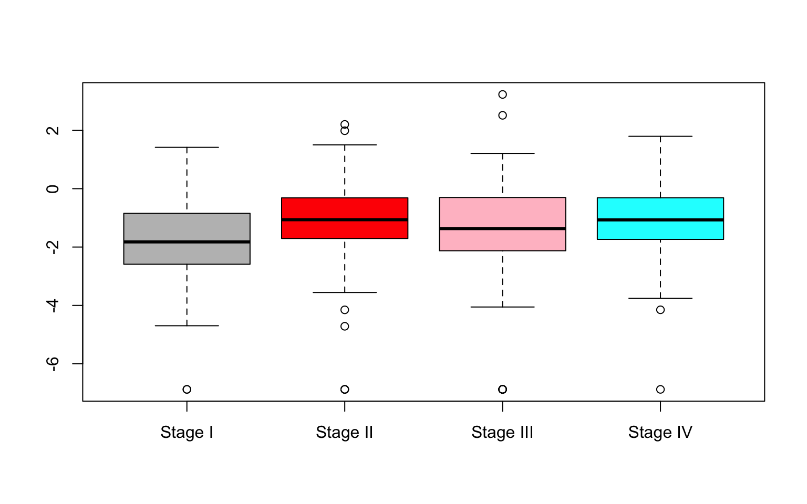

---
output:
  BiocStyle::html_document
---

<!---
Because we split the analysis pipeline in different independent files,
to speed up processing it, here in the setup block we load libraries and
objects that were loaded or produced in the previously processed file,
and which are necessary in this file.
--->


## GSEA

Here we ran the GSEA analysis for the tumor dataset. Same as for the DE Analysis, we decided not to explain again every step of the pipeline, which in this case were all explained in detail in the FE Analysis section of the paired dataset.

Same as for the paired dataset, we decided to restrict our analysis to the KEGG, REACTOME and BIOCARTA genesets. We then built the incidence matrix and we only selected the genesets which are present in both our dataset and the incidence matrix.
Furthermore, we filtered out the genesets that contain less than 5 genes.

After that, we calculated the z-scores for the genesets as well as the adjusted p-values and focus on the ones with lower p-values.


```r
# collect gene sets
data(c2BroadSets)
gsc <- GeneSetCollection(c2BroadSets)
gsc <- gsc[c(grep("^KEGG", names(gsc)),grep("^REACTOME", names(gsc)), grep("^BIOCARTA", names(gsc)))]
gsc <- mapIdentifiers(gsc, AnnoOrEntrezIdentifier(metadata(coadse.tumor)$annotation))
# Know which gene is in which geneset
Im <- incidence(gsc)
# Discard genes that are not in our data
Im <- Im[, colnames(Im) %in% rownames(coadse.tumor)]
# Discard genes that are not in the dataset
coadse.tumor <- coadse.tumor[colnames(Im), ]
dge.tumor <- dge.tumor[colnames(Im),]
# Only select genesets of decent size
Im <- Im[rowSums(Im) >= 5, ]

# Z SCORES
# calc moderated test statistics
tGSgenes <- tt[match(colnames(Im), rownames(tt)), "t"]
# calc the z test statistic
zS <- sqrt(rowSums(Im)) * (as.vector(Im %*% tGSgenes)/rowSums(Im))
#Look at the first few geneset
rnkGS <- sort(abs(zS), decreasing = TRUE)
pv <- pmin(pnorm(zS), 1 - pnorm(zS))
sum(pv < 0.5)
```

```
[1] 812
```

```r
pvadj <- p.adjust(pv, method = "fdr")
DEgs <- names(pvadj)[which(pvadj < 0.1)]
DEgs
```

```
 [1] "KEGG_OXIDATIVE_PHOSPHORYLATION"                                      
 [2] "REACTOME_AXON_GUIDANCE"                                              
 [3] "REACTOME_DIABETES_PATHWAYS"                                          
 [4] "REACTOME_FORMATION_OF_ATP_BY_CHEMIOSMOTIC_COUPLING"                  
 [5] "REACTOME_FORMATION_OF_PLATELET_PLUG"                                 
 [6] "REACTOME_FURTHER_PLATELET_RELEASATE"                                 
 [7] "REACTOME_G_ALPHA_S_SIGNALLING_EVENTS"                                
 [8] "REACTOME_G_PROTEIN_BETA_GAMMA_SIGNALLING"                            
 [9] "REACTOME_HEMOSTASIS"                                                 
[10] "REACTOME_NCAM_SIGNALING_FOR_NEURITE_OUT_GROWTH"                      
[11] "REACTOME_NCAM1_INTERACTIONS"                                         
[12] "REACTOME_PLATELET_ACTIVATION"                                        
[13] "REACTOME_PLATELET_DEGRANULATION"                                     
[14] "REACTOME_REGULATION_OF_INSULIN_SECRETION"                            
[15] "REACTOME_SIGNALING_BY_PDGF"                                          
[16] "REACTOME_ADP_SIGNALLING_THROUGH_P2Y_PURINOCEPTOR_12"                 
[17] "REACTOME_ACTIVATION_OF_KAINATE_RECEPTORS_UPON_GLUTAMATE_BINDING"     
[18] "REACTOME_G_BETA_GAMMA_SIGNALLING_THROUGH_PLC_BETA"                   
[19] "REACTOME_G_BETA_GAMMA_SIGNALLING_THROUGH_PI3KGAMMA"                  
[20] "REACTOME_INHIBITION_OF_INSULIN_SECRETION_BY_ADRENALINE_NORADRENALINE"
[21] "REACTOME_SMOOTH_MUSCLE_CONTRACTION"                                  
[22] "BIOCARTA_SALMONELLA_PATHWAY"                                         
```
In the tumor-stages analysis there was not enough statistical power to detect DE genes in the different tumorogenic stages (I-IV), previosly to the gene set enrichment. However, after applying GSEA to the data we could see some relevant pathways that may differe between those stages. 

Although many genes have been associated with the increased risk of CRC, the genetic differences across different stages of CRC have not been clearly identified @lorenc2017profile. Some genes have been reported to be potentially associated with higher stages of the cancer, as NEK4, RNF34 (implied in senescence and apoptosis) and NUDT6 (control signaling compounds and degradates potentially mutagenic oxidized nucleotides), which are expected to be in low concentration for higher stage of the disease. 

For example, among the top 20 patways ranked according to the Z-score test, there are included those related to Homeostasis, the signaling pathway of PDGF, and the PI3K pathway. PDGF has been found to an important growth factor for normal tissue growth and division @manzat2017role, and also corelated with CRC invasion and metastasis when deregulated. Regarding to PI3K pathway, has also been related with loss of Adenomatous Polyposis Coli (APC), commented to be potentially important in CRC development. 

However, we still miss some information that may be the reason for a non statistical reliable results. In our tumor stages study, some limitations are found: we only use TCGA CRC data on samples from cancer patients, and thus the analysis was only performed on these samples (difficulty to have a control); many field of the TCGA data were missing (NAs), which was not possible to be evaluated, and may be alterating gene expression in some of the genes of interest.

Finally, the last test we decided to perform to try to identy visually some kind of differences between the different stages was a boxplot of the different logCPM values between stages in those genes with highest logFC values.


```r
boxplotgenes <- function(se, gene) {
  iterations = dim(se)[2]
  variables = 2
  output <- matrix(ncol=variables, nrow=iterations)
  output <- data.frame(output)
  colnames(output) <- c("stage", "logCPM")
  aa <- se[rowData(se)$symbol == gene]$ajcc_pathologic_tumor_stage
  bb<-assays(se[rowData(se)$symbol == gene])$logCPM
  for(i in 1:iterations){
  output$stage[i] <- aa[i]
  output$logCPM[i] <- bb[i]
  }
  output$stage<-gsub(x = output$stage, pattern = "1", replacement = "Stage I")
  output$stage<-gsub(x = output$stage, pattern = "2", replacement = "Stage II")
  output$stage<-gsub(x = output$stage, pattern = "3", replacement = "Stage III")
  output$stage<-gsub(x = output$stage, pattern = "4", replacement = "Stage IV")
  boxplot(logCPM ~ stage, data=output, col=c("grey","red", "pink", "cyan", main= gene , ylab="logCPM"))
}

all_DEgenes <- tt
all_DEgenes_sorted <- all_DEgenes[order(all_DEgenes$adj.P.Val),]
genes<-rownames(all_DEgenes_sorted)[13]
gene<-dge.tumor$genes$symbol[rownames(dge.tumor$genes) == genes]


boxplotgenes(coadse.tumor, gene)
```

<div class="figure" style="text-align: center">

<p class="caption">(\#fig:boxplot)Boxplot of RIPK3</p>
</div>

Finally, in the figure \@ref(fig:boxplot) we have represented the different logCPM values among stages of RIPK3 gene, the thirteenth gene with a higher logFC value, and a gene that has been suggested as a potential predictive and prognostic marker in metastatic colon cancer @conev2019ripk3. Looking at the plot, we can not see important differences among stages but a subtle tendency of increasing the logCPM values stage to stage. 


### Session Information

```r
sessionInfo()
```

```
R version 3.5.3 (2019-03-11)
Platform: x86_64-apple-darwin15.6.0 (64-bit)
Running under: macOS Mojave 10.14.3

Matrix products: default
BLAS: /Library/Frameworks/R.framework/Versions/3.5/Resources/lib/libRblas.0.dylib
LAPACK: /Library/Frameworks/R.framework/Versions/3.5/Resources/lib/libRlapack.dylib

locale:
[1] it_IT.UTF-8/it_IT.UTF-8/it_IT.UTF-8/C/it_IT.UTF-8/it_IT.UTF-8

attached base packages:
[1] parallel  stats4    stats     graphics  grDevices utils     datasets 
[8] methods   base     

other attached packages:
 [1] GOstats_2.48.0              ggplot2_3.1.1              
 [3] calibrate_1.7.2             MASS_7.3-51.4              
 [5] Category_2.48.1             Matrix_1.2-17              
 [7] GSVA_1.30.0                 GSVAdata_1.18.0            
 [9] hgu95a.db_3.2.3             GSEABase_1.44.0            
[11] graph_1.60.0                org.Hs.eg.db_3.7.0         
[13] xtable_1.8-4                geneplotter_1.60.0         
[15] annotate_1.60.1             XML_3.98-1.19              
[17] AnnotationDbi_1.44.0        lattice_0.20-38            
[19] edgeR_3.24.3                limma_3.38.3               
[21] SummarizedExperiment_1.12.0 DelayedArray_0.8.0         
[23] BiocParallel_1.16.6         matrixStats_0.54.0         
[25] Biobase_2.42.0              GenomicRanges_1.34.0       
[27] GenomeInfoDb_1.18.2         IRanges_2.16.0             
[29] S4Vectors_0.20.1            BiocGenerics_0.28.0        
[31] knitr_1.22                  BiocStyle_2.10.0           

loaded via a namespace (and not attached):
 [1] bitops_1.0-6           bit64_0.9-7            RColorBrewer_1.1-2    
 [4] Rgraphviz_2.26.0       tools_3.5.3            R6_2.4.0              
 [7] DBI_1.0.0              lazyeval_0.2.2         colorspace_1.4-1      
[10] withr_2.1.2            tidyselect_0.2.5       bit_1.1-14            
[13] compiler_3.5.3         bookdown_0.9           scales_1.0.0          
[16] genefilter_1.64.0      RBGL_1.58.2            stringr_1.4.0         
[19] digest_0.6.18          rmarkdown_1.12         AnnotationForge_1.24.0
[22] XVector_0.22.0         pkgconfig_2.0.2        htmltools_0.3.6       
[25] highr_0.8              rlang_0.3.4            RSQLite_2.1.1         
[28] shiny_1.3.2            dplyr_0.8.1            RCurl_1.95-4.12       
[31] magrittr_1.5           GO.db_3.7.0            GenomeInfoDbData_1.2.0
[34] Rcpp_1.0.1             munsell_0.5.0          stringi_1.4.3         
[37] yaml_2.2.0             zlibbioc_1.28.0        plyr_1.8.4            
[40] grid_3.5.3             blob_1.1.1             promises_1.0.1        
[43] crayon_1.3.4           splines_3.5.3          locfit_1.5-9.1        
[46] pillar_1.3.1           codetools_0.2-16       glue_1.3.1            
[49] evaluate_0.13          BiocManager_1.30.4     httpuv_1.5.1          
[52] gtable_0.3.0           purrr_0.3.2            assertthat_0.2.1      
[55] xfun_0.6               mime_0.6               later_0.8.0           
[58] survival_2.44-1.1      tibble_2.1.1           shinythemes_1.1.2     
[61] memoise_1.1.0         
```
