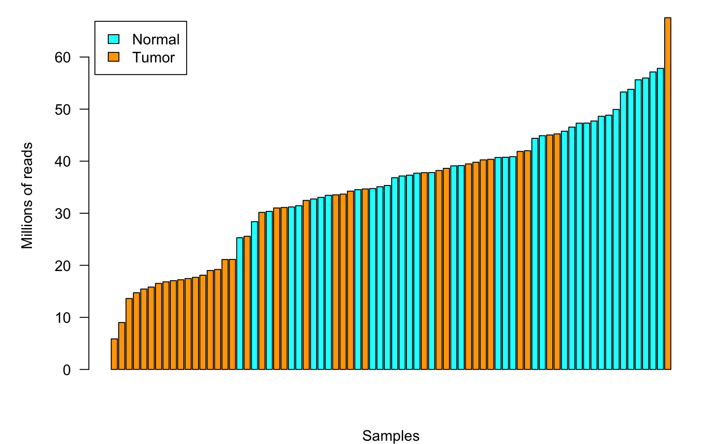
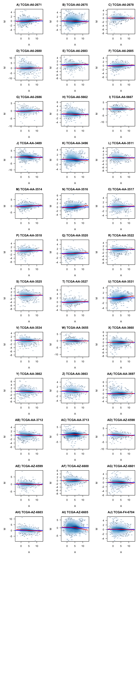
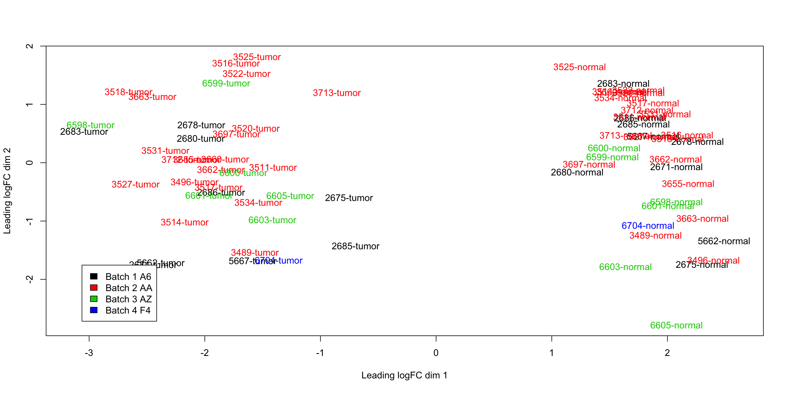

---
output:
  BiocStyle::html_document
---

<!---
The following chunk of code, which should not be shown in the resulting document (echo=FALSE)
sets up global processing options, such as forcing 'knitr' to stop when an error
in the R code is encountered, caching of the results in the 'cache'
directory and asking 'knitr' to figure out automatically the dependencies among
code chunks to re-calculate cached results (autodep=TRUE).

Other options could be changing the name of the directory where figures end up
('figure' by default), etc. For a full account of 'knitr' options please consult
http://yihui.name/knitr/options

At the end of the chunk a 'cat()' call is made to dump a CSS file that gives
a better look-and-feel than the knitr default one. See the source css/ieo.css
and the resulting projectTemplate.html to understand where this is being dumpted.
--->


# Quality assessment

## Data import

We start importing the raw table of counts.

<!--
The option 'message=FALSE' avoid dumping R messages such as "Loading required package: methods"
into the output of the report.
-->


```r
coadse <- readRDS(file.path("rawCounts", "seCOAD.rds"))
summary(coadse$type)
```

```
normal  tumor 
    41    483 
```

```r
dim(colData(coadse))
```

```
[1] 524 549
```

In this TCGA RNA-seq data we have a total of 524 samples (483 tumor samples and 41 non-tumor samples) that have 549 clinical variables/factors that could be analysed. However, we are not going to explore all these variables, but those that can have more relevance in the data of study.

In order to know more about the data, we explore the `colData` column, that corresponds to clinical variables, and their corresponding metadata.


```r
colData(coadse)[1:5, 1:5]
```

```
DataFrame with 5 rows and 5 columns
                                 type                     bcr_patient_uuid
                             <factor>                             <factor>
TCGA.3L.AA1B.01A.11R.A37K.07    tumor A94E1279-A975-480A-93E9-7B1FF05CBCBF
TCGA.4N.A93T.01A.11R.A37K.07    tumor 92554413-9EBC-4354-8E1B-9682F3A031D9
TCGA.4T.AA8H.01A.11R.A41B.07    tumor A5E14ADD-1552-4606-9FFE-3A03BCF76640
TCGA.5M.AAT4.01A.11R.A41B.07    tumor                                   NA
TCGA.5M.AAT5.01A.21R.A41B.07    tumor                                   NA
                             bcr_patient_barcode form_completion_date
                                        <factor>             <factor>
TCGA.3L.AA1B.01A.11R.A37K.07        TCGA-3L-AA1B            2014-4-22
TCGA.4N.A93T.01A.11R.A37K.07        TCGA-4N-A93T            2014-10-1
TCGA.4T.AA8H.01A.11R.A41B.07        TCGA-4T-AA8H             2014-6-5
TCGA.5M.AAT4.01A.11R.A41B.07                  NA                   NA
TCGA.5M.AAT5.01A.21R.A41B.07                  NA                   NA
                             prospective_collection
                                           <factor>
TCGA.3L.AA1B.01A.11R.A37K.07                    YES
TCGA.4N.A93T.01A.11R.A37K.07                    YES
TCGA.4T.AA8H.01A.11R.A41B.07                     NO
TCGA.5M.AAT4.01A.11R.A41B.07                     NA
TCGA.5M.AAT5.01A.21R.A41B.07                     NA
```

```r
mcols(colData(coadse), use.names=TRUE)
```

```
DataFrame with 549 rows and 2 columns
                                                         labelDescription
                                                              <character>
type                                           sample type (tumor/normal)
bcr_patient_uuid                                         bcr patient uuid
bcr_patient_barcode                                   bcr patient barcode
form_completion_date                                 form completion date
prospective_collection            tissue prospective collection indicator
...                                                                   ...
lymph_nodes_pelvic_pos_total                               total pelv lnp
lymph_nodes_aortic_examined_count                           total aor lnr
lymph_nodes_aortic_pos_by_he                          aln pos light micro
lymph_nodes_aortic_pos_by_ihc                                 aln pos ihc
lymph_nodes_aortic_pos_total                                total aor-lnp
                                        CDEID
                                  <character>
type                                       NA
bcr_patient_uuid                           NA
bcr_patient_barcode                   2673794
form_completion_date                       NA
prospective_collection                3088492
...                                       ...
lymph_nodes_pelvic_pos_total          3151828
lymph_nodes_aortic_examined_count     3104460
lymph_nodes_aortic_pos_by_he          3151832
lymph_nodes_aortic_pos_by_ihc         3151831
lymph_nodes_aortic_pos_total          3151827
```
These metadata consists of two columns of information about the clinical variables.
One called `labelDescription` contains a succint description of the variable, often
not more self-explanatory than the variable name itself, and the other called
'CDEID' corresponds to the so-called `Common Data Element (CDE)` identifier. This
identifier can be use in https://cdebrowser.nci.nih.gov to search for further
information about the associated clinical variable using the `Advanced search`
form and the `Public ID` attribute search.

Now, explore the row (feature) data. 


```r
rowData(coadse)
```

```
DataFrame with 20115 rows and 3 columns
               symbol     txlen              txgc
          <character> <integer>         <numeric>
1                A1BG      3322 0.564419024683925
2                 A2M      4844 0.488232865400495
9                NAT1      2280 0.394298245614035
10               NAT2      1322 0.389561270801815
12           SERPINA3      3067 0.524942940984676
...               ...       ...               ...
100996331       POTEB      1706 0.430832356389215
101340251    SNORD124       104 0.490384615384615
101340252   SNORD121B        81 0.407407407407407
102724473      GAGE10       538 0.505576208178439
103091865   BRWD1-IT2      1028 0.592412451361868
```

```r
rowRanges(coadse)
```

```
GRanges object with 20115 ranges and 3 metadata columns:
            seqnames            ranges strand |      symbol     txlen
               <Rle>         <IRanges>  <Rle> | <character> <integer>
          1    chr19 58345178-58362751      - |        A1BG      3322
          2    chr12   9067664-9116229      - |         A2M      4844
          9     chr8 18170477-18223689      + |        NAT1      2280
         10     chr8 18391245-18401218      + |        NAT2      1322
         12    chr14 94592058-94624646      + |    SERPINA3      3067
        ...      ...               ...    ... .         ...       ...
  100996331    chr15 20835372-21877298      - |       POTEB      1706
  101340251    chr17 40027542-40027645      - |    SNORD124       104
  101340252     chr9 33934296-33934376      - |   SNORD121B        81
  102724473     chrX 49303669-49319844      + |      GAGE10       538
  103091865    chr21 39313935-39314962      + |   BRWD1-IT2      1028
                         txgc
                    <numeric>
          1 0.564419024683925
          2 0.488232865400495
          9 0.394298245614035
         10 0.389561270801815
         12 0.524942940984676
        ...               ...
  100996331 0.430832356389215
  101340251 0.490384615384615
  101340252 0.407407407407407
  102724473 0.505576208178439
  103091865 0.592412451361868
  -------
  seqinfo: 455 sequences (1 circular) from hg38 genome
```
By using the `rowData` and `rowRanges` functions we can see information about the
features of interest. In this case each row represents a gene transcript and we 
can see information about the length, the GC content, the chromosome where it is 
located, the strand (forward or reverse), etc. 

To perform quality assessment and normalization we need first to load the
[edgeR](http://bioconductor.org/packages/edgeR) R/Bioconductor package, 
create a `DGEList` object and store it in the `results` folder.


```r
dge <- DGEList(counts=assays(coadse)$counts, genes=mcols(coadse))
saveRDS(dge, file.path("results", "dge.rds"))
```

Since gene expression data contain a big amount of variability, it is a good practice to stabilize variability by transforming the expression values into logarithmic scale. In order to do so, we calculate $\log_2$ CPM values of expression and put them as an additional
assay element to ease their manipulation.


```r
assays(coadse)$logCPM <- cpm(dge, log=TRUE, prior.count=0.5)
assays(coadse)$logCPM[1:5, 1:5]
```

```
   TCGA.3L.AA1B.01A.11R.A37K.07 TCGA.4N.A93T.01A.11R.A37K.07
1                     0.2611757                     3.518905
2                    10.0130074                     6.668572
9                    -5.8591298                    -5.859130
10                   -5.8591298                    -5.859130
12                    5.7145152                     5.917077
   TCGA.4T.AA8H.01A.11R.A41B.07 TCGA.5M.AAT4.01A.11R.A41B.07
1                     -0.593583                    -1.566157
2                      6.471984                     7.316527
9                     -5.859130                    -5.859130
10                    -5.859130                    -5.859130
12                     5.505588                     5.475205
   TCGA.5M.AAT5.01A.21R.A41B.07
1                   -0.09524941
2                    7.24810042
9                   -5.85912981
10                  -4.41522112
12                   5.44298099
```
As we can see, for each sample there are different CPM (Counts Per Million) values
of expression. Negative ones correspond to very low expressed samples. 

## Subset of samples: Paired Analysis

From the total of 524 samples, before starting to analyse the data we proceed to do a subset of paired samples (tumor and non-tumor samples extracted from the same patient). The reason of doing this is to reduce the within variance, as far as variation between different individuals could be found due to environmental factors. In order to obtain a better estimate of these expression level differences between Tumor and Non-tumor samples, we searched in the [TCGA barcode](https://docs.gdc.cancer.gov/Encyclopedia/pages/TCGA_Barcode/) those patients that were present in both Tumor and Non-tumor samples. This meant that those samples belonged to the same patient and, thus, were paired.

<!-- Create a subset - paired 
Only select the paired samples -->


```r
df <-  data.frame(rbind(table(coadse$bcr_patient_barcode, coadse$type)))
df_paired<-df[(df$normal > 0) & (df$tumor > 0),]
paired_mask <-coadse$bcr_patient_barcode  %in% rownames(df_paired)
coadse.paired<- coadse[,paired_mask]
dge.paired <- dge[,paired_mask]
table(coadse.paired$type)
```

```

normal  tumor 
    38     38 
```

As is shown in this table, we finally found a total of **38 non-tumor** samples and **38 tumor** paired samples. However, we consider that with this number of samples should be sufficient powered to detect expression changes between tumor and non-tumor samples.


## Sequencing depth

Before proceeding with any normalization or analysis step, we want to collect an overview of
the data that we are working with. Here we examine the sequencing depth by plotting the total number of reads mapped to the genome per sample.

<div class="figure" style="text-align: center">

<p class="caption">(\#fig:libsizes)Library sizes in increasing order.</p>
</div>


In the plot \@ref(fig:libsizes) we observe two main aspects that are worth paying attention to.
First, we observe that in general the tumor samples present a lower sequencing depth than the normal samples. Even though we could not find any reliable explaination for this behaviour so far in our research, we considered this event dispensable at this time as the sequencing depth will be taken into consideration during the normalization steps.
One other important aspect is that we observe that some sample present considerable differences in the sequencing depth and specifically we can distinguish a couple of samples on the left of the graph that present  considerably low sequencing depths: this may generate problems in further analysis of the data. 
For this reason we identify these samples by looking at the at the sample depth as shown below. 

```r
sampledepth <- round(dge.paired$sample$lib.size / 1e6, digits=1)
names(sampledepth) <- substr(colnames(coadse.paired), 6, 12)
sort(sampledepth)
```

```
A6.2679 A6.2682 AA.3531 AA.3517 AA.3534 A6.2683 AA.3518 AA.3520 AA.3522 
    5.9     9.0    13.6    14.7    15.4    15.8    16.5    16.8    17.0 
AA.3516 AA.3525 AA.3514 A6.2680 AA.3527 A6.2685 A6.2671 A6.2678 AA.3496 
   17.2    17.5    17.7    18.1    19.0    19.2    21.1    21.1    25.3 
AA.3697 AA.3660 AZ.6598 AA.3663 A6.2675 AA.3663 AZ.6600 AA.3662 AA.3662 
   25.6    28.4    30.2    30.4    31.0    31.1    31.2    31.5    32.5 
AA.3713 A6.5662 A6.2675 AA.3655 AA.3660 AZ.6599 AA.3712 AZ.6605 AA.3489 
   32.7    33.0    33.4    33.5    33.7    34.2    34.5    34.7    34.7 
AZ.6601 AZ.6603 AA.3525 AA.3655 A6.5667 AA.3534 A6.2686 AA.3511 A6.5667 
   35.1    35.3    36.8    37.2    37.3    37.7    37.8    37.8    38.2 
AZ.6601 A6.2679 AZ.6598 A6.5662 AA.3496 AA.3511 AA.3712 AZ.6605 AA.3518 
   38.6    39.1    39.2    39.5    39.8    40.3    40.4    40.7    40.8 
AZ.6599 AZ.6600 AA.3713 AA.3697 AA.3514 AZ.6603 AA.3489 A6.2682 A6.2678 
   40.9    41.9    42.0    44.4    44.9    45.0    45.2    45.8    46.5 
A6.2671 F4.6704 AA.3516 A6.2685 A6.2683 A6.2686 A6.2680 AA.3531 AA.3522 
   47.3    47.3    47.7    48.6    48.8    49.9    53.3    53.8    55.6 
AA.3517 AA.3527 AA.3520 F4.6704 
   56.0    57.1    57.8    67.5 
```
Because the samples A6.2679 and A6.2682 present extremely low sequencing depths we decide to remove them from our dataset.
Since we decided to proceed with a paired analysis, when removing one sample we remove its paired one too.


```r
# Remove the two samples with very low sequencing depth
mask_remove_low_coverage <- substr(colnames(coadse.paired),9,12) %in% c("2679", "2682")
coadse.paired <- coadse.paired[,!mask_remove_low_coverage]
dge.paired <- dge.paired[,!mask_remove_low_coverage]
summary(coadse.paired$type)
```

```
normal  tumor 
    36     36 
```

We verify that after the filtering of the samples with low library size, our paired dataset contains 36 samples.


```r
# coverage_filtered plot
par(mfrow = c(1, 1), mar = c(4, 5, 1, 1))
ord <- order(dge.paired$sample$lib.size)
barplot(dge.paired$sample$lib.size[ord]/1e+06, las = 1, ylab = "Millions of reads", xlab = "Samples",
        col = c("cyan", "orange")[coadse.paired$type[ord]] )
legend("topleft", c("Normal", "Tumor"), fill = c("cyan", "orange"), inset = 0.01)
```

<div class="figure" style="text-align: center">

<p class="caption">(\#fig:libsize2)Library sizes in increasing order after filtering</p>
</div>
Moreover, in figure \@ref(fig:libsize2) we can observe again the sorted histogram of library sizes per sample after the filtering.

## Gender among samples

In order to collect an even broader understanding of the dataset we then furher explore the sequencing depth highlighting female and male samples.


```r
ord <- order(dge.paired$sample$lib.size)
barplot(dge.paired$sample$lib.size[ord]/1e+06, las = 1, ylab = "Millions of reads", xlab = "Samples", col = c("cyan", "orange")[coadse.paired$gender[ord]] )
legend("topleft", c("Female", "Male"), fill = c("cyan", "orange"), inset = 0.01)
```

<div class="figure" style="text-align: center">

<p class="caption">(\#fig:libsizegender)Library sizes with respect to gender</p>
</div>
In figure \@ref(fig:libsizegender) we can see that not only we have a similar number of female and male samples, but that their sequencing depth is quite well equilibrated as we cannot clearly identify any defined clustering event.

## Distribution of expression levels among samples

Even after the filtering out of the samples with low library sizes values, some samples still present different sequencing depth and also there may be sample-specific biase related to sample preparation. For this reason, we need to carry out a normalization procedure. 


```r
assays(coadse.paired)$logCPM <- cpm(dge.paired, log = TRUE, prior.count = 0.25) 
```

We are then interested in exploring the distribution of the expression levels through
all the samples in terms of logarithmic CPM units.

<div class="figure" style="text-align: center">

<p class="caption">(\#fig:distRawExpAll)Non-parametric density distribution of expression profiles per sample.</p>
</div>

In figure \@ref(fig:distRawExpAll) we can observe a non-parametric density distribution of expression profiles per sample in terms of logarithmic units. As expected the expression values per sample follow a bimodal distribution with an early peak that corresponds to lowly-expressed genes and a later peak that correponds to highly-expressed ones.
In order to provide a clearer visualization, we decided to divide the dataset into two smaller subsets, specifically tumor samples and normal samples.

<div class="figure" style="text-align: center">

<p class="caption">(\#fig:distRawExpComp)Non-parametric density distribution of expression profiles per sample.</p>
</div>

Figure \@ref(fig:distRawExpComp) shows the expression levels in terms of logCPM for tumors and control samples separately. We can not appreciate any substancial difference between the distributions of the tumor and normal samples.

## Distribution of expression levels among genes

We are now interested in investigating if there is any gene which has very low expression
values so that we can exclude them from our dataset. In fact, if a gene is not expressed, then it can not be differentially expressed and so including them in our analysis would only add noise.

<div class="figure" style="text-align: center">

<p class="caption">(\#fig:exprdist)Distribution of average expression level per gene.</p>
</div>
In order to do so, we calculate the average expression of each gene for all the samples and plot their distribution in Figure \@ref(fig:exprdist).

## Filtering of lowly-expressed genes

From the distribution of figure \@ref(fig:exprdist) we could already visually identify a cutoff to define the too lowly expressed genes.
Nontheless, we opted for a more precise approach to calculate the cutoff.


```r
cpmcutoff <- round(10/min(dge.paired$sample$lib.size/1e+06), digits = 1)
sprintf("Cutoff: %s", cpmcutoff)
```

```
[1] "Cutoff: 0.7"
```

```r
nsamplescutoff <- min(table(coadse.paired$gender))
mask <- rowSums(cpm(dge.paired) > cpmcutoff) >= nsamplescutoff
coadse.filt <- coadse.paired[mask, ]
dge.filt <- dge.paired[mask, ]
```

Once we have identified the cutoff, we filter out the genes that are below it.


```r
par(mar = c(4, 5, 1, 1))
h <- hist(avgexp, xlab = expression("Expression level (" * log[2] * "CPM)"), main = "",
          las = 1, col = "grey", cex.axis = 1.2, cex.lab = 1.5)
x <- cut(rowMeans(assays(coadse.filt)$logCPM), breaks = h$breaks)
lines(h$mids, table(x), type = "h", lwd = 10, lend = 1, col = "darkred")
legend("topright", c("All genes", "Filtered genes"), fill = c("grey", "darkred"))
```

<div class="figure" style="text-align: center">

<p class="caption">(\#fig:filter)Distribution of average expression level per gene highlighting the filtering</p>
</div>

We can visually observe which genes have been left out from the datatset in Figure \@ref(fig:filter).
Before proceeding with the normalization steps, we prefer to save a copy of the unnormalized data in case we later need to work on it again.


```r
saveRDS(coadse.filt, file.path("results", "coadse.filt.unnorm.rds"))
saveRDS(dge.filt, file.path("results", "dge.filt.unnorm.rds"))
```

## Normalization

Since different samples may have different RNA compositions and this could be problematic for further analyses we need to take it into account and normalize the data.
We estimate a normalization factor for each library using the Trimmed Mean of M-Values and apply it to our data.


```r
dge.filt <- calcNormFactors(dge.filt) 
assays(coadse.filt)$logCPM <- cpm(dge.filt, log=TRUE, normalized.lib.sizes=TRUE, prior.count=0.25)
```

Again, we like to keep on with the good practice of storing intermediate generated files.  


```r
saveRDS(coadse.filt, file.path("results", "coadse.filt.rds"))
saveRDS(dge.filt, file.path("results", "dge.filt.rds"))
```


## MA-plots

We now want to visualize the expression profiles of the normalized data. As we did previously, we opted for a subdivision of the dataset in the tumor and normal subsets.
<div class="figure" style="text-align: center">

<p class="caption">(\#fig:maPlotsTumor)MA-plots of the tumor samples.</p>
</div>
In Figure \@ref(fig:maPlotsTumor) we observe the MA-plots for the Tumor samples subset. We can see that even after the between and within normalization steps, we still have some artifacts in our data as we can observe for example in \@ref(fig:maPlotsTumor) B, E, F, J, Z, AI, and AD. 

<div class="figure" style="text-align: center">

<p class="caption">(\#fig:maPlotsNormal)MA-plots of the control samples.</p>
</div>
In Figure \@ref(fig:maPlotsNormal) we observe the MA-plots for the Control samples subset and we cannot identify any important expression levels biases in any of the  normal samples.


## Batch identification

The next step will be the search for potential surrogate of batch effect indicators. Batch effect include sub-groups of measurements that have qualitatively different behaviour across conditions and are unrelated to the biological variables in the study.
As normalization of the data can not always remove completely the batch effect, we are going to identify this effect, adjust for it and eventually correct it.

Given that each sample names corresponds to a [TCGA barcode] (https://docs.gdc.cancer.gov/Encyclopedia/pages/TCGA_Barcode/), following the strategy described in http://bioinformatics.mdanderson.org/main/TCGABatchEffects:Overview we are going to derive different elements of the TCGA barcode and examine their distribution across samples.


```r
tss <- substr(colnames(dge.filt), 6, 7)
table(data.frame(TYPE=coadse.filt$type, TSS=tss))
```

```
        TSS
TYPE     A6 AA AZ F4
  normal  9 20  6  1
  tumor   9 20  6  1
```

```r
samplevial <- substr(colnames(dge.filt), 14, 16)
table(data.frame(TYPE=coadse.filt$type, SAMPLEVIAL=samplevial))
```

```
        SAMPLEVIAL
TYPE     01A 11A
  normal   0  36
  tumor   36   0
```

```r
portionanalyte <- substr(colnames(dge.filt), 18, 20)
table(data.frame(TYPE=coadse.filt$type, PORTIONANALYTE=portionanalyte))
```

```
        PORTIONANALYTE
TYPE     01R 02R 11R 21R
  normal  35   1   0   0
  tumor   17   6   7   6
```

```r
plate <- substr(colnames(dge.filt), 22, 25)
table(data.frame(TYPE=coadse.filt$type, PLATE=plate))
```

```
        PLATE
TYPE     0821 0826 1410 1653 1672 1723 1774 1839 A32Z
  normal    0    0    0    1    1    9    4    6   15
  tumor     9    3    3    1    0    9    4    6    1
```

```r
center <- substr(colnames(dge.filt), 27, 28)
table(data.frame(TYPE=coadse.filt$type, CENTER=center))
```

```
        CENTER
TYPE     07
  normal 36
  tumor  36
```

From this information we can make the following observations:

  * *TSS*: Samples were collected across 4 different tissue source sites (TSS), with poor representation of one of them (F4).
  
  * *Sample Vial*: 36 samples belong to solid tumor samples(**01 code**) whereas 36 do not (**11 code**). 
  
  * *Portions & Analyte*: samples where distributed in different portions and analytes combinations. 
  
  * *Plates*: Samples were sequenced in 9 different plates.
  
  * *Center*: All samples were sequenced at the same center.

  * The analyte code of all samples is a `R` (RNA samples), as expected.
  
Since all the sample were analysed in the same center, that is for sure not a cause of batch effect. Moreover, the cross-tabulation tables of sample vial, portion analytes and plates contain too many zero entries which implies that we do not have enough information identify any batch effect with this information.
On the other hand, TSS presents values that allow further investigation to detect batch effect.


```r
logCPM <- cpm(dge.paired, log=TRUE, prior.count=3)
d <- as.dist(1-cor(logCPM, method="spearman"))
sampleClustering <- hclust(d)
batch <- as.integer(factor(tss))
sampleDendrogram <- as.dendrogram(sampleClustering, hang=0.1)
names(batch) <- colnames(coadse.filt)
outcome <- paste(substr(colnames(coadse.filt), 9, 12), as.character(coadse.filt$type), sep="-")
names(outcome) <- colnames(coadse.filt)
sampleDendrogram <- dendrapply(sampleDendrogram,
                               function(x, batch, labels) {
                                 if (is.leaf(x)) {
                                   attr(x, "nodePar") <- list(lab.col=as.vector(batch[attr(x, "label")]))
                                   attr(x, "label") <- as.vector(labels[attr(x, "label")])
                                 }
                                 x
                               }, batch, outcome)
plot(sampleDendrogram, main="Hierarchical clustering of samples")
legend("topright", paste("Batch", sort(unique(batch)), levels(factor(tss))), fill=sort(unique(batch)))
```

<div class="figure" style="text-align: center">

<p class="caption">(\#fig:sampleClustering)Hierarchical clustering of the samples.</p>
</div>

We examine now how samples group together by hierarchical clustering and multidimensional
scaling, annotating the outcome of interest and the the surrogate of batch indicator. We
calculate again log CPM values with a higher prior count to moderate extreme fold-changes
produced by low counts. The resulting dendrogram is shown in Figure \@ref(fig:sampleClustering).

We can observe that samples cluster primarily by sample type, tumor or normal, which is a good sign for our analysis since normal and tumor are our main outcomes of interest. 


```r
plotMDS(dge.paired, labels=outcome, col=batch)
legend("bottomleft", paste("Batch", sort(unique(batch)), levels(factor(tss))),
       fill=sort(unique(batch)), inset=0.05)
```

<div class="figure" style="text-align: center">

<p class="caption">(\#fig:mdsPlot)Multidimensional scaling plot of the samples.</p>
</div>
In Figure \@ref(fig:mdsPlot) we show the corresponding MDS plot. Here we see more clearly that the first source of variation separates tumor from normal samples.

From both the hierarchical plot and de MDS plot we can not identify any batch effect for the TSS. For this reason, we proceed the analysis without adjusting or removing any batch effect.

## Session information


```r
sessionInfo()
```

```
R version 3.5.3 (2019-03-11)
Platform: x86_64-apple-darwin15.6.0 (64-bit)
Running under: macOS Mojave 10.14.3

Matrix products: default
BLAS: /Library/Frameworks/R.framework/Versions/3.5/Resources/lib/libRblas.0.dylib
LAPACK: /Library/Frameworks/R.framework/Versions/3.5/Resources/lib/libRlapack.dylib

locale:
[1] it_IT.UTF-8/it_IT.UTF-8/it_IT.UTF-8/C/it_IT.UTF-8/it_IT.UTF-8

attached base packages:
[1] parallel  stats4    stats     graphics  grDevices utils     datasets 
[8] methods   base     

other attached packages:
 [1] geneplotter_1.60.0          annotate_1.60.1            
 [3] XML_3.98-1.19               AnnotationDbi_1.44.0       
 [5] lattice_0.20-38             edgeR_3.24.3               
 [7] limma_3.38.3                SummarizedExperiment_1.12.0
 [9] DelayedArray_0.8.0          BiocParallel_1.16.6        
[11] matrixStats_0.54.0          Biobase_2.42.0             
[13] GenomicRanges_1.34.0        GenomeInfoDb_1.18.2        
[15] IRanges_2.16.0              S4Vectors_0.20.1           
[17] BiocGenerics_0.28.0         knitr_1.22                 
[19] BiocStyle_2.10.0           

loaded via a namespace (and not attached):
 [1] Rcpp_1.0.1             RColorBrewer_1.1-2     compiler_3.5.3        
 [4] BiocManager_1.30.4     highr_0.8              XVector_0.22.0        
 [7] bitops_1.0-6           tools_3.5.3            zlibbioc_1.28.0       
[10] bit_1.1-14             digest_0.6.18          memoise_1.1.0         
[13] RSQLite_2.1.1          evaluate_0.13          Matrix_1.2-17         
[16] DBI_1.0.0              yaml_2.2.0             xfun_0.6              
[19] GenomeInfoDbData_1.2.0 stringr_1.4.0          bit64_0.9-7           
[22] locfit_1.5-9.1         grid_3.5.3             rmarkdown_1.12        
[25] bookdown_0.9           blob_1.1.1             magrittr_1.5          
[28] codetools_0.2-16       htmltools_0.3.6        xtable_1.8-4          
[31] KernSmooth_2.23-15     stringi_1.4.3          RCurl_1.95-4.12       
```
