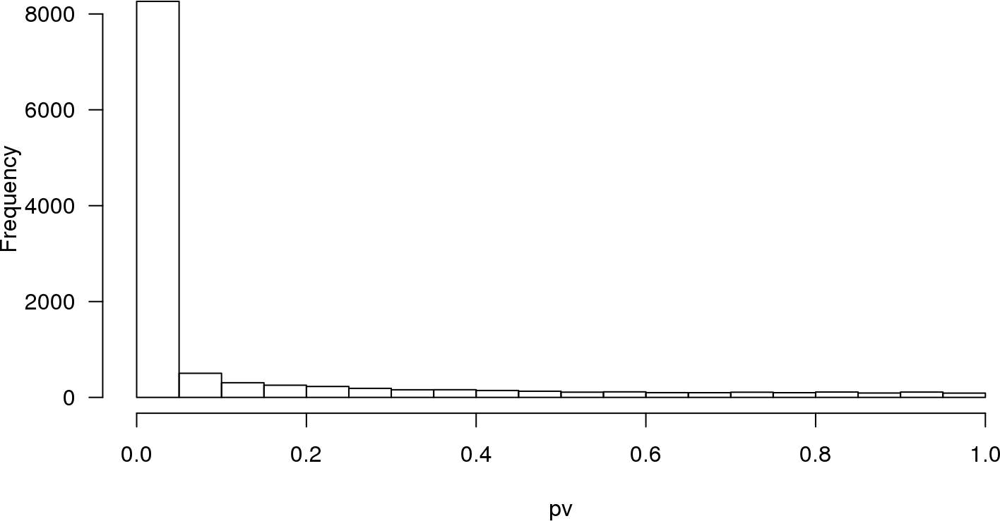
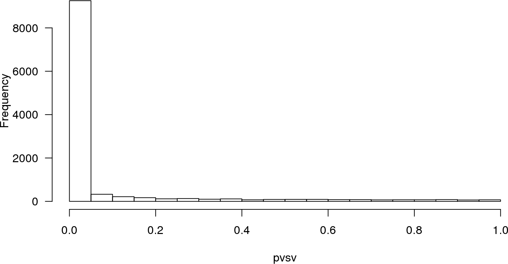

---
output:
  BiocStyle::html_document
---

<!---
Because we split the analysis pipeline in different independent files,
to speed up processing it, here in the setup block we load libraries and
objects that were loaded or produced in the previously processed file,
and which are necessary in this file.
--->


# Differential expression

We perform a simple examination of expression changes and their associated p-values
using the R/Bioconductor package [sva](http://bioconductor.org/packages/sva).


```r
library(sva)
mod <- model.matrix(~ se.filt$type, colData(se.filt))
mod0 <- model.matrix(~ 1, colData(se.filt))
pv <- f.pvalue(assays(se.filt)$logCPM, mod, mod0)
sum(p.adjust(pv, method="fdr") < 0.01)
```

```
[1] 7000
```

There are 7000 genes changing significantly
their expression at FDR < 1%. In Figure \@ref(fig:pdist) below we show the distribution of the
resulting p-values.

<div class="figure" style="text-align: center">

<p class="caption">(\#fig:pdist)Distribution of raw p-values for an F-test on every gene between tumor and normal samples.</p>
</div>

Now, let's estimate surrogate variables using the `sva()` function.


```r
sv <- sva(assays(se.filt)$logCPM, mod, mod0)
```

```
Number of significant surrogate variables is:  18 
Iteration (out of 5 ):1  2  3  4  5  
```

```r
sv$n
```

```
[1] 18
```

The SVA algorithm has found 18 surrogate variables. Let's use them to
assess againt the extent of differential expression this time adjusting for these
surrogate variables.


```r
modsv <- cbind(mod, sv$sv)
mod0sv <- cbind(mod0, sv$sv)
pvsv <- f.pvalue(assays(se.filt)$logCPM, modsv, mod0sv)
sum(p.adjust(pvsv, method="fdr") < 0.01)
```

```
[1] 8472
```

We have increased the number of changing genes to 8472.
Figure \@ref(fig:psvdist) shows the resulting distribution of p-values.

<div class="figure" style="text-align: center">

<p class="caption">(\#fig:psvdist)Distribution of raw p-values for an F-test on every gene between tumor and normal samples, adjusting for surrogate variables estimated with SVA.</p>
</div>

## Session information


```r
sessionInfo()
```

```
R version 3.5.0 (2018-04-23)
Platform: x86_64-pc-linux-gnu (64-bit)
Running under: CentOS Linux 7 (Core)

Matrix products: default
BLAS: /opt/R/R-3.5.0/lib64/R/lib/libRblas.so
LAPACK: /opt/R/R-3.5.0/lib64/R/lib/libRlapack.so

locale:
 [1] LC_CTYPE=en_US.UTF8       LC_NUMERIC=C             
 [3] LC_TIME=en_US.UTF8        LC_COLLATE=en_US.UTF8    
 [5] LC_MONETARY=en_US.UTF8    LC_MESSAGES=en_US.UTF8   
 [7] LC_PAPER=en_US.UTF8       LC_NAME=C                
 [9] LC_ADDRESS=C              LC_TELEPHONE=C           
[11] LC_MEASUREMENT=en_US.UTF8 LC_IDENTIFICATION=C      

attached base packages:
[1] parallel  stats4    stats     graphics  grDevices utils     datasets 
[8] methods   base     

other attached packages:
 [1] sva_3.28.0                  genefilter_1.62.0          
 [3] mgcv_1.8-24                 nlme_3.1-137               
 [5] geneplotter_1.58.0          annotate_1.58.0            
 [7] XML_3.98-1.16               AnnotationDbi_1.42.1       
 [9] lattice_0.20-35             edgeR_3.22.5               
[11] limma_3.36.5                SummarizedExperiment_1.10.1
[13] DelayedArray_0.6.6          BiocParallel_1.14.2        
[15] matrixStats_0.54.0          Biobase_2.40.0             
[17] GenomicRanges_1.32.7        GenomeInfoDb_1.16.0        
[19] IRanges_2.14.12             S4Vectors_0.18.3           
[21] BiocGenerics_0.26.0         knitr_1.20                 
[23] BiocStyle_2.8.2            

loaded via a namespace (and not attached):
 [1] locfit_1.5-9.1         xfun_0.3               splines_3.5.0         
 [4] htmltools_0.3.6        yaml_2.2.0             blob_1.1.1            
 [7] survival_2.42-6        DBI_1.0.0              bit64_0.9-7           
[10] RColorBrewer_1.1-2     GenomeInfoDbData_1.1.0 stringr_1.3.1         
[13] zlibbioc_1.26.0        codetools_0.2-15       evaluate_0.12         
[16] memoise_1.1.0          highr_0.7              Rcpp_0.12.19          
[19] xtable_1.8-3           backports_1.1.2        XVector_0.20.0        
[22] bit_1.1-14             digest_0.6.18          stringi_1.2.4         
[25] bookdown_0.7           grid_3.5.0             rprojroot_1.3-2       
[28] tools_3.5.0            bitops_1.0-6           magrittr_1.5          
[31] RCurl_1.95-4.11        RSQLite_2.1.1          Matrix_1.2-14         
[34] rmarkdown_1.10         compiler_3.5.0        
```
