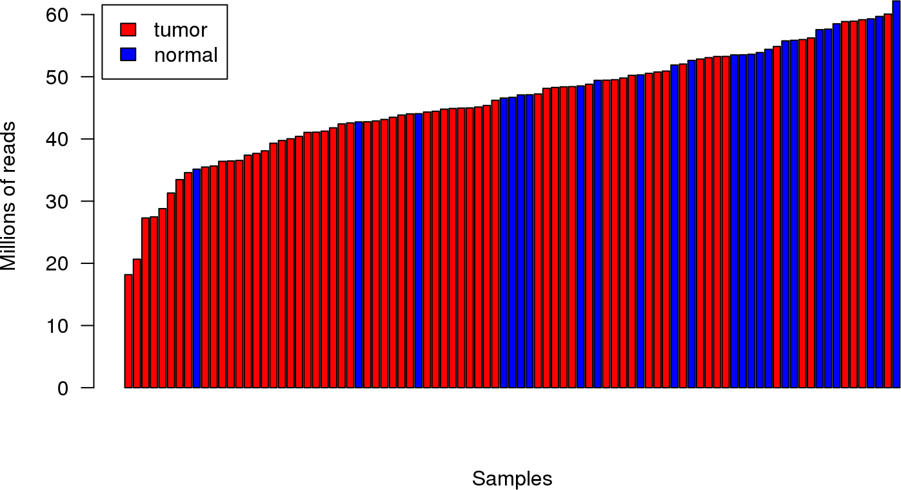
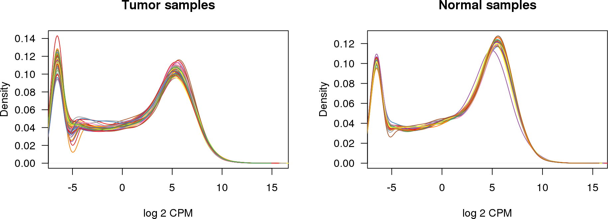
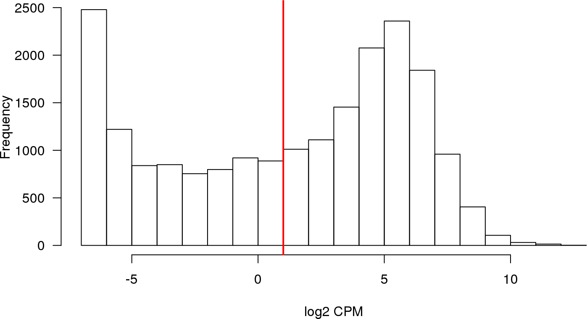
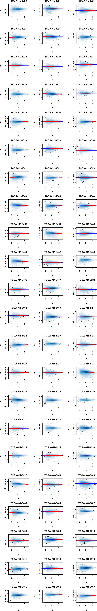
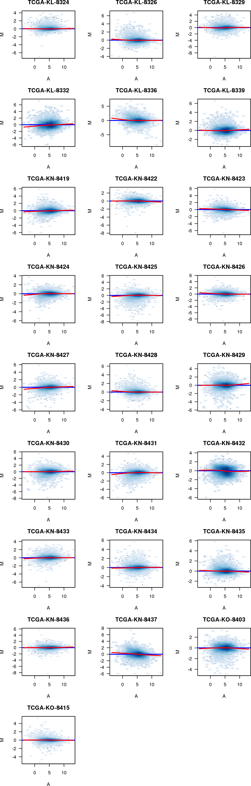
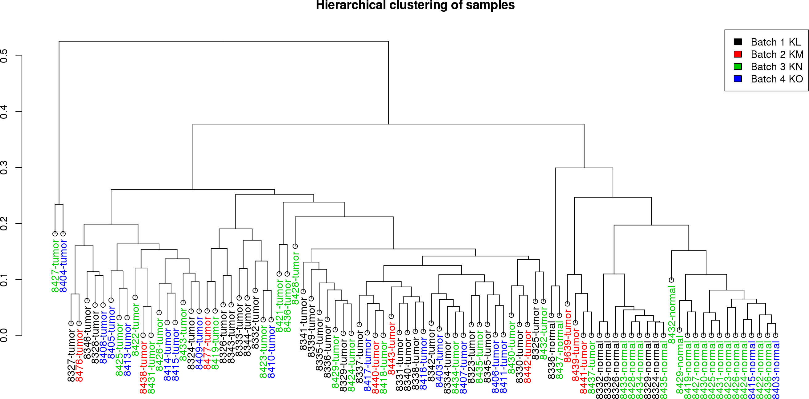
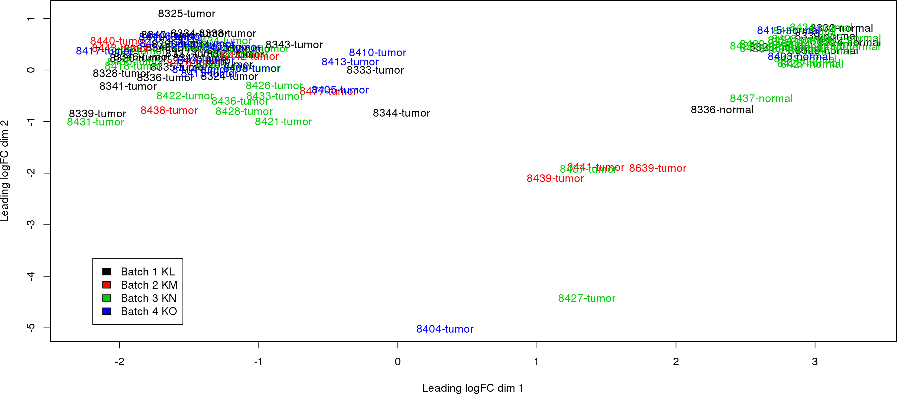

---
output:
  BiocStyle::html_document
---

<!---
The following chunk of code, which should not be shown in the resulting document (echo=FALSE)
sets up global processing options, such as forcing 'knitr' to stop when an error
in the R code is encountered, caching of the results in the 'cache'
directory and asking 'knitr' to figure out automatically the dependencies among
code chunks to re-calculate cached results (autodep=TRUE).

Other options could be changing the name of the directory where figures end up
('figure' by default), etc. For a full account of 'knitr' options please consult
http://yihui.name/knitr/options

At the end of the chunk a 'cat()' call is made to dump a CSS file that gives
a better look-and-feel than the knitr default one. See the source css/ieo.css
and the resulting projectTemplate.html to understand where this is being dumpted.
--->


# Quality assessment

## Data import

We start importing the raw table of counts.

<!--
The option 'message=FALSE' avoid dumping R messages such as "Loading required package: methods"
into the output of the report.
-->


```r
library(SummarizedExperiment)

se <- readRDS(file.path("rawCounts", "seKICH.rds"))
se
```

```
class: RangedSummarizedExperiment 
dim: 20115 91 
metadata(5): experimentData annotation cancerTypeCode
  cancerTypeDescription objectCreationDate
assays(1): counts
rownames(20115): 1 2 ... 102724473 103091865
rowData names(3): symbol txlen txgc
colnames(91): TCGA.KL.8323.01A.21R.2315.07
  TCGA.KL.8324.01A.11R.2315.07 ... TCGA.KO.8403.11A.01R.2315.07
  TCGA.KO.8415.11A.01R.2315.07
colData names(549): type bcr_patient_uuid ...
  lymph_nodes_aortic_pos_by_ihc lymph_nodes_aortic_pos_total
```

Explore the column (phenotypic) data, which in this case corresponds to clinical
variables, and their corresponding metadata.


```r
dim(colData(se))
```

```
[1]  91 549
```

```r
colData(se)[1:5, 1:5]
```

```
DataFrame with 5 rows and 5 columns
                                 type                     bcr_patient_uuid
                             <factor>                             <factor>
TCGA.KL.8323.01A.21R.2315.07    tumor 83b3060c-2449-4581-88ef-817d126e4525
TCGA.KL.8324.01A.11R.2315.07    tumor 0697436f-e487-45db-b0bc-ad9246f70196
TCGA.KL.8325.01A.11R.2315.07    tumor 6101ffe6-2ef6-4256-9d6b-a7c545836995
TCGA.KL.8326.01A.11R.2315.07    tumor 03f3dd32-e1d1-485b-a968-3f55798f4d46
TCGA.KL.8327.01A.11R.2315.07    tumor 02979422-5149-4750-ad5f-483e0bec6ac5
                             bcr_patient_barcode form_completion_date
                                        <factor>             <factor>
TCGA.KL.8323.01A.21R.2315.07        TCGA-KL-8323            2012-7-24
TCGA.KL.8324.01A.11R.2315.07        TCGA-KL-8324            2012-7-24
TCGA.KL.8325.01A.11R.2315.07        TCGA-KL-8325            2012-7-24
TCGA.KL.8326.01A.11R.2315.07        TCGA-KL-8326            2012-7-24
TCGA.KL.8327.01A.11R.2315.07        TCGA-KL-8327            2012-7-24
                             prospective_collection
                                           <factor>
TCGA.KL.8323.01A.21R.2315.07                     NO
TCGA.KL.8324.01A.11R.2315.07                     NO
TCGA.KL.8325.01A.11R.2315.07                     NO
TCGA.KL.8326.01A.11R.2315.07                     NO
TCGA.KL.8327.01A.11R.2315.07                     NO
```

```r
mcols(colData(se), use.names=TRUE)
```

```
DataFrame with 549 rows and 2 columns
                                                         labelDescription
                                                              <character>
type                                           sample type (tumor/normal)
bcr_patient_uuid                                         bcr patient uuid
bcr_patient_barcode                                   bcr patient barcode
form_completion_date                                 form completion date
prospective_collection            tissue prospective collection indicator
...                                                                   ...
lymph_nodes_pelvic_pos_total                               total pelv lnp
lymph_nodes_aortic_examined_count                           total aor lnr
lymph_nodes_aortic_pos_by_he                          aln pos light micro
lymph_nodes_aortic_pos_by_ihc                                 aln pos ihc
lymph_nodes_aortic_pos_total                                total aor-lnp
                                        CDEID
                                  <character>
type                                       NA
bcr_patient_uuid                           NA
bcr_patient_barcode                   2673794
form_completion_date                       NA
prospective_collection                3088492
...                                       ...
lymph_nodes_pelvic_pos_total          3151828
lymph_nodes_aortic_examined_count     3104460
lymph_nodes_aortic_pos_by_he          3151832
lymph_nodes_aortic_pos_by_ihc         3151831
lymph_nodes_aortic_pos_total          3151827
```

These metadata consists of two columns of information about the clinical variables.
One called `labelDescription` contains a succint description of the variable, often
not more self-explanatory than the variable name itself, and the other called
'CDEID' corresponds to the so-called `Common Data Element (CDE)` identifier. This
identifier can be use in https://cdebrowser.nci.nih.gov to search for further
information about the associated clinical variable using the `Advanced search`
form and the `Public ID` attribute search.

Now, explore the row (feature) data.


```r
rowData(se)
```

```
DataFrame with 20115 rows and 3 columns
           symbol     txlen              txgc
      <character> <integer>         <numeric>
1            A1BG      3322 0.564419024683925
2             A2M      4844 0.488232865400495
3            NAT1      2280 0.394298245614035
4            NAT2      1322 0.389561270801815
5        SERPINA3      3067 0.524942940984676
...           ...       ...               ...
20111       POTEB      1706 0.430832356389215
20112    SNORD124       104 0.490384615384615
20113   SNORD121B        81 0.407407407407407
20114      GAGE10       538 0.505576208178439
20115   BRWD1-IT2      1028 0.592412451361868
```

```r
rowRanges(se)
```

```
GRanges object with 20115 ranges and 3 metadata columns:
            seqnames            ranges strand |      symbol     txlen
               <Rle>         <IRanges>  <Rle> | <character> <integer>
          1    chr19 58345178-58362751      - |        A1BG      3322
          2    chr12   9067664-9116229      - |         A2M      4844
          9     chr8 18170477-18223689      + |        NAT1      2280
         10     chr8 18391245-18401218      + |        NAT2      1322
         12    chr14 94592058-94624646      + |    SERPINA3      3067
        ...      ...               ...    ... .         ...       ...
  100996331    chr15 20835372-21877298      - |       POTEB      1706
  101340251    chr17 40027542-40027645      - |    SNORD124       104
  101340252     chr9 33934296-33934376      - |   SNORD121B        81
  102724473     chrX 49303669-49319844      + |      GAGE10       538
  103091865    chr21 39313935-39314962      + |   BRWD1-IT2      1028
                         txgc
                    <numeric>
          1 0.564419024683925
          2 0.488232865400495
          9 0.394298245614035
         10 0.389561270801815
         12 0.524942940984676
        ...               ...
  100996331 0.430832356389215
  101340251 0.490384615384615
  101340252 0.407407407407407
  102724473 0.505576208178439
  103091865 0.592412451361868
  -------
  seqinfo: 455 sequences (1 circular) from hg38 genome
```

To perform quality assessment and normalization we need first to load the
[edgeR](http://bioconductor.org/packages/edgeR) R/Bioconductor package and
create a `DGEList' object.


```r
library(edgeR)

dge <- DGEList(counts=assays(se)$counts, genes=mcols(se))
```

```
Warning in as.data.frame(x, row.names = NULL, optional = optional, ...):
Arguments in '...' ignored
```

```r
saveRDS(dge, file.path("results", "dge.rds"))
```

Now calculate $\log_2$ CPM values of expression and put them as an additional
assay element to ease their manipulation.


```r
assays(se)$logCPM <- cpm(dge, log=TRUE, prior.count=0.5)
assays(se)$logCPM[1:5, 1:5]
```

```
   TCGA.KL.8323.01A.21R.2315.07 TCGA.KL.8324.01A.11R.2315.07
1                     -1.176627                   -0.7690097
2                      8.735598                    8.5877309
9                     -6.527378                   -6.5273783
10                    -6.527378                   -6.5273783
12                     5.533634                    6.4826026
   TCGA.KL.8325.01A.11R.2315.07 TCGA.KL.8326.01A.11R.2315.07
1                     -1.143140                     3.174466
2                      8.255307                     8.171660
9                     -6.527378                    -6.527378
10                    -6.527378                    -6.527378
12                     6.125902                     5.973882
   TCGA.KL.8327.01A.11R.2315.07
1                      1.248823
2                      8.477338
9                     -6.527378
10                    -6.527378
12                     7.450862
```

## Sequencing depth

Let's examine the sequencing depth in terms of total number of sequence read counts
mapped to the genome per sample. Figure \@ref(fig:libsizes) below shows the
sequencing depth per sample, also known as library sizes, in increasing order.

<!---
you can control the height and width in pixels of the figure with 'out.height' and
'out.width'. Figures are automatically numbered, to refer to them in the main test
you should use the notation shown above as \@ref(fig:xxxx) with xxxx being the label
in the code chunk that also gives the filename of the figure. This name must be unique
--->

<div class="figure" style="text-align: center">

<p class="caption">(\#fig:libsizes)Library sizes in increasing order.</p>
</div>
This figure reveals substantial differences in sequencing depth between samples
and we may consider discarding those samples whose depth is substantially lower
than the rest. To identify who are these samples we may simply look at the
actual numbers including portion of the sample identifier that distinguishes them.


```r
sampledepth <- round(dge$sample$lib.size / 1e6, digits=1)
names(sampledepth) <- substr(colnames(se), 6, 12)
sort(sampledepth)
```

```
KL.8327 KN.8431 KM.8476 KO.8409 KN.8433 KN.8432 KL.8332 KO.8408 KO.8415 
   18.2    20.7    27.3    27.5    28.8    31.3    33.5    34.6    35.1 
KL.8326 KO.8416 KM.8438 KL.8324 KO.8404 KM.8439 KO.8415 KN.8419 KO.8405 
   35.5    35.6    36.4    36.5    36.5    37.4    37.7    38.1    39.3 
KL.8342 KL.8338 KM.8477 KL.8328 KN.8422 KO.8403 KM.8443 KO.8407 KL.8340 
   39.8    40.0    40.4    41.1    41.1    41.3    41.8    42.4    42.6 
KN.8432 KL.8346 KO.8413 KM.8441 KN.8430 KL.8331 KL.8323 KL.8326 KN.8426 
   42.7    42.8    42.9    43.1    43.5    43.8    44.0    44.1    44.3 
KN.8421 KL.8337 KN.8436 KL.8345 KN.8434 KN.8437 KL.8335 KM.8440 KN.8424 
   44.4    44.8    44.9    45.0    45.0    45.1    45.4    46.2    46.6 
KN.8433 KN.8419 KN.8428 KO.8411 KN.8429 KO.8414 KL.8336 KO.8417 KN.8436 
   46.7    47.1    47.1    47.2    48.1    48.3    48.4    48.4    48.5 
KL.8339 KM.8442 KN.8437 KL.8343 KN.8435 KL.8333 KL.8324 KN.8425 KO.8406 
   48.8    49.4    49.4    49.5    49.8    50.2    50.3    50.6    50.8 
KO.8410 KN.8430 KL.8325 KN.8431 KL.8334 KN.8418 KL.8330 KN.8424 KN.8429 
   50.9    51.9    52.0    52.6    52.8    53.1    53.3    53.3    53.5 
KN.8434 KN.8422 KN.8423 KL.8339 KN.8428 KL.8336 KO.8403 KN.8427 KL.8329 
   53.5    53.6    53.9    54.4    54.9    55.8    55.9    56.0    56.2 
KL.8329 KL.8332 KN.8426 KM.8639 KN.8423 KL.8344 KN.8435 KN.8425 KL.8341 
   57.6    57.7    58.5    58.9    58.9    59.2    59.3    59.7    60.1 
KN.8427 
   62.2 
```

## Distribution of expression levels among samples

Let's look at the distribution of expression values per sample in terms of
logarithmic CPM units. Due to the large number of samples, we display tumor
and normal samples separately, and are shown in Figure \@ref(fig:distRawExp)

<!---
the option echo=FALSE hides the R code. When plotting in general one does not
want to see the code. Options fig.height and fig.width control height and width
of the plot in inches while out.height and out.width do it in the final output
file; see http://yihui.name/knitr/options for full details.
--->

<div class="figure" style="text-align: center">

<p class="caption">(\#fig:distRawExp)Non-parametric density distribution of expression profiles per sample.</p>
</div>

We do not appreciate substantial differences between the samples in the
distribution of expression values.

## Distribution of expression levels among genes

Let's calculate now the average expression per gene through all the samples.
Figure \@ref(fig:exprdist) shows the distribution of those values across genes.

<div class="figure" style="text-align: center">

<p class="caption">(\#fig:exprdist)Distribution of average expression level per gene.</p>
</div>

## Filtering of lowly-expressed genes

In the light of this plot, we may consider a cutoff of 1 log CPM unit as minimum value
of expression to select genes being expressed across samples. Using this cutoff we proceed
to filter out lowly-expressed genes.


```r
mask <- avgexp > 1
dim(se)
```

```
[1] 20115    91
```

```r
se.filt <- se[mask, ]
dim(se.filt)
```

```
[1] 11368    91
```

```r
dge.filt <- dge[mask, ]
dim(dge.filt)
```

```
[1] 11368    91
```

Store un-normalized versions of the filtered expression data.


```r
saveRDS(se.filt, file.path("results", "se.filt.unnorm.rds"))
saveRDS(dge.filt, file.path("results", "dge.filt.unnorm.rds"))
```

## Normalization

We calculate now the normalization factors on the filtered expression data set.


```r
dge.filt <- calcNormFactors(dge.filt)
```

Replace the raw log2 CPM units in the corresponding assay element of the `SummarizedExperiment`
object, by the normalized ones.


```r
assays(se.filt)$logCPM <- cpm(dge.filt, log=TRUE, normalized.lib.sizes=TRUE, prior.count=0.25)
```

Store normalized versions of the filtered expression data.


```r
saveRDS(se.filt, file.path("results", "se.filt.rds"))
saveRDS(dge.filt, file.path("results", "dge.filt.rds"))
```

## MA-plots

We examine now the MA-plots of the normalized expression profiles. We look first to
the tumor samples in Figure \@ref(fig:maPlotsTumor).

<!---
Here we make a MA-plot for each sample. The options 'fig.height' and 'fig.width'
control the relative image size in *inches*. The final image size results from
'height'x'dpi' and 'width'x'dpi', where 'dpi' is the image resolution in
"dots per inch" (by default dpi=72). To scale the image to a desired size use
'out.width' and 'out.height'. More information at http://yihui.name/knitr/options
--->

<div class="figure" style="text-align: center">

<p class="caption">(\#fig:maPlotsTumor)MA-plots of the tumor samples.</p>
</div>

We do not observe samples with major expression-level dependent biases. Let's
look now to the normal samples in Figure \@ref(fig:maPlotsNormal).

<div class="figure" style="text-align: center">

<p class="caption">(\#fig:maPlotsNormal)MA-plots of the normal samples.</p>
</div>

We do not observe either important expression-level dependent biases among the normal samples.

## Batch identification

We will search now for potential surrogate of batch effect indicators. Given that each sample
names corresponds to a TCGA barcode (see https://wiki.nci.nih.gov/display/TCGA/TCGA+barcode),
following the strategy described in http://bioinformatics.mdanderson.org/main/TCGABatchEffects:Overview
we are going to derive different elements of the TCGA barcode and examine their distribution
across samples.


```r
tss <- substr(colnames(se.filt), 6, 7)
table(tss)
```

```
tss
KL KM KN KO 
30  9 36 16 
```

```r
center <- substr(colnames(se.filt), 27, 28)
table(center)
```

```
center
07 
91 
```

```r
plate <- substr(colnames(se.filt), 22, 25)
table(plate)
```

```
plate
2315 2403 
  90    1 
```

```r
portionanalyte <- substr(colnames(se.filt), 18, 20)
table(portionanalyte)
```

```
portionanalyte
01R 11R 21R 
 25  65   1 
```

```r
samplevial <- substr(colnames(se.filt), 14, 16)
table(samplevial)
```

```
samplevial
01A 11A 
 66  25 
```

From this information we can make the following observations:

  * All samples were sequenced at the same center

  * All samples belong to one of two combinations of tissue type and vial, matching the
    expected tumor and normal distribution.

  * Samples were collected across different tissue source sites (TSS).

  * All samples were sequenced within the same plate, except for the following one:


```r
colnames(se.filt)[plate == "2403"]
```

```
[1] "TCGA.KM.8639.01A.11R.2403.07"
```

  * All samples were sequenced using one of two portion and analyte combinations except fo the
    following one:


```r
colnames(se.filt)[portionanalyte == "21R"]
```

```
[1] "TCGA.KL.8323.01A.21R.2315.07"
```

We are going to use the TSS as surrogate of batch effect indicator. Considering our outcome
of interest as molecular changes between sample types, tumor vs. normal, we will examine now
the cross-classification of this outcome with TSS.


```r
table(data.frame(TYPE=se.filt$type, TSS=tss))
```

```
        TSS
TYPE     KL KM KN KO
  normal  6  0 17  2
  tumor  24  9 19 14
```

Observe that normal tissues with `TSS=KM` or `TSS=KO` are under-represented with respect to
the tumor tissues. If TSS is a source of expression variability, this under-representation
of those two TSS in the normal samples may lead to a potential confounding effect.

We examine now how samples group together by hierarchical clustering and multidimensional
scaling, annotating the outcome of interest and the the surrogate of batch indicator. We
calculate again log CPM values with a higher prior count to moderate extreme fold-changes
produced by low counts. The resulting dendrogram is shown in Figure \@ref(fig:sampleClustering).


```r
logCPM <- cpm(dge.filt, log=TRUE, prior.count=3)
d <- as.dist(1-cor(logCPM, method="spearman"))
sampleClustering <- hclust(d)
batch <- as.integer(factor(tss))
sampleDendrogram <- as.dendrogram(sampleClustering, hang=0.1)
names(batch) <- colnames(se.filt)
outcome <- paste(substr(colnames(se.filt), 9, 12), as.character(se.filt$type), sep="-")
names(outcome) <- colnames(se.filt)
sampleDendrogram <- dendrapply(sampleDendrogram,
                               function(x, batch, labels) {
                                 if (is.leaf(x)) {
                                   attr(x, "nodePar") <- list(lab.col=as.vector(batch[attr(x, "label")]))
                                   attr(x, "label") <- as.vector(labels[attr(x, "label")])
                                 }
                                 x
                               }, batch, outcome)
plot(sampleDendrogram, main="Hierarchical clustering of samples")
legend("topright", paste("Batch", sort(unique(batch)), levels(factor(tss))), fill=sort(unique(batch)))
```

<div class="figure" style="text-align: center">

<p class="caption">(\#fig:sampleClustering)Figure S6: Hierarchical clustering of the samples.</p>
</div>

We can observe that samples cluster primarily by sample type, tumor or normal. TSS seems to have
a stronger effect among the normal samples, while it distributes better among the tumor samples.
We may consider discarding samples leading to an unbalanced distribution of the outcome across batches.

In Figure \@ref(fig:mdsPlot) we show the corresponding MDS plot. Here we see more clearly that the
first source of variation separates tumor from normal samples. We can also observe that two tumor
samples, corresponding to individuals `KL-8404` and `KN-8427` are separated from the rest, just as
it happens in the hierchical clustering. A closer examination of their corresponding MA-plots also
reveals a slight dependence of expression changes on average expression. We may consider discarding
these two samples and doing the MDS plot again to have a closer look to the differences among the rest
of the samples and their relationship with TSS.


```r
plotMDS(dge.filt, labels=outcome, col=batch)
legend("bottomleft", paste("Batch", sort(unique(batch)), levels(factor(tss))),
       fill=sort(unique(batch)), inset=0.05)
```

<div class="figure" style="text-align: center">

<p class="caption">(\#fig:mdsPlot)Figure S7: Multidimensional scaling plot of the samples.</p>
</div>

## Session information


```r
sessionInfo()
```

```
R version 3.5.0 (2018-04-23)
Platform: x86_64-pc-linux-gnu (64-bit)
Running under: CentOS Linux 7 (Core)

Matrix products: default
BLAS: /opt/R/R-3.5.0/lib64/R/lib/libRblas.so
LAPACK: /opt/R/R-3.5.0/lib64/R/lib/libRlapack.so

locale:
 [1] LC_CTYPE=en_US.UTF8       LC_NUMERIC=C             
 [3] LC_TIME=en_US.UTF8        LC_COLLATE=en_US.UTF8    
 [5] LC_MONETARY=en_US.UTF8    LC_MESSAGES=en_US.UTF8   
 [7] LC_PAPER=en_US.UTF8       LC_NAME=C                
 [9] LC_ADDRESS=C              LC_TELEPHONE=C           
[11] LC_MEASUREMENT=en_US.UTF8 LC_IDENTIFICATION=C      

attached base packages:
[1] parallel  stats4    stats     graphics  grDevices utils     datasets 
[8] methods   base     

other attached packages:
 [1] geneplotter_1.58.0          annotate_1.58.0            
 [3] XML_3.98-1.16               AnnotationDbi_1.42.1       
 [5] lattice_0.20-35             edgeR_3.22.5               
 [7] limma_3.36.5                SummarizedExperiment_1.10.1
 [9] DelayedArray_0.6.6          BiocParallel_1.14.2        
[11] matrixStats_0.54.0          Biobase_2.40.0             
[13] GenomicRanges_1.32.7        GenomeInfoDb_1.16.0        
[15] IRanges_2.14.12             S4Vectors_0.18.3           
[17] BiocGenerics_0.26.0         knitr_1.20                 
[19] BiocStyle_2.8.2            

loaded via a namespace (and not attached):
 [1] Rcpp_0.12.19           RColorBrewer_1.1-2     compiler_3.5.0        
 [4] highr_0.7              XVector_0.20.0         bitops_1.0-6          
 [7] tools_3.5.0            zlibbioc_1.26.0        bit_1.1-14            
[10] digest_0.6.18          memoise_1.1.0          RSQLite_2.1.1         
[13] evaluate_0.12          Matrix_1.2-14          DBI_1.0.0             
[16] yaml_2.2.0             xfun_0.3               GenomeInfoDbData_1.1.0
[19] stringr_1.3.1          bit64_0.9-7            locfit_1.5-9.1        
[22] rprojroot_1.3-2        grid_3.5.0             rmarkdown_1.10        
[25] bookdown_0.7           blob_1.1.1             magrittr_1.5          
[28] backports_1.1.2        codetools_0.2-15       htmltools_0.3.6       
[31] xtable_1.8-3           KernSmooth_2.23-15     stringi_1.2.4         
[34] RCurl_1.95-4.11       
```
